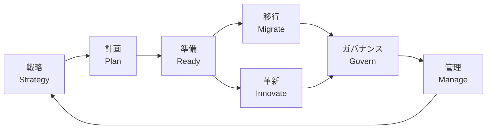
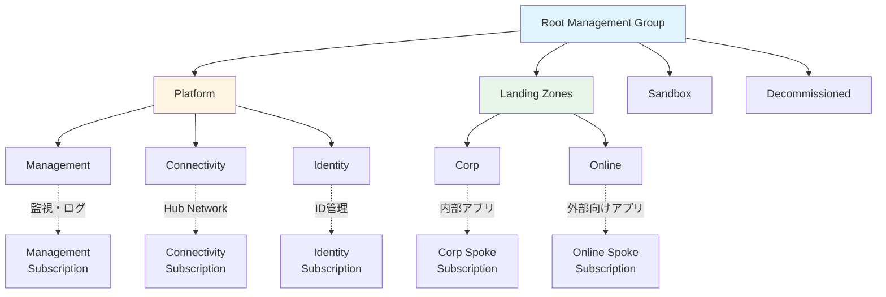
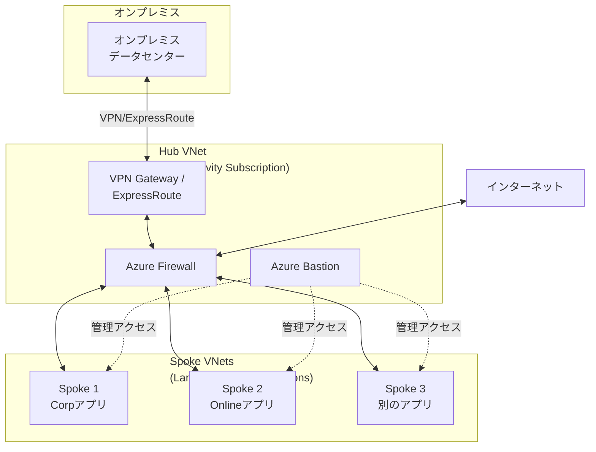
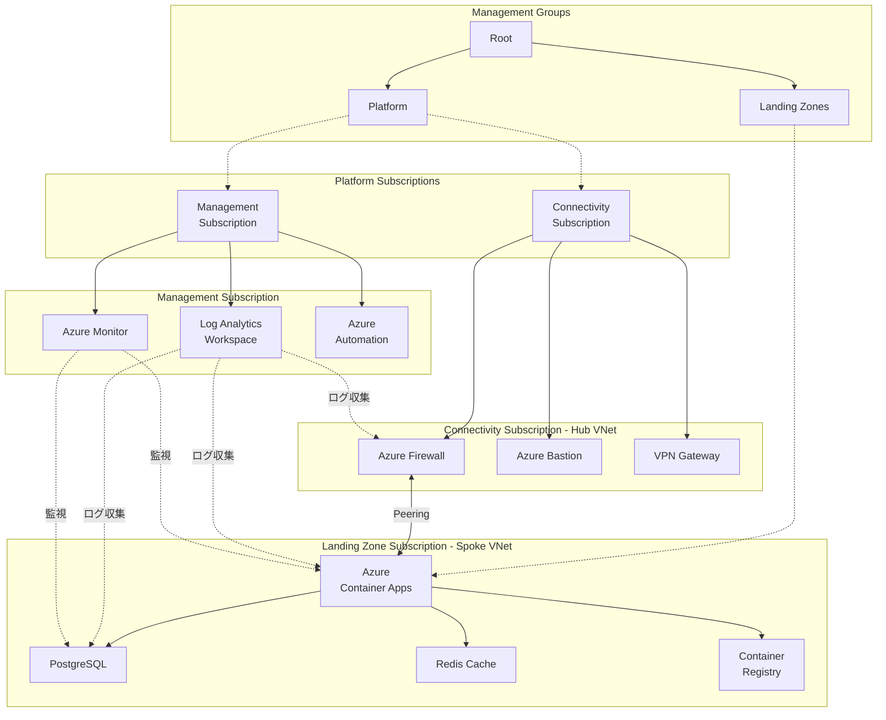

# 第 1 章：イントロダクションと CAF 概要

## 本章の目的

本章では、Microsoft Cloud Adoption Framework (CAF) の基本概念と、なぜランディングゾーンが必要なのかを理解します。また、本ハンズオンで構築するアーキテクチャの全体像を把握します。

**所要時間**: 約 1 時間  
**難易度**: ⭐

---

## 1.1 クラウド移行の課題

### 従来のクラウド導入の問題点

多くの組織がクラウドを導入する際、以下のような問題に直面します：

#### 問題 1: 無秩序なリソース作成

- 各チームが独自にリソースを作成
- 命名規則やタグ付けのルールがない
- どこに何があるか分からなくなる
- コスト管理ができない

#### 問題 2: セキュリティの不備

- セキュリティ設定が統一されていない
- 脆弱性のあるリソースが放置される
- コンプライアンス要件を満たせない
- インシデント発生時の対応が困難

#### 問題 3: ガバナンスの欠如

- リソース作成の承認プロセスがない
- ポリシーが適用されていない
- 監査証跡が残らない
- 統制が取れない

#### 問題 4: スケーラビリティの限界

- 最初は小規模で始めても、すぐに限界に
- 後から統制を取ろうとすると大規模な作り直しが必要
- 技術的負債が蓄積

### なぜこれらの問題が起こるのか

これらの問題の根本原因は、**「しっかりとした基盤（ランディングゾーン）を作らずに、いきなりアプリケーションを作り始めてしまう」** ことにあります。

現実世界に例えると：

- ビルを建てる時、まず基礎工事をしますよね？
- 都市を作る時、まず道路やインフラを整備しますよね？

クラウドも同じです。アプリケーションを作る前に、しっかりとした基盤を作る必要があります。

---

## 1.2 Cloud Adoption Framework (CAF) とは

### CAF の定義

Microsoft Cloud Adoption Framework (CAF) は、クラウド導入を成功させるための**ベストプラクティス、ガイダンス、ツールの集合体**です。

Microsoft が多くの顧客と協力して得た経験を基に作成されており、世界中の企業で使用されています。

### CAF の全体像

CAF は以下の 7 つのフェーズで構成されています：



#### 1. 戦略 (Strategy)

- なぜクラウドに移行するのか
- ビジネス成果の定義
- 財務的な計画

#### 2. 計画 (Plan)

- 現状の棚卸し（デジタル資産の評価）
- クラウド導入計画の策定
- スキルの準備

#### 3. 準備 (Ready) ★ 本ハンズオンの焦点

- **ランディングゾーンの構築**
- クラウド環境の準備
- これが本ハンズオンのテーマです

#### 4. 移行 (Migrate)

- 既存ワークロードの移行
- 最適化

#### 5. 革新 (Innovate)

- クラウドネイティブなアプリケーション開発
- 新しい価値の創造

#### 6. ガバナンス (Govern)

- ポリシーの適用
- コンプライアンスの維持
- リスク管理

#### 7. 管理 (Manage)

- 運用管理
- 監視とアラート
- 継続的な改善

### 本ハンズオンの位置づけ

本ハンズオンは、**「準備 (Ready)」フェーズのランディングゾーン構築**に焦点を当てていますが、ガバナンス、管理の要素も含まれています。

---

## 1.3 ランディングゾーンとは

### ランディングゾーンの定義

**ランディングゾーン (Landing Zone)** とは、ワークロードをホストするために事前にプロビジョニングされた、コードで管理されたクラウド環境のことです。

簡単に言うと：

- アプリケーションを安全に稼働させるための「土台」
- 必要なインフラ、セキュリティ、ガバナンスが事前に設定されている
- 複数のアプリケーションチームが共通して使用できる

### 空港の滑走路に例えると

「Landing Zone（着陸地帯）」という名前は、空港の滑走路から来ています：

| 空港の滑走路                               | Azure ランディングゾーン                         |
| ------------------------------------------ | ------------------------------------------------ |
| 飛行機が安全に着陸できる場所               | アプリケーションが安全に稼働できる場所           |
| 照明、管制塔、燃料補給設備が整備されている | ネットワーク、セキュリティ、監視が整備されている |
| 複数の飛行機が利用できる                   | 複数のアプリケーションが利用できる               |
| 厳格な安全基準がある                       | ポリシーとガバナンスがある                       |

### ランディングゾーンの重要な特徴

#### 特徴 1: コードで管理 (Infrastructure as Code)

- すべての設定をコードで定義
- バージョン管理が可能
- 再現性がある
- レビューができる

#### 特徴 2: スケーラブル

- 1 つのアプリから、100 のアプリまで対応
- 新しいワークロードを簡単に追加できる
- 組織の成長に合わせて拡張できる

#### 特徴 3: セキュアバイデフォルト

- セキュリティが最初から組み込まれている
- ゼロトラストの原則
- 多層防御

#### 特徴 4: ガバナンスが効いている

- ポリシーが自動適用される
- コンプライアンス要件を満たす
- 監査証跡が残る

---

## 1.4 エンタープライズスケールアーキテクチャ

### エンタープライズスケールランディングゾーンとは

Microsoft が推奨する**エンタープライズスケール (Enterprise-Scale)** アーキテクチャは、大規模組織向けのランディングゾーンの参照実装です。

### アーキテクチャの全体像



### 主要コンポーネントの説明

#### Root Management Group

- すべての管理グループとサブスクリプションの親
- 組織全体に適用するポリシーをここで設定

#### Platform Management Group

組織のプラットフォーム基盤を管理する管理グループ：

**Management (管理)**

- Log Analytics Workspace
- Azure Monitor
- Azure Automation
- すべてのログとメトリクスがここに集まる

**Connectivity (接続)**

- Hub VNet
- Azure Firewall
- VPN Gateway / ExpressRoute Gateway
- Azure Bastion
- ネットワークの中心

**Identity (ID 管理)**

- Azure AD Domain Services (必要な場合)
- Domain Controller の VM (ハイブリッド環境の場合)

#### Landing Zones Management Group

実際のアプリケーションが稼働する場所：

**Corp (社内向け)**

- 内部アプリケーション
- オンプレミスと接続が必要なワークロード
- 厳格なセキュリティ要件

**Online (インターネット向け)**

- 外部公開するアプリケーション
- Web サイト、API など
- インターネットからアクセス可能

#### Sandbox

- 開発者の実験環境
- ポリシーが緩い
- コストを制限

#### Decommissioned

- 廃止予定のリソース
- 一時的に保持
- 段階的に削除

### Hub-Spoke ネットワークトポロジー



#### Hub (ハブ)

- ネットワークの中心
- すべてのトラフィックが通過
- セキュリティ境界

#### Spoke (スポーク)

- 個別のワークロード
- 互いに分離
- Hub を経由して通信

---

## 1.5 8 つの設計領域

ランディングゾーンを設計する際、以下の 8 つの領域を考慮する必要があります：

### 1. Azure 課金と Active Directory テナント

- Azure アカウントの構造
- テナントの設計
- 課金アカウントの設定

### 2. ID とアクセス管理

- Azure AD (Entra ID)
- ロールベースアクセス制御 (RBAC)
- Privileged Identity Management (PIM)
- 条件付きアクセス

### 3. リソース編成

- Management Groups 階層
- Subscription 設計
- リソースグループの整理
- 命名規則とタグ付け

### 4. ネットワークトポロジと接続

- Hub-Spoke アーキテクチャ
- VNet 設計
- ハイブリッド接続
- DNS 設定

### 5. セキュリティ

- Microsoft Defender for Cloud
- Azure Firewall
- Network Security Groups
- DDoS Protection
- Key Vault

### 6. 管理

- ログとメトリクスの収集
- Azure Monitor
- アラート
- バックアップ

### 7. ガバナンス

- Azure Policy
- Blueprints
- Cost Management
- コンプライアンス

### 8. プラットフォームの自動化と DevOps

- Infrastructure as Code
- CI/CD パイプライン
- GitOps

本ハンズオンでは、これら 8 つの領域すべてをカバーします。

---

## 1.6 本ハンズオンで構築するアーキテクチャ

### 構築するもの

本ハンズオンでは、以下を構築します：

#### 1. Management Groups 階層

```
Root Tenant Group
├── Platform
│   ├── Management
│   ├── Connectivity
│   └── Identity
├── Landing Zones
│   ├── Corp
│   └── Online
├── Sandbox
└── Decommissioned
```

#### 2. Subscriptions

- Management Subscription (監視・ログ用)
- Connectivity Subscription (ネットワーク Hub 用)
- Identity Subscription (ID 管理用)
- Corp Landing Zone Subscription (本番アプリ用)
- Sandbox Subscription (検証用)

#### 3. ネットワーク基盤

- Hub VNet (10.0.0.0/16)
  - GatewaySubnet
  - AzureFirewallSubnet
  - AzureBastionSubnet
  - ManagementSubnet
- Spoke VNet (10.1.0.0/16)
  - AppSubnet
  - DataSubnet
  - PrivateEndpointSubnet

#### 4. セキュリティ基盤

- Azure Firewall (すべてのトラフィック制御)
- Azure Bastion (安全な管理アクセス)
- Network Security Groups
- Key Vault
- Microsoft Defender for Cloud

#### 5. 監視基盤

- Log Analytics Workspace
- Azure Monitor
- アラート
- Workbook (ダッシュボード)

#### 6. ガバナンス

- 20+ の Azure Policy
- カスタムポリシーとイニシアチブ
- タグ付けルール
- コスト管理

#### 7. CI/CD

- GitHub Actions ワークフロー
- 自動デプロイ
- Infrastructure as Code

#### 8. アプリケーション

- Next.js + TypeScript + Tailwind CSS
- Azure Container Apps
- Azure Database for PostgreSQL
- Azure Cache for Redis
- Azure Container Registry

### アーキテクチャ図（全体）



### 最終的な成果物

本ハンズオン完了時には、以下が得られます：

1. **完全なランディングゾーン環境**

   - エンタープライズグレード
   - 本番環境レベルのセキュリティとガバナンス

2. **Infrastructure as Code のリポジトリ**

   - すべてのインフラが Bicep で定義
   - バージョン管理されている
   - CI/CD で自動デプロイ

3. **稼働するアプリケーション**

   - Next.js アプリケーション
   - データベース接続
   - インターネットからアクセス可能

4. **運用管理体制**

   - ログ収集
   - メトリクス監視
   - アラート

5. **深い理解**
   - Azure の設計パターン
   - エンタープライズアーキテクチャ
   - セキュリティとガバナンス
   - DevOps 実践

---

## 1.7 設計原則

本ハンズオンでは、以下の設計原則に従います：

### 原則 1: Subscription 民主化

チームが自律的にリソースを作成できるようにしつつ、ガバナンスは維持する。

### 原則 2: ポリシー駆動ガバナンス

手動チェックではなく、ポリシーで自動的にガバナンスを効かせる。

### 原則 3: 単一制御プレーンとログシンク

すべてのリソースを一元的に管理し、ログは一箇所に集める。

### 原則 4: アプリケーション中心

アプリケーションチームが生産性高く開発できることを最優先。

### 原則 5: Azure ネイティブデザイン

Azure 固有の機能を最大限活用する。

### 原則 6: 推奨事項の使用

組み込みのベストプラクティスを活用する。

---

## 1.8 前提知識の確認

本ハンズオンを進める前に、以下の概念について簡単に理解しておくと良いでしょう：

### クラウドコンピューティングの基本

- IaaS, PaaS, SaaS
- リージョンと Availability Zones
- 従量課金

### ネットワークの基本

- IP アドレス (IPv4)
- サブネット
- ファイアウォール
- DNS

### セキュリティの基本

- 認証 vs 認可
- 暗号化
- 最小権限の原則

### Git の基本

- commit, push, pull
- ブランチ
- Pull Request

これらの知識がなくても、ハンズオンを進めながら学ぶことができます。

---

## 1.9 学習のヒント

### 理解のためのコツ

#### 1. レイヤーで考える

ランディングゾーンは複数のレイヤーから成ります：

- 組織構造（Management Groups）
- ネットワーク（Hub-Spoke）
- セキュリティ（Firewall, NSG）
- 管理（監視、ログ）
- ガバナンス（Policy）

各レイヤーを独立して理解してから、全体を統合します。

#### 2. 「Why」を理解する

「どうやって作るか」だけでなく、「なぜそう設計するか」を理解しましょう。

#### 3. 図を描く

アーキテクチャ図を自分で描いてみると理解が深まります。

#### 4. 比較する

他のクラウド（AWS、GCP）と比較すると、Azure の特徴が分かります。

### 実践のコツ

#### 1. 失敗を恐れない

エラーが出たら、それは学習のチャンスです。

#### 2. ログを読む

問題が起きたら、ログを確認する習慣をつけましょう。

#### 3. 公式ドキュメントを読む

このハンズオンは出発点です。公式ドキュメントで詳細を学びましょう。

#### 4. 実験する

基本を理解したら、自分なりにカスタマイズしてみましょう。

---

## 1.10 章のまとめ

本章で学んだこと：

- クラウド導入の一般的な課題
- Cloud Adoption Framework (CAF) の概要
- ランディングゾーンの定義と重要性
- エンタープライズスケールアーキテクチャ
- 8 つの設計領域
- 本ハンズオンで構築するアーキテクチャの全体像
- 設計原則

### 重要なポイント

1. **ランディングゾーンは基盤**: アプリケーションを作る前に、しっかりとした基盤を作る
2. **エンタープライズスケール**: 大規模組織でも通用するアーキテクチャ
3. **8 つの設計領域**: すべての領域をカバーする必要がある
4. **コードで管理**: Infrastructure as Code で再現性を確保

---

## 次のステップ

基本概念を理解できたら、次は実際の環境準備に進みましょう。

👉 [第 2 章：前提条件と環境準備](chapter02-prerequisites.md)

---

## 参考リンク

- [Cloud Adoption Framework - 公式ドキュメント](https://docs.microsoft.com/azure/cloud-adoption-framework/)
- [Azure Landing Zones](https://docs.microsoft.com/azure/cloud-adoption-framework/ready/landing-zone/)
- [Enterprise-Scale Architecture](https://docs.microsoft.com/azure/cloud-adoption-framework/ready/enterprise-scale/)
- [設計領域](https://docs.microsoft.com/azure/cloud-adoption-framework/ready/landing-zone/design-areas)

---

**最終更新**: 2026 年 1 月 7 日
