# 第 3 章：CAF ランディングゾーン詳細

## 本章の目的

本章では、Cloud Adoption Framework (CAF) のランディングゾーンアーキテクチャを深く理解します。8 つの設計領域を詳細に学び、実際の設計判断ができるようになることを目指します。

**所要時間**: 約 1-2 時間  
**難易度**: ⭐⭐

---

## 3.1 ランディングゾーンの 8 つの設計領域

ランディングゾーンを設計する際、以下の 8 つの領域を体系的に検討する必要があります。

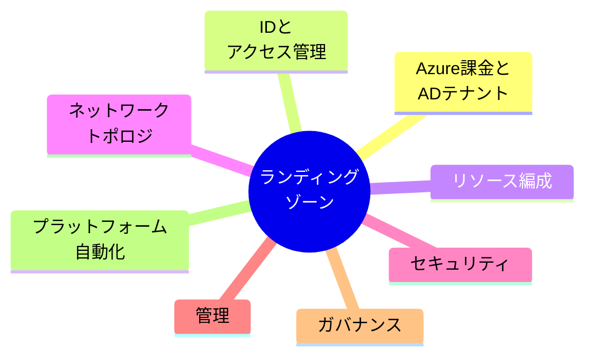

それぞれを詳しく見ていきましょう。

---

## 3.2 設計領域 1: Azure 課金と AD テナント

### 3.2.1 テナントとは

**テナント**は、Azure AD（現在は Microsoft Entra ID）の専用インスタンスです。

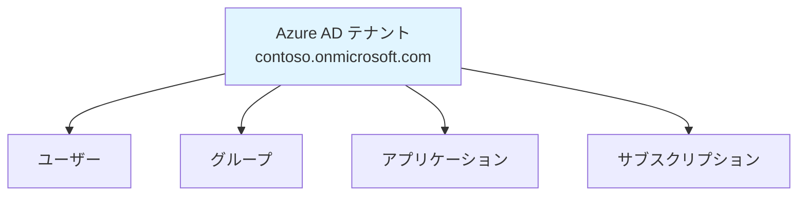

#### テナントの特徴

- 組織ごとに 1 つ（または複数）
- ユーザー、グループ、アプリケーションを管理
- すべての Azure リソースがテナントに紐づく
- ドメイン名: `yourcompany.onmicrosoft.com`

### 3.2.2 サブスクリプションとは

**サブスクリプション**は、Azure リソースの論理的なコンテナであり、課金の単位です。

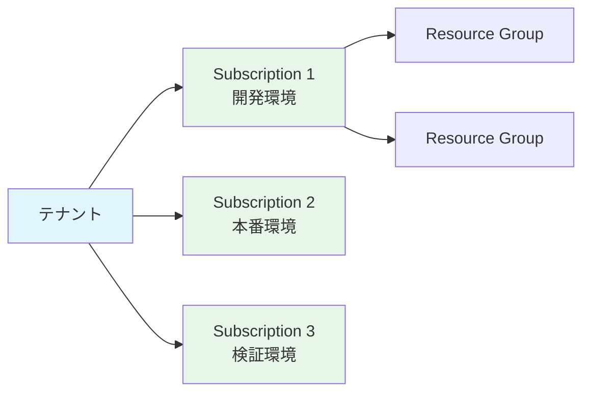

#### サブスクリプションの役割

- **課金の境界**: 各サブスクリプションに独立した請求
- **アクセス制御の境界**: RBAC 権限を設定
- **ポリシーの境界**: Azure Policy を適用
- **リソース制限の単位**: クォータと制限

### 3.2.3 課金アカウントの構造

エンタープライズ組織では、Enterprise Agreement (EA)を使用することが一般的です。

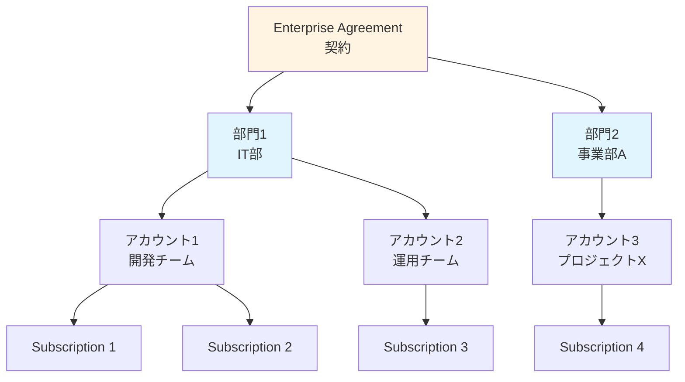

### 3.2.4 本ハンズオンでの設計

本ハンズオンでは、個人アカウント（従量課金）を使用しますが、エンタープライズの構造を模擬します。

- **1 つのテナント**
- **複数のサブスクリプション**（役割ごとに分離）

---

## 3.3 設計領域 2: ID とアクセス管理

### 3.3.1 Azure RBAC (Role-Based Access Control)

Azure RBAC は、「誰が」「何に」「何をできるか」を制御します。

#### RBAC の 3 要素

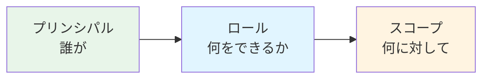

#### プリンシパル（誰が）

- ユーザー
- グループ
- サービスプリンシパル
- マネージド ID

#### ロール（何をできるか）

- **Owner**: すべての権限（削除含む）
- **Contributor**: リソースの作成・管理（権限付与以外）
- **Reader**: 読み取りのみ
- **カスタムロール**: 細かく定義

#### スコープ（何に対して）

- Management Group
- Subscription
- Resource Group
- 個別リソース

### 3.3.2 ロール割り当ての階層

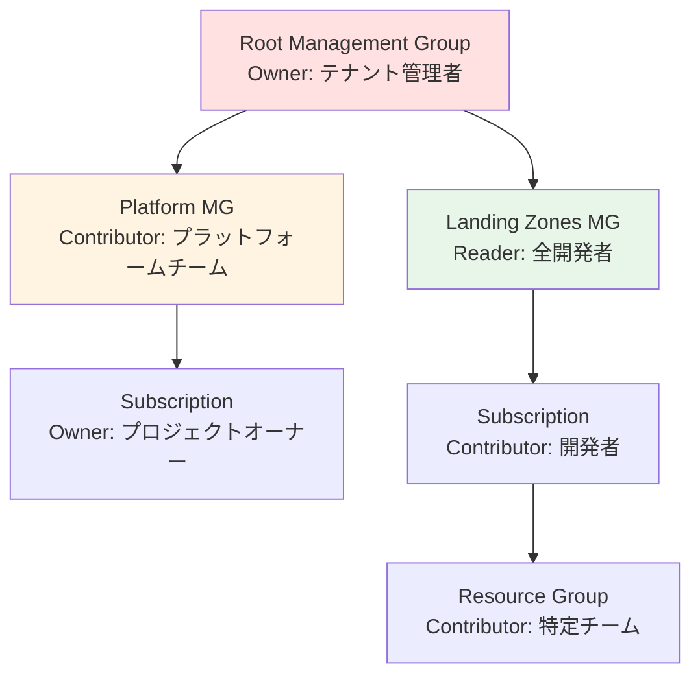

権限は**上から下に継承**されます。

### 3.3.3 Privileged Identity Management (PIM)

PIM は、特権アクセスを時間制限付きで付与する機能です。

#### PIM の利点

- **Just-In-Time (JIT) アクセス**: 必要な時だけ権限付与
- **承認フロー**: 管理者の承認が必要
- **監査証跡**: すべてのアクセスを記録
- **アラート**: 異常なアクセスを検知

#### 使用例

```
開発者が本番環境にアクセスする必要がある場合:
1. PIMでリクエスト送信
2. 理由を記載
3. 管理者が承認
4. 4時間限定でOwner権限付与
5. 時間経過で自動的に権限剥奪
```

### 3.3.4 条件付きアクセス

条件付きアクセスは、アクセス時の条件に基づいてアクセスを制御します。

#### ポリシー例

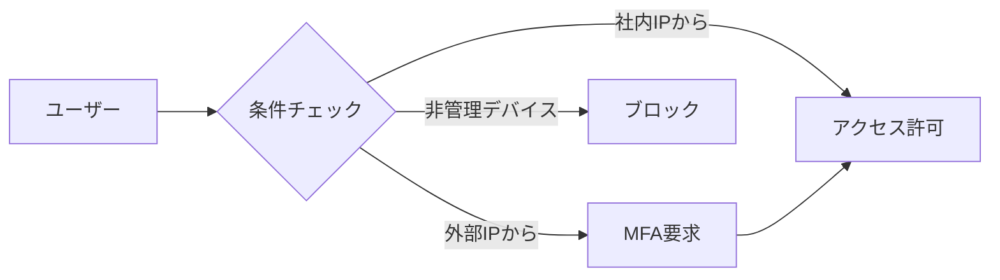

#### 設定できる条件

- **場所**: IP アドレス、国
- **デバイス**: 管理デバイスか、OS の種類
- **アプリケーション**: どのサービスか
- **リスクレベル**: 異常なサインインか

#### 制御

- アクセス許可
- MFA 要求
- デバイス準拠要求
- ブロック

### 3.3.5 Multi-Factor Authentication (MFA)

MFA は、複数の認証要素を組み合わせてセキュリティを強化します。

#### 認証要素

1. **知識**: パスワード、PIN
2. **所有**: スマートフォン、セキュリティキー
3. **生体**: 指紋、顔認証

本ハンズオンでは、すべてのユーザーに MFA を強制します。

---

## 3.4 設計領域 3: リソース編成

### 3.4.1 Management Groups 階層

Management Groups は、複数のサブスクリプションをグループ化し、ポリシーを一括適用するための階層構造です。

#### エンタープライズスケールの標準階層

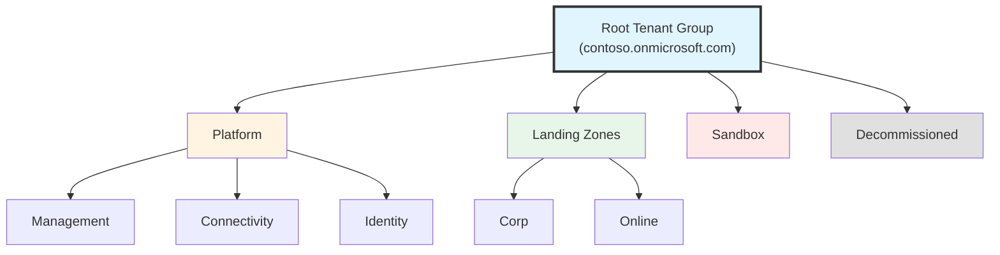

#### 各 Management Group の役割

| Management Group   | 役割                 | 適用するポリシー例               |
| ------------------ | -------------------- | -------------------------------- |
| **Root**           | 組織全体             | 許可されるリージョン、必須タグ   |
| **Platform**       | プラットフォーム基盤 | 診断設定の強制                   |
| **Management**     | 監視・ログ           | Log Analytics 接続の強制         |
| **Connectivity**   | ネットワーク Hub     | ネットワークセキュリティ         |
| **Identity**       | ID 管理              | 特権アクセスの制限               |
| **Landing Zones**  | アプリ全体           | セキュリティベースライン         |
| **Corp**           | 内部アプリ           | オンプレ接続、厳格なセキュリティ |
| **Online**         | 外部アプリ           | インターネット公開許可           |
| **Sandbox**        | 検証環境             | コスト制限、緩いポリシー         |
| **Decommissioned** | 廃止予定             | 読み取り専用                     |

### 3.4.2 Subscription 設計戦略

#### Subscription の分離理由

Subscription を分離する理由：

1. **課金の分離**: 部門ごと、プロジェクトごとのコスト管理
2. **アクセス制御の境界**: 開発環境と本番環境の分離
3. **リソース制限**: クォータの分離
4. **ブラストラジアス**: 影響範囲の最小化

#### 典型的な Subscription 構成

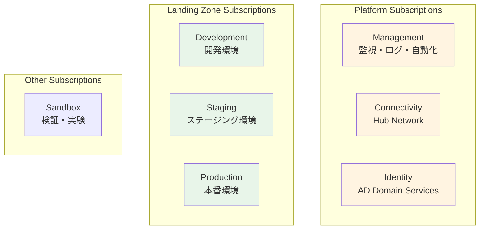

### 3.4.3 環境分離の設計（開発・ステージング・本番）

CAF のベストプラクティスでは、開発（Dev）、ステージング（Staging）、本番（Production）環境を明確に分離することが推奨されています。

#### 環境分離の 3 つのアプローチ

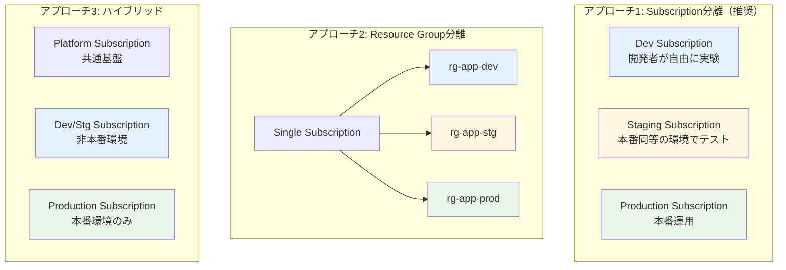

#### アプローチ 1: Subscription 分離（推奨）

**メリット**：

- ✅ **完全な課金分離**: 環境ごとのコストが明確
- ✅ **強力なアクセス制御**: 本番環境への誤った変更を防止
- ✅ **独立したクォータ**: 開発環境の負荷が本番に影響しない
- ✅ **ポリシーの差別化**: 開発は緩く、本番は厳格に設定可能
- ✅ **ブラストラジアス**: 開発環境の障害が本番に波及しない

**デメリット**：

- ❌ 管理対象の Subscription が増える
- ❌ Subscription 間のリソース共有が複雑

**適用シナリオ**：

- エンタープライズ環境（推奨）
- 厳格なコンプライアンス要件がある場合
- 大規模なチーム・プロジェクト

#### アプローチ 2: Resource Group 分離

**メリット**：

- ✅ 管理が簡単（単一 Subscription）
- ✅ リソース間の接続が容易（同一 VNet など）
- ✅ コストが低い（Subscription の最小数）

**デメリット**：

- ❌ 課金の分離が不十分
- ❌ 誤操作のリスク（本番 RG を誤って削除など）
- ❌ クォータの共有（環境間で競合）

**適用シナリオ**：

- 小規模プロジェクト
- PoC や検証環境
- 予算制約が厳しい場合

#### アプローチ 3: ハイブリッド（実践的な推奨）

**構成例**：

```
Platform Subscription（共通）
  ├── Management Subscription: 監視・ログ
  ├── Connectivity Subscription: Hub Network
  └── Identity Subscription: ID管理

Non-Production Subscription（非本番）
  ├── rg-app-dev-jpe-001
  ├── rg-app-stg-jpe-001
  └── vnet-nonprod-jpe-001

Production Subscription（本番）
  ├── rg-app-prod-jpe-001
  └── vnet-prod-jpe-001
```

**メリット**：

- ✅ 本番環境の完全な分離（最も重要）
- ✅ 開発・ステージングの統合管理（コスト削減）
- ✅ バランスの取れた管理負荷

**適用シナリオ**：

- 中規模〜大規模プロジェクト（最も一般的）
- セキュリティと管理負荷のバランスを重視

#### ネットワーク分離パターン：Hub VNet の共有 vs 分離

環境分離において、**Hub VNet（ハブネットワーク）をどう扱うか**は重要な設計判断です。CAF では以下の 2 つのパターンがあります。

##### パターン A: 共有 Hub VNet（コスト効率重視）

すべての環境が**単一の Hub VNet を共有**するアプローチ：

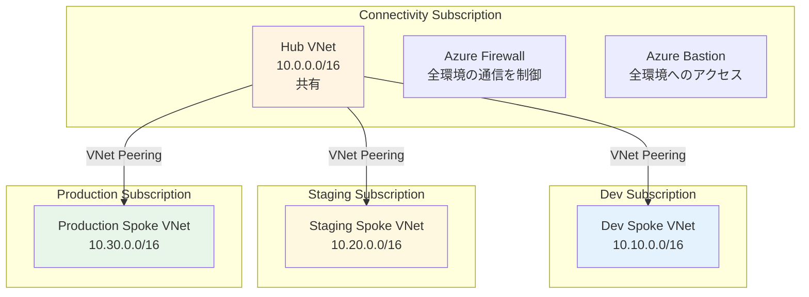

**メリット**：

- ✅ **コスト効率**: Azure Firewall、VPN Gateway、Bastion を 1 セットのみ管理
- ✅ **管理の簡素化**: 単一の Hub ネットワーク設定
- ✅ **リソース共有**: ExpressRoute、VPN などの高価なリソースを共有

**デメリット**：

- ❌ **セキュリティ懸念**: Firewall ルールの誤設定で環境間の通信が発生するリスク
- ❌ **ブラストラジアス**: Hub の障害が全環境に影響
- ❌ **コンプライアンス**: 一部の規制では環境の完全分離を要求

**適用シナリオ**：

- 中小規模組織（最も一般的）← **本ハンズオンで採用**
- コスト最適化が重要
- 環境間の厳格な分離が不要

##### パターン B: 環境別 Hub VNet（セキュリティ重視）

環境ごとに**独立した Hub VNet**を持つアプローチ：

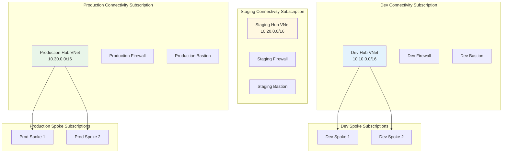

**メリット**：

- ✅ **完全な環境分離**: ネットワークレベルで環境が独立
- ✅ **セキュリティ**: 環境間の通信が物理的に不可能
- ✅ **ブラストラジアス**: 開発環境の障害が本番に影響しない
- ✅ **コンプライアンス**: 厳格な規制要件に対応可能
- ✅ **独立した運用**: 環境ごとに異なる運用チーム・ポリシー

**デメリット**：

- ❌ **高コスト**: Azure Firewall、VPN Gateway、Bastion を環境数分だけ必要
- ❌ **管理負荷**: Hub ネットワークが環境数分だけ増加
- ❌ **複雑性**: 環境間のリソース共有が困難

**コスト例**（月額・日本東部）：

```
単一 Hub VNet:
  Azure Firewall Standard: ¥122,000
  Azure Bastion Standard: ¥14,000
  合計: ¥136,000/月

環境別 Hub VNet（Dev/Staging/Prod）:
  Azure Firewall × 3: ¥366,000
  Azure Bastion × 3: ¥42,000
  合計: ¥408,000/月 ← 約 3 倍のコスト
```

**適用シナリオ**：

- 大規模エンタープライズ組織
- 金融、医療、政府機関など厳格な規制がある業界
- セキュリティとコンプライアンスが最優先
- 予算に余裕がある

##### パターン C: ハイブリッド（非本番共有、本番分離）

非本番環境（Dev/Staging）は Hub を共有し、**本番環境のみ独立した Hub** を持つアプローチ：

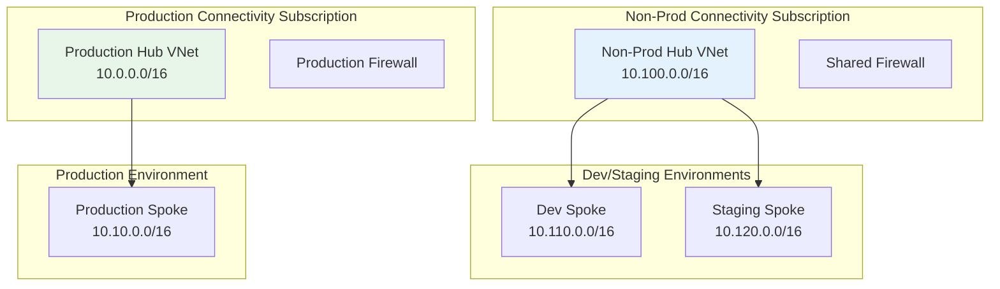

**メリット**：

- ✅ **バランス**: コストとセキュリティの妥協点
- ✅ **本番保護**: 最も重要な本番環境を完全分離
- ✅ **コスト削減**: 非本番環境のリソースは共有

**適用シナリオ**：

- 中規模〜大規模プロジェクト（実践的な推奨）
- 本番環境のセキュリティが重要だがコストも考慮したい

##### Hub VNet 分離の設計判断基準

| 判断基準                      | 共有 Hub（A） | 環境別 Hub（B） | ハイブリッド（C） |
| ----------------------------- | ------------- | --------------- | ----------------- |
| **月額コスト**                | ¥140K         | ¥420K           | ¥280K             |
| **管理負荷**                  | 低            | 高              | 中                |
| **セキュリティレベル**        | 中            | 高              | 高（本番のみ）    |
| **環境間の完全分離**          | ❌            | ✅              | ⚠️（本番のみ）    |
| **コンプライアンス対応**      | 限定的        | 完全対応        | 本番のみ対応      |
| **小規模組織（〜100 人）**    | ✅ 推奨       | ❌              | ⚠️                |
| **中規模組織（100-1000 人）** | ✅            | ⚠️              | ✅ 推奨           |
| **大規模組織（1000 人〜）**   | ❌            | ✅ 推奨         | ✅                |
| **金融・医療・政府**          | ❌            | ✅ 推奨         | ✅                |

##### 本ハンズオンでの採用パターン

本ハンズオンでは**パターン A（共有 Hub VNet）**を採用しています：

```
理由:
1. 学習目的: コスト効率を重視
2. シンプル: Hub-Spoke の基本概念を理解しやすい
3. 実用的: 多くの中小規模組織で採用されているパターン

実際のエンタープライズ環境への拡張:
- パターン B（環境別 Hub）に移行する場合:
  * Connectivity Subscription を環境数分作成
  * 各環境に独立した Hub VNet、Firewall、Bastion を構築

- パターン C（ハイブリッド）に移行する場合:
  * Non-Prod Connectivity Subscription（Dev/Staging共有）
  * Prod Connectivity Subscription（Production専用）
```

#### 環境ごとの設計パターン

| 観点                   | Development（開発） | Staging（ステージング）   | Production（本番）        |
| ---------------------- | ------------------- | ------------------------- | ------------------------- |
| **アクセス権限**       | 開発者: Contributor | 限定メンバー: Contributor | SRE/運用チームのみ: Owner |
| **ネットワーク**       | 10.10.0.0/16        | 10.20.0.0/16              | 10.0.0.0/16               |
| **VM サイズ**          | Standard_B2s（小）  | Standard_D4s_v5（中）     | Standard_D8s_v5（大）     |
| **可用性**             | Single VM           | Availability Zone（1-2）  | Availability Zone（3）    |
| **バックアップ**       | なし or 週次        | 日次                      | 日次 + GRS                |
| **診断ログ**           | 7 日間              | 30 日間                   | 90 日間                   |
| **Azure Policy**       | Audit（監査のみ）   | Audit + DeployIfNotExists | Deny + 強制               |
| **コストタグ**         | Environment: Dev    | Environment: Staging      | Environment: Production   |
| **自動シャットダウン** | 有効（夜間・週末）  | 有効（夜間のみ）          | 無効                      |
| **スケーリング**       | 手動                | 手動 or 制限付き自動      | 自動（フル設定）          |

#### 命名規則での環境識別

CAF の命名規則に環境を含める：

```
形式: {リソースタイプ}-{ワークロード}-{環境}-{リージョン}-{インスタンス}

例:
  vnet-spoke-dev-jpe-001    # 開発環境の Spoke VNet
  vnet-spoke-stg-jpe-001    # ステージング環境の Spoke VNet
  vnet-spoke-prod-jpe-001   # 本番環境の Spoke VNet

  rg-app-dev-jpe-001        # 開発環境の Resource Group
  rg-app-stg-jpe-001        # ステージング環境の Resource Group
  rg-app-prod-jpe-001       # 本番環境の Resource Group

  kv-secrets-dev-jpe-001    # 開発環境の Key Vault
  kv-secrets-prod-jpe-001   # 本番環境の Key Vault
```

**環境の略語**：

- `dev`: Development（開発）
- `stg`: Staging（ステージング）
- `prod`: Production（本番）
- `qa`: QA（品質保証）
- `uat`: UAT（ユーザー受入テスト）
- `dr`: Disaster Recovery（DR 環境）
- `sandbox`: Sandbox（検証・実験）

#### CI/CD パイプラインでの環境管理

環境ごとに異なるデプロイメント戦略：

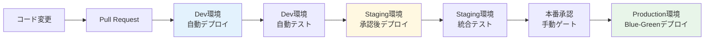

**デプロイメント戦略**：

- **Dev**: プッシュごとに自動デプロイ（高頻度）
- **Staging**: マージ後に自動デプロイ（1 日数回）
- **Production**: 手動承認 + スケジュール（週次・隔週）

#### 環境間のデータ管理

**重要な原則**：

```
⚠️ 本番データを開発・ステージング環境にコピーしない
   → 個人情報保護、コンプライアンス違反のリスク
```

**推奨アプローチ**：

1. **合成データ**: 開発・ステージングでは架空のテストデータを使用
2. **データマスキング**: 必要な場合は本番データを匿名化
3. **サブセット**: 本番データの一部のみ（匿名化済み）を使用

#### 本ハンズオンでの環境戦略

本ハンズオンでは**単一の Production 環境**のみを構築しますが、実際のエンタープライズ環境では以下のように拡張できます：

**拡張例**：

```
Platform Subscriptions（共通）
  ├── Management Subscription
  ├── Connectivity Subscription
  └── Identity Subscription

Landing Zone - Development（開発）
  ├── sub-landingzone-corp-dev
  └── 開発者が自由に実験可能

Landing Zone - Staging（ステージング）
  ├── sub-landingzone-corp-stg
  └── 本番同等の構成でテスト

Landing Zone - Production（本番）✅
  ├── sub-landingzone-corp-prod ← 本ハンズオンで構築
  └── 厳格なアクセス制御
```

### 3.4.4 リソースグループの設計

リソースグループは、関連するリソースをまとめる論理的なコンテナです。

#### リソースグループの原則

**原則 1: ライフサイクルの一致**

```
同じライフサイクルを持つリソースを同じRGに配置

例: Webアプリ + App Service Plan + SQL Database
   → すべて一緒にデプロイ、一緒に削除
```

**原則 2: デプロイ単位**

```
一緒にデプロイするリソースを同じRGに

例: ARM/Bicepテンプレートのデプロイターゲット
```

**原則 3: アクセス制御の単位**

```
同じアクセス権限を持つリソースを同じRGに

例: 開発者がアクセスできるリソース群
```

#### リソースグループの命名例

```
rg-{workload}-{environment}-{region}-{instance}

例:
rg-webapp-prod-japaneast-001
rg-network-hub-japaneast-001
rg-monitoring-prod-japaneast-001
```

### 3.4.5 命名規則とタグ付け

#### 命名規則

一貫した命名規則は、リソース管理の基本です。

**推奨される命名パターン**:

```
{resource-type}-{workload/app}-{environment}-{region}-{instance}

例:
vnet-hub-prod-japaneast-001
vm-jumpbox-dev-japaneast-001
st-logs-prod-japaneast-001  (ストレージアカウントは短縮)
kv-app1-prod-jpe-001        (Key Vaultは短縮)
```

**リソースタイプの略語**:

| リソース                | 略語 | 例                             |
| ----------------------- | ---- | ------------------------------ |
| Resource Group          | rg   | rg-webapp-prod-jpe-001         |
| Virtual Network         | vnet | vnet-hub-prod-jpe-001          |
| Subnet                  | snet | snet-app-prod-jpe-001          |
| Network Security Group  | nsg  | nsg-app-prod-jpe-001           |
| Virtual Machine         | vm   | vm-jumpbox-prod-jpe-001        |
| Storage Account         | st   | stlogsprod001 (22 文字制限)    |
| Key Vault               | kv   | kv-app1-prod-001 (24 文字制限) |
| Log Analytics Workspace | law  | law-prod-jpe-001               |
| Azure Firewall          | afw  | afw-hub-prod-jpe-001           |

詳細: [Microsoft の命名規則ガイド](https://docs.microsoft.com/azure/cloud-adoption-framework/ready/azure-best-practices/resource-naming)

#### タグ付け戦略

タグは、リソースにメタデータを付与する機能です。

**必須タグの例**:

```json
{
  "Environment": "Production",
  "CostCenter": "IT-001",
  "Owner": "john.doe@contoso.com",
  "Application": "CustomerPortal",
  "Criticality": "High",
  "DataClassification": "Confidential",
  "BusinessUnit": "Sales"
}
```

**タグの用途**:

- コスト配分
- 自動化（タグベースでバックアップ等）
- レポート作成
- 所有者の追跡

**タグのベストプラクティス**:

- 組織全体で統一されたタグスキーマ
- Azure Policy で必須タグを強制
- タグの継承（RG → リソース）

---

## 3.5 設計領域 4: ネットワークトポロジと接続

### 3.5.1 Hub-Spoke トポロジー

Hub-Spoke は、エンタープライズ環境で最も一般的なネットワークトポロジーです。

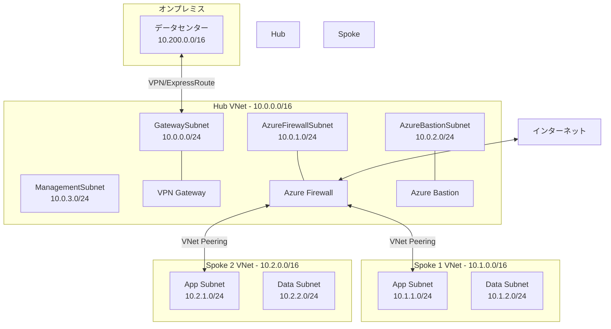

#### Hub VNet の役割

**中央集約型サービス**:

- Azure Firewall（すべてのトラフィック制御）
- VPN Gateway / ExpressRoute Gateway（オンプレ接続）
- Azure Bastion（安全な管理アクセス）
- DNS（プライベート DNS）

**利点**:

- セキュリティの一元管理
- コスト効率（共有リソース）
- トラフィックの可視化

#### Spoke VNet の役割

**ワークロード実行環境**:

- アプリケーションサーバー
- データベース
- その他のワークロード

**特徴**:

- ワークロードごとに分離
- 互いに直接通信しない（Hub を経由）
- 独立したアクセス制御

### 3.5.2 IP アドレス設計

#### アドレス空間の割り当て

慎重に計画する必要があります（後から変更が困難）。

**推奨される割り当て**:

```
オンプレミス: 10.0.0.0/8 または 172.16.0.0/12 の一部
Azure Hub:    10.0.0.0/16  (65,536 IP)
Azure Spoke:  10.1.0.0/16, 10.2.0.0/16, ...

注意: オンプレミスと重複しないこと!
```

#### サブネット設計

**Hub VNet (10.0.0.0/16)**:

| サブネット          | CIDR        | 用途                     |
| ------------------- | ----------- | ------------------------ |
| GatewaySubnet       | 10.0.0.0/24 | VPN/ExpressRoute Gateway |
| AzureFirewallSubnet | 10.0.1.0/24 | Azure Firewall           |
| AzureBastionSubnet  | 10.0.2.0/24 | Azure Bastion            |
| ManagementSubnet    | 10.0.3.0/24 | 管理用 VM 等             |
| (予約)              | 10.0.4.0/22 | 将来の拡張用             |

**Spoke VNet (10.1.0.0/16)**:

| サブネット            | CIDR        | 用途               |
| --------------------- | ----------- | ------------------ |
| AppSubnet             | 10.1.1.0/24 | アプリケーション層 |
| DataSubnet            | 10.1.2.0/24 | データベース層     |
| PrivateEndpointSubnet | 10.1.3.0/24 | Private Endpoint   |
| (予約)                | 10.1.4.0/22 | 将来の拡張用       |

#### サブネットサイズの選び方

- /24 (256 IP) - 中小規模のワークロード
- /22 (1,024 IP) - 大規模ワークロード
- /27 (32 IP) - 小規模、管理用途

**注意**: Azure は各サブネットで 5 つの IP アドレスを予約します。

### 3.5.3 ハイブリッド接続

オンプレミスと Azure を接続する方法は 2 つあります。

#### VPN Gateway

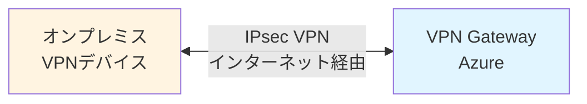

**特徴**:

- インターネット経由の暗号化トンネル
- 比較的安価
- 帯域幅: 最大 10 Gbps
- レイテンシ: やや高い

**用途**: 小規模～中規模の接続

#### ExpressRoute

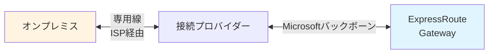

**特徴**:

- 専用線による直接接続
- 高速・低レイテンシ
- 帯域幅: 50 Mbps ～ 100 Gbps
- 高可用性

**用途**: ミッションクリティカルな接続

### 3.5.4 DNS の設計

#### Azure Private DNS Zone

プライベート IP アドレスの名前解決に使用します。

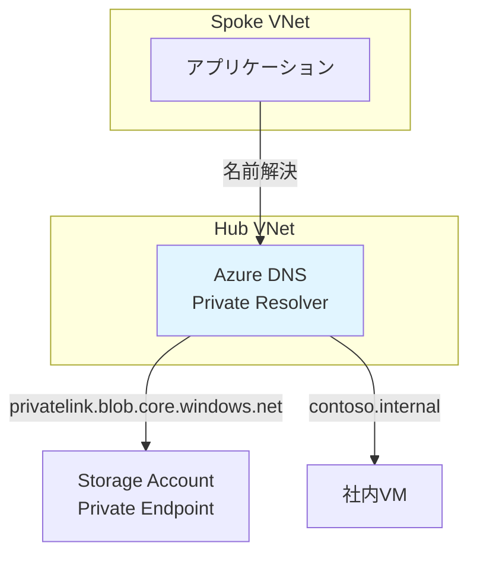

**使用例**:

- Private Endpoint の名前解決
- 社内 DNS ゾーンの統合
- ハイブリッド DNS

---

## 3.6 設計領域 5: セキュリティ

### 3.6.1 多層防御 (Defense in Depth)

セキュリティは複数の層で構成します。

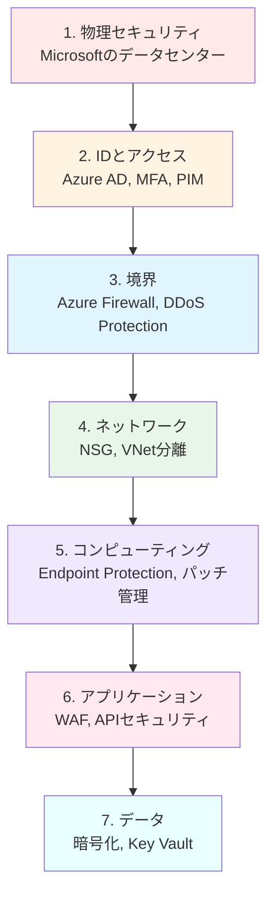

各層が独立してセキュリティを提供します。

### 3.6.2 ゼロトラストモデル

**従来のモデル**: 境界の内側は信頼  
**ゼロトラスト**: すべてを検証

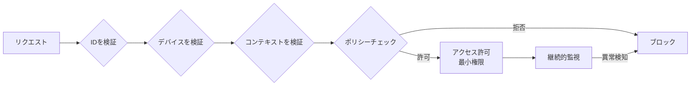

#### ゼロトラストの原則

1. **明示的に検証**: 常に ID を検証
2. **最小権限アクセス**: 必要最小限の権限のみ
3. **侵害を想定**: すでに侵入されている前提で設計

### 3.6.3 主要なセキュリティサービス

#### Microsoft Defender for Cloud

統合されたセキュリティ管理と Workload Protection。

**機能**:

- セキュリティスコア
- 推奨事項
- 脆弱性スキャン
- 脅威検知
- コンプライアンスダッシュボード

#### Azure Firewall

フルマネージドのネットワークファイアウォール。

**機能**:

- アプリケーションルール（FQDN ベース）
- ネットワークルール（IP/ポート ベース）
- 脅威インテリジェンス
- TLS 検査
- IDPS プロビジョン）

#### Network Security Group (NSG)

サブネット・NIC レベルのファイアウォール。

**ルール例**:

```
優先度 100: Allow HTTPS from Internet to AppSubnet
優先度 200: Allow SQL from AppSubnet to DataSubnet
優先度 300: Deny all other traffic
```

#### Azure Key Vault

シークレット、キー、証明書の安全な保管。

**保管対象**:

- データベース接続文字列
- API キー
- 暗号化キー
- SSL 証明書

#### Azure DDoS Protection

DDoS 攻撃からの保護。

**プラン**:

- **Basic**: 自動有効、無料
- **Standard**: 高度な保護、コスト最適化

---

## 3.7 設計領域 6: 管理

### 3.7.1 監視とログ

#### Log Analytics Workspace

すべてのログを集約する中央リポジトリ。

```mermaid
graph TB
    subgraph "ログソース"
        VM[Virtual Machines]
        WebApp[Web Apps]
        DB[Databases]
        Firewall[Azure Firewall]
        NSG[NSG Flow Logs]
    end

    LAW[Log Analytics<br/>Workspace]

    VM -->|診断ログ| LAW
    WebApp -->|アプリログ| LAW
    DB -->|クエリログ| LAW
    Firewall -->|トラフィックログ| LAW
    NSG -->|フローログ| LAW

    LAW --> Query[Kusto Query<br/>KQL]
    LAW --> Alert[アラート]
    LAW --> Workbook[Workbook]
    LAW --> Sentinel[Azure Sentinel]

    style LAW fill:#e1f5ff
```

#### Azure Monitor

メトリクス、ログ、アラートの統合プラットフォーム。

**監視対象**:

- リソースメトリクス（CPU、メモリ、ネットワーク）
- アプリケーションパフォーマンス
- 可用性
- ユーザー動作

#### アラート設計

```mermaid
graph LR
    Condition[条件<br/>CPU > 80%] --> Alert[アラート発火]
    Alert --> ActionGroup[アクション<br/>グループ]
    ActionGroup --> Email[メール送信]
    ActionGroup --> SMS[SMS送信]
    ActionGroup --> Webhook[Webhook<br/>自動修復]

    style Alert fill:#ffe8e8
```

### 3.7.2 バックアップと障害復旧

#### Azure Backup

**バックアップ対象**:

- VM
- Azure Files
- SQL Database
- SAP HANA

**ポリシー例**:

- 日次バックアップ（午前 2 時）
- 週次バックアップを 4 週間保持
- 月次バックアップを 12 ヶ月保持
- 年次バックアップを 7 年保持

#### Azure Site Recovery (ASR)

**用途**:

- ディザスタリカバリ
- リージョン間のレプリケーション
- オンプレミス → Azure 移行

**目標**:

- RPO (Recovery Point Objective): データ損失許容時間
- RTO (Recovery Time Objective): 復旧時間目標

---

## 3.8 設計領域 7: ガバナンス

### 3.8.1 Azure Policy の仕組み

Azure Policy は、組織のルールを自動的に適用します。

```mermaid
graph LR
    Policy[Policy定義<br/>ルール] --> Assignment[割り当て<br/>スコープ]
    Assignment --> Evaluation[評価]
    Evaluation --> Compliant[準拠]
    Evaluation --> NonCompliant[非準拠]
    NonCompliant --> Effect[効果]
    Effect --> Deny[拒否]
    Effect --> Audit[監査]
    Effect --> Deploy[自動修復]

    style Compliant fill:#e8f5e9
    style NonCompliant fill:#ffe8e8
```

#### ポリシーの効果

| 効果                  | 説明                       | 使用例                                   |
| --------------------- | -------------------------- | ---------------------------------------- |
| **Deny**              | リソース作成を拒否         | 許可されていないリージョンでの作成を防ぐ |
| **Audit**             | 非準拠を記録（警告）       | 推奨設定からの逸脱を検知                 |
| **DeployIfNotExists** | 自動的に設定を追加         | 診断設定を自動適用                       |
| **Modify**            | リソースのプロパティを変更 | タグを自動追加                           |
| **Append**            | プロパティを追加           | NSG ルールを追加                         |

### 3.8.2 ポリシーイニシアチブ

複数のポリシーをグループ化したもの。

**例: セキュリティベースライン**

```
イニシアチブ: "セキュリティベースライン"
├── ポリシー1: ストレージアカウントはHTTPSのみ許可
├── ポリシー2: VMにマルウェア対策を要求
├── ポリシー3: SQL Databaseは暗号化を要求
├── ポリシー4: 診断ログを有効化
└── ポリシー5: NSGでRDPを制限
```

### 3.8.3 Blueprints

Blueprints は、サブスクリプション全体のテンプレートです。

**含まれるもの**:

- ロール割り当て
- ポリシー割り当て
- ARM テンプレート
- リソースグループ

**使用例**:

```
Blueprint: "Landing Zone - Corp"
├── ロール割り当て: 開発者グループにContributor
├── ポリシー: セキュリティベースライン
├── Resource Group: "rg-networking"
│   └── VNet, NSG, Route Table
└── Resource Group: "rg-monitoring"
    └── Log Analytics Workspace
```

### 3.8.4 Cost Management

コスト管理は重要なガバナンス要素です。

#### 予算アラート

```mermaid
graph LR
    Budget[予算<br/>$1000/月] --> Track[使用量追跡]
    Track --> Alert1[80%達成<br/>アラート]
    Track --> Alert2[100%達成<br/>アラート]
    Track --> Alert3[120%達成<br/>緊急アラート]

    Alert3 --> Action[自動アクション<br/>リソース停止]

    style Alert3 fill:#ffe8e8
```

#### コスト配分タグ

```json
{
  "CostCenter": "IT-001",
  "Project": "CustomerPortal",
  "Environment": "Production"
}
```

これらのタグでコストを集計し、チャージバックできます。

---

## 3.9 設計領域 8: プラットフォームの自動化と DevOps

### 3.9.1 Infrastructure as Code (IaC)

すべてのインフラをコードで定義します。

#### IaC の利点

```mermaid
graph TB
    IaC[Infrastructure<br/>as Code]

    IaC --> Version[バージョン管理<br/>Git]
    IaC --> Review[レビュー<br/>Pull Request]
    IaC --> Test[テスト<br/>自動検証]
    IaC --> Deploy[自動デプロイ<br/>CI/CD]
    IaC --> Reproduce[再現性<br/>環境複製]
    IaC --> Document[ドキュメント<br/>コードが仕様]

    style IaC fill:#e1f5ff
```

#### Bicep vs ARM vs Terraform

| 特徴             | Bicep      | ARM JSON  | Terraform           |
| ---------------- | ---------- | --------- | ------------------- |
| 可読性           | ⭐⭐⭐⭐⭐ | ⭐⭐      | ⭐⭐⭐⭐            |
| Azure ネイティブ | ✅         | ✅        | ❌ (マルチクラウド) |
| 学習曲線         | 緩やか     | 急        | 中程度              |
| サポート         | Microsoft  | Microsoft | HashiCorp           |
| コミュニティ     | 成長中     | 大        | 非常に大            |

本ハンズオンでは、**Bicep**を使用します（Azure ネイティブ、可読性が高い）。

### 3.9.2 CI/CD パイプライン

```mermaid
graph LR
    Dev[開発者] -->|git push| Repo[GitHub]
    Repo -->|trigger| CI[CI<br/>GitHub Actions]
    CI --> Validate[Bicep検証]
    Validate --> Test[テスト]
    Test --> Deploy[デプロイ<br/>Azure]
    Deploy --> Monitor[監視]

    style CI fill:#e1f5ff
    style Deploy fill:#e8f5e9
```

#### ワークフロー例

```yaml
name: Deploy Infrastructure

on:
  push:
    branches: [main]
    paths: ["infrastructure/**"]

jobs:
  deploy:
    runs-on: ubuntu-latest
    steps:
      - uses: actions/checkout@v2

      - name: Azure Login
        uses: azure/login@v1
        with:
          creds: ${{ secrets.AZURE_CREDENTIALS }}

      - name: Deploy Bicep
        run: |
          az deployment sub create \
            --location japaneast \
            --template-file infrastructure/bicep/main.bicep \
            --parameters infrastructure/bicep/parameters/prod.parameters.json
```

### 3.9.3 GitOps

Git をシングルソースオブトゥルース（唯一の信頼できる情報源）とします。

**原則**:

1. すべての変更は Git にコミット
2. Pull Request でレビュー
3. main ブランチへのマージで自動デプロイ
4. 環境は Git の状態を反映

---

## 3.10 本ハンズオンでの設計決定

### 3.10.1 Management Groups 階層

```
Root Tenant Group (Contoso)
├── Platform
│   ├── Management
│   ├── Connectivity
│   └── Identity
├── Landing Zones
│   ├── Corp
│   └── Online
├── Sandbox
└── Decommissioned
```

### 3.10.2 Subscriptions

- **1 つの Subscription**: コスト管理のため（本番では分離推奨）
- **複数の Resource Groups**: 役割ごとに分離

### 3.10.3 ネットワーク

- **Hub VNet**: 10.0.0.0/16
- **Spoke VNet**: 10.1.0.0/16
- **Hub-Spoke Peering**
- **Azure Firewall**: すべてのトラフィック制御

### 3.10.4 セキュリティ

- **Azure Firewall**: L3-L7 トラフィック制御
- **NSG**: サブネットレベル制御
- **Azure Bastion**: 安全な管理アクセス
- **Key Vault**: シークレット管理
- **Defender for Cloud**: セキュリティ監視

### 3.10.5 監視

- **Log Analytics Workspace**: 中央ログリポジトリ
- **Azure Monitor**: メトリクスとアラート
- **Workbook**: ダッシュボード

### 3.10.6 ガバナンス

- **20+ Azure Policies**: セキュリティ、コスト、運用
- **タグ付け戦略**: 7 つの必須タグ
- **予算アラート**: 月次コスト監視

### 3.10.7 自動化

- **Bicep**: すべての IaC
- **GitHub Actions**: CI/CD パイプライン
- **GitOps**: Git ベースのワークフロー

---

## 3.11 章のまとめ

本章で学んだこと：

### 8 つの設計領域の詳細

1. **Azure 課金と AD テナント**: テナント、サブスクリプション、課金構造
2. **ID とアクセス管理**: RBAC、PIM、条件付きアクセス、MFA
3. **リソース編成**: Management Groups、Subscriptions、命名規則、タグ
4. **ネットワークトポロジ**: Hub-Spoke、IP アドレス設計、ハイブリッド接続
5. **セキュリティ**: 多層防御、ゼロトラスト、Firewall、Key Vault
6. **管理**: 監視、ログ、アラート、バックアップ
7. **ガバナンス**: Azure Policy、Blueprints、Cost Management
8. **自動化**: IaC、CI/CD、GitOps

### 重要な概念

- **Management Groups**: ポリシーを階層的に適用
- **Hub-Spoke**: ネットワークの中心集約
- **ゼロトラスト**: すべてを検証
- **Infrastructure as Code**: すべてをコードで管理

---

## 次のステップ

設計の詳細を理解できたら、次は実際の Azure 環境のセットアップに進みましょう。

👉 [第 4 章：Azure 環境の初期セットアップ](chapter04-setup.md)

---

## 参考リンク

- [CAF 設計領域](https://docs.microsoft.com/azure/cloud-adoption-framework/ready/landing-zone/design-areas)
- [Management Groups](https://docs.microsoft.com/azure/governance/management-groups/)
- [Hub-Spoke ネットワーク](https://docs.microsoft.com/azure/architecture/reference-architectures/hybrid-networking/hub-spoke)
- [Azure Policy](https://docs.microsoft.com/azure/governance/policy/)
- [Azure Bicep](https://docs.microsoft.com/azure/azure-resource-manager/bicep/)
- [ゼロトラストセキュリティ](https://docs.microsoft.com/security/zero-trust/)

---

**最終更新**: 2026 年 1 月 7 日
