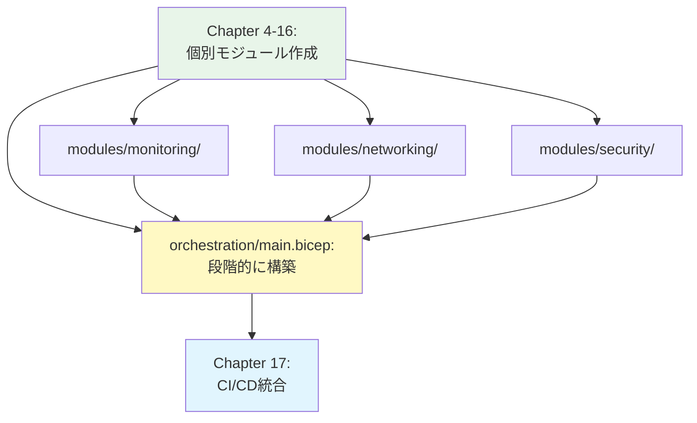
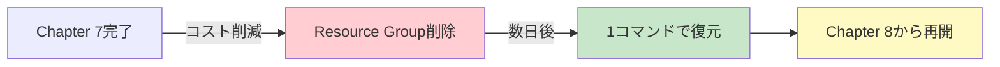

# 第 4 章：Azure 環境の初期セットアップ

## 本章の目的

本章では、Azure 環境を実際にセットアップします。Azure ポータルへのアクセス、初期 Subscription の確認、サービスプリンシパルの作成、そして最初の Bicep ファイルの作成とデプロイを行います。

**所要時間**: 約 1-2 時間  
**難易度**: ⭐⭐

---

## 4.1 Azure ポータルへのアクセス

### 4.1.1 ポータルへのサインイン

1. [Azure ポータル](https://portal.azure.com)にアクセス

2. 作成した Microsoft アカウントでサインイン

3. MFA が設定されている場合は、認証を完了

4. Azure ポータルのホーム画面が表示されます

### 4.1.2 ポータルの基本操作

#### ダッシュボード

ホーム画面では、よく使うリソースやサービスにアクセスできます。

#### 検索バー

画面上部の検索バーから、任意のサービスやリソースを検索できます。

試しに「Management groups」と検索してみましょう。

#### Cloud Shell

画面上部の Cloud Shell アイコン（`>_`）をクリックすると、ブラウザ内で Bash または PowerShell を実行できます。

初回起動時は、ストレージアカウントの作成を求められます（無料枠内で作成可能）。

---

## 4.2 テナントとサブスクリプションの確認

### 4.2.1 テナント情報の確認

#### ポータルで確認

1. 画面右上のアカウントアイコンをクリック
2. 「ディレクトリの切り替え」を選択
3. 現在のテナント（ディレクトリ）を確認

#### CLI で確認

GitHub Codespaces のターミナルで実行：

```bash
# Azure CLIにログイン（まだの場合）
az login --use-device-code

# テナント情報を表示
az account show --output table
```

出力例：

```
Name                 CloudName    SubscriptionId                        TenantId                              State
-------------------  -----------  ------------------------------------  ------------------------------------  -------
Azure subscription 1 AzureCloud   12345678-1234-1234-1234-123456789abc  87654321-4321-4321-4321-987654321dcb  Enabled
```

以下の情報をメモします：

- **SubscriptionId**: サブスクリプション ID
- **TenantId**: テナント ID

### 4.2.2 サブスクリプションの確認

```bash
# すべてのサブスクリプションを表示
az account list --output table
```

新規アカウントの場合、通常 1 つのサブスクリプションのみが存在します。

#### デフォルトサブスクリプションの設定

複数のサブスクリプションがある場合は、デフォルトを設定：

```bash
az account set --subscription "サブスクリプション名またはID"
```

確認：

```bash
az account show --query name -o tsv
```

---

## 4.3 Management Groups の権限確認

### 4.3.1 Management Groups とは（復習）

Management Groups は、複数のサブスクリプションをグループ化し、ポリシーを階層的に適用する仕組みです。

### 4.3.2 ルート Management Group へのアクセス権付与

Management Groups を作成・管理するには、ルート Management Group に対する **Owner** ロールが必要です。

#### ポータルでの権限付与

1. Azure ポータルで「Management groups」を検索

2. 初回アクセス時、Management Groups が有効化されます

3. 画面右上の「設定」（歯車アイコン）をクリック

4. 「Permissions」タブを選択

5. 「Elevate access to manage all Azure subscriptions and management groups」をチェック

6. 「Save」をクリック

これで、あなたのアカウントにルートスコープの「User Access Administrator」ロールが付与されます。

**重要**: その後、ルート Management Group に **Owner** ロールを追加で付与してください。

```bash
# ルート Management Group に Owner ロールを付与
ROOT_MG_ID=$(az account tenant list --query "[0].tenantId" -o tsv)
USER_OBJECT_ID=$(az ad signed-in-user show --query id -o tsv)

az role assignment create \
  --role "Owner" \
  --assignee-object-id $USER_OBJECT_ID \
  --assignee-principal-type User \
  --scope /providers/Microsoft.Management/managementGroups/$ROOT_MG_ID
```

#### CLI での確認

```bash
# 自分のロール割り当てを確認
az role assignment list \
  --assignee $(az account show --query user.name -o tsv) \
  --scope / \
  --output table
```

「Owner」ロールが表示されれば OK です。

---

## 4.4 プロジェクトの初期化

### 4.4.1 環境変数ファイルの準備

機密情報を環境変数で管理します。

※ この時点では、現在 Azure アカウントで使用できるサブスクリプション（無料トライアルまたは既存のサブスクリプション）を使用します。専用のサブスクリプション（management、connectivity など）は第 6 章で作成します。

```bash
# .envファイルを作成（このファイルはGitにコミットしません）
cat << EOF > .env
# Azure環境情報
AZURE_TENANT_ID=$(az account show --query tenantId -o tsv)
AZURE_SUBSCRIPTION_ID=$(az account show --query id -o tsv)
AZURE_LOCATION=japaneast

# 命名規則
ENVIRONMENT=dev
COMPANY_PREFIX=contoso
EOF

# 確認
cat .env

# 環境変数を読み込む
source .env

# 確認
echo "Tenant ID: $AZURE_TENANT_ID"
echo "Subscription ID: $AZURE_SUBSCRIPTION_ID"
```

---

## 4.5 最初の Bicep ファイルの作成

### 4.5.1 Bicep の基本構造

Bicep ファイルは、Azure リソースを宣言的に定義します。

基本的な構文：

```bicep
// パラメータ（入力値）
param location string = 'japaneast'
param resourceName string

// 変数（計算値）
var storageAccountName = 'st${resourceName}${uniqueString(resourceGroup().id)}'

// リソース定義
resource storageAccount 'Microsoft.Storage/storageAccounts@2023-01-01' = {
  name: storageAccountName
  location: location
  sku: {
    name: 'Standard_LRS'
  }
  kind: 'StorageV2'
}

// 出力値
output storageAccountId string = storageAccount.id
```

### 4.5.2 Bicep パラメーター管理の設計原則

**なぜパラメーターファイルが必要か？**

Bicep で Infrastructure as Code を実践する最大の理由は、**すべてのリソースを消しても一発で復元できる**ことです。

#### ❌ 間違ったアプローチ

```bash
# パラメーターをCLIで直接指定
az deployment sub create \
  --template-file main.bicep \
  --parameters resourceGroupName=rg-test location=japaneast
```

**問題点:**

- パラメーター値がコマンド履歴にしか残らない
- 災害復旧時に値を思い出せない
- チームメンバーと共有できない
- 環境の再現性がない

#### ✅ 正しいアプローチ

```bash
# パラメーターファイルを使用
az deployment sub create \
  --template-file main.bicep \
  --parameters main.bicepparam
```

**メリット:**

- すべてのパラメーター値がファイルとして記録
- Git 管理で履歴追跡可能
- 完全な再現性を保証
- 災害時の復旧手順書として機能
- タイプセーフ（Bicep ファイルとの型チェック）
- IntelliSense サポート

#### ディレクトリ構成

本教科書では、以下の構成を採用します：

```
infrastructure/bicep/
├── modules/          # Bicep テンプレート（再利用可能）
│   ├── resource-group/
│   │   └── resource-group.bicep
│   ├── subscriptions/
│   │   ├── sub-management.bicep
│   │   └── sub-identity.bicep
│   ├── monitoring/
│   │   ├── log-analytics.bicep
│   │   └── dcr-vm-insights.bicep
│   └── identity/
│       └── managed-identity.bicep
└── parameters/       # パラメーターファイル（環境固有の値）
    ├── sub-management.bicepparam
    ├── sub-identity.bicepparam
    ├── management-resource-group.bicepparam
    ├── log-analytics.bicepparam
    └── dcr-vm-insights.bicepparam
```

**重要原則:**

1. **すべてのパラメーターをファイルで管理**: billingScope、workspaceId、tableName など、すべてのパラメーターは `.bicepparam` ファイルに記述します
2. **CLI でのパラメーター注入は禁止**: `--parameters param=value` 形式でのパラメーター指定は使用しません
3. **Git 管理**: すべての `.bicepparam` ファイルは Git 管理下に置き、本番環境の完全なバックアップとして機能させます
4. **環境固有の値**: 開発者ごとに異なる値（billingScope、subscription ID など）は、各自がパラメーターファイルを編集して使用します
5. **`.bicepparam` を使用**: Microsoft が推奨する新しいパラメーターファイル形式（Bicep 0.18.4 以降）

### 4.5.3 テスト用のリソースグループ作成

まず、簡単なリソースグループを作成して Bicep の動作を確認します。

#### test-rg.bicep ファイルの作成

```bash
# テスト用ディレクトリを作成
mkdir -p infrastructure/bicep/test
```

ファイル `infrastructure/bicep/test/test-rg.bicep` を作成し、以下の内容を記述します：

**test-rg.bicep の解説：**

サブスクリプションレベルでリソースグループを作成するテンプレート。タグ付けのベストプラクティスとして、Environment、Project、ManagedBy、CreatedDate を設定しています。

```bicep
// テスト用リソースグループ作成
targetScope = 'subscription'

@description('リソースグループ名')
param resourceGroupName string = 'rg-caf-handson-test'

@description('デプロイ先のリージョン')
param location string = 'japaneast'

@description('作成日（自動生成）')
param createdDate string = utcNow('yyyy-MM-dd')

@description('タグ')
param tags object = {
  Environment: 'Test'
  Project: 'CAF-Handson'
  ManagedBy: 'Bicep'
  CreatedDate: createdDate
}

// リソースグループの作成
resource resourceGroup 'Microsoft.Resources/resourceGroups@2021-04-01' = {
  name: resourceGroupName
  location: location
  tags: tags
}

// 出力
output resourceGroupId string = resourceGroup.id
output resourceGroupName string = resourceGroup.name
```

ファイル `infrastructure/bicep/test/test-rg.bicepparam` を作成し、以下の内容を記述します：

```bicep
using './test-rg.bicep'

param resourceGroupName = 'rg-caf-handson-test'
param location = 'japaneast'
param tags = {
  Environment: 'Test'
  Project: 'CAF-Handson'
  ManagedBy: 'Bicep'
}
```

### 4.5.4 Bicep ファイルの検証

デプロイ前に、構文エラーをチェックします。

```bash
# Bicepファイルのビルド（ARM JSONに変換）
az bicep build --file infrastructure/bicep/test/test-rg.bicep

# 生成されたARMテンプレートを確認（オプション）
cat infrastructure/bicep/test/test-rg.json
```

エラーがなければ、test-rg.json ファイルが生成されます。

### 4.5.5 What-If 実行（プレビュー）

実際にデプロイする前に、何が作成されるか確認します。

```bash
# 事前確認
az deployment sub what-if \
  --location japaneast \
  --template-file infrastructure/bicep/test/test-rg.bicep \
  --parameters infrastructure/bicep/test/test-rg.bicepparam
```

出力例：

```
Resource and property changes are indicated with these symbols:
  + Create

The deployment will update the following scope:

Scope: /subscriptions/12345678-1234-1234-1234-123456789abc

  + Microsoft.Resources/resourceGroups/rg-caf-handson-test
    location: "japaneast"
    tags:
      Environment: "Test"
      Project: "CAF-Handson"
      ManagedBy: "Bicep"
```

### 4.5.6 デプロイの実行

```bash
# デプロイ実行
az deployment sub create \
  --name "test-rg-deployment-$(date +%Y%m%d-%H%M%S)" \
  --location japaneast \
  --template-file infrastructure/bicep/test/test-rg.bicep \
  --parameters infrastructure/bicep/test/test-rg.bicepparam
```

デプロイには数秒かかります。

出力例：

```json
{
  "id": "/subscriptions/.../providers/Microsoft.Resources/deployments/test-rg-deployment-20260107-120000",
  "name": "test-rg-deployment-20260107-120000",
  "properties": {
    "correlationId": "...",
    "outputs": {
      "resourceGroupId": {
        "type": "String",
        "value": "/subscriptions/.../resourceGroups/rg-caf-handson-test"
      },
      "resourceGroupName": {
        "type": "String",
        "value": "rg-caf-handson-test"
      }
    },
    "provisioningState": "Succeeded",
    ...
  }
}
```

### 4.5.6 Azure ポータルで確認

1. Azure ポータルを開く
2. 「Resource groups」を検索
3. 「rg-caf-handson-test」が作成されていることを確認
4. リソースグループをクリックして詳細を表示
5. 「Tags」タブでタグが正しく設定されていることを確認

### 4.5.7 リソースの削除

テストが完了したら、リソースグループを削除します。

```bash
# リソースグループの削除
az group delete \
  --name rg-caf-handson-test \
  --yes \
  --no-wait

# 削除状況の確認
az group show --name rg-caf-handson-test --query properties.provisioningState -o tsv
```

削除には数分かかります。「Deleting」→「NotFound」となれば完了です。

---

## 4.6 Bicep モジュールの構造設計

本格的なインフラ構築の前に、Bicep プロジェクトの構造を設計します。

### 4.6.1 ディレクトリ構造

```
infrastructure/
└── bicep/
    ├── main.bicep                 # メインエントリポイント
    ├── parameters/                # パラメータファイル
    │   ├── common.bicepparam
    │   ├── dev.bicepparam
    │   └── prod.bicepparam
    └── modules/                   # 再利用可能モジュール
        ├── management-groups/     # Management Groups
        │   └── main.bicep
        ├── networking/            # Hub ネットワーク（Platform チーム管理）
        │   ├── hub-vnet.bicep
        │   ├── firewall.bicep
        │   ├── bastion.bicep
        │   └── route-table.bicep
        ├── security/              # セキュリティ
        │   ├── key-vault.bicep
        │   └── nsg.bicep
        ├── monitoring/            # 監視
        │   ├── log-analytics.bicep
        │   └── alerts.bicep
        └── landing-zone/          # Landing Zone（Application チーム管理）
            ├── main.bicep
            ├── networking/        # Spoke ネットワーク
            │   ├── spoke-vnet.bicep
            │   ├── hub-to-spoke-peering.bicep
            │   └── private-dns-zone.bicep
            ├── compute/           # コンピューティング
            │   └── container-apps.bicep
            └── data/              # データストア
                ├── postgresql.bicep
                └── redis-cache.bicep
```

**構造設計の原則：**

- **networking/**: Hub 側（Connectivity サブスクリプション）のプラットフォームネットワーク
- **landing-zone/networking/**: Spoke 側（Landing Zone サブスクリプション）のアプリケーションネットワーク
- CAF では、Spoke リソースはアプリケーションチームが管理するため、landing-zone 配下に配置

### 4.6.2 共通パラメータファイルの作成

```bash
# パラメータディレクトリを作成
mkdir -p infrastructure/bicep/parameters
```

ファイル `infrastructure/bicep/parameters/common.bicepparam` を作成し、以下の内容を記述します：

**common.bicepparam の解説：**

共通パラメータファイル。会社プレフィックス、デフォルトリージョン、共通タグを定義しており、すべての Bicep デプロイで再利用されます。`.bicepparam` 形式は、Bicep 0.18.4 以降で推奨される新しいパラメーターファイル形式で、タイプセーフと IntelliSense をサポートしています。

```bicep
using '../main.bicep'

param companyPrefix = 'contoso'
param location = 'japaneast'
param tags = {
  ManagedBy: 'Bicep'
  Project: 'CAF-Landing-Zone'
  CostCenter: 'IT-001'
}
```

---

## 4.7 命名規則の定義

### 4.7.1 命名規則の設計

一貫した命名規則は、リソース管理の基本です。

#### パターン

```
{resource-type}-{workload}-{environment}-{region}-{instance}
```

#### 例

```
rg-platform-prod-jpe-001        # Resource Group
vnet-hub-prod-jpe-001           # Virtual Network
afw-hub-prod-jpe-001            # Azure Firewall
law-platform-prod-jpe-001       # Log Analytics Workspace
kv-app1-prod-jpe-001            # Key Vault
```

### 4.7.2 命名規則モジュールの作成

Bicep で命名規則を実装します。

```bash
# 共通モジュールディレクトリを作成
mkdir -p infrastructure/bicep/modules/common
```

ファイル `infrastructure/bicep/modules/common/naming.bicep` を作成し、以下の内容を記述します：

**naming.bicep の解説：**

命名規則を標準化するモジュール。リソースタイプ、ワークロード、環境、リージョン、インスタンス番号から、一貫した命名パターン（{type}-{workload}-{env}-{region}-{instance}）を生成します。

```bicep
// 命名規則関数（User-Defined Function）
@export()
func generateName(resourceType string, workload string, environment string, regionShort string, instance string) string =>
  '${resourceType}-${workload}-${environment}-${regionShort}-${instance}'
```

### 4.7.3 命名規則のテスト

ファイル `infrastructure/bicep/test/test-naming.bicep` を作成し、以下の内容を記述します：

**test-naming.bicep の解説：**

命名規則関数を実際に使用してリソースグループを作成するテスト。naming.bicep の関数をインポートして名前を生成します。

```bicep
targetScope = 'subscription'

// 命名規則関数をインポート
import { generateName } from '../modules/common/naming.bicep'

// 命名規則関数を使用してリソース名を生成
var resourceGroupName = generateName('rg', 'platform', 'prod', 'jpe', '001')

// リソースグループを作成
resource resourceGroup 'Microsoft.Resources/resourceGroups@2021-04-01' = {
  name: resourceGroupName
  location: 'japaneast'
  tags: {
    Environment: 'prod'
    ManagedBy: 'Bicep'
    Purpose: 'NamingConventionTest'
  }
}

// 出力
output resourceGroupName string = resourceGroup.name
output expectedName string = 'rg-platform-prod-jpe-001'
output namesMatch bool = (resourceGroup.name == 'rg-platform-prod-jpe-001')
```

命名規則の動作を確認：

```bash
# What-Ifで確認
az deployment sub what-if \
  --location japaneast \
  --template-file infrastructure/bicep/test/test-naming.bicep
```

出力に「rg-platform-prod-jpe-001」という名前のリソースグループが表示され、`namesMatch` が `true` になれば OK です。

---

## 4.8 オーケストレーションの準備

### 4.8.1 オーケストレーションとは

本教科書では、各章で個別にリソースを構築しながら、最終的に全体を統合デプロイできる仕組みを作ります。



**アプローチ：**

- ✅ 各章でモジュールを作成（学習しながら理解）
- ✅ パラメータを`main.bicepparam`に追記（一元管理）
- ✅ `main.bicep`にモジュールを追加（段階的構築）
- ✅ 各章で`main.bicep`経由でデプロイ（動作確認）

**メリット：**

- Single Source of Truth（パラメータの一元管理）
- 段階的に学習しながら全体を構築
- Chapter 17 で即座に CI/CD 化可能
- 本番運用でそのまま使える

### 4.8.2 オーケストレーションの骨格作成

オーケストレーションは 2 つのスコープに分かれます：

- **テナントスコープ**：Management Groups
- **サブスクリプションスコープ**：リソース（監視、ネットワーク、セキュリティなど）

```bash
# orchestrationディレクトリを作成
mkdir -p infrastructure/bicep/orchestration
```

#### テナントスコープ（Management Groups）

ファイル `infrastructure/bicep/orchestration/tenant.bicep` を作成：

```bicep
// =============================================================================
// CAF Landing Zone - Tenant Scope Template (Management Groups)
// =============================================================================
// このファイルはChapter 5で構築します

targetScope = 'tenant'

// =============================================================================
// パラメータ定義
// =============================================================================

@description('デプロイ日時（自動生成）')
param deployedAt string = utcNow()

// Chapter 5で追加予定:
// - Management Groups階層定義

// =============================================================================
// Management Groups
// =============================================================================
// Chapter 5でモジュールを追加します

// =============================================================================
// Outputs
// =============================================================================

output deploymentInfo object = {
  scope: 'tenant'
  deployedAt: deployedAt
}
```

ファイル `infrastructure/bicep/orchestration/tenant.bicepparam` を作成：

```bicep
// =============================================================================
// CAF Landing Zone - Tenant Scope Parameters
// =============================================================================
// Management Groups関連のパラメータ

using './tenant.bicep'

// =============================================================================
// Management Groups設定
// =============================================================================

// Chapter 5で追記予定:
// param managementGroups = { ... }
```

#### サブスクリプションスコープ（リソース）

ファイル `infrastructure/bicep/orchestration/main.bicep` を作成：

```bicep
// =============================================================================
// CAF Landing Zone - Subscription Scope Template (Resources)
// =============================================================================
// このファイルは各章で段階的に構築していきます

targetScope = 'subscription'

// =============================================================================
// パラメータ定義
// =============================================================================

@description('Company prefix for naming resources')
param companyPrefix string

@description('デプロイ先のリージョン')
param location string

@description('環境名（prod/dev/test）')
param environment string

@description('共通タグ')
param tags object

@description('デプロイ日時（自動生成）')
param deployedAt string = utcNow()

// 以降、各章でパラメータを追加予定:
// - Chapter 7: Monitoring (monitoring object)
// - Chapter 12: Security (security object)
// - Chapter 13: Networking (networking object)
// - Chapter 15-16: Landing Zones (landingZones object)

// =============================================================================
// モジュールデプロイ
// =============================================================================
// 各章でモジュールを追加していきます

// =============================================================================
// Outputs
// =============================================================================

output deploymentInfo object = {
  location: location
  environment: environment
  deployedAt: deployedAt
}
```

ファイル `infrastructure/bicep/orchestration/main.bicepparam` を作成：

```bicep
// =============================================================================
// CAF Landing Zone - Orchestration Parameters
// =============================================================================
// このファイルは各章で段階的に構築していきます
// 各章で設定を追記することで、パラメータを一元管理します

using './main.bicep'

// =============================================================================
// 共通設定
// =============================================================================

param companyPrefix = 'contoso'

param location = 'japaneast'

param environment = 'prod'

param tags = {
  Environment: 'Production'
  ManagedBy: 'Bicep'
  CostCenter: 'IT-Platform'
  Project: 'CAF-LandingZone'
  CreatedBy: 'Orchestration'
}

// =============================================================================
// 各章で追記予定のセクション
// =============================================================================

// Chapter 5/6: Management Groups & Subscriptions → tenant.bicepparam を使用

// Chapter 7: Monitoring
// param monitoring = { ... }

// Chapter 12: Security
// param security = { ... }

// Chapter 13: Networking
// param networking = { ... }

// Chapter 15-16: Landing Zones
// param landingZones = { ... }
```

### 4.8.3 オーケストレーションのテスト

現時点では骨格のみですが、構文確認します：

```bash
# テナントスコープのビルド確認
az bicep build \
  --file infrastructure/bicep/orchestration/tenant.bicep

# サブスクリプションスコープのビルド確認
az bicep build \
  --file infrastructure/bicep/orchestration/main.bicep

echo "✅ Orchestration templates are valid"
```

### 4.8.4 今後の流れ

各章で以下を実施します：

**Chapter 5（Management Groups）：**

1. `modules/management-groups/` にモジュール作成
2. `orchestration/tenant.bicepparam` にパラメータ追記
3. `orchestration/tenant.bicep` にモジュール追加
4. テナントスコープでデプロイ

**Chapter 7 以降（リソース）：**

1. `modules/` 配下にリソース定義作成
2. `orchestration/main.bicepparam` にパラメータ追記
3. `orchestration/main.bicep` にモジュール追加
4. サブスクリプションスコープでデプロイ

**全体復元時：**

```bash
# 1. Management Groupsをデプロイ
az deployment tenant create \
  --location japaneast \
  --template-file infrastructure/bicep/orchestration/tenant.bicep \
  --parameters infrastructure/bicep/orchestration/tenant.bicepparam

# 2. リソースをデプロイ
az deployment sub create \
  --location japaneast \
  --template-file infrastructure/bicep/orchestration/main.bicep \
  --parameters infrastructure/bicep/orchestration/main.bicepparam
```

**重要**：各章でのデプロイは **orchestration 経由** で実行します。これにより：

- パラメータが正しく動作することを確認
- 段階的にオーケストレーションを構築
- 全体が消失した場合も 2 コマンドで復元可能

### 4.8.5 コスト削減：途中削除と 1 コマンド復元

**orchestration 方式の最大のメリット**：途中でリソースを全削除しても、**1 コマンドで復元して続きから再開**できます。

#### 削除 → 復元 → 再開のフロー



#### 実践例：Chapter 7 で中断 → 後日 Chapter 8 から再開

```bash
# ============================================================
# 1日目：Chapter 7まで完了
# ============================================================

# Chapter 7でResource Groupが作成されている
az group show --name rg-platform-management-prod-jpe-001

# コスト削減のため削除（Management Groupsは残す）
az group delete --name rg-platform-management-prod-jpe-001 --yes --no-wait

# ============================================================
# 数日後：Chapter 8から再開
# ============================================================

# 環境変数を再読み込み
source .env

# Management Subscriptionに切り替え
az account set --subscription $SUB_MANAGEMENT_ID

# ✅ orchestration経由で1コマンド復元
az deployment sub create \
  --name "main-deployment-$(date +%Y%m%d-%H%M%S)" \
  --location japaneast \
  --template-file infrastructure/bicep/orchestration/main.bicep \
  --parameters infrastructure/bicep/orchestration/main.bicepparam

# ✅ Chapter 7までのリソースが全て復元される
# ✅ Chapter 8の手順を続けるだけ
```

#### なぜ復元できるのか？

orchestration ファイルには**全ての設定が蓄積**されています：

```
orchestration/main.bicepparam    ← Chapter 7までのパラメータが全て記載
orchestration/main.bicep         ← Chapter 7までのモジュールが全て記載
```

Bicep の**冪等性**により：

- 削除されたリソース → 再作成される
- 既存のリソース → スキップされる
- 変更されたリソース → 更新される

#### 削除の推奨パターン

**推奨：Resource Group 単位で削除**

```bash
# Management Subscriptionのリソースを削除
az group delete --name rg-platform-management-prod-jpe-001 --yes --no-wait

# Connectivity Subscriptionのリソースを削除
az group delete --name rg-platform-connectivity-prod-jpe-001 --yes --no-wait
```

**削除してはいけないもの**：

- ❌ Management Groups（無料、再作成に手間）
- ❌ Subscriptions（無料、24 時間制限あり）
- ❌ `.env`ファイル（Subscription ID が必要）
- ❌ `orchestration/`配下のファイル（復元に必要）

#### 完全削除後の全体復元

全ての Subscription のリソースを削除した場合：

```bash
# 1. Management Subscriptionを復元
az account set --subscription $SUB_MANAGEMENT_ID
az deployment sub create \
  --location japaneast \
  --template-file infrastructure/bicep/orchestration/main.bicep \
  --parameters infrastructure/bicep/orchestration/main.bicepparam

# 2. Connectivity Subscriptionを復元（Chapter 13以降の場合）
az account set --subscription $SUB_CONNECTIVITY_ID
az deployment sub create \
  --location japaneast \
  --template-file infrastructure/bicep/orchestration/main.bicep \
  --parameters infrastructure/bicep/orchestration/main.bicepparam

# ✅ 全てのリソースが復元される
```

**これにより、コストを気にせず学習を中断・再開できます！**

---

## 4.9 Git へのコミット

### 4.9.1 変更の確認

```bash
# 変更されたファイルを確認
git status
```

### 4.8.2 ステージングとコミット

```bash
# すべての変更をステージング
git add .

# コミット
git commit -m "Chapter 4: Initial Azure setup and first Bicep templates

- Created .gitignore
- Created .env for environment variables
- Created test Bicep templates for resource group
- Created naming convention module
- Created common parameters file
- Tested Bicep deployment"
```

### 4.8.3 プッシュ

```bash
# リモートリポジトリにプッシュ
git push origin main
```

### 4.8.4 GitHub で確認

ブラウザで GitHub リポジトリを開き、変更が反映されていることを確認します。

---

## 4.9 Azure ポータルでのデプロイ履歴確認

### 4.9.1 サブスクリプションレベルのデプロイ確認

1. Azure ポータルを開く
2. 「Subscriptions」を検索
3. 自分のサブスクリプションをクリック
4. 左メニューの「Deployments」をクリック
5. これまでのデプロイ履歴が表示される

各デプロイをクリックすると：

- 入力パラメータ
- 出力値
- デプロイされたリソース
- エラー（あれば）

を確認できます。

---

## 4.11 トラブルシューティング

### Q1: Bicep のビルドに失敗する

**症状**: `az bicep build`でエラー

**解決策**:

```bash
# Bicepのバージョン確認
az bicep version

# 最新版にアップグレード
az bicep upgrade

# Bicepファイルの構文チェック
az bicep lint --file infrastructure/bicep/test/test-rg.bicep
```

### Q2: デプロイに失敗する

**症状**: `az deployment sub create`でエラー

**解決策**:

```bash
# 詳細なエラーメッセージを表示
az deployment sub create \
  --name test \
  --location japaneast \
  --template-file infrastructure/bicep/test/test-rg.bicep \
  --verbose

# デプロイ操作の詳細を確認
az deployment operation sub list \
  --name test \
  --query "[?properties.provisioningState=='Failed']"
```

よくあるエラー：

- **権限不足**: サブスクリプションの Contributor ロールがあるか確認
- **クォータ超過**: サブスクリプションの制限を確認
- **リージョン未対応**: 指定したリージョンでサービスが利用可能か確認

### Q3: Management Groups にアクセスできない

**症状**: Management Groups のページでエラー

**解決策**:

```bash
# 権限の昇格（ポータルの設定で実施）
# Azureポータル > Management groups > 設定 > Elevate access

# または、Azure ADの「Global Administrator」ロールを持つユーザーに依頼
```

### Q4: リソースグループが削除できない

**症状**: `az group delete`で削除できない

**解決策**:

```bash
# リソースグループ内のリソースを確認
az resource list --resource-group rg-caf-handson-test --output table

# リソースが残っている場合は、先に削除
az resource delete --ids <resource-id>

# または、ポータルから手動で削除
```

### Q5: Git のプッシュに失敗する

**症状**: `git push`でエラー

**解決策**:

```bash
# リモートリポジトリの状態を確認
git remote -v

# 最新の状態を取得
git pull origin main --rebase

# 再度プッシュ
git push origin main
```

---

## 4.11 章のまとめ

本章で行ったこと：

1. ✅ Azure ポータルへのアクセス
2. ✅ テナントとサブスクリプションの確認
3. ✅ Management Groups の権限設定
4. ✅ .gitignore ファイルの作成
5. ✅ 環境変数ファイルの準備
6. ✅ 最初の Bicep ファイルの作成
7. ✅ Bicep のビルドと検証
8. ✅ What-If 実行（デプロイプレビュー）
9. ✅ 実際のデプロイ
10. ✅ Azure ポータルでの確認
11. ✅ 命名規則モジュールの作成
12. ✅ 共通パラメータファイルの作成
13. ✅ オーケストレーション構造の作成
14. ✅ Git へのコミット・プッシュ

### 学んだ重要な概念

- **Bicep の基本構文**: パラメータ、リソース、出力
- **targetScope**: サブスクリプションレベルのデプロイ
- **What-If**: デプロイ前のプレビュー
- **命名規則**: 一貫したリソース命名
- **モジュール化**: 再利用可能な Bicep モジュール

### 次章への準備

これで、Azure でのデプロイの基本が理解できました。次章からは、本格的なランディングゾーンの構築に入ります。

---

## チェックリスト

以下を確認してください：

- [ ] Azure ポータルにアクセスできる
- [ ] テナント ID とサブスクリプション ID を控えた
- [ ] Management Groups へのアクセス権がある
- [ ] .gitignore ファイルが作成されている
- [ ] Bicep ファイルのビルドが成功する
- [ ] テスト用リソースグループをデプロイできた
- [ ] Azure ポータルでリソースを確認できた
- [ ] テスト用リソースグループを削除した
- [ ] 命名規則モジュールが動作する
- [ ] Git にコミット・プッシュできた

---

## 次のステップ

環境のセットアップが完了したら、次は Management Groups の設計と構築に進みます。

👉 [第 5 章：Management Groups 設計・構築](chapter05-management-groups.md)

---

## 参考リンク

- [Bicep ドキュメント](https://docs.microsoft.com/azure/azure-resource-manager/bicep/)
- [Bicep モジュール](https://docs.microsoft.com/azure/azure-resource-manager/bicep/modules)
- [Azure CLI リファレンス](https://docs.microsoft.com/cli/azure/)
- [命名規則ベストプラクティス](https://docs.microsoft.com/azure/cloud-adoption-framework/ready/azure-best-practices/resource-naming)
- [What-If デプロイ](https://docs.microsoft.com/azure/azure-resource-manager/templates/deploy-what-if)

---

**最終更新**: 2026 年 1 月 7 日
