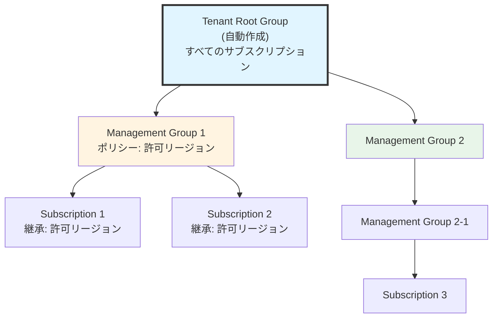
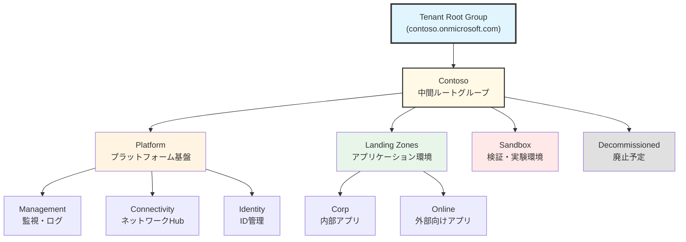

# 第 5 章：Management Groups 設計・構築

## 本章の目的

本章では、CAF ランディングゾーンの基盤となる Management Groups 階層を設計・構築します。Management Groups は、Azure のガバナンスの中核であり、ポリシーと RBAC を階層的に適用するための仕組みです。

**所要時間**: 約 2-3 時間  
**難易度**: ⭐⭐

---

## 5.1 Management Groups の重要性

### 5.1.1 なぜ Management Groups が必要か

大規模な Azure 環境では、以下の課題があります：

**課題 1: サブスクリプションの増加**

```
サブスクリプションが10個、50個、100個...と増えると：
- 各サブスクリプションにポリシーを個別に適用するのは困難
- 権限管理が煩雑
- 統制が効かない
```

**課題 2: 組織構造の反映**

```
企業の組織構造をAzureに反映したい：
- Platform部門（インフラ管理）
- 事業部A、B、C（各アプリケーション）
- 開発環境、本番環境の分離
```

**Management Groups で解決**：

- 階層構造でサブスクリプションをグループ化
- 上位グループのポリシーと RBAC が下位に継承される
- 一度の設定で複数のサブスクリプションに適用

### 5.1.2 Management Groups の階層構造



**重要な特徴**：

- 最大 6 階層まで（Root 含む）
- ポリシーと RBAC は上から下に継承
- 1 つのサブスクリプションは 1 つの Management Group にのみ所属
- Management Groups は親を変更可能（サブスクリプションの移動も可能）

---

## 5.2 エンタープライズスケールの Management Groups 設計

### 5.2.1 CAF 推奨の階層構造

Microsoft CAF では、以下の Management Groups 階層を推奨しています：



### 5.2.2 各 Management Group の役割

#### Root Tenant Group (ルート)

**役割**: 組織全体

**適用するポリシーの例**:

- 許可される Azure リージョンの制限
- 必須タグの強制
- 診断設定の強制（すべてのリソース）
- セキュリティベースライン

**RBAC**:

- テナント管理者（Global Administrator）のみ
- 必要最小限の権限

#### Platform Management Group

**役割**: プラットフォーム基盤全体

**配下の Management Groups**:

1. **Management**: 監視・ログ・自動化
2. **Connectivity**: ネットワーク Hub（Firewall、VPN Gateway 等）
3. **Identity**: ID 管理（Domain Controller 等）

**適用するポリシーの例**:

- プラットフォームチームのみがリソース作成可能
- 特定のリソースタイプのみ許可
- 厳格なネットワークルール

#### Landing Zones Management Group

**役割**: アプリケーションワークロード全体

**配下の Management Groups**:

1. **Corp**: 内部アプリケーション（オンプレ接続あり）
2. **Online**: インターネット向けアプリケーション

**適用するポリシーの例**:

- セキュリティベースライン
- コスト管理ポリシー
- タグ付けルール
- ネットワーク接続ルール

#### Sandbox Management Group

**役割**: 開発者の検証・実験環境

**特徴**:

- ポリシーが緩い（イノベーション重視）
- コスト上限を設定
- 本番データへのアクセスなし
- 定期的にリソースを削除

**適用するポリシーの例**:

- コスト上限（月$100 等）
- 短期間で自動削除
- 本番環境への接続禁止

#### Decommissioned Management Group

**役割**: 廃止予定のリソース

**特徴**:

- 読み取り専用
- 新規リソース作成禁止
- 一定期間後に削除

**適用するポリシーの例**:

- すべての作成操作を拒否
- 既存リソースの変更を拒否

---

## 5.3 Management Groups 階層の実装

### 5.3.1 Management Groups Bicep モジュールの作成

Management Groups は Bicep で作成します。

#### ディレクトリ作成

```bash
# Management Groupsモジュールディレクトリを作成
mkdir -p infrastructure/bicep/modules/management-groups

# メインファイルを作成
touch infrastructure/bicep/modules/management-groups/main.bicep
```

ファイル `infrastructure/bicep/modules/management-groups/main.bicep` を作成し、以下の内容を記述します：

**main.bicep の解説：**

CAF 推奨の階層構造（Platform、Landing Zones、Sandbox、Decommissioned）を持つ Management Groups を作成します。各 Management Group に説明メタデータを設定し、親子関係を明確に定義します。

```bicep
// Management Groups階層の作成
targetScope = 'tenant'

@description('会社のプレフィックス')
param companyPrefix string

@description('Management Groupsの説明を含むメタデータ')
param managementGroupMetadata object = {
  intermediateRoot: {
    displayName: 'Contoso'
    description: '中間ルート管理グループ'
  }
  platform: {
    displayName: 'Platform'
    description: 'プラットフォーム基盤全体を管理'
  }
  platformManagement: {
    displayName: 'Management'
    description: '監視・ログ・自動化のためのリソース'
  }
  platformConnectivity: {
    displayName: 'Connectivity'
    description: 'ネットワークHub（Firewall、VPN Gateway等）'
  }
  platformIdentity: {
    displayName: 'Identity'
    description: 'ID管理（Domain Controller等）'
  }
  landingZones: {
    displayName: 'Landing Zones'
    description: 'アプリケーションワークロード全体'
  }
  landingZonesCorp: {
    displayName: 'Corp'
    description: '内部アプリケーション（オンプレ接続あり）'
  }
  landingZonesOnline: {
    displayName: 'Online'
    description: 'インターネット向けアプリケーション'
  }
  sandbox: {
    displayName: 'Sandbox'
    description: '検証・実験環境'
  }
  decommissioned: {
    displayName: 'Decommissioned'
    description: '廃止予定のリソース'
  }
}

// Tenant Root Management Group ID
var tenantRootGroupId = '/providers/Microsoft.Management/managementGroups/${tenant().tenantId}'

// 中間ルート管理グループ
resource intermediateRootMG 'Microsoft.Management/managementGroups@2021-04-01' = {
  name: companyPrefix
  properties: {
    displayName: managementGroupMetadata.intermediateRoot.displayName
    details: {
      parent: {
        id: tenantRootGroupId
      }
    }
  }
}

// ルートレベルのManagement Groups
// Platform
resource platformMG 'Microsoft.Management/managementGroups@2021-04-01' = {
  name: '${companyPrefix}-platform'
  properties: {
    displayName: managementGroupMetadata.platform.displayName
    details: {
      parent: {
        id: intermediateRootMG.id
      }
    }
  }
}

// Platform配下のManagement Groups
resource platformManagementMG 'Microsoft.Management/managementGroups@2021-04-01' = {
  name: '${companyPrefix}-platform-management'
  properties: {
    displayName: managementGroupMetadata.platformManagement.displayName
    details: {
      parent: {
        id: platformMG.id
      }
    }
  }
}

resource platformConnectivityMG 'Microsoft.Management/managementGroups@2021-04-01' = {
  name: '${companyPrefix}-platform-connectivity'
  properties: {
    displayName: managementGroupMetadata.platformConnectivity.displayName
    details: {
      parent: {
        id: platformMG.id
      }
    }
  }
}

resource platformIdentityMG 'Microsoft.Management/managementGroups@2021-04-01' = {
  name: '${companyPrefix}-platform-identity'
  properties: {
    displayName: managementGroupMetadata.platformIdentity.displayName
    details: {
      parent: {
        id: platformMG.id
      }
    }
  }
}

// Landing Zones
resource landingZonesMG 'Microsoft.Management/managementGroups@2021-04-01' = {
  name: '${companyPrefix}-landingzones'
  properties: {
    displayName: managementGroupMetadata.landingZones.displayName
    details: {
      parent: {
        id: intermediateRootMG.id
      }
    }
  }
}

// Landing Zones配下のManagement Groups
resource landingZonesCorpMG 'Microsoft.Management/managementGroups@2021-04-01' = {
  name: '${companyPrefix}-landingzones-corp'
  properties: {
    displayName: managementGroupMetadata.landingZonesCorp.displayName
    details: {
      parent: {
        id: landingZonesMG.id
      }
    }
  }
}

resource landingZonesOnlineMG 'Microsoft.Management/managementGroups@2021-04-01' = {
  name: '${companyPrefix}-landingzones-online'
  properties: {
    displayName: managementGroupMetadata.landingZonesOnline.displayName
    details: {
      parent: {
        id: landingZonesMG.id
      }
    }
  }
}

// Sandbox
resource sandboxMG 'Microsoft.Management/managementGroups@2021-04-01' = {
  name: '${companyPrefix}-sandbox'
  properties: {
    displayName: managementGroupMetadata.sandbox.displayName
    details: {
      parent: {
        id: intermediateRootMG.id
      }
    }
  }
}

// Decommissioned
resource decommissionedMG 'Microsoft.Management/managementGroups@2021-04-01' = {
  name: '${companyPrefix}-decommissioned'
  properties: {
    displayName: managementGroupMetadata.decommissioned.displayName
    details: {
      parent: {
        id: intermediateRootMG.id
      }
    }
  }
}

// 出力
output intermediateRootMGId string = intermediateRootMG.id
output platformMGId string = platformMG.id
output platformManagementMGId string = platformManagementMG.id
output platformConnectivityMGId string = platformConnectivityMG.id
output platformIdentityMGId string = platformIdentityMG.id
output landingZonesMGId string = landingZonesMG.id
output landingZonesCorpMGId string = landingZonesCorpMG.id
output landingZonesOnlineMGId string = landingZonesOnlineMG.id
output sandboxMGId string = sandboxMG.id
output decommissionedMGId string = decommissionedMG.id
```

### 5.3.2 オーケストレーションへのパラメータ追記

Chapter 4 で作成した `orchestration/tenant.bicepparam` に、Management Groups の設定を追記します。

ファイル `infrastructure/bicep/orchestration/tenant.bicepparam` を開き、以下を追記：

```bicep
// =============================================================================
// CAF Landing Zone - Tenant Scope Parameters
// =============================================================================
// Management Groups関連のパラメータ

using './tenant.bicep'

// =============================================================================
// Management Groups設定
// =============================================================================

// 👇 Chapter 5で追記
param companyPrefix = 'contoso'

param managementGroupMetadata = {
  platform: {
    displayName: 'Platform'
    description: 'プラットフォーム基盤全体を管理'
  }
  platformManagement: {
    displayName: 'Management'
    description: '監視・ログ・自動化のためのリソース'
  }
  platformConnectivity: {
    displayName: 'Connectivity'
    description: 'ネットワークHub（Firewall、VPN Gateway等）'
  }
  platformIdentity: {
    displayName: 'Identity'
    description: 'ID管理（Domain Controller等）'
  }
  landingZones: {
    displayName: 'Landing Zones'
    description: 'アプリケーションワークロード全体'
  }
  landingZonesCorp: {
    displayName: 'Corp'
    description: '内部アプリケーション（オンプレ接続あり）'
  }
  landingZonesOnline: {
    displayName: 'Online'
    description: 'インターネット向けアプリケーション'
  }
  sandbox: {
    displayName: 'Sandbox'
    description: '検証・実験環境'
  }
  decommissioned: {
    displayName: 'Decommissioned'
    description: '廃止予定のリソース'
  }
}
```

### 5.3.3 オーケストレーションへのモジュール追加

ファイル `infrastructure/bicep/orchestration/tenant.bicep` を開き、以下を追記：

```bicep
// =============================================================================
// CAF Landing Zone - Tenant Scope Template (Management Groups)
// =============================================================================

targetScope = 'tenant'

// =============================================================================
// パラメータ定義
// =============================================================================

@description('デプロイ日時（自動生成）')
param deployedAt string = utcNow()

// 👇 Chapter 5で追記
@description('会社のプレフィックス')
param companyPrefix string

@description('Management Groupsのメタデータ')
param managementGroupMetadata object

// =============================================================================
// Management Groups
// =============================================================================

// 👇 Chapter 5で追記
module managementGroups '../modules/management-groups/main.bicep' = {
  name: 'deploy-management-groups'
  params: {
    companyPrefix: companyPrefix
    managementGroupMetadata: managementGroupMetadata
  }
}

// =============================================================================
// Outputs
// =============================================================================

output deploymentInfo object = {
  scope: 'tenant'
  deployedAt: deployedAt
}

// 👇 Chapter 5で追記
output platformMGId string = managementGroups.outputs.platformMGId
output landingZonesMGId string = managementGroups.outputs.landingZonesMGId
output sandboxMGId string = managementGroups.outputs.sandboxMGId
output decommissionedMGId string = managementGroups.outputs.decommissionedMGId
```

---

## 5.4 Management Groups のデプロイ

### 5.4.1 Tenant ルートレベルの権限設定

Management Groups を Tenant ルートレベルで作成するには、Tenant スコープ (`/`) に対する Owner 権限が必要です。

#### ステップ 1: elevateAccess で User Access Administrator を取得

まず、`elevateAccess` API を実行して、自分のアカウントに Tenant スコープでの User Access Administrator ロールを付与します。

```bash
# elevateAccessを実行
az rest --method post --url "/providers/Microsoft.Authorization/elevateAccess?api-version=2016-07-01"
```

**出力**:

```json
{}
```

空の JSON が返れば成功です。

#### ステップ 2: トークンを更新（重要）

`elevateAccess` で付与された権限を反映させるため、**必ずログアウト・ログインしてトークンを更新**してください。

```bash
# ログアウト
az logout

# 再ログイン
az login
```

ログイン後、正しいサブスクリプションが選択されていることを確認：

```bash
az account show
```

#### ステップ 3: Tenant スコープに Owner ロールを付与

次に、Tenant スコープ (`/`) に Owner ロールを自分に割り当てます。

```bash
# 自分のオブジェクトIDを取得
USER_OBJECT_ID=$(az ad signed-in-user show --query id -o tsv)

# Tenantスコープ (/) に Owner ロールを付与
az role assignment create \
  --assignee $USER_OBJECT_ID \
  --role "Owner" \
  --scope "/"
```

#### ステップ 4: 権限を確認

```bash
# 自分のオブジェクトIDを再取得（ログインし直したため）
USER_OBJECT_ID=$(az ad signed-in-user show --query id -o tsv)

# ロール割り当てを確認
az role assignment list \
  --assignee $USER_OBJECT_ID \
  --scope "/" \
  --output table
```

`Owner` と `User Access Administrator` の両方が表示されれば OK です。

**注意**: この権限は非常に強力です。Management Groups のデプロイが完了したら、必要に応じて削除してください。

### 5.4.2 Bicep ファイルの検証

```bash
# Bicepファイルのビルド
az bicep build --file infrastructure/bicep/orchestration/tenant.bicep

# エラーがなければJSON形式のARMテンプレートが生成される
```

### 5.4.3 What-If 実行

**重要**: Management Groups は削除が難しいため、What-If で必ず確認します。

```bash
# What-If実行（テナントレベル）
az deployment tenant what-if \
  --name "mg-deployment-$(date +%Y%m%d-%H%M%S)" \
  --location japaneast \
  --template-file infrastructure/bicep/orchestration/tenant.bicep \
  --parameters infrastructure/bicep/orchestration/tenant.bicepparam
```

出力例：

```
Resource and property changes are indicated with these symbols:
  + Create

The deployment will update the following scope:

Scope: /

  + Microsoft.Management/managementGroups/contoso-platform
      displayName: "Platform"

  + Microsoft.Management/managementGroups/contoso-platform-management
      displayName: "Management"
      parent: "/providers/Microsoft.Management/managementGroups/contoso-platform"

  + Microsoft.Management/managementGroups/contoso-platform-connectivity
      displayName: "Connectivity"
      parent: "/providers/Microsoft.Management/managementGroups/contoso-platform"

  ... (続く)
```

すべての Management Groups が正しく表示されることを確認します。

### 5.4.4 実際のデプロイ

What-If で問題がないことを確認したら、実際にデプロイを実行します。

```bash
# デプロイ名を変数に保存（重要：タイムスタンプが変わらないように）
DEPLOYMENT_NAME="mg-deployment-$(date +%Y%m%d-%H%M%S)"

echo "Deploying Management Groups..."

# デプロイ実行
az deployment tenant create \
  --name "$DEPLOYMENT_NAME" \
  --location japaneast \
  --template-file infrastructure/bicep/orchestration/tenant.bicep \
  --parameters infrastructure/bicep/orchestration/tenant.bicepparam

echo "Deployment name: $DEPLOYMENT_NAME"
```

デプロイには数分かかります。

**注意**: Management Groups の作成には時間がかかる場合があります（5-10 分程度）。

### 5.4.5 デプロイ結果の確認

```bash
# デプロイの状態を確認
az deployment tenant show \
  --name "$DEPLOYMENT_NAME" \
  --query properties.provisioningState

# 出力: "Succeeded"
```

「Succeeded」と表示されればデプロイ成功です。

**代替方法**: デプロイから時間が経過している場合は、以下のコマンドで最新のデプロイを確認できます：

```bash
# 最新のテナントレベルデプロイを確認
az deployment tenant list \
  --query "[?contains(name, 'mg-deployment')].{Name:name, State:properties.provisioningState, Time:properties.timestamp}" \
  --output table | head -5
```

---

## 5.5 Azure ポータルでの確認

### 5.5.1 Management Groups の表示

1. [Azure ポータル](https://portal.azure.com)を開く

2. 検索バーで「Management groups」を検索

3. Management Groups のページが開く

4. 階層構造が表示される：

```
Tenant Root Group
├── contoso-platform
│   ├── contoso-platform-management
│   ├── contoso-platform-connectivity
│   └── contoso-platform-identity
├── contoso-landingzones
│   ├── contoso-landingzones-corp
│   └── contoso-landingzones-online
├── contoso-sandbox
└── contoso-decommissioned
```

### 5.5.2 各 Management Group の詳細確認

1. 任意の Management Group をクリック

2. 詳細ページで以下を確認：
   - **Overview**: 基本情報
   - **Subscriptions**: 配下のサブスクリプション（現時点では空）
   - **Policy**: 割り当てられたポリシー（後の章で設定）
   - **Access control (IAM)**: ロール割り当て
   - **Settings**: 設定

---

## 5.6 Management Groups へのサブスクリプションの関連付け

現在、サブスクリプションは Tenant Root Group の直下にあります。適切な Management Group に移動します。

### 5.6.1 サブスクリプション ID の取得

```bash
# サブスクリプション情報を表示
az account show --query '{Name:name, Id:id}' -o table
```

サブスクリプション ID をメモします。

### 5.6.2 サブスクリプションの移動

```bash
# サブスクリプションIDを変数に設定
SUBSCRIPTION_ID=$(az account show --query id -o tsv)

# Sandboxに移動（現時点ではテスト環境として扱う）
az account management-group subscription add \
  --name contoso-sandbox \
  --subscription $SUBSCRIPTION_ID
```

### 5.6.3 移動の確認

```bash
# サブスクリプションの親Management Groupを確認
az account management-group subscription show \
  --name contoso-sandbox \
  --subscription $SUBSCRIPTION_ID
```

---

## 5.7 Management Groups の命名と管理

### 5.7.1 Management Group ID の命名規則

Management Group ID は変更できないため、慎重に命名します。

**推奨パターン**：

```
{company}-{function}

例:
contoso-platform
contoso-platform-management
contoso-landingzones
contoso-landingzones-corp
```

**避けるべきパターン**：

- 日付や環境（dev/prod）を含める（変更できないため）
- 長すぎる名前（250 文字制限）

### 5.7.2 Display Name の活用

Display Name は変更可能なので、わかりやすい名前をつけます：

| ID                          | Display Name | 説明                 |
| --------------------------- | ------------ | -------------------- |
| contoso-platform            | Platform     | プラットフォーム基盤 |
| contoso-platform-management | Management   | 監視・ログ           |
| contoso-landingzones-corp   | Corp         | 内部アプリ           |

---

## 5.8 Management Groups のガバナンス設計

### 5.8.1 ロール割り当ての設計

各 Management Group に適切なロールを割り当てます。

**推奨されるロール割り当て**：

| Management Group      | ロール      | 割り当て先               |
| --------------------- | ----------- | ------------------------ |
| Root                  | Owner       | テナント管理者のみ       |
| Root                  | Reader      | すべての従業員（透明性） |
| Platform              | Contributor | プラットフォームチーム   |
| Platform-Management   | Owner       | 監視チーム               |
| Platform-Connectivity | Owner       | ネットワークチーム       |
| Landing Zones         | Reader      | すべての開発者           |
| Landing Zones-Corp    | Contributor | 開発チーム               |
| Sandbox               | Contributor | すべての開発者           |

### 5.8.2 ロール割り当ての実装（例）

```bash
# プラットフォームチームのグループIDを取得（事前にAzure ADで作成）
PLATFORM_TEAM_GROUP_ID="xxxxxxxx-xxxx-xxxx-xxxx-xxxxxxxxxxxx"

# PlatformManagement GroupにContributorロールを付与
az role assignment create \
  --role "Contributor" \
  --assignee $PLATFORM_TEAM_GROUP_ID \
  --scope "/providers/Microsoft.Management/managementGroups/contoso-platform"
```

**本ハンズオンでは、個人アカウントのため、この手順はスキップします**（必要に応じて後で設定）。

---

## 5.9 Git へのコミット

### 5.9.1 変更の確認

```bash
# 新しく作成したファイルを確認
git status
```

### 5.9.2 コミットとプッシュ

```bash
# すべての変更をステージング
git add .

# コミット
git commit -m "Chapter 5: Implement Management Groups hierarchy

- Created Management Groups Bicep module
- Deployed CAF-aligned Management Groups structure
  - Platform (Management, Connectivity, Identity)
  - Landing Zones (Corp, Online)
  - Sandbox
  - Decommissioned
- Created parameter file for Management Groups
- Moved subscription to Sandbox Management Group
- Verified deployment in Azure Portal"

# プッシュ
git push origin main
```

---

## 5.10 トラブルシューティング

### Q1: Management Groups の作成に失敗する

**症状**: `az deployment tenant create`でエラー

**考えられる原因と解決策**:

```bash
# 原因1: テナントレベルの権限がない
# 解決策: Azureポータルで「Elevate access」を実行

# 原因2: Management Groupsが有効化されていない
# 解決策: Azureポータルで一度Management Groupsにアクセス

# 原因3: 同じ名前のManagement Groupが既に存在
# 解決策: 既存のManagement Groupsを確認
az account management-group list --output table
```

### Q2: Management Groups が表示されない

**症状**: ポータルで Management Groups が見えない

**解決策**:

```bash
# Management Groupsへのアクセス権を確認
az role assignment list \
  --assignee $(az account show --query user.name -o tsv) \
  --scope /providers/Microsoft.Management/managementGroups/contoso-platform

# アクセス権がない場合は、Rootレベルで権限を付与
```

### Q3: サブスクリプションを移動できない

**症状**: サブスクリプションの移動に失敗

**解決策**:

```bash
# サブスクリプションのOwnerまたはUser Access Administrator権限が必要
az role assignment list \
  --subscription $SUBSCRIPTION_ID \
  --assignee $(az account show --query user.name -o tsv)

# 権限がない場合は、Azureポータルから権限を付与
```

### Q4: Management Groups の削除

**症状**: Management Groups を削除したい

**注意**: Management Groups の削除は慎重に行う必要があります。

**手順**:

```bash
# 1. 配下のサブスクリプションをすべて移動
# 2. 配下の子Management Groupsを削除（下から順番に）
# 3. ポリシー割り当てを削除
# 4. Management Groupを削除

az account management-group delete --name contoso-platform-management
```

---

## 5.11 章のまとめ

本章で行ったこと：

1. ✅ Management Groups の重要性を理解
2. ✅ CAF 推奨の階層構造を設計
3. ✅ Management Groups Bicep モジュールの作成
4. ✅ パラメータファイルの作成
5. ✅ What-If 実行（デプロイプレビュー）
6. ✅ Management Groups のデプロイ
7. ✅ Azure ポータルでの確認
8. ✅ サブスクリプションの関連付け
9. ✅ 階層の可視化（Mermaid ダイアグラム）
10. ✅ Git へのコミット・プッシュ

### 構築した階層

```
Tenant Root Group
├── contoso-platform
│   ├── contoso-platform-management
│   ├── contoso-platform-connectivity
│   └── contoso-platform-identity
├── contoso-landingzones
│   ├── contoso-landingzones-corp
│   └── contoso-landingzones-online
├── contoso-sandbox (現在のサブスクリプション)
└── contoso-decommissioned
```

### 重要なポイント

- **階層構造**: ポリシーと RBAC が上から下に継承
- **命名規則**: ID は変更不可、Display Name は変更可能
- **テナントスコープ**: Management Groups はテナントレベルでデプロイ
- Management Groups は、ランディングゾーンのガバナンスの基盤です

### チェックリスト

- [ ] Management Groups Bicep モジュールを作成した
- [ ] What-If でデプロイ内容を確認した
- [ ] Management Groups をデプロイした
- [ ] Azure ポータルで階層構造を確認した
- [ ] サブスクリプションを適切な Management Group に移動した
- [ ] Git にコミット・プッシュした

### 次のステップ

Management Groups 階層が構築できたら、次は Subscriptions の設計と構築に進みます。

👉 [第 6 章：Subscriptions 設計・構築](chapter06-subscriptions.md)

### 参考リンク

- [Management Groups](https://docs.microsoft.com/azure/governance/management-groups/)
- [Management Groups Bicep](https://docs.microsoft.com/azure/azure-resource-manager/bicep/deploy-to-tenant)
- [CAF Management Groups 設計](https://docs.microsoft.com/azure/cloud-adoption-framework/ready/landing-zone/design-area/resource-org-management-groups)
- [エンタープライズスケールアーキテクチャ](https://docs.microsoft.com/azure/cloud-adoption-framework/ready/enterprise-scale/management-group-and-subscription-organization)

---

**最終更新**: 2026 年 1 月 7 日
