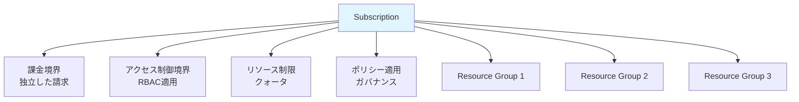
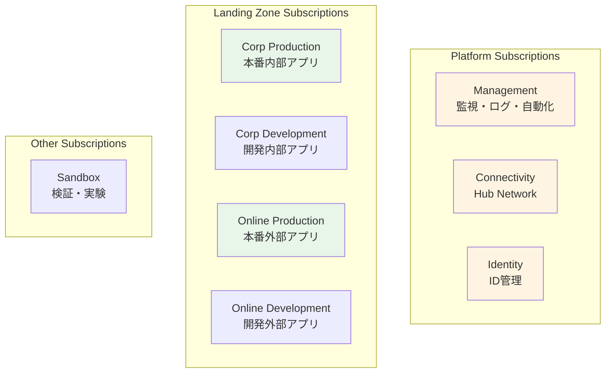

# 第 6 章：Subscriptions 設計・構築

## 本章の目的

本章では、Subscription の設計戦略を学び、ランディングゾーンに必要な Subscriptions を作成します。Subscription は課金とアクセス制御の境界であり、適切な設計が重要です。

**所要時間**: 約 2-3 時間  
**難易度**: ⭐⭐

---

## 6.1 Subscription の理解

### 6.1.1 Subscription とは

**Subscription（サブスクリプション）**は：

- Azure リソースの論理的なコンテナ
- **課金の単位**: 各 Subscription に独立した請求
- **アクセス制御の境界**: RBAC を適用
- **リソース制限の単位**: クォータと制限

###6.1.2 Subscription の特徴



### 6.1.3 Subscription の制限

各 Subscription には制限があります：

| リソース        | 制限                     |
| --------------- | ------------------------ |
| Resource Groups | 980 個                   |
| VNet            | 1,000 個                 |
| VNet Peering    | 500 個                   |
| Public IP       | 1,000 個（Standard SKU） |
| Load Balancer   | 1,000 個                 |

詳細: [Azure サブスクリプションとサービスの制限](https://docs.microsoft.com/azure/azure-resource-manager/management/azure-subscription-service-limits)

---

## 6.2 Subscription 設計戦略

### 6.2.1 なぜ Subscription を分離するか

**理由 1: 課金の分離**

```
部門ごと、プロジェクトごとにSubscriptionを分けることで：
- コストを明確に把握
- チャージバックが容易
- 予算管理が簡単
```

**理由 2: アクセス制御の境界**

```
開発環境と本番環境を分離：
- 開発者は開発環境のみにアクセス
- 本番環境は限られた人のみ
- 誤操作のリスク低減
```

**理由 3: リソース制限の分離**

```
大規模な環境では、1つのSubscriptionでは制限に達する可能性：
- Subscriptionを分けることでスケール
```

**理由 4: ブラストラジアス（影響範囲）の制限**

```
問題が発生しても、他のSubscriptionに影響しない：
- セキュリティインシデントの封じ込め
- 設定ミスの影響範囲を限定
```

### 6.2.2 CAF 推奨の Subscription 構成

エンタープライズスケールアーキテクチャでは、以下の Subscriptions を推奨：



### 6.2.3 本ハンズオンでの Subscription 構成

**本ハンズオンでは、コスト削減のため、1 つの Subscription で実装します**。

ただし、以下のように Resource Groups で論理的に分離します：

```
Single Subscription
├── rg-platform-management-prod-jpe-001
│   └── Log Analytics Workspace、Azure Automation等
├── rg-platform-connectivity-prod-jpe-001
│   └── Hub VNet、Azure Firewall、Azure Bastion等
├── rg-landingzone-corp-prod-jpe-001
│   └── Spoke VNet、アプリケーションリソース
└── (その他)
```

**本番環境では、各役割ごとに Subscription を分離することを強く推奨します。**

---

## 6.3 Subscription の作成（エンタープライズ環境の場合）

### 6.3.1 Enterprise Agreement (EA) の場合

エンタープライズ環境では、EA（Enterprise Agreement）ポータルから Subscription を作成します。

#### 手順（参考）

1. [EA Portal](https://ea.azure.com/)にアクセス

2. 「Account」セクションで「Add Subscription」をクリック

3. Subscription 名を入力

   - 例: `sub-platform-connectivity-prod`

4. アカウントオーナーを指定

5. 作成

#### Bicep でのサブスクリプション作成（EA）

エンタープライズ環境では、Bicep で Subscription を作成することもできます：

```bicep
targetScope = 'managementGroup'

resource newSubscription 'Microsoft.Subscription/aliases@2021-10-01' = {
  name: 'sub-platform-connectivity-prod'
  properties: {
    workload: 'Production'
    displayName: 'Platform - Connectivity - Production'
    billingScope: '/providers/Microsoft.Billing/billingAccounts/xxxxx/enrollmentAccounts/xxxxx'
  }
}
```

### 6.3.2 個人アカウント（従量課金）の場合

個人アカウントでは、追加の Subscription を作成するには、Azure ポータルから手動で作成するか、サポートに問い合わせる必要があります。

**本ハンズオンでは、既存の 1 つの Subscription を使用します。**

---

## 6.4 Subscriptions と Management Groups の関連付け

### 6.4.1 現在の Subscription の確認

```bash
# Subscription情報を表示
az account show --query '{Name:name, Id:id, State:state}' -o table
```

### 6.4.2 Subscription を適切な Management Group に移動

前章で Sandbox に移動しましたが、実際の用途に応じて移動します。

本ハンズオンでは、Landing Zones - Corp に移動します（内部アプリを想定）：

```bash
# SubscriptionIDを取得
SUBSCRIPTION_ID=$(az account show --query id -o tsv)

# Landing Zones - Corpに移動
az account management-group subscription add \
  --name contoso-landingzones-corp \
  --subscription $SUBSCRIPTION_ID

# 確認
az account management-group subscription show \
  --name contoso-landingzones-corp \
  --subscription $SUBSCRIPTION_ID
```

### 6.4.3 Azure ポータルでの確認

1. Azure ポータルで「Management groups」を開く

2. 「contoso-landingzones-corp」をクリック

3. 「Subscriptions」タブを選択

4. 自分の Subscription が表示されていることを確認

---

## 6.5 Subscription レベルのタグ付け

### 6.5.1 タグ付け戦略

Subscription レベルでタグを設定することで、コスト管理やレポート作成が容易になります。

**推奨される必須タグ**:

| タグ名             | 説明             | 例                               |
| ------------------ | ---------------- | -------------------------------- |
| Environment        | 環境             | Production, Development, Staging |
| CostCenter         | コストセンター   | IT-001, Sales-002                |
| Owner              | 所有者           | john.doe@contoso.com             |
| BusinessUnit       | 事業部           | IT, Sales, Marketing             |
| Application        | アプリケーション | CustomerPortal, InternalApp      |
| Criticality        | 重要度           | High, Medium, Low                |
| DataClassification | データ分類       | Confidential, Internal, Public   |

### 6.5.2 Subscription へのタグ適用

```bash
# Subscriptionにタグを設定
az tag create \
  --resource-id "/subscriptions/$SUBSCRIPTION_ID" \
  --tags \
    Environment=Production \
    CostCenter=IT-001 \
    Owner=$(az account show --query user.name -o tsv) \
    BusinessUnit=IT \
    Application=LandingZone \
    Criticality=High \
    DataClassification=Internal \
    ManagedBy=Bicep \
    Project=CAF-Landing-Zone

# 確認
az tag list --resource-id "/subscriptions/$SUBSCRIPTION_ID"
```

### 6.5.3 Bicep でのタグ設定

Subscription レベルのタグは、Bicep でも設定できます：

```bash
# Subscription タグ設定用Bicepファイルを作成
cat << 'EOF' > infrastructure/bicep/modules/subscriptions/tags.bicep
targetScope = 'subscription'

@description('Subscriptionに適用するタグ')
param tags object

// Subscriptionレベルのタグは、個別のリソースではなく、
// Resource Groupsに継承される形で実装
resource tagResource 'Microsoft.Resources/tags@2022-09-01' = {
  name: 'default'
  properties: {
    tags: tags
  }
}

output appliedTags object = tagResource.properties.tags
EOF

# パラメータファイルを作成
cat << 'EOF' > infrastructure/bicep/parameters/subscription-tags.parameters.json
{
  "$schema": "https://schema.management.azure.com/schemas/2019-04-01/deploymentParameters.json#",
  "contentVersion": "1.0.0.0",
  "parameters": {
    "tags": {
      "value": {
        "Environment": "Production",
        "CostCenter": "IT-001",
        "BusinessUnit": "IT",
        "Application": "LandingZone",
        "Criticality": "High",
        "DataClassification": "Internal",
        "ManagedBy": "Bicep",
        "Project": "CAF-Landing-Zone"
      }
    }
  }
}
EOF
```

---

## 6.6 Subscription レベルのリソースプロバイダー登録

### 6.6.1 リソースプロバイダーとは

Azure の各サービスは、リソースプロバイダーとして提供されます。使用する前に、Subscription で登録する必要があります。

### 6.6.2 必要なリソースプロバイダーの確認

```bash
# 登録済みのリソースプロバイダーを確認
az provider list --query "[?registrationState=='Registered'].{Namespace:namespace}" -o table

# すべてのリソースプロバイダーと状態を確認
az provider list --query "[].{Namespace:namespace, State:registrationState}" -o table
```

### 6.6.3 必要なリソースプロバイダーの登録

本ハンズオンで使用するリソースプロバイダーを登録します：

```bash
# 必要なリソースプロバイダーのリスト
PROVIDERS=(
  "Microsoft.Network"
  "Microsoft.Compute"
  "Microsoft.Storage"
  "Microsoft.KeyVault"
  "Microsoft.OperationalInsights"
  "Microsoft.Insights"
  "Microsoft.Security"
  "Microsoft.Authorization"
  "Microsoft.Resources"
  "Microsoft.ManagedIdentity"
  "Microsoft.ContainerRegistry"
  "Microsoft.App"
  "Microsoft.DBforPostgreSQL"
  "Microsoft.Cache"
  "Microsoft.Sql"
  "Microsoft.Web"
  "Microsoft.OperationsManagement"
)

# すべてを登録
for provider in "${PROVIDERS[@]}"; do
  echo "Registering $provider..."
  az provider register --namespace $provider --wait
done

# 登録状態の確認
for provider in "${PROVIDERS[@]}"; do
  az provider show --namespace $provider --query "{Namespace:namespace, State:registrationState}" -o table
done
```

**注意**: リソースプロバイダーの登録には数分かかる場合があります。

### 6.6.4 Bicep でのリソースプロバイダー登録

```bash
# リソースプロバイダー登録用Bicepファイルを作成
cat << 'EOF' > infrastructure/bicep/modules/subscriptions/resource-providers.bicep
targetScope = 'subscription'

@description('登録するリソースプロバイダーのリスト')
param resourceProviders array = [
  'Microsoft.Network'
  'Microsoft.Compute'
  'Microsoft.Storage'
  'Microsoft.KeyVault'
  'Microsoft.OperationalInsights'
  'Microsoft.Insights'
  'Microsoft.Security'
  'Microsoft.ManagedIdentity'
  'Microsoft.ContainerRegistry'
  'Microsoft.App'
  'Microsoft.DBforPostgreSQL'
  'Microsoft.Cache'
]

// 注: BicepでのリソースプロバイダーRegistration Scope: subscription

// 現時点では、Bicepでリソースプロバイダーを登録するリソースタイプは存在しません。
// Azure CLIまたはAzure PowerShellを使用してください。

// この情報を出力として記録
output requiredProviders array = resourceProviders
EOF
```

---

## 6.7 Subscription 設計のドキュメント化

### 6.7.1 Subscription 設計書の作成

```bash
# Subscription設計書を作成
cat << 'EOF' > docs/diagrams/subscription-design.md
# Subscription設計

## 概要

本ハンズオンでは、コスト最適化のため、1つのSubscriptionを使用します。
本番環境では、役割ごとにSubscriptionを分離することを強く推奨します。

## Subscription構成（本ハンズオン）

\`\`\`mermaid
graph TB
    Sub[Subscription: Azure subscription 1]

    Sub --> MgmtRG[rg-platform-management-prod-jpe-001<br/>監視・ログ]
    Sub --> ConnRG[rg-platform-connectivity-prod-jpe-001<br/>Hub Network]
    Sub --> CorpRG[rg-landingzone-corp-prod-jpe-001<br/>アプリケーション]

    MgmtRG --> LAW[Log Analytics Workspace]
    MgmtRG --> Automation[Azure Automation]

    ConnRG --> HubVNet[Hub VNet]
    ConnRG --> Firewall[Azure Firewall]
    ConnRG --> Bastion[Azure Bastion]

    CorpRG --> SpokeVNet[Spoke VNet]
    CorpRG --> App[Container Apps]
    CorpRG --> DB[PostgreSQL]

    style Sub fill:#e1f5ff
    style MgmtRG fill:#fff4e1
    style ConnRG fill:#fff4e1
    style CorpRG fill:#e8f5e9
\`\`\`

## 推奨されるSubscription構成（本番環境）

\`\`\`mermaid
graph TB
    subgraph "Platform Subscriptions"
        MgmtSub[Management Subscription<br/>監視・ログ・自動化]
        ConnSub[Connectivity Subscription<br/>Hub Network]
        IdSub[Identity Subscription<br/>ID管理]
    end

    subgraph "Landing Zone Subscriptions - Corp"
        CorpProdSub[Corp Production<br/>本番内部アプリ]
        CorpStagingSub[Corp Staging<br/>ステージング内部アプリ]
        CorpDevSub[Corp Development<br/>開発内部アプリ]
    end

    subgraph "Landing Zone Subscriptions - Online"
        OnlineProdSub[Online Production<br/>本番外部アプリ]
        OnlineStagingSub[Online Staging<br/>ステージング外部アプリ]
        OnlineDevSub[Online Development<br/>開発外部アプリ]
    end

    subgraph "Other Subscriptions"
        SandboxSub[Sandbox<br/>検証・実験]
    end

    style MgmtSub fill:#fff4e1
    style ConnSub fill:#fff4e1
    style IdSub fill:#fff4e1
    style CorpProdSub fill:#d4edda
    style CorpStagingSub fill:#e8f5e9
    style CorpDevSub fill:#f0f9f4
    style OnlineProdSub fill:#d4edda
    style OnlineStagingSub fill:#e8f5e9
    style OnlineDevSub fill:#f0f9f4
\`\`\`

## Subscription命名規則

\`\`\`
sub-{platform/landingzone}-{function}-{environment}

例:
sub-platform-management-prod
sub-platform-connectivity-prod
sub-landingzone-corp-prod
sub-landingzone-corp-dev
sub-landingzone-online-prod
sub-sandbox
\`\`\`

## Subscriptionタグ戦略

各Subscriptionには、以下のタグを必須とします：

| タグ名 | 説明 | 例 |
|---|---|---|
| Environment | 環境 | Production, Development, Staging |
| CostCenter | コストセンター | IT-001, Sales-002 |
| Owner | 所有者 | john.doe@contoso.com |
| BusinessUnit | 事業部 | IT, Sales, Marketing |
| Application | アプリケーション | Platform, CustomerPortal |
| Criticality | 重要度 | High, Medium, Low |
| DataClassification | データ分類 | Confidential, Internal, Public |
| ManagedBy | 管理方法 | Bicep, Terraform |
| Project | プロジェクト | CAF-Landing-Zone |

## Subscription制限

各Subscriptionには制限があるため、大規模環境ではSubscriptionを分離します：

| リソース | 制限 | 対策 |
|---|---|---|
| VNet | 1,000個 | Subscription分割 |
| VNet Peering | 500個/VNet | Hub-Spoke設計 |
| Public IP | 1,000個 | NAT Gateway使用 |
| NSG | 5,000個 | 適切な設計 |

詳細: [Azureサブスクリプションとサービスの制限](https://docs.microsoft.com/azure/azure-resource-manager/management/azure-subscription-service-limits)

## Subscriptionのライフサイクル

### 作成
- EA Portal または Azure Portal から作成
- 適切なManagement Groupに配置
- タグを設定
- リソースプロバイダーを登録

### 運用
- 定期的なコストレビュー
- リソース使用状況の監視
- ポリシーコンプライアンスの確認

### 廃止
1. すべてのリソースを削除
2. Decommissioned Management Groupに移動
3. 一定期間（30-90日）保持
4. Subscription削除（またはキャンセル）

---

**作成日**: 2026年1月7日
EOF

# 確認
cat docs/diagrams/subscription-design.md
```

---

## 6.8 Git へのコミット

```bash
# 変更の確認
git status

# ステージングとコミット
git add .

git commit -m "Chapter 6: Subscription design and configuration

- Moved subscription to Landing Zones - Corp Management Group
- Applied subscription-level tags for cost management
- Registered required resource providers
- Created subscription design documentation
- Created Bicep modules for subscription management
- Documented recommended subscription structure for production"

# プッシュ
git push origin main
```

---

## 6.9 章のまとめ

本章で行ったこと：

1. ✅ Subscription の理解
2. ✅ Subscription 設計戦略の学習
3. ✅ Subscription と Management Groups の関連付け
4. ✅ Subscription レベルのタグ付け
5. ✅ リソースプロバイダーの登録
6. ✅ Subscription 設計のドキュメント化
7. ✅ Git へのコミット・プッシュ

### 重要なポイント

- **Subscription は課金の境界**: コスト管理の基本単位
- **アクセス制御の境界**: RBAC 適用の単位
- **本番環境では分離**: 役割ごとに独立した Subscription
- **タグ付けが重要**: コスト配分とレポート作成に必須

### 本ハンズオンの構成

```
Single Subscription (contoso-landingzones-corp)
├── Platform Management (Resource Group)
├── Platform Connectivity (Resource Group)
└── Landing Zone Corp (Resource Group)
```

---

## チェックリスト

- [ ] Subscription の役割を理解した
- [ ] Subscription を Management Group に関連付けた
- [ ] Subscription レベルのタグを設定した
- [ ] 必要なリソースプロバイダーを登録した
- [ ] Subscription 設計書を作成した
- [ ] Git にコミット・プッシュした

---

## 次のステップ

Subscription の設計が完了したら、次は Identity とアクセス管理に進みます。

👉 [第 7 章：Identity & Access Management](chapter07-identity.md)

---

## 参考リンク

- [Azure サブスクリプション](https://docs.microsoft.com/azure/cost-management-billing/manage/create-subscription)
- [サブスクリプション設計](https://docs.microsoft.com/azure/cloud-adoption-framework/ready/landing-zone/design-area/resource-org-subscriptions)
- [サブスクリプションの制限](https://docs.microsoft.com/azure/azure-resource-manager/management/azure-subscription-service-limits)
- [リソースプロバイダー](https://docs.microsoft.com/azure/azure-resource-manager/management/resource-providers-and-types)

---

**最終更新**: 2026 年 1 月 7 日
