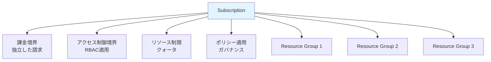
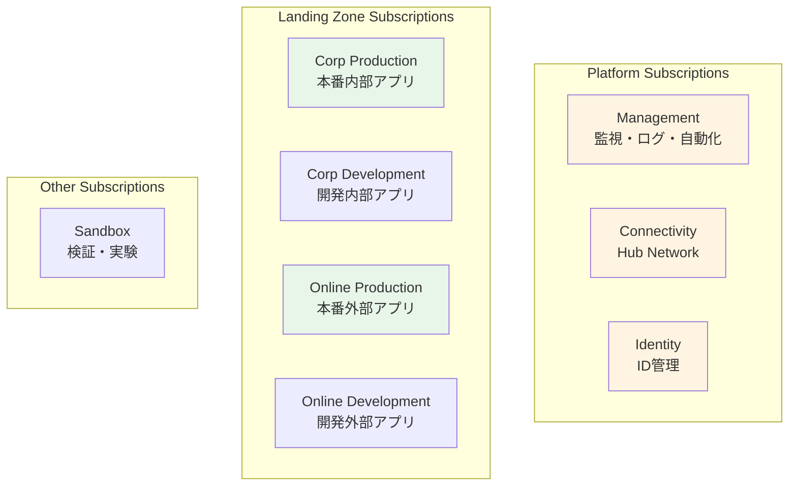

# 第 6 章：Subscriptions 設計・構築（1 日目）

## 本章の目的

本章では、Subscription の設計戦略を学び、ランディングゾーンに必要な Subscriptions の全体像を理解します。そして、**1 日目の作業として Management Subscription を作成**します。Subscription は課金とアクセス制御の境界であり、適切な設計が重要です。

**所要時間**: 約 1-2 時間  
**難易度**: ⭐⭐  
**実施タイミング**: **1 日目**

---

## 6.1 Subscription の理解

### 6.1.1 Subscription とは

**Subscription（サブスクリプション）** は：

- Azure リソースの論理的なコンテナ
- **課金の単位**: 各 Subscription に独立した請求
- **アクセス制御の境界**: RBAC を適用
- **リソース制限の単位**: クォータと制限

### 6.1.2 Subscription の特徴



### 6.1.3 Subscription の制限

各 Subscription には制限があります：

| リソース        | 制限                     |
| --------------- | ------------------------ |
| Resource Groups | 980 個                   |
| VNet            | 1,000 個                 |
| VNet Peering    | 500 個                   |
| Public IP       | 1,000 個（Standard SKU） |
| Load Balancer   | 1,000 個                 |

詳細: [Azure サブスクリプションとサービスの制限](https://docs.microsoft.com/azure/azure-resource-manager/management/azure-subscription-service-limits)

---

## 6.2 Subscription 設計戦略

### 6.2.1 なぜ Subscription を分離するか

**理由 1: 課金の分離**

```
部門ごと、プロジェクトごとにSubscriptionを分けることで：
- コストを明確に把握
- チャージバックが容易
- 予算管理が簡単
```

**理由 2: アクセス制御の境界**

```
開発環境と本番環境を分離：
- 開発者は開発環境のみにアクセス
- 本番環境は限られた人のみ
- 誤操作のリスク低減
```

**理由 3: リソース制限の分離**

```
大規模な環境では、1つのSubscriptionでは制限に達する可能性：
- Subscriptionを分けることでスケール
```

**理由 4: ブラストラジアス（影響範囲）の制限**

```
問題が発生しても、他のSubscriptionに影響しない：
- セキュリティインシデントの封じ込め
- 設定ミスの影響範囲を限定
```

### 6.2.2 CAF 推奨の Subscription 構成

エンタープライズスケールアーキテクチャでは、以下の Subscriptions を推奨：



### 6.2.3 本ハンズオンでの Subscription 構成

**本ハンズオンでは、CAF のベストプラクティスに従い、役割ごとに専用のサブスクリプションを作成します**：

- **sub-platform-management-prod**: 管理・監視用（Log Analytics、Automation 等）← **1 日目に作成**
- **sub-platform-identity-prod**: ID 管理用（将来の拡張用）← **2 日目に作成**
- **sub-platform-connectivity-prod**: ネットワーク接続用（Hub VNet、Firewall、Bastion 等）← **3 日目に作成**
- **sub-landingzone-corp-prod**: 内部アプリケーション用（Spoke VNet、Container Apps 等）← **4 日目以降に作成**

これにより、本番環境と同じ構成で学習できます。

> **⚠️ 重要：個人契約アカウントの制約事項**
>
> 個人契約の Azure アカウント（Pay-As-You-Go、Free Trial など）では、セキュリティとリソース乱用防止のため、**24 時間に 1 つのサブスクリプションしか作成できない制限**があります。
>
> このため、個人アカウントで 4 つのサブスクリプションを作成する場合、**最大 4 日間**かかります。各日で 1 つずつサブスクリプションを作成していきます。
>
> Enterprise Agreement（EA）などのエンタープライズプランでは、この制限は緩和されています。

---

## 6.3 Management Subscription の作成（1 日目）

### 6.3.1 前提条件

- Billing Scope（請求スコープ）へのアクセスが必要
- Microsoft.Subscription/aliases リソースタイプを使用

### 6.3.2 Billing Scope の取得

```bash
# Billing Accountを取得
az billing account list --output table

# Billing Account IDを変数に格納
BILLING_ACCOUNT_NAME=$(az billing account list --query "[0].name" -o tsv)

# Billing Profileを取得
az billing profile list --account-name $BILLING_ACCOUNT_NAME --output table

# Billing Profile IDを変数に格納
BILLING_PROFILE_NAME=$(az billing profile list --account-name $BILLING_ACCOUNT_NAME --query "[0].name" -o tsv)

# Invoice Sectionを取得
az billing invoice section list \
  --account-name $BILLING_ACCOUNT_NAME \
  --profile-name $BILLING_PROFILE_NAME \
  --output table

# Invoice Section IDを変数に格納
INVOICE_SECTION_NAME=$(az billing invoice section list \
  --account-name $BILLING_ACCOUNT_NAME \
  --profile-name $BILLING_PROFILE_NAME \
  --query "[0].name" -o tsv)

# Billing Scopeを構築
BILLING_SCOPE="/providers/Microsoft.Billing/billingAccounts/$BILLING_ACCOUNT_NAME/billingProfiles/$BILLING_PROFILE_NAME/invoiceSections/$INVOICE_SECTION_NAME"

echo "Billing Scope: $BILLING_SCOPE"

# .envファイルに保存（後続の章で再利用）
echo "BILLING_SCOPE=$BILLING_SCOPE" >> .env
```

### 6.3.3 Bicep ファイルの作成

まず、ディレクトリを準備：

```bash
mkdir -p infrastructure/bicep/subscriptions
```

ファイル `infrastructure/bicep/subscriptions/sub-management.bicep` を作成し、以下の内容を記述します：

```bicep
targetScope = 'tenant'

@description('Billing Scope')
param billingScope string

resource subManagement 'Microsoft.Subscription/aliases@2021-10-01' = {
  name: 'sub-platform-management-prod'
  properties: {
    workload: 'Production'
    displayName: 'sub-platform-management-prod'
    billingScope: billingScope
  }
}

output subscriptionId string = subManagement.properties.subscriptionId
```

### 6.3.4 Bicep のデプロイ（10-15 分）

```bash
# デプロイ名を変数に保存（重要：タイムスタンプが変わらないように）
DEPLOYMENT_NAME="deploy-sub-management-$(date +%Y%m%d-%H%M%S)"

echo "Creating Management Subscription..."

# 事前確認
az deployment tenant what-if \
  --name "$DEPLOYMENT_NAME" \
  --location japaneast \
  --template-file infrastructure/bicep/subscriptions/sub-management.bicep \
  --parameters billingScope="$BILLING_SCOPE"

# 確認後、デプロイ実行
az deployment tenant create \
  --name "$DEPLOYMENT_NAME" \
  --location japaneast \
  --template-file infrastructure/bicep/subscriptions/sub-management.bicep \
  --parameters billingScope="$BILLING_SCOPE"

# デプロイ結果から Subscription ID を取得
SUB_MANAGEMENT_ID=$(az deployment tenant show \
  --name "$DEPLOYMENT_NAME" \
  --query properties.outputs.subscriptionId.value -o tsv)

echo "Management Subscription ID: $SUB_MANAGEMENT_ID"
```

### 6.3.5 Subscription ID の記録

```bash
# .envファイルに追記（既に取得済みの場合はスキップ可）
echo "SUB_MANAGEMENT_ID=$SUB_MANAGEMENT_ID" >> .env

# 確認
echo "Management Subscription ID: $SUB_MANAGEMENT_ID"
```

**代替方法**: デプロイから時間が経過している場合は、以下のコマンドでも取得可能です：

```bash
SUB_MANAGEMENT_ID=$(az account list --query "[?name=='sub-platform-management-prod'].id" -o tsv)
echo "Management Subscription ID: $SUB_MANAGEMENT_ID"
```

### 6.3.6 Azure ポータルでの確認

1. [Azure ポータル](https://portal.azure.com)にアクセス

2. 検索バーで「Subscriptions」を検索

3. **sub-platform-management-prod** が表示されることを確認

または CLI で確認：

```bash
# Management Subscriptionを表示
az account show --subscription $SUB_MANAGEMENT_ID --output table
```

---

## 6.4 Management Subscription と Management Group の関連付け

作成した Management Subscription を、第 5 章で作成した Management Group「contoso-platform-management」に割り当てます。

Bicep モジュール `infrastructure/bicep/modules/management-group/subscription-association.bicep` を作成します：

```bicep
targetScope = 'managementGroup'

@description('Management Group 名')
param managementGroupName string

@description('割り当てる Subscription ID')
param subscriptionId string

// Management Group への Subscription 割り当て
resource subscriptionAssociation 'Microsoft.Management/managementGroups/subscriptions@2021-04-01' = {
  scope: tenant()
  name: '${managementGroupName}/${subscriptionId}'
}

output managementGroupName string = managementGroupName
output subscriptionId string = subscriptionId
```

デプロイ：

```bash
# 事前確認
az deployment mg what-if \
  --management-group-id contoso-platform-management \
  --location japaneast \
  --template-file infrastructure/bicep/modules/management-group/subscription-association.bicep \
  --parameters \
    managementGroupName=contoso-platform-management \
    subscriptionId=$SUB_MANAGEMENT_ID

# 確認後、デプロイ実行
az deployment mg create \
  --management-group-id contoso-platform-management \
  --location japaneast \
  --template-file infrastructure/bicep/modules/management-group/subscription-association.bicep \
  --parameters \
    managementGroupName=contoso-platform-management \
    subscriptionId=$SUB_MANAGEMENT_ID

echo "Management Subscription が Management Group に割り当てられました"
```

### Azure ポータルでの確認

1. Azure ポータルで「Management groups」を開く

2. 「contoso-platform-management」をクリック

3. 「Subscriptions」タブを選択

4. **sub-platform-management-prod** が表示されていることを確認

---

## 6.5 Git へのコミット

```bash
# 変更の確認
git status

# ステージングとコミット
git add .

git commit -m "Day 1: Create Management Subscription and associate with Management Group

- Created sub-platform-management-prod subscription
- Associated with contoso-platform-management management group
- Saved BILLING_SCOPE and SUB_MANAGEMENT_ID to .env"

# プッシュ
git push origin main
```

---

## 6.6 章のまとめ

本章で行ったこと：

1. ✅ Subscription の理解と設計戦略の学習
2. ✅ Management Subscription の作成
3. ✅ Management Subscription と Management Group の関連付け
4. ✅ Billing Scope と Subscription ID の記録
5. ✅ Git へのコミット・プッシュ

### 重要なポイント

- **Subscription は課金の境界**: コスト管理の基本単位
- **アクセス制御の境界**: RBAC 適用の単位
- **本番環境では分離**: 役割ごとに独立した Subscription
- **24 時間に 1 つの制約**: 個人アカウントではサブスクリプション作成に時間がかかる

### 次のステップ

1 日目の作業として、Management Subscription の作成が完了しました。次は、このサブスクリプションに監視・ログ基盤を構築します。

---

## チェックリスト

- [ ] Subscription の役割を理解した
- [ ] Billing Scope を取得し、.env に保存した
- [ ] Management Subscription を作成した
- [ ] Management Subscription を Management Group に関連付けた
- [ ] SUB_MANAGEMENT_ID を .env に保存した
- [ ] Git にコミット・プッシュした

---

## 次のステップ

Management Subscription の準備が完了したら、次は監視・ログ基盤の構築に進みます。

👉 [第 7 章：Monitoring（監視・ログ基盤）](chapter07-monitoring.md)

**注意**: 次の章では、今作成した Management Subscription にリソースをデプロイします。

---

## 参考リンク

- [Azure サブスクリプション](https://docs.microsoft.com/azure/cost-management-billing/manage/create-subscription)
- [サブスクリプション設計](https://docs.microsoft.com/azure/cloud-adoption-framework/ready/landing-zone/design-area/resource-org-subscriptions)
- [サブスクリプションの制限](https://docs.microsoft.com/azure/azure-resource-manager/management/azure-subscription-service-limits)

---

---

**最終更新**: 2026 年 1 月 7 日
