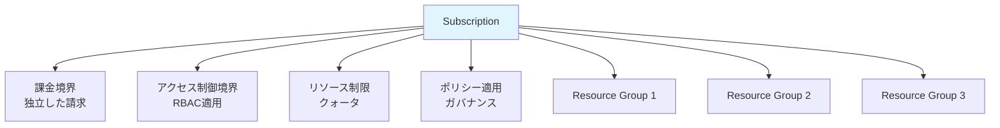
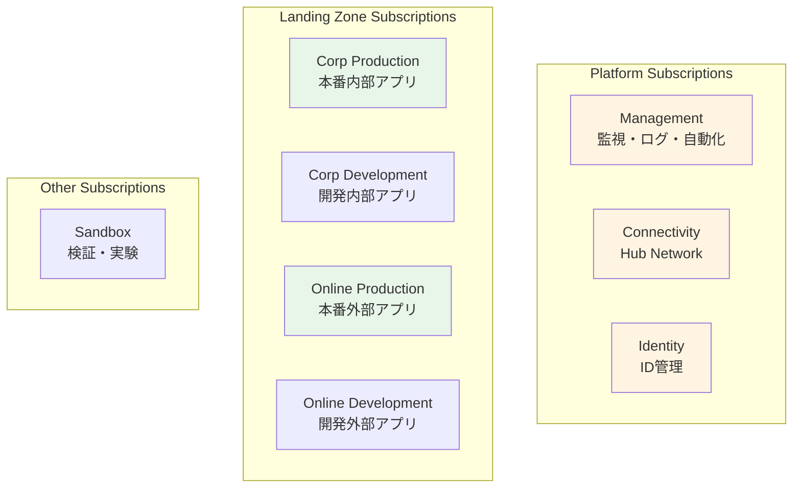

# 第 6 章：Subscriptions 設計・構築（1 日目）

## 本章の目的

本章では、Subscription の設計戦略を学び、ランディングゾーンに必要な Subscriptions の全体像を理解します。そして、**1 日目の作業として Management Subscription を作成**します。Subscription は課金とアクセス制御の境界であり、適切な設計が重要です。

**所要時間**: 約 1-2 時間  
**難易度**: ⭐⭐  
**実施タイミング**: **1 日目**

---

## 6.1 Subscription の理解

### 6.1.1 Subscription とは

**Subscription（サブスクリプション）** は：

- Azure リソースの論理的なコンテナ
- **課金の単位**: 各 Subscription に独立した請求
- **アクセス制御の境界**: RBAC を適用
- **リソース制限の単位**: クォータと制限

### 6.1.2 Subscription の特徴



### 6.1.3 Subscription の制限

各 Subscription には制限があります：

| リソース        | 制限                     |
| --------------- | ------------------------ |
| Resource Groups | 980 個                   |
| VNet            | 1,000 個                 |
| VNet Peering    | 500 個                   |
| Public IP       | 1,000 個（Standard SKU） |
| Load Balancer   | 1,000 個                 |

詳細: [Azure サブスクリプションとサービスの制限](https://docs.microsoft.com/azure/azure-resource-manager/management/azure-subscription-service-limits)

---

## 6.2 Subscription 設計戦略

### 6.2.1 なぜ Subscription を分離するか

**理由 1: 課金の分離**

```
部門ごと、プロジェクトごとにSubscriptionを分けることで：
- コストを明確に把握
- チャージバックが容易
- 予算管理が簡単
```

**理由 2: アクセス制御の境界**

```
開発環境と本番環境を分離：
- 開発者は開発環境のみにアクセス
- 本番環境は限られた人のみ
- 誤操作のリスク低減
```

**理由 3: リソース制限の分離**

```
大規模な環境では、1つのSubscriptionでは制限に達する可能性：
- Subscriptionを分けることでスケール
```

**理由 4: ブラストラジアス（影響範囲）の制限**

```
問題が発生しても、他のSubscriptionに影響しない：
- セキュリティインシデントの封じ込め
- 設定ミスの影響範囲を限定
```

### 6.2.2 CAF 推奨の Subscription 構成

エンタープライズスケールアーキテクチャでは、以下の Subscriptions を推奨：



### 6.2.3 本ハンズオンでの Subscription 構成

**本ハンズオンでは、CAF のベストプラクティスに従い、役割ごとに専用のサブスクリプションを作成します**：

- **sub-platform-management-prod**: 管理・監視用（Log Analytics、Automation 等）← **1 日目に作成**
- **sub-platform-identity-prod**: ID 管理用（将来の拡張用）← **2 日目に作成**
- **sub-platform-connectivity-prod**: ネットワーク接続用（Hub VNet、Firewall、Bastion 等）← **3 日目に作成**
- **sub-landingzone-corp-prod**: 内部アプリケーション用（Spoke VNet、Container Apps 等）← **4 日目以降に作成**

これにより、本番環境と同じ構成で学習できます。

> **⚠️ 重要：個人契約アカウントの制約事項**
>
> 個人契約の Azure アカウント（Pay-As-You-Go、Free Trial など）では、セキュリティとリソース乱用防止のため、**24 時間に 1 つのサブスクリプションしか作成できない制限**があります。
>
> このため、個人アカウントで 4 つのサブスクリプションを作成する場合、**最大 4 日間**かかります。各日で 1 つずつサブスクリプションを作成していきます。
>
> Enterprise Agreement（EA）などのエンタープライズプランでは、この制限は緩和されています。

---

## 6.3 Management Subscription の作成（1 日目）

### 6.3.1 前提条件

- Billing Scope（請求スコープ）へのアクセスが必要
- Microsoft.Subscription/aliases リソースタイプを使用

### 6.3.2 Billing Scope の取得

```bash
# Billing Accountを取得
az billing account list --output table

# Billing Account IDを変数に格納
BILLING_ACCOUNT_NAME=$(az billing account list --query "[0].name" -o tsv)

# Billing Profileを取得
az billing profile list --account-name $BILLING_ACCOUNT_NAME --output table

# Billing Profile IDを変数に格納
BILLING_PROFILE_NAME=$(az billing profile list --account-name $BILLING_ACCOUNT_NAME --query "[0].name" -o tsv)

# Invoice Sectionを取得
az billing invoice section list \
  --account-name $BILLING_ACCOUNT_NAME \
  --profile-name $BILLING_PROFILE_NAME \
  --output table

# Invoice Section IDを変数に格納
INVOICE_SECTION_NAME=$(az billing invoice section list \
  --account-name $BILLING_ACCOUNT_NAME \
  --profile-name $BILLING_PROFILE_NAME \
  --query "[0].name" -o tsv)

# Billing Scopeを構築
BILLING_SCOPE="/providers/Microsoft.Billing/billingAccounts/$BILLING_ACCOUNT_NAME/billingProfiles/$BILLING_PROFILE_NAME/invoiceSections/$INVOICE_SECTION_NAME"

echo "Billing Scope: $BILLING_SCOPE"

# .envファイルに保存（後続の章で再利用、重複防止）
grep -q "BILLING_SCOPE=" .env || echo "BILLING_SCOPE=$BILLING_SCOPE" >> .env
```

### 6.3.3 Bicep モジュールの作成

**重要**: Subscription 作成は`targetScope = 'tenant'`が必要なため、**orchestration (`tenant.bicep`)に統合**します。

まず、ディレクトリを準備：

```bash
mkdir -p infrastructure/bicep/modules/subscriptions
mkdir -p infrastructure/bicep/modules/management-groups
```

#### Subscription モジュールの作成

ファイル `infrastructure/bicep/modules/subscriptions/subscription.bicep` を作成：

```bicep
targetScope = 'tenant'

@description('Subscription alias name (unique identifier)')
param subscriptionAliasName string

@description('Subscription display name')
param subscriptionDisplayName string

@description('Billing Scope')
param billingScope string

@description('Workload type (Production or DevTest)')
@allowed(['Production', 'DevTest'])
param workload string = 'Production'

resource subscription 'Microsoft.Subscription/aliases@2021-10-01' = {
  name: subscriptionAliasName
  properties: {
    workload: workload
    displayName: subscriptionDisplayName
    billingScope: billingScope
  }
}

output subscriptionId string = subscription.properties.subscriptionId
output subscriptionName string = subscriptionDisplayName
```

#### Subscription-MG 紐づけモジュールの作成

ファイル `infrastructure/bicep/modules/management-groups/subscription-association.bicep` を作成：

```bicep
targetScope = 'tenant'

@description('Management Group ID')
param managementGroupId string

@description('Subscription ID')
param subscriptionId string

resource managementGroup 'Microsoft.Management/managementGroups@2021-04-01' existing = {
  name: managementGroupId
}

resource subscriptionAssociation 'Microsoft.Management/managementGroups/subscriptions@2021-04-01' = {
  parent: managementGroup
  name: subscriptionId
}

output managementGroupId string = managementGroupId
output subscriptionId string = subscriptionId
```

### 6.3.4 Orchestration への統合

**Chapter 4 で作成した `orchestration/tenant.bicep` を開き**、以下を追記：

```bicep
// =============================================================================
// Chapter 6: Subscriptions (追記)
// =============================================================================

@description('Billing Scope')
param billingScope string = ''

@description('Subscriptions設定')
param subscriptions object = {}

// Management Subscription作成
module managementSubscription '../modules/subscriptions/subscription.bicep' = if (contains(subscriptions, 'management')) {
  name: 'deploy-subscription-management'
  params: {
    subscriptionAliasName: subscriptions.management.aliasName
    subscriptionDisplayName: subscriptions.management.displayName
    billingScope: billingScope
    workload: subscriptions.management.workload
  }
}

// Management SubscriptionをManagement Groupに紐づけ
module managementSubscriptionAssociation '../modules/management-groups/subscription-association.bicep' = if (contains(subscriptions, 'management')) {
  name: 'deploy-mg-assoc-management'
  params: {
    managementGroupId: '${companyPrefix}-platform-management'
    subscriptionId: managementSubscription.?outputs.?subscriptionId ?? ''
  }
  dependsOn: [
    managementGroups  // Management Groups作成後に実行
  ]
}

// =============================================================================
// 出力（Chapter 6で追加）
// =============================================================================

output managementSubscription object = {
  subscriptionId: managementSubscription.?outputs.?subscriptionId ?? ''
  subscriptionName: managementSubscription.?outputs.?subscriptionName ?? ''
}
```

**orchestration/tenant.bicepparam を開き**、以下を追記：

```bicep
// =============================================================================
// Chapter 6: Subscriptions
// =============================================================================

param billingScope = 'YOUR_BILLING_SCOPE_HERE'

param subscriptions = {
  management: {
    aliasName: 'sub-platform-management-prod'
    displayName: 'sub-platform-management-prod'
    workload: 'Production'
  }
  // Chapter 8以降で追記:
  // identity: { ... }
  // connectivity: { ... }
  // landingZoneCorp: { ... }
}
```

**重要：** `billingScope` の値を置き換えてください：

```bash
# Billing Scopeの値を確認（前のセクションで取得済み）
echo $BILLING_SCOPE

# 出力例：
# /providers/Microsoft.Billing/billingAccounts/12345678/billingProfiles/ABCD-EFGH-001/invoiceSections/IJKL-MNOP-002
```

この値をパラメーターファイルの `billingScope` に設定します。

### 6.3.5 What-If 実行

**orchestration 経由**でデプロイします：

```bash
# デプロイ名を変数に保存
DEPLOYMENT_NAME="tenant-deployment-$(date +%Y%m%d-%H%M%S)"

echo "Creating Management Subscription via Orchestration..."

# What-If実行
az deployment tenant what-if \
  --name "$DEPLOYMENT_NAME" \
  --location japaneast \
  --template-file infrastructure/bicep/orchestration/tenant.bicep \
  --parameters infrastructure/bicep/orchestration/tenant.bicepparam
```

**What-If 結果の確認**：

以下の出力が表示されれば正常です：

```
Resource changes: 1 to modify, 9 no change, 1 unsupported.

Diagnostics (1):
[tenantResourceId('Microsoft.Management/managementGroups/subscriptions', ...)] (Unsupported)
```

**💡 "Unsupported" について**：

- これは**警告ではなく情報メッセージ**です
- Subscription 作成 → その ID で Management Group 紐づけという流れのため、What-If 実行時点ではリソース ID が確定していません
- デプロイ実行時には正しく処理されるため、**このままデプロイして問題ありません**

### 6.3.6 デプロイ実行（10-15 分）

What-If で問題がないことを確認したら、実際にデプロイを実行します。

```bash
# デプロイ実行
az deployment tenant create \
  --name "$DEPLOYMENT_NAME" \
  --location japaneast \
  --template-file infrastructure/bicep/orchestration/tenant.bicep \
  --parameters infrastructure/bicep/orchestration/tenant.bicepparam

echo "Deployment name: $DEPLOYMENT_NAME"
```

### 6.3.7 Subscription ID の取得と記録

```bash
# デプロイ結果から Subscription ID を取得
SUB_MANAGEMENT_ID=$(az deployment tenant show \
  --name "$DEPLOYMENT_NAME" \
  --query "properties.outputs.managementSubscription.value.subscriptionId" -o tsv)

echo "Management Subscription ID: $SUB_MANAGEMENT_ID"

# .envファイルに追記（重複防止）
grep -q "SUB_MANAGEMENT_ID=" .env || echo "SUB_MANAGEMENT_ID=$SUB_MANAGEMENT_ID" >> .env

# 確認
cat .env
```

**代替方法**: デプロイから時間が経過している場合：

```bash
SUB_MANAGEMENT_ID=$(az account list --query "[?name=='sub-platform-management-prod'].id" -o tsv)
echo "Management Subscription ID: $SUB_MANAGEMENT_ID"
grep -q "SUB_MANAGEMENT_ID=" .env || echo "SUB_MANAGEMENT_ID=$SUB_MANAGEMENT_ID" >> .env
```

### 6.3.8 Azure ポータルでの確認

1. [Azure ポータル](https://portal.azure.com)にアクセス
2. 検索バーで「Subscriptions」を検索
3. **sub-platform-management-prod** が表示されることを確認
4. 「Management groups」を開き、**contoso-platform-management** 配下に表示されることを確認

CLI で確認：

```bash
# Subscription確認
az account show --subscription $SUB_MANAGEMENT_ID --output table

# Management Group紐づけ確認
az account management-group subscription show \
  --name contoso-platform-management \
  --subscription $SUB_MANAGEMENT_ID
```

---

## 6.4 orchestration 統合のメリット

**従来の方式**（個別デプロイ）:

- ❌ 各 Chapter で Subscription 作成と MG 紐づけを別々に実行
- ❌ orchestration ファイルに含まれず、復元時に手動実行が必要
- ❌ 冪等性が保証されない

**orchestration 統合後**:

- ✅ **1 コマンドで全て作成**: Subscription 作成と MG 紐づけが自動
- ✅ **冪等性**: 何度実行しても同じ結果
- ✅ **復元が容易**: 全削除後も`tenant.bicep`を実行するだけ
- ✅ **一元管理**: `tenant.bicepparam`でパラメータ管理

---

## 6.5 orchestration の更新方法（各章での追加パターン）

**Chapter 8（Identity Subscription）での追加例**:

```bicep
// tenant.bicepparamに追記
param subscriptions = {
  management: {
    aliasName: 'sub-platform-management-prod'
    displayName: 'sub-platform-management-prod'
    workload: 'Production'
  }
  identity: {  // 👈 Chapter 8で追記
    aliasName: 'sub-platform-identity-prod'
    displayName: 'sub-platform-identity-prod'
    workload: 'Production'
  }
}
```

`tenant.bicep`にも対応するモジュール呼び出しを追記すれば、段階的に構築できます

---

## 6.6 Git へのコミット

```bash
# 変更の確認
git status

# ステージングとコミット
git add .

git commit -m "Chapter 6: Add Subscription creation to orchestration

- Created subscription and subscription-association modules
- Integrated into tenant.bicep orchestration
- Added Management Subscription creation
- Auto-associated with Management Group
- Saved BILLING_SCOPE and SUB_MANAGEMENT_ID to .env"

# プッシュ
git push origin main
```

---

## 6.7 章のまとめ

本章で行ったこと：

1. ✅ Subscription の理解と設計戦略の学習
2. ✅ **Subscription 作成を orchestration 統合** （冪等性と復元性の向上）
3. ✅ Management Subscription の作成
4. ✅ Management Subscription と Management Group の自動紐づけ
5. ✅ Billing Scope と Subscription ID の記録
6. ✅ Git へのコミット・プッシュ

### orchestration 統合のメリット

- **1 コマンドで全て作成**: Subscription 作成と MG 紐づけが自動化
- **冪等性**: 何度実行しても同じ結果
- **復元が容易**: 全削除後も`tenant.bicep`を実行するだけ
- **一元管理**: `tenant.bicepparam`でパラメータ管理

### 重要なポイント

- **Subscription は課金の境界**: コスト管理の基本単位
- **アクセス制御の境界**: RBAC 適用の単位
- **本番環境では分離**: 役割ごとに独立した Subscription
- **24 時間に 1 つの制約**: 個人アカウントではサブスクリプション作成に時間がかかる
- **orchestration に統合**: tenant.bicep で一元管理

### 次のステップ

1 日目の作業として、Management Subscription の作成が完了しました。次は、このサブスクリプションに監視・ログ基盤を構築します。

---

## チェックリスト

- [ ] Subscription の役割を理解した
- [ ] Billing Scope を取得し、.env に保存した
- [ ] Subscription/Subscription-Association モジュールを作成した
- [ ] orchestration (tenant.bicep) に統合した
- [ ] Management Subscription を作成した
- [ ] Management Subscription が Management Group に自動紐づけされた
- [ ] SUB_MANAGEMENT_ID を .env に保存した
- [ ] Git にコミット・プッシュした

---

## 次のステップ

Management Subscription の準備が完了したら、次は監視・ログ基盤の構築に進みます。

👉 [第 7 章：Monitoring（監視・ログ基盤）](chapter07-monitoring.md)

**注意**: 次の章では、今作成した Management Subscription にリソースをデプロイします。

---

## 参考リンク

- [Azure サブスクリプション](https://docs.microsoft.com/azure/cost-management-billing/manage/create-subscription)
- [サブスクリプション設計](https://docs.microsoft.com/azure/cloud-adoption-framework/ready/landing-zone/design-area/resource-org-subscriptions)
- [サブスクリプションの制限](https://docs.microsoft.com/azure/azure-resource-manager/management/azure-subscription-service-limits)

---

---

**最終更新**: 2026 年 1 月 8 日
