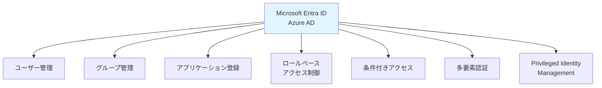
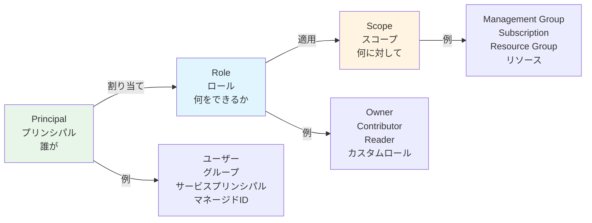
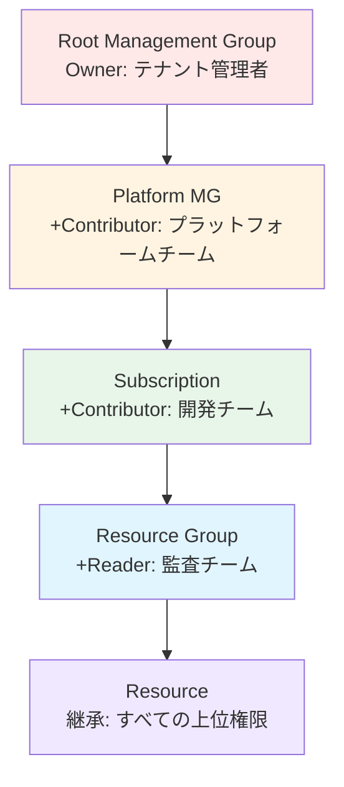
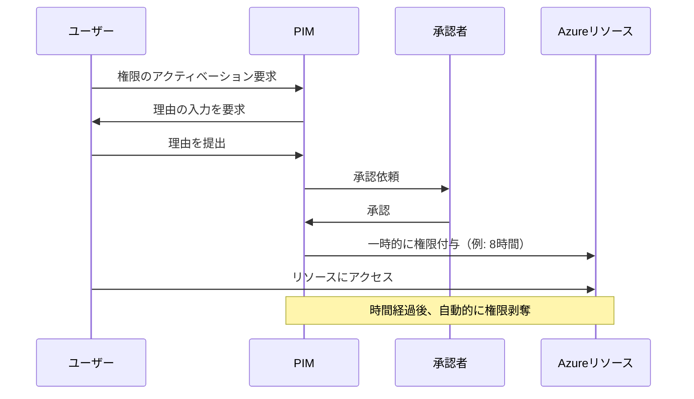

# 第 7 章：Identity & Access Management

## 本章の目的

本章では、Azure Active Directory（Microsoft Entra ID）を使用した ID とアクセス管理を実装します。RBAC ロール、条件付きアクセス、Multi-Factor Authentication（MFA）の設定を行い、セキュアなアクセス制御を構築します。

**所要時間**: 約 3-4 時間  
**難易度**: ⭐⭐⭐

---

## 7.1 Azure AD (Microsoft Entra ID) の理解

### 7.1.1 Azure AD とは

**Azure Active Directory（Azure AD）**は、Microsoft のクラウドベースのアイデンティティおよびアクセス管理サービスです。

2023 年に**Microsoft Entra ID**にブランド変更されましたが、サービスの本質は同じです。



### 7.1.2 Azure AD とオンプレミス AD の違い

| 項目       | オンプレミス AD   | Azure AD                        |
| ---------- | ----------------- | ------------------------------- |
| プロトコル | LDAP, Kerberos    | OAuth 2.0, SAML, OpenID Connect |
| 管理       | Domain Controller | フルマネージド SaaS             |
| スコープ   | オンプレミス      | クラウド、モバイル、Web         |
| 認証       | パスワードベース  | 多要素認証、パスワードレス      |

---

## 7.2 Azure RBAC の設計

### 7.2.1 RBAC の基本概念

Azure RBAC は、「誰が」「何に」「何をできるか」を制御します。



### 7.2.2 組み込みロール

Azure には、100 以上の組み込みロールがあります。主要なものを紹介します：

#### 一般的なロール

| ロール                        | 説明                                 | 用途                     |
| ----------------------------- | ------------------------------------ | ------------------------ |
| **Owner**                     | すべての権限（削除、権限付与含む）   | サブスクリプション管理者 |
| **Contributor**               | リソースの作成・管理（権限付与以外） | 開発者、運用者           |
| **Reader**                    | 読み取りのみ                         | 監査、レポート作成       |
| **User Access Administrator** | アクセス権限の管理のみ               | セキュリティ管理者       |

#### ネットワーク関連

| ロール                           | 説明                       |
| -------------------------------- | -------------------------- |
| **Network Contributor**          | ネットワークリソースの管理 |
| **Private DNS Zone Contributor** | Private DNS の管理         |

#### セキュリティ関連

| ロール                      | 説明                       |
| --------------------------- | -------------------------- |
| **Security Admin**          | セキュリティポリシーの管理 |
| **Security Reader**         | セキュリティ情報の読み取り |
| **Key Vault Administrator** | Key Vault の完全管理       |

#### 監視関連

| ロール                        | 説明                 |
| ----------------------------- | -------------------- |
| **Monitoring Contributor**    | 監視設定の管理       |
| **Monitoring Reader**         | 監視データの読み取り |
| **Log Analytics Contributor** | Log Analytics の管理 |

### 7.2.3 ロール割り当ての階層

ロール割り当ては上位スコープから継承されます：



---

## 7.3 ユーザーとグループの作成

### 7.3.1 Azure AD でのユーザー作成

本ハンズオンでは、個人アカウントを使用しているため、追加ユーザーの作成はオプションです。

エンタープライズ環境での手順を説明します：

#### ポータルでのユーザー作成

1. Azure ポータルで「Microsoft Entra ID」を検索

2. 左メニューの「Users」をクリック

3. 「+ New user」→「Create new user」を選択

4. ユーザー情報を入力：

   - User principal name: `john.doe@contoso.onmicrosoft.com`
   - Display name: `John Doe`
   - Password: 初回ログイン時に変更を要求

5. 「Create」をクリック

#### CLI でのユーザー作成

```bash
# ユーザーを作成
az ad user create \
  --display-name "John Doe" \
  --user-principal-name john.doe@contoso.onmicrosoft.com \
  --password "P@ssw0rd123!" \
  --force-change-password-next-sign-in true
```

### 7.3.2 グループの作成

グループを作成し、ユーザーをまとめて管理します。

#### 推奨されるグループ構成

```
grp-platform-admins          # プラットフォーム管理者
grp-platform-network         # ネットワークチーム
grp-platform-security        # セキュリティチーム
grp-platform-monitoring      # 監視チーム
grp-developers               # すべての開発者
grp-developers-corp          # Corp開発者
grp-developers-online        # Online開発者
grp-readers                  # 読み取り専用ユーザー
```

#### CLI でのグループ作成

```bash
# Platform Adminsグループを作成
az ad group create \
  --display-name "grp-platform-admins" \
  --mail-nickname "grp-platform-admins" \
  --description "プラットフォーム基盤の管理者"

# Developersグループを作成
az ad group create \
  --display-name "grp-developers" \
  --mail-nickname "grp-developers" \
  --description "すべての開発者"
```

### 7.3.3 グループへのユーザー追加

```bash
# グループIDを取得
GROUP_ID=$(az ad group show --group grp-platform-admins --query id -o tsv)

# ユーザーIDを取得
USER_ID=$(az ad user show --id john.doe@contoso.onmicrosoft.com --query id -o tsv)

# グループにユーザーを追加
az ad group member add \
  --group $GROUP_ID \
  --member-id $USER_ID
```

---

## 7.4 ロール割り当ての実装

### 7.4.1 Management Group レベルのロール割り当て

#### 設計

| Management Group      | ロール                 | グループ                |
| --------------------- | ---------------------- | ----------------------- |
| Platform              | Contributor            | grp-platform-admins     |
| Platform-Connectivity | Network Contributor    | grp-platform-network    |
| Platform-Management   | Monitoring Contributor | grp-platform-monitoring |
| Landing Zones-Corp    | Contributor            | grp-developers-corp     |

#### Bicep でのロール割り当て

```bash
# ロール割り当てモジュールを作成
mkdir -p infrastructure/bicep/modules/rbac
```

ファイル `infrastructure/bicep/modules/rbac/role-assignments.bicep` を作成し、以下の内容を記述します：

**role-assignments.bicep の解説：**

Management GroupレベルでRBACロールを割り当てるモジュール。ロール定義ID、プリンシパルID（ユーザー、グループ、サービスプリンシパル）を指定して使用します。

```bicep
targetScope = 'managementGroup'

@description('割り当てるロールの定義ID')
param roleDefinitionId string

@description('プリンシパルID（ユーザー、グループ、サービスプリンシパル）')
param principalId string

@description('プリンシパルのタイプ')
@allowed([
  'User'
  'Group'
  'ServicePrincipal'
])
param principalType string = 'Group'

// ロール割り当て
resource roleAssignment 'Microsoft.Authorization/roleAssignments@2022-04-01' = {
  name: guid(managementGroup().id, roleDefinitionId, principalId)
  properties: {
    roleDefinitionId: roleDefinitionId
    principalId: principalId
    principalType: principalType
  }
}

output roleAssignmentId string = roleAssignment.id
```

#### ロール割り当ての実行（例）

```bash
# Platformmanagement GroupにContributorロールを付与（例）
# 注: グループIDは実際の環境に合わせて変更してください

PLATFORM_MG_ID="/providers/Microsoft.Management/managementGroups/contoso-platform"
CONTRIBUTOR_ROLE_ID="/providers/Microsoft.Authorization/roleDefinitions/b24988ac-6180-42a0-ab88-20f7382dd24c"
GROUP_ID="xxxxxxxx-xxxx-xxxx-xxxx-xxxxxxxxxxxx"  # 実際のグループID

# ロール割り当てを作成
az role assignment create \
  --role "Contributor" \
  --assignee $GROUP_ID \
  --scope $PLATFORM_MG_ID \
  --assignee-object-id $GROUP_ID \
  --assignee-principal-type Group
```

### 7.4.2 Subscription レベルのロール割り当て

```bash
# 現在のユーザーに対して、Subscriptionレベルで確認
az role assignment list \
  --subscription $(az account show --query id -o tsv) \
  --assignee $(az account show --query user.name -o tsv) \
  --output table
```

### 7.4.3 カスタムロールの作成

組み込みロールで要件を満たせない場合、カスタムロールを作成します。

#### カスタムロール定義の例

```bash
# カスタムロール定義ファイルを作成
mkdir -p infrastructure/rbac/custom-roles

cat << EOF > infrastructure/rbac/custom-roles/network-reader.json
{
  "Name": "Network Reader",
  "Description": "ネットワークリソースの読み取り専用アクセス",
  "Actions": [
    "Microsoft.Network/*/read",
    "Microsoft.Resources/subscriptions/resourceGroups/read"
  ],
  "NotActions": [],
  "DataActions": [],
  "NotDataActions": [],
  "AssignableScopes": [
    "/providers/Microsoft.Management/managementGroups/contoso-platform"
  ]
}
EOF

# カスタムロールを作成
az role definition create \
  --role-definition infrastructure/rbac/custom-roles/network-reader.json
```

---

## 7.5 サービスプリンシパルとマネージド ID

### 7.5.1 サービスプリンシパル

サービスプリンシパルは、アプリケーションやサービス用の ID です。

#### CI/CD 用サービスプリンシパル（第 2 章で作成済み）

```bash
# 既存のサービスプリンシパルを確認
az ad sp list --display-name "sp-azure-caf-handson-cicd" --output table
```

### 7.5.2 マネージド ID

マネージド ID は、Azure リソースに自動的に割り当てられる ID です。

**2 種類のマネージド ID**:

1. **System-assigned (システム割り当て)**

   - リソースと一緒に作成・削除される
   - 1:1 の関係

2. **User-assigned (ユーザー割り当て)**
   - 独立したリソース
   - 複数のリソースで共有可能

#### マネージド ID の作成（例）

```bash
# User-assigned Managed Identityを作成
az identity create \
  --name "id-platform-automation" \
  --resource-group "rg-platform-management-prod-jpe-001" \
  --location japaneast

# Managed IDを取得
MANAGED_ID=$(az identity show \
  --name "id-platform-automation" \
  --resource-group "rg-platform-management-prod-jpe-001" \
  --query principalId -o tsv)

# Managed IDにロールを付与
az role assignment create \
  --role "Contributor" \
  --assignee $MANAGED_ID \
  --scope "/subscriptions/$(az account show --query id -o tsv)"
```

---

## 7.6 Multi-Factor Authentication (MFA)

### 7.6.1 MFA の重要性

MFA（多要素認証）は、パスワードに加えて追加の認証要素を要求することで、セキュリティを大幅に向上させます。

**認証の 3 要素**:

1. **知識**: パスワード、PIN
2. **所有**: スマートフォン、セキュリティキー
3. **生体**: 指紋、顔認証

### 7.6.2 MFA の設定（個人アカウント）

個人アカウントで MFA を有効化します：

1. [Azure ポータル](https://portal.azure.com)を開く

2. 右上のアカウントアイコンをクリック

3. 「View account」を選択

4. 「Security info」をクリック

5. 「+ Add sign-in method」をクリック

6. 「Authenticator app」を選択（Microsoft Authenticator を推奨）

7. スマートフォンで Microsoft Authenticator アプリをインストール

8. QR コードをスキャン

9. 認証コードを入力して確認

### 7.6.3 条件付きアクセスポリシー（エンタープライズ）

エンタープライズ環境では、条件付きアクセスで MFA を強制します。

#### ポリシー例

```
ポリシー名: "管理者にMFAを要求"

条件:
- ユーザー: grp-platform-admins
- クラウドアプリ: すべてのクラウドアプリ
- 場所: すべての場所

制御:
- アクセス権の付与
- 多要素認証を要求
```

#### CLI での条件付きアクセスポリシー作成（参考）

```bash
# 条件付きアクセスポリシーはAzure ADプレミアムが必要
# 個人アカウントでは制限があるため、参考として記載

# ポリシーの作成（Azure AD Premium P1/P2が必要）
az rest --method POST \
  --uri https://graph.microsoft.com/v1.0/identity/conditionalAccess/policies \
  --body '{
    "displayName": "管理者にMFAを要求",
    "state": "enabled",
    "conditions": {
      "users": {
        "includeGroups": ["group-id"]
      },
      "applications": {
        "includeApplications": ["All"]
      }
    },
    "grantControls": {
      "operator": "OR",
      "builtInControls": ["mfa"]
    }
  }'
```

---

## 7.7 Privileged Identity Management (PIM)

### 7.7.1 PIM とは

PIM（Privileged Identity Management）は、特権アクセスを Just-In-Time（必要な時だけ）で付与する機能です。



### 7.7.2 PIM の設定（エンタープライズ）

PIM は Azure AD Premium P2 が必要です。個人アカウントでは利用できない場合が多いため、概念のみ説明します。

#### PIM の利点

- **Just-In-Time アクセス**: 必要な時だけ権限付与
- **承認フロー**: 管理者の承認が必要
- **時間制限**: 自動的に権限剥奪
- **監査証跡**: すべてのアクセスを記録
- **アラート**: 異常なアクセスを検知

---

## 7.8 RBAC 設計のドキュメント化

```bash
# RBAC設計書を作成
cat << 'EOF' > docs/diagrams/rbac-design.md
# RBAC設計

## 概要

本ハンズオンでのロールベースアクセス制御（RBAC）の設計を記載します。

## ロール割り当て戦略

### Management Groupレベル

| Management Group | ロール | 割り当て先 | 理由 |
|---|---|---|---|
| Root | Owner | テナント管理者のみ | 最上位の権限 |
| Root | Reader | 全従業員 | 透明性の確保 |
| Platform | Contributor | grp-platform-admins | プラットフォーム管理 |
| Platform-Management | Monitoring Contributor | grp-platform-monitoring | 監視設定の管理 |
| Platform-Connectivity | Network Contributor | grp-platform-network | ネットワーク管理 |
| Landing Zones-Corp | Contributor | grp-developers-corp | アプリ開発 |
| Sandbox | Contributor | grp-developers | 自由な実験環境 |

### Subscriptionレベル

| Subscription | ロール | 割り当て先 |
|---|---|---|
| すべて | Reader | 監査チーム |
| すべて | Cost Management Reader | 財務チーム |

### Resource Groupレベル

| Resource Group | ロール | 割り当て先 |
|---|---|---|
| rg-platform-management-* | Log Analytics Contributor | grp-platform-monitoring |
| rg-platform-connectivity-* | Network Contributor | grp-platform-network |
| rg-landingzone-corp-* | Contributor | プロジェクトチーム |

## 組み込みロール

### よく使用するロール

| ロール名 | ロールID | 用途 |
|---|---|---|
| Owner | 8e3af657-a8ff-443c-a75c-2fe8c4bcb635 | 完全な管理権限 |
| Contributor | b24988ac-6180-42a0-ab88-20f7382dd24c | リソース管理（権限付与以外） |
| Reader | acdd72a7-3385-48ef-bd42-f606fba81ae7 | 読み取りのみ |
| Network Contributor | 4d97b98b-1d4f-4787-a291-c67834d212e7 | ネットワーク管理 |
| Monitoring Contributor | 749f88d5-cbae-40b8-bcfc-e573ddc772fa | 監視設定の管理 |

## カスタムロール

### Network Reader

読み取り専用のネットワークアクセス。

\`\`\`json
{
  "Name": "Network Reader",
  "Description": "ネットワークリソースの読み取り専用アクセス",
  "Actions": [
    "Microsoft.Network/*/read"
  ],
  "AssignableScopes": [
    "/providers/Microsoft.Management/managementGroups/contoso-platform"
  ]
}
\`\`\`

## グループ設計

### 推奨されるグループ構成

\`\`\`
grp-tenant-admins               # テナント管理者（最小限）
grp-platform-admins             # プラットフォーム管理者
grp-platform-network            # ネットワークチーム
grp-platform-security           # セキュリティチーム
grp-platform-monitoring         # 監視チーム
grp-developers                  # すべての開発者
grp-developers-corp             # Corp環境の開発者
grp-developers-online           # Online環境の開発者
grp-readers                     # 読み取り専用ユーザー
grp-finance                     # 財務チーム（コスト管理）
\`\`\`

## セキュリティベストプラクティス

### 最小権限の原則

- 必要最小限の権限のみ付与
- Ownerロールは極力避ける
- Contributorで十分な場合はContributorを使用

### 定期的なレビュー

- 四半期ごとにロール割り当てをレビュー
- 不要になった権限は削除
- 離職者の権限は即座に削除

### Just-In-Time アクセス

- 特権アクセスはPIMを使用
- 常時Ownerを付与しない
- 必要な時だけアクティベーション

### 監査ログ

- すべてのロール割り当てをログに記録
- 異常なアクセスをアラート
- 定期的に監査レポートを作成

---

**作成日**: 2026年1月7日
EOF

# 確認
cat docs/diagrams/rbac-design.md
```

---

## 7.9 Git へのコミット

```bash
# 変更を確認
git status

# ステージングとコミット
git add .

git commit -m "Chapter 7: Identity and Access Management

- Documented Azure AD (Entra ID) concepts
- Designed RBAC strategy for Management Groups and Subscriptions
- Created RBAC Bicep modules for role assignments
- Documented user and group management
- Explained service principals and managed identities
- Covered MFA and conditional access concepts
- Documented PIM (Privileged Identity Management)
- Created comprehensive RBAC design documentation
- Created custom role definitions"

# プッシュ
git push origin main
```

---

## 7.10 章のまとめ

本章で行ったこと：

1. ✅ Azure AD (Microsoft Entra ID) の理解
2. ✅ Azure RBAC の設計
3. ✅ ユーザーとグループ管理の理解
4. ✅ ロール割り当ての実装方法
5. ✅ カスタムロールの作成
6. ✅ サービスプリンシパルとマネージド ID の理解
7. ✅ MFA の設定
8. ✅ 条件付きアクセスの概念
9. ✅ PIM の理解
10. ✅ RBAC 設計のドキュメント化

### 重要なポイント

- **最小権限の原則**: 必要最小限の権限のみ付与
- **階層的な継承**: Management Groups からの継承を活用
- **MFA は必須**: すべての管理者アカウントに MFA
- **PIM で特権管理**: Just-In-Time アクセスで特権を制限
- **定期的なレビュー**: 権限の棚卸しを定期実施

---

## チェックリスト

- [ ] Azure AD の基本を理解した
- [ ] RBAC 戦略を設計した
- [ ] グループ構成を理解した
- [ ] ロール割り当てモジュールを作成した
- [ ] MFA を有効化した
- [ ] RBAC 設計書を作成した
- [ ] Git にコミット・プッシュした

---

## 次のステップ

ID とアクセス管理の設計が完了したら、次は Hub Network の構築に進みます。

👉 [第 8 章：Hub Network 構築](chapter08-networking-hub.md)

---

## 参考リンク

- [Azure AD (Microsoft Entra ID)](https://docs.microsoft.com/azure/active-directory/)
- [Azure RBAC](https://docs.microsoft.com/azure/role-based-access-control/)
- [条件付きアクセス](https://docs.microsoft.com/azure/active-directory/conditional-access/)
- [Privileged Identity Management](https://docs.microsoft.com/azure/active-directory/privileged-identity-management/)
- [マネージド ID](https://docs.microsoft.com/azure/active-directory/managed-identities-azure-resources/)
- [MFA](https://docs.microsoft.com/azure/active-directory/authentication/concept-mfa-howitworks)

---

**最終更新**: 2026 年 1 月 7 日
