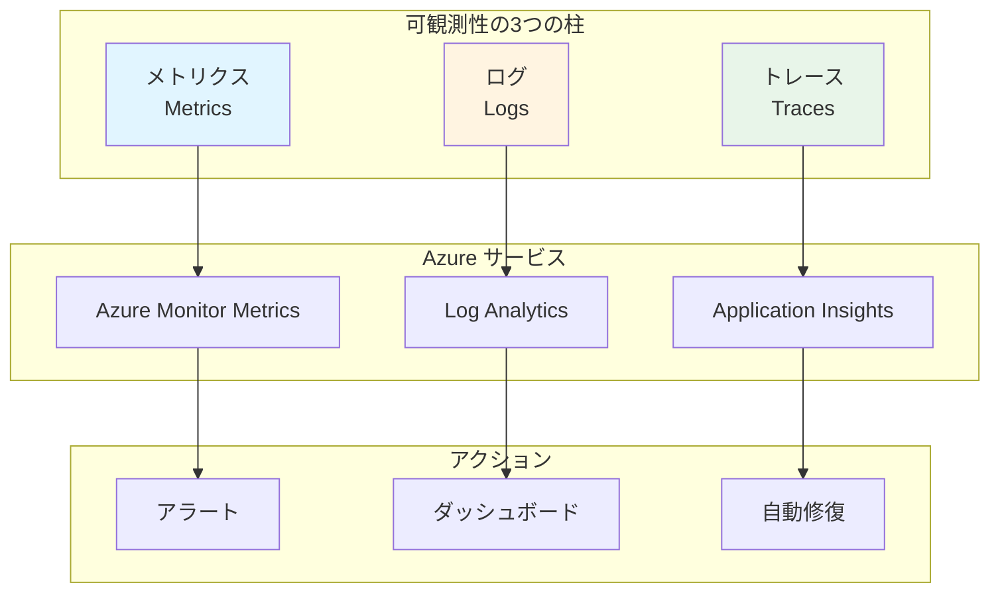
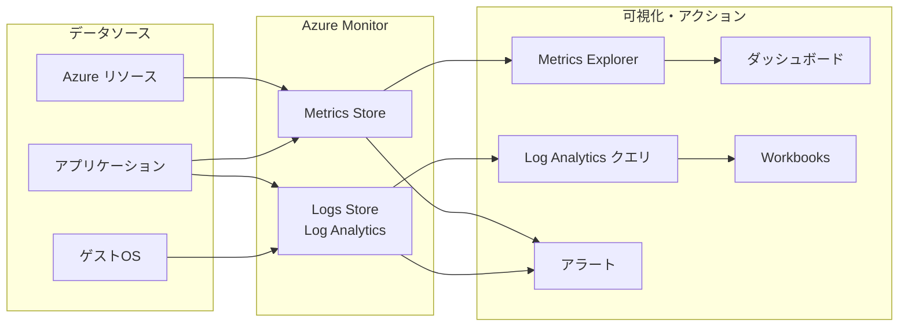
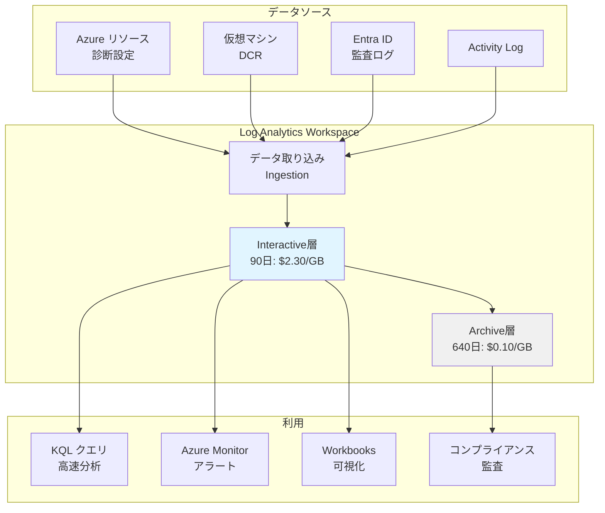
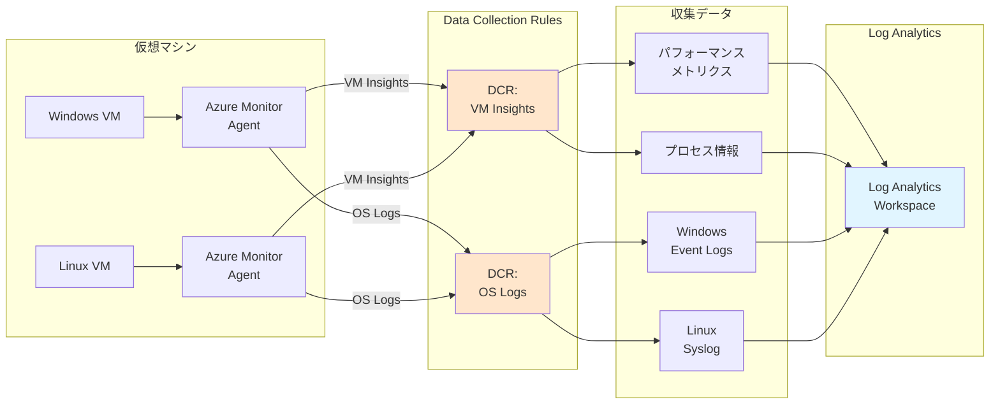
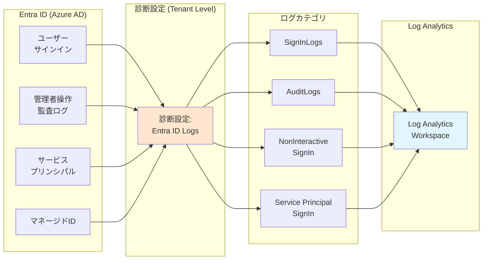
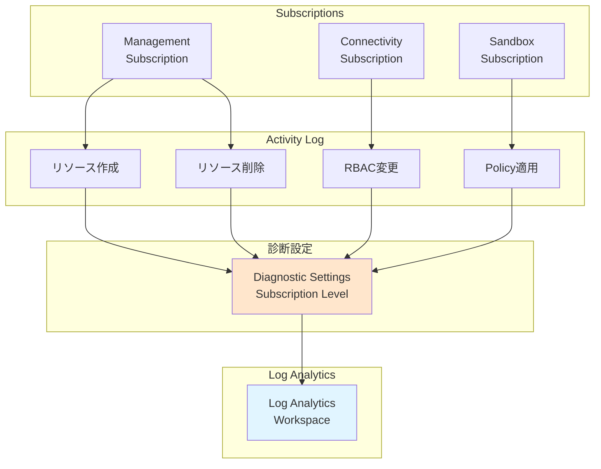
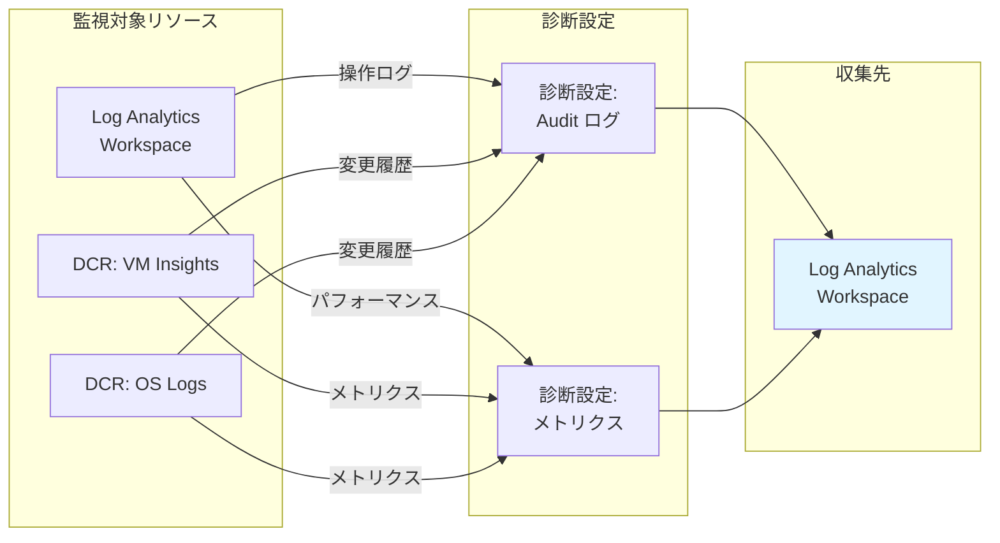
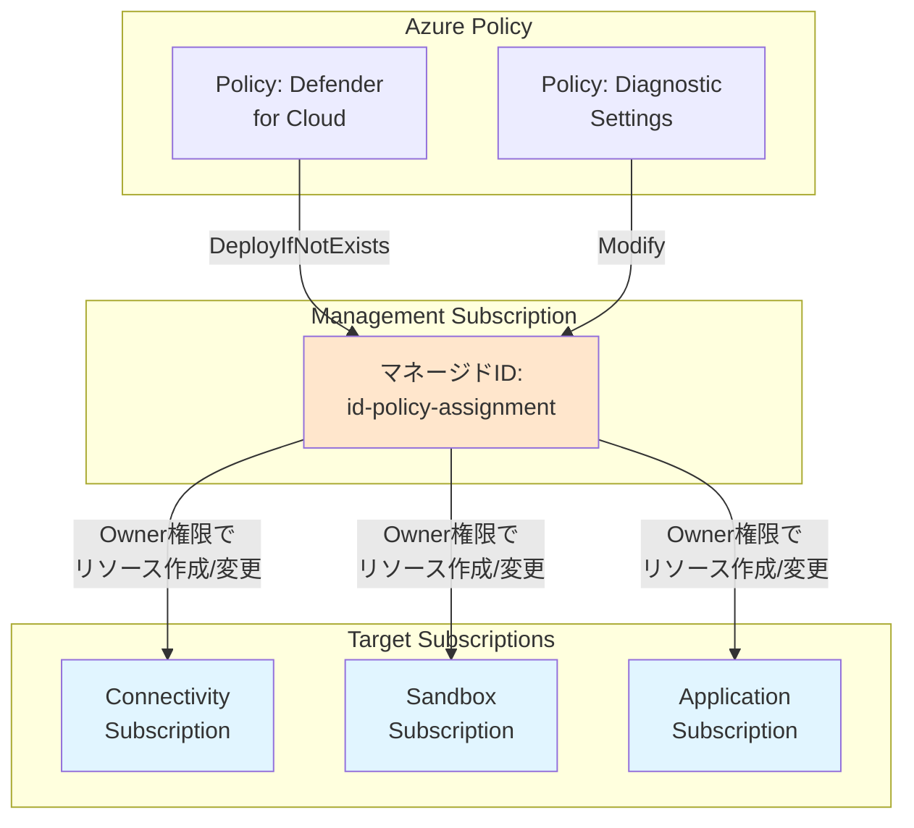
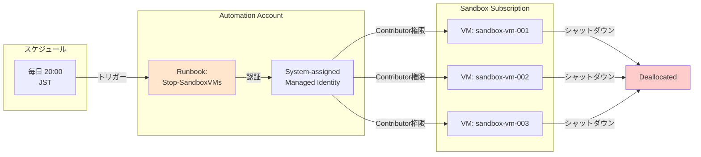

# 第 7 章：監視・ログ基盤構築（1 日目）

## 本章の目的

本章では、Management Subscription に監視・ログ基盤を構築します。Log Analytics Workspace、診断設定、基本的なアラートを実装し、システムの可観測性の基礎を確立します。

**所要時間**: 約 2-3 時間  
**難易度**: ⭐⭐  
**実施タイミング**: **1 日目**（Management Subscription 作成後）

---

## 7.0 事前準備：Management Subscription の選択

本章では、監視・ログリソースを **Management Subscription** にデプロイします。

作業を開始する前に、必ず適切なサブスクリプションを選択してください：

```bash
# 環境変数を読み込み
source .env

# Management Subscriptionに切り替え
az account set --subscription $SUB_MANAGEMENT_ID

# 現在のサブスクリプションを確認
az account show --query "{Name:name, SubscriptionId:id}" -o table
```

**注意**: 第 6 章で作成した Management Subscription を使用します。

---

## 7.1 可観測性（Observability）とは

### 7.1.1 可観測性の 3 つの柱



### 7.1.2 監視戦略

**監視すべき対象**:

- **インフラストラクチャ**: CPU、メモリ、ディスク、ネットワーク
- **アプリケーション**: レスポンスタイム、エラー率、スループット
- **セキュリティ**: 異常なアクセス、失敗した認証
- **コスト**: リソース使用量、予算超過

---

## 7.2 Azure Monitor の理解

### 7.2.1 Azure Monitor とは

**Azure Monitor**は、すべての Azure リソースの監視を統合するサービスです。

**機能**:

- メトリクスの収集と可視化
- ログの収集と分析（Log Analytics）
- アラートの設定
- 自動スケーリング
- ダッシュボード

### 7.2.2 データフロー



---

## 7.3 Log Analytics Workspace の構築



**Log Analytics Workspace の役割：**

Log Analytics Workspace は、Azure 全体のログとメトリクスを集約する**中央ログストア**です。すべての監視データがここに集まり、KQL クエリで分析、アラート発火、長期保存が可能になります。

### 7.3.1 Resource Group の作成

監視リソース用の Resource Group を Bicep で作成します。

ディレクトリを作成：

```bash
mkdir -p infrastructure/bicep/modules/resource-group
```

ファイル `infrastructure/bicep/modules/resource-group/resource-group.bicep` を作成：

```bicep
targetScope = 'subscription'

@description('リソースグループ名')
param resourceGroupName string

@description('デプロイ先のリージョン')
param location string

@description('タグ')
param tags object = {}

// Resource Group
resource resourceGroup 'Microsoft.Resources/resourceGroups@2023-07-01' = {
  name: resourceGroupName
  location: location
  tags: tags
}

output resourceGroupName string = resourceGroup.name
output resourceGroupId string = resourceGroup.id
```

ファイル `infrastructure/bicep/parameters/management-resource-group.bicepparam` を作成し、以下の内容を記述します：

```bicep
using '../modules/resource-group/resource-group.bicep'

param resourceGroupName = 'rg-platform-management-prod-jpe-001'
param location = 'japaneast'
param tags = {
  Environment: 'Production'
  ManagedBy: 'Bicep'
  Component: 'Management'
}
```

**重要：** パラメーターファイルを Git 管理下に置くことで、すべてのリソースを消しても一発で復元できます。

デプロイ：

```bash
# パラメーターファイルのディレクトリを作成
mkdir -p infrastructure/bicep/parameters

# Management Subscription に切り替え（念のため確認）
az account set --subscription $SUB_MANAGEMENT_ID

# 事前確認
az deployment sub what-if \
  --name "rg-management-$(date +%Y%m%d-%H%M%S)" \
  --location japaneast \
  --template-file infrastructure/bicep/modules/resource-group/resource-group.bicep \
  --parameters infrastructure/bicep/parameters/management-resource-group.bicepparam

# 確認後、デプロイ実行
az deployment sub create \
  --name "rg-management-$(date +%Y%m%d-%H%M%S)" \
  --location japaneast \
  --template-file infrastructure/bicep/modules/resource-group/resource-group.bicep \
  --parameters infrastructure/bicep/parameters/management-resource-group.bicepparam

echo "Resource Group が Bicep で作成されました"
```

**重要：** すべてのリソースを Bicep で管理することで、インフラストラクチャのパラメーターシート兼バックアップとして機能します。Resource Group も例外ではありません。

### 7.3.2 Log Analytics Workspace の作成

すべてのログとメトリクスを集約する中央ログストアとして、Log Analytics Workspace を作成します。

ディレクトリを作成：

```bash
mkdir -p infrastructure/bicep/modules/monitoring
```

ファイル `infrastructure/bicep/modules/monitoring/log-analytics.bicep` を作成：

```bicep
@description('Log Analytics Workspaceの名前')
param workspaceName string

@description('デプロイ先のリージョン')
param location string

@description('対話型分析期間（日数）- この期間はKQLで高速アクセス可能')
@minValue(30)
@maxValue(730)
param retentionInDays int = 90

@description('タグ')
param tags object = {}

// Log Analytics Workspace
resource logAnalyticsWorkspace 'Microsoft.OperationalInsights/workspaces@2022-10-01' = {
  name: workspaceName
  location: location
  tags: tags
  properties: {
    sku: {
      name: 'PerGB2018'
    }
    retentionInDays: retentionInDays
    features: {
      enableLogAccessUsingOnlyResourcePermissions: true
    }
    publicNetworkAccessForIngestion: 'Enabled'
    publicNetworkAccessForQuery: 'Enabled'
  }
}

// 出力
output workspaceId string = logAnalyticsWorkspace.id
output workspaceName string = logAnalyticsWorkspace.name
output customerId string = logAnalyticsWorkspace.properties.customerId
```

**注意：** `totalRetentionInDays` パラメータはワークスペース作成後、Azure Portal で各テーブルのデータ保持ポリシーを設定する際に使用します。Bicep ではワークスペースレベルの `retentionInDays`（Interactive 期間）のみを設定し、Archive 期間は Portal または Azure CLI で個別に設定します。

ファイル `infrastructure/bicep/parameters/log-analytics.bicepparam` を作成し、以下の内容を記述します：

```bicep
using '../modules/monitoring/log-analytics.bicep'

param workspaceName = 'log-platform-prod-jpe-001'
param location = 'japaneast'
param retentionInDays = 90
param tags = {
  Environment: 'Production'
  ManagedBy: 'Bicep'
  Component: 'Monitoring'
}
```

デプロイ：

```bash
# 事前確認
az deployment group what-if \
  --name "log-analytics-deployment-$(date +%Y%m%d-%H%M%S)" \
  --resource-group rg-platform-management-prod-jpe-001 \
  --template-file infrastructure/bicep/modules/monitoring/log-analytics.bicep \
  --parameters infrastructure/bicep/parameters/log-analytics.bicepparam

# 確認後、デプロイ実行
az deployment group create \
  --name "log-analytics-deployment-$(date +%Y%m%d-%H%M%S)" \
  --resource-group rg-platform-management-prod-jpe-001 \
  --template-file infrastructure/bicep/modules/monitoring/log-analytics.bicep \
  --parameters infrastructure/bicep/parameters/log-analytics.bicepparam

# Workspace IDを取得して環境変数に保存
WORKSPACE_ID=$(az monitor log-analytics workspace show \
  --resource-group rg-platform-management-prod-jpe-001 \
  --workspace-name log-platform-prod-jpe-001 \
  --query id -o tsv)

echo "WORKSPACE_ID=$WORKSPACE_ID" >> .env
echo "Log Analytics Workspace ID: $WORKSPACE_ID"
```

### 7.3.3 テーブルレベルの保持期間設定

Log Analytics Workspace のテーブルごとに保持期間を設定します。これにより、Interactive 期間（高速アクセス）と Archive 期間（低コスト長期保存）を制御できます。

ファイル `infrastructure/bicep/modules/monitoring/log-analytics-table-retention.bicep` を作成：

```bicep
@description('Log Analytics Workspace名')
param workspaceName string

@description('テーブル名')
param tableName string

@description('対話型分析期間（日数）')
@minValue(30)
@maxValue(730)
param retentionInDays int = 90

@description('総保持期間（日数）- アーカイブを含む')
@minValue(30)
@maxValue(2556)
param totalRetentionInDays int = 730

// 既存のLog Analytics Workspace
resource workspace 'Microsoft.OperationalInsights/workspaces@2022-10-01' existing = {
  name: workspaceName
}

// テーブルの保持期間設定
resource tableRetention 'Microsoft.OperationalInsights/workspaces/tables@2022-10-01' = {
  parent: workspace
  name: tableName
  properties: {
    retentionInDays: retentionInDays
    totalRetentionInDays: totalRetentionInDays
  }
}

output tableName string = tableRetention.name
output retentionInDays int = tableRetention.properties.retentionInDays
output totalRetentionInDays int = tableRetention.properties.totalRetentionInDays
```

ファイル `infrastructure/bicep/parameters/log-analytics-table-retention.bicepparam` を作成し、以下の内容を記述します：

```bicep
using '../modules/monitoring/log-analytics-table-retention.bicep'

param workspaceName = 'log-platform-prod-jpe-001'
param tableName = 'AzureActivity'  // ループ処理でCLIから上書き
param retentionInDays = 90
param totalRetentionInDays = 730
```

**すべてのテーブルに保持期間を設定：**

1つのパラメーターファイルを使用し、テーブル名のみCLIから上書きしてループ処理します。

```bash
# Log Analytics Workspaceのすべてのテーブルを取得
TABLES=$(az monitor log-analytics workspace table list \
  --resource-group rg-platform-management-prod-jpe-001 \
  --workspace-name log-platform-prod-jpe-001 \
  --query "[].name" -o tsv)

echo "取得されたテーブル数: $(echo "$TABLES" | wc -l)"
echo "テーブル一覧:"
echo "$TABLES"

# 各テーブルに保持期間を設定
for TABLE in $TABLES; do
  echo "Setting retention for table: $TABLE"

  # 事前確認（テーブル名のみCLIから上書き）
  az deployment group what-if \
    --name "table-retention-${TABLE}-$(date +%Y%m%d-%H%M%S)" \
    --resource-group rg-platform-management-prod-jpe-001 \
    --template-file infrastructure/bicep/modules/monitoring/log-analytics-table-retention.bicep \
    --parameters infrastructure/bicep/parameters/log-analytics-table-retention.bicepparam \
    --parameters tableName="$TABLE"

  # 確認後、デプロイ実行（テーブル名のみCLIから上書き）
  az deployment group create \
    --name "table-retention-${TABLE}-$(date +%Y%m%d-%H%M%S)" \
    --resource-group rg-platform-management-prod-jpe-001 \
    --template-file infrastructure/bicep/modules/monitoring/log-analytics-table-retention.bicep \
    --parameters infrastructure/bicep/parameters/log-analytics-table-retention.bicepparam \
    --parameters tableName="$TABLE"
done

echo "すべてのテーブルに保持期間が設定されました"
```

**重要な注意事項：**

- **パラメーターファイルは1つだけ**: `log-analytics-table-retention.bicepparam` のみを作成
- **テーブル名のみCLI注入**: `--parameters tableName="$TABLE"` でパラメーターファイルの値を上書き
- **カスタムテーブル**: Log Analytics にカスタムテーブルがある場合も自動的に対象となります
- **システムテーブル**: 一部のシステムテーブルは保持期間設定がサポートされない場合があります（エラーが出た場合はスキップ）
- **再実行**: 新しいテーブルが追加された場合、このスクリプトを再実行することで新規テーブルにも保持期間を設定できます

**主要なテーブルの例：**

- `AzureActivity`: Activity Log
- `AzureDiagnostics`: 診断設定
- `SigninLogs`: Entra ID サインイン
- `AuditLogs`: Entra ID 監査
- `Heartbeat`: VM Insights ハートビート
- `Perf`: VM Insights パフォーマンス
- `InsightsMetrics`: VM Insights メトリクス
- `Syslog`: Linux Syslog
- `Event`: Windows Event
- その他、Workspace 内のすべてのテーブル

### 7.3.4 ログ保存期間とアーカイブ戦略

Log Analytics Workspace のデータ保存には 2 つの階層があります。

#### Interactive Analytics 層（対話型分析）

- **期間**: 90 日（`retentionInDays`）
- **特徴**: KQL クエリで高速アクセス可能
- **コスト**: 約 $2.30/GB/月
- **用途**: 日常的なセキュリティ調査、トラブルシューティング、パフォーマンス分析

#### Archive 層（アーカイブ）

- **期間**: 91 日目〜730 日目（`totalRetentionInDays - retentionInDays`）
- **特徴**: 低コストの長期保存、クエリは遅い
- **コスト**: 約 $0.10/GB/月（約 95%削減）
- **用途**: コンプライアンス、監査証跡、長期トレンド分析

#### CAF ベストプラクティスに基づく推奨設定

| 要件レベル | Interactive | Total Retention | 用途                         |
| ---------- | ----------- | --------------- | ---------------------------- |
| **標準**   | 90 日       | 730 日（2 年）  | 一般的な企業、GDPR/SOC2 対応 |
| **金融**   | 90 日       | 2555 日（7 年） | 金融機関、厳格な監査要件     |
| **医療**   | 90 日       | 1825 日（5 年） | 医療機関、HIPAA 対応         |

**今回の実装:**

```yaml
retentionInDays: 90日 # Interactive期間
totalRetentionInDays: 730日 # 総保持期間（アーカイブ含む）
```

**コスト試算例（1 日 10GB のログ取り込みの場合）:**

- Interactive（90 日）: 10GB × 90 日 × $2.30/GB/月 = $2,070/月
- Archive（640 日）: 10GB × 640 日 × $0.10/GB/月 = $640/月
- **合計**: $2,710/月

**アーカイブなしの場合（730 日すべて Interactive）:**

- Interactive（730 日）: 10GB × 730 日 × $2.30/GB/月 = $16,790/月

**節約効果**: Archive 層を活用することで、約 84% のコスト削減（$14,080/月の節約）

#### Azure ポータルでの確認

1. Log Analytics Workspace に移動
2. **設定** > **使用量と推定コスト** を選択
3. **データ保持** タブで、Workspace 全体の保持期間を確認
4. **設定** > **テーブル** で各テーブルの保持期間を確認：
   - **Table**: テーブル名（AzureActivity, AzureDiagnostics など）
   - **Retention (days)**: 対話型分析期間（90 日）
   - **Total retention (days)**: 総保持期間（730 日）
   - **Archive (days)**: アーカイブ期間（640 日 = 730 - 90）

### 7.3.5 Workspace のクエリと監視

Log Analytics Workspace にデータが収集されているか確認します。

Azure ポータルから、Log Analytics Workspace を開き、**ログ** を選択して KQL クエリを実行できます。

```kql
// 過去24時間のログエントリ数をテーブル別に集計
search *
| where TimeGenerated > ago(24h)
| summarize Count = count() by Type
| order by Count desc
```

---

## 7.4 Data Collection Rules (DCR) の構築



**Data Collection Rule (DCR) の役割：**

DCR は、Azure Monitor Agent が**どのデータを収集するか**を定義します。VM Insights 用と OS ログ用の 2 つの DCR を作成し、後の章で Azure Policy を使って全 VM に自動適用します。

### 7.4.1 DCR for VM Insights

VM Insights 用の DCR を作成します。これにより、VM のパフォーマンスメトリクスとプロセス情報を収集できます。

ファイル `infrastructure/bicep/modules/monitoring/dcr-vm-insights.bicep` を作成：

```bicep
@description('DCRの名前')
param dcrName string

@description('デプロイ先のリージョン')
param location string

@description('Log Analytics Workspace ID')
param workspaceId string

@description('タグ')
param tags object = {}

// Data Collection Rule for VM Insights
resource dcrVMInsights 'Microsoft.Insights/dataCollectionRules@2022-06-01' = {
  name: dcrName
  location: location
  tags: tags
  kind: 'Linux'
  properties: {
    description: 'Data Collection Rule for VM Insights (Performance and Processes)'
    dataSources: {
      performanceCounters: [
        {
          name: 'VMInsightsPerfCounters'
          streams: [
            'Microsoft-InsightsMetrics'
          ]
          samplingFrequencyInSeconds: 60
          counterSpecifiers: [
            '\\VmInsights\\DetailedMetrics'
          ]
        }
      ]
      extensions: [
        {
          name: 'DependencyAgentDataSource'
          streams: [
            'Microsoft-ServiceMap'
          ]
          extensionName: 'DependencyAgent'
          extensionSettings: {}
        }
      ]
    }
    destinations: {
      logAnalytics: [
        {
          name: 'VMInsightsPerf-Logs-Dest'
          workspaceResourceId: workspaceId
        }
      ]
    }
    dataFlows: [
      {
        streams: [
          'Microsoft-InsightsMetrics'
        ]
        destinations: [
          'VMInsightsPerf-Logs-Dest'
        ]
      }
      {
        streams: [
          'Microsoft-ServiceMap'
        ]
        destinations: [
          'VMInsightsPerf-Logs-Dest'
        ]
      }
    ]
  }
}

output dcrId string = dcrVMInsights.id
output dcrName string = dcrVMInsights.name
```

ファイル `infrastructure/bicep/parameters/dcr-vm-insights.bicepparam` を作成し、以下の内容を記述します：

```bicep
using '../modules/monitoring/dcr-vm-insights.bicep'

param dcrName = 'dcr-vm-insights-prod-jpe-001'
param location = 'japaneast'
param workspaceId = '/subscriptions/YOUR_SUB_ID/resourceGroups/rg-platform-management-prod-jpe-001/providers/Microsoft.OperationalInsights/workspaces/log-platform-prod-jpe-001'
param tags = {
  Environment: 'Production'
  ManagedBy: 'Bicep'
  Component: 'Monitoring'
}
```

**重要：** `workspaceId` の値を置き換えてください。以下のコマンドで取得した Workspace ID を使用します：

```bash
# Log Analytics Workspace IDの値を確認（前のセクションで取得済み）
echo $WORKSPACE_ID

# 出力例：
# /subscriptions/12345678-1234-1234-1234-123456789012/resourceGroups/rg-platform-management-prod-jpe-001/providers/Microsoft.OperationalInsights/workspaces/log-platform-prod-jpe-001
```

この値をパラメーターファイルの `workspaceId` に設定します。

デプロイ：

```bash
# 事前確認
az deployment group what-if \
  --name "dcr-vm-insights-$(date +%Y%m%d-%H%M%S)" \
  --resource-group rg-platform-management-prod-jpe-001 \
  --template-file infrastructure/bicep/modules/monitoring/dcr-vm-insights.bicep \
  --parameters infrastructure/bicep/parameters/dcr-vm-insights.bicepparam

# 確認後、デプロイ実行
az deployment group create \
  --name "dcr-vm-insights-$(date +%Y%m%d-%H%M%S)" \
  --resource-group rg-platform-management-prod-jpe-001 \
  --template-file infrastructure/bicep/modules/monitoring/dcr-vm-insights.bicep \
  --parameters infrastructure/bicep/parameters/dcr-vm-insights.bicepparam

# DCR IDを取得して保存
DCR_VM_INSIGHTS_ID=$(az monitor data-collection rule show \
  --name dcr-vm-insights-prod-jpe-001 \
  --resource-group rg-platform-management-prod-jpe-001 \
  --query id -o tsv)

echo "DCR_VM_INSIGHTS_ID=$DCR_VM_INSIGHTS_ID" >> .env
echo "VM Insights DCR ID: $DCR_VM_INSIGHTS_ID"
```

### 7.4.2 DCR for Windows Event Logs and Syslog

Windows Event ログと Linux Syslog を収集する DCR を作成します。

ファイル `infrastructure/bicep/modules/monitoring/dcr-os-logs.bicep` を作成：

```bicep
@description('DCRの名前')
param dcrName string

@description('デプロイ先のリージョン')
param location string

@description('Log Analytics Workspace ID')
param workspaceId string

@description('タグ')
param tags object = {}

// Data Collection Rule for OS Logs (Windows Events + Syslog)
resource dcrOSLogs 'Microsoft.Insights/dataCollectionRules@2022-06-01' = {
  name: dcrName
  location: location
  tags: tags
  properties: {
    description: 'Data Collection Rule for Windows Event Logs and Linux Syslog'
    dataSources: {
      windowsEventLogs: [
        {
          name: 'WindowsEventLogsDataSource'
          streams: [
            'Microsoft-Event'
          ]
          xPathQueries: [
            'System!*[System[(Level=1 or Level=2 or Level=3 or Level=4 or Level=0)]]'
            'Application!*[System[(Level=1 or Level=2 or Level=3 or Level=4 or Level=0)]]'
            'Security!*'
          ]
        }
      ]
      syslog: [
        {
          name: 'SyslogDataSource'
          streams: [
            'Microsoft-Syslog'
          ]
          facilityNames: [
            'auth'
            'authpriv'
            'cron'
            'daemon'
            'kern'
            'syslog'
            'user'
          ]
          logLevels: [
            'Alert'
            'Critical'
            'Debug'
            'Emergency'
            'Error'
            'Info'
            'Notice'
            'Warning'
          ]
        }
      ]
    }
    destinations: {
      logAnalytics: [
        {
          name: 'OSLogs-Dest'
          workspaceResourceId: workspaceId
        }
      ]
    }
    dataFlows: [
      {
        streams: [
          'Microsoft-Event'
        ]
        destinations: [
          'OSLogs-Dest'
        ]
      }
      {
        streams: [
          'Microsoft-Syslog'
        ]
        destinations: [
          'OSLogs-Dest'
        ]
      }
    ]
  }
}

output dcrId string = dcrOSLogs.id
output dcrName string = dcrOSLogs.name
```

ファイル `infrastructure/bicep/parameters/dcr-os-logs.bicepparam` を作成し、以下の内容を記述します：

```bicep
using '../modules/monitoring/dcr-os-logs.bicep'

param dcrName = 'dcr-os-logs-prod-jpe-001'
param location = 'japaneast'
param workspaceId = '/subscriptions/YOUR_SUB_ID/resourceGroups/rg-platform-management-prod-jpe-001/providers/Microsoft.OperationalInsights/workspaces/log-platform-prod-jpe-001'
param tags = {
  Environment: 'Production'
  ManagedBy: 'Bicep'
  Component: 'Monitoring'
}
```

**重要：** `workspaceId` の値を置き換えてください。以下のコマンドで取得した Workspace ID を使用します：

```bash
# Log Analytics Workspace IDの値を確認（前のセクションで取得済み）
echo $WORKSPACE_ID

# 出力例：
# /subscriptions/12345678-1234-1234-1234-123456789012/resourceGroups/rg-platform-management-prod-jpe-001/providers/Microsoft.OperationalInsights/workspaces/log-platform-prod-jpe-001
```

この値をパラメーターファイルの `workspaceId` に設定します。

デプロイ：

```bash
# 事前確認
az deployment group what-if \
  --name "dcr-os-logs-$(date +%Y%m%d-%H%M%S)" \
  --resource-group rg-platform-management-prod-jpe-001 \
  --template-file infrastructure/bicep/modules/monitoring/dcr-os-logs.bicep \
  --parameters infrastructure/bicep/parameters/dcr-os-logs.bicepparam

# 確認後、デプロイ実行
az deployment group create \
  --name "dcr-os-logs-$(date +%Y%m%d-%H%M%S)" \
  --resource-group rg-platform-management-prod-jpe-001 \
  --template-file infrastructure/bicep/modules/monitoring/dcr-os-logs.bicep \
  --parameters infrastructure/bicep/parameters/dcr-os-logs.bicepparam

# DCR IDを取得して保存
DCR_OS_LOGS_ID=$(az monitor data-collection rule show \
  --name dcr-os-logs-prod-jpe-001 \
  --resource-group rg-platform-management-prod-jpe-001 \
  --query id -o tsv)

echo "DCR_OS_LOGS_ID=$DCR_OS_LOGS_ID" >> .env
echo "OS Logs DCR ID: $DCR_OS_LOGS_ID"
```

### 7.4.3 DCR の役割と今後の活用

作成した DCR は、後の章で **Azure Policy** と組み合わせることで、環境全体の VM に自動的に適用されます。

**組み込みポリシー例：**

- `Configure Windows machines to run Azure Monitor Agent and associate them to a Data Collection Rule`
- `Configure Linux machines to run Azure Monitor Agent and associate them to a Data Collection Rule`

これにより、新しく作成される VM にも自動的に Azure Monitor Agent がインストールされ、ログ収集が開始されます。

### 7.4.3 Azure Portal での確認

デプロイ後、Azure Portal で以下を確認します:

1. **Data Collection Rules の確認**

   - Azure Portal → Monitor → Data Collection Rules
   - `dcr-vm-insights-prod-jpe-001` と `dcr-os-logs-prod-jpe-001` が存在することを確認

2. **DCR の詳細確認**

   - DCR を開く → Resources → 後の章で VM を作成後、ここに VM が自動的に関連付けられることを確認
   - Data sources で Performance Counters や Syslog が設定されていることを確認

3. **Log Analytics への接続確認**
   - DCR を開く → Destinations → Log Analytics Workspace が正しく設定されていることを確認

---

## 7.5 Entra ID の監査ログ収集



**Entra ID ログ収集の重要性：**

Entra ID（旧 Azure AD）のログは、**誰が**「いつ」「どこから」Azure にアクセスしたかを記録します。セキュリティ侵害の検知、不正アクセスの調査、コンプライアンス対応に不可欠です。

Entra ID（Azure Active Directory）のサインインログと監査ログを Log Analytics Workspace に送信します。ユーザーの認証履歴やディレクトリ変更を一元的に監視できます。

### 7.5.1 Entra ID 診断設定の特徴

Entra ID の診断設定は **テナントレベル** のリソースであり、通常の Bicep デプロイでは設定できません。Azure CLI の `az monitor diagnostic-settings` コマンドを使用します。

**収集されるログカテゴリ：**

- **AuditLogs**: ディレクトリの変更（ユーザー追加、グループ変更等）
- **SignInLogs**: 対話型サインイン
- **NonInteractiveUserSignInLogs**: 非対話型サインイン
- **ServicePrincipalSignInLogs**: サービスプリンシパルのサインイン
- **ManagedIdentitySignInLogs**: マネージド ID のサインイン
- **ProvisioningLogs**: プロビジョニングログ

### 7.5.2 診断設定の適用

```bash
# Entra ID の診断設定を作成
az monitor diagnostic-settings create \
  --name "entra-id-to-log-analytics" \
  --resource "/providers/microsoft.aadiam/tenants/$TENANT_ID" \
  --workspace $LOG_WORKSPACE_ID \
  --logs '[
    {"category": "AuditLogs", "enabled": true},
    {"category": "SignInLogs", "enabled": true},
    {"category": "NonInteractiveUserSignInLogs", "enabled": true},
    {"category": "ServicePrincipalSignInLogs", "enabled": true},
    {"category": "ManagedIdentitySignInLogs", "enabled": true},
    {"category": "ProvisioningLogs", "enabled": true}
  ]'

echo "Entra ID のログが Log Analytics に送信されるようになりました"
```

**注意事項：**

- Entra ID P1/P2 ライセンスが必要な場合があります（SignInLogs 等）
- 診断設定の確認：Azure Portal → Entra ID → Diagnostic settings

### 7.5.3 KQL クエリ例

```kql
// 最近のサインインログ（成功のみ）
SigninLogs
| where TimeGenerated > ago(1h)
| where ResultType == 0  // 0 = 成功
| project TimeGenerated, UserPrincipalName, IPAddress, AppDisplayName, Location
| order by TimeGenerated desc

// サインイン失敗の監視
SigninLogs
| where TimeGenerated > ago(1h)
| where ResultType != 0  // 失敗
| summarize FailureCount = count() by UserPrincipalName, ResultType, ResultDescription
| order by FailureCount desc

// 監査ログ - ユーザー作成イベント
AuditLogs
| where TimeGenerated > ago(24h)
| where OperationName == "Add user"
| project TimeGenerated, Identity, TargetResources
| order by TimeGenerated desc
```

### 7.5.4 Azure Portal での確認

デプロイ後、Azure Portal で以下を確認します:

1. **Entra ID 診断設定の確認**

   - Azure Portal → Entra ID → Diagnostic settings
   - `entra-id-to-log-analytics` が存在し、有効になっていることを確認

2. **ログカテゴリの確認**

   - Diagnostic settings で AuditLogs, SignInLogs など全カテゴリが有効であることを確認

3. **Log Analytics でログ確認**
   - Azure Portal → Log Analytics workspaces → Logs
   - `SigninLogs | take 10` を実行してサインインログが収集されていることを確認

---

## 7.6 サブスクリプションのアクティビティログ収集



**Activity Log（アクティビティログ）とは：**

Azure の**管理操作の履歴**を記録します。「誰が」「いつ」「どのリソースを作成/変更/削除したか」が記録され、セキュリティ監査やトラブルシューティングに活用できます。

作成したサブスクリプションのアクティビティログ（管理操作の履歴）を Log Analytics Workspace に送信します。

### 7.6.1 診断設定 Bicep モジュール

ファイル `infrastructure/bicep/modules/monitoring/subscription-diagnostic-settings.bicep` を作成します：

**subscription-diagnostic-settings.bicep の解説：**

サブスクリプションレベルの診断設定を作成します。`targetScope: 'subscription'` を指定することで、サブスクリプション全体のアクティビティログを Log Analytics に送信できます。

```bicep
targetScope = 'subscription'

@description('Log Analytics Workspace ID')
param workspaceId string

@description('診断設定の名前')
param diagnosticSettingName string = 'send-to-log-analytics'

// サブスクリプションの診断設定
resource diagnosticSetting 'Microsoft.Insights/diagnosticSettings@2021-05-01-preview' = {
  name: diagnosticSettingName
  properties: {
    workspaceId: workspaceId
    logs: [
      { category: 'Administrative', enabled: true }
      { category: 'Security', enabled: true }
      { category: 'ServiceHealth', enabled: true }
      { category: 'Alert', enabled: true }
      { category: 'Recommendation', enabled: true }
      { category: 'Policy', enabled: true }
      { category: 'Autoscale', enabled: true }
      { category: 'ResourceHealth', enabled: true }
    ]
  }
}
```

### 7.6.2 Management Subscription の診断設定を適用

ファイル `infrastructure/bicep/parameters/subscription-diagnostics.bicepparam` を作成し、以下の内容を記述します：

```bicep
using '../modules/monitoring/subscription-diagnostic-settings.bicep'

param workspaceId = '/subscriptions/YOUR_SUB_ID/resourceGroups/rg-platform-management-prod-jpe-001/providers/Microsoft.OperationalInsights/workspaces/log-platform-prod-jpe-001'
param diagnosticSettingName = 'send-to-log-analytics'
```

**重要：** `workspaceId` の値を置き換えてください。以下のコマンドで取得した Workspace ID を使用します：

```bash
# Log Analytics Workspace IDの値を確認（前のセクションで取得済み）
echo $WORKSPACE_ID

# 出力例：
# /subscriptions/12345678-1234-1234-1234-123456789012/resourceGroups/rg-platform-management-prod-jpe-001/providers/Microsoft.OperationalInsights/workspaces/log-platform-prod-jpe-001
```

この値をパラメーターファイルの `workspaceId` に設定します。

```bash
# Management Subscription で実行
az account set --subscription $SUB_MANAGEMENT_ID

# 事前確認
az deployment sub what-if \
  --name "sub-diagnostics-$(date +%Y%m%d-%H%M%S)" \
  --location japaneast \
  --template-file infrastructure/bicep/modules/monitoring/subscription-diagnostic-settings.bicep \
  --parameters infrastructure/bicep/parameters/subscription-diagnostics.bicepparam

# 確認後、デプロイ実行
az deployment sub create \
  --name "sub-diagnostics-$(date +%Y%m%d-%H%M%S)" \
  --location japaneast \
  --template-file infrastructure/bicep/modules/monitoring/subscription-diagnostic-settings.bicep \
  --parameters infrastructure/bicep/parameters/subscription-diagnostics.bicepparam
```

### 7.6.3 Azure Portal での確認

デプロイ後、Azure Portal で以下を確認します:

1. **サブスクリプション診断設定の確認**

   - Azure Portal → Subscriptions → Management Subscription
   - Diagnostic settings で `send-to-log-analytics` が存在することを確認

2. **ログカテゴリの確認**

   - Administrative, Security, Policy など全カテゴリが有効であることを確認

3. **Activity Log の確認**
   - Azure Portal → Monitor → Activity Log
   - 最近のサブスクリプション操作が表示されることを確認

### 7.6.4 Activity Log のクエリ例

Log Analytics で Activity Log を検索する KQL クエリ例：

```kql
// 過去24時間のすべてのActivity Log
AzureActivity
| where TimeGenerated > ago(24h)
| project TimeGenerated, Caller, OperationNameValue, ResourceGroup, Resource, ActivityStatusValue
| order by TimeGenerated desc

// リソースの作成・削除操作のみ
AzureActivity
| where OperationNameValue has_any ("Microsoft.Resources/subscriptions/resourceGroups/write",
                                     "Microsoft.Resources/subscriptions/resourceGroups/delete")
| project TimeGenerated, Caller, OperationNameValue, ResourceGroup, ActivityStatusValue
| order by TimeGenerated desc

// RBAC変更（ロール割り当て）
AzureActivity
| where OperationNameValue startswith "Microsoft.Authorization/roleAssignments/"
| project TimeGenerated, Caller, OperationNameValue, Properties
| order by TimeGenerated desc

// 失敗した操作のみ
AzureActivity
| where ActivityStatusValue == "Failed"
| project TimeGenerated, Caller, OperationNameValue, ResourceGroup, Resource, ActivitySubstatusValue
| order by TimeGenerated desc

// 特定のユーザーの操作履歴
AzureActivity
| where Caller contains "user@example.com"
| project TimeGenerated, OperationNameValue, ResourceGroup, Resource, ActivityStatusValue
| order by TimeGenerated desc

// Resource Group削除操作の詳細
AzureActivity
| where OperationNameValue == "Microsoft.Resources/subscriptions/resourceGroups/delete"
| extend DeletedResourceGroup = tostring(parse_json(Properties).resource)
| project TimeGenerated, Caller, DeletedResourceGroup, ActivityStatusValue, SubscriptionId
```

**Activity Log の活用：**

- **セキュリティ監査**: 誰が機密リソースを削除したか
- **変更追跡**: RBAC 変更の履歴
- **トラブルシューティング**: 失敗した操作の原因調査
- **コンプライアンス**: 管理操作の証跡保存

---

## 7.7 既存リソースの診断設定

すでに作成した Log Analytics Workspace と DCR に対して診断設定を適用し、これらのリソース自体の操作ログも収集します。



**診断設定の重要性：**

監視基盤自体（Log Analytics や DCR）の操作ログを収集することで、「誰が」「いつ」「どのような変更を行ったか」を追跡できます。セキュリティ監査やコンプライアンス対応に不可欠です。

**今後のリソース作成における診断設定のルール：**

本章では既存の監視リソース（Log Analytics、DCR）に診断設定を適用しましたが、**今後作成するすべてのリソースにも診断設定を適用します**。

診断設定が利用可能なリソース：

- Azure Firewall
- Key Vault
- Azure Bastion
- Storage Account
- Virtual Network Gateway
- Application Gateway
- その他の Azure サービス

**実装方針：**

- リソース作成と診断設定を**同じ Bicep ファイル内**で定義
- すべてのログとメトリクスを Log Analytics Workspace に送信
- リソース作成時に診断設定も自動的にデプロイ

例：`infrastructure/bicep/modules/networking/firewall.bicep` では、Azure Firewall リソースと診断設定の両方を定義します。

---

### 7.7.1 Log Analytics Workspace の診断設定

ファイル `infrastructure/bicep/modules/monitoring/log-analytics-diagnostics.bicep` を作成します：

**log-analytics-diagnostics.bicep の解説：**

Log Analytics Workspace 自体の操作ログ（Audit）とメトリクスを収集します。ワークスペースへの変更履歴を追跡できます。

```bicep
@description('Log Analytics Workspace名')
param workspaceName string

@description('診断設定の送信先 Workspace ID')
param destinationWorkspaceId string

@description('診断設定の名前')
param diagnosticSettingName string = 'send-to-log-analytics'

// 既存のLog Analytics Workspace
resource workspace 'Microsoft.OperationalInsights/workspaces@2022-10-01' existing = {
  name: workspaceName
}

// 診断設定
resource diagnosticSetting 'Microsoft.Insights/diagnosticSettings@2021-05-01-preview' = {
  name: diagnosticSettingName
  scope: workspace
  properties: {
    workspaceId: destinationWorkspaceId
    logs: [
      { category: 'Audit', enabled: true, retentionPolicy: { enabled: false, days: 0 } }
    ]
    metrics: [
      { category: 'AllMetrics', enabled: true, retentionPolicy: { enabled: false, days: 0 } }
    ]
  }
}

output diagnosticSettingId string = diagnosticSetting.id
```

ファイル `infrastructure/bicep/parameters/log-analytics-diagnostics.bicepparam` を作成し、以下の内容を記述します：

```bicep
using '../modules/monitoring/log-analytics-diagnostics.bicep'

param workspaceName = 'log-platform-prod-jpe-001'
param destinationWorkspaceId = '/subscriptions/YOUR_SUB_ID/resourceGroups/rg-platform-management-prod-jpe-001/providers/Microsoft.OperationalInsights/workspaces/log-platform-prod-jpe-001'
param diagnosticSettingName = 'send-to-log-analytics'
```

**重要：** `destinationWorkspaceId` の値を置き換えてください。以下のコマンドで取得した Workspace ID を使用します：

```bash
# Log Analytics Workspace IDの値を確認（前のセクションで取得済み）
echo $WORKSPACE_ID

# 出力例：
# /subscriptions/12345678-1234-1234-1234-123456789012/resourceGroups/rg-platform-management-prod-jpe-001/providers/Microsoft.OperationalInsights/workspaces/log-platform-prod-jpe-001
```

この値をパラメーターファイルの `destinationWorkspaceId` に設定します。

```bash
# Log Analytics Workspace の診断設定を適用
# 事前確認
az deployment group what-if \
  --name "log-diagnostics-$(date +%Y%m%d-%H%M%S)" \
  --resource-group rg-platform-management-prod-jpe-001 \
  --template-file infrastructure/bicep/modules/monitoring/log-analytics-diagnostics.bicep \
  --parameters infrastructure/bicep/parameters/log-analytics-diagnostics.bicepparam

# 確認後、デプロイ実行
az deployment group create \
  --name "log-diagnostics-$(date +%Y%m%d-%H%M%S)" \
  --resource-group rg-platform-management-prod-jpe-001 \
  --template-file infrastructure/bicep/modules/monitoring/log-analytics-diagnostics.bicep \
  --parameters infrastructure/bicep/parameters/log-analytics-diagnostics.bicepparam
```

### 7.7.2 Data Collection Rule の診断設定

ファイル `infrastructure/bicep/modules/monitoring/dcr-diagnostics.bicep` を作成します：

**dcr-diagnostics.bicep の解説：**

DCR 自体の操作ログを収集します。DCR の変更や削除を追跡できます。

```bicep
@description('DCR名')
param dcrName string

@description('診断設定の送信先 Workspace ID')
param destinationWorkspaceId string

@description('診断設定の名前')
param diagnosticSettingName string = 'send-to-log-analytics'

// 既存のDCR
resource dcr 'Microsoft.Insights/dataCollectionRules@2022-06-01' existing = {
  name: dcrName
}

// 診断設定
resource diagnosticSetting 'Microsoft.Insights/diagnosticSettings@2021-05-01-preview' = {
  name: diagnosticSettingName
  scope: dcr
  properties: {
    workspaceId: destinationWorkspaceId
    logs: [
      { category: 'allLogs', enabled: true, retentionPolicy: { enabled: false, days: 0 } }
    ]
    metrics: [
      { category: 'AllMetrics', enabled: true, retentionPolicy: { enabled: false, days: 0 } }
    ]
  }
}

output diagnosticSettingId string = diagnosticSetting.id
```

ファイル `infrastructure/bicep/parameters/dcr-diagnostics-vm-insights.bicepparam` を作成し、以下の内容を記述します：

```bicep
using '../modules/monitoring/dcr-diagnostics.bicep'

param dcrName = 'dcr-vm-insights-prod-jpe-001'
param destinationWorkspaceId = '/subscriptions/YOUR_SUB_ID/resourceGroups/rg-platform-management-prod-jpe-001/providers/Microsoft.OperationalInsights/workspaces/log-platform-prod-jpe-001'
param diagnosticSettingName = 'send-to-log-analytics'
```

ファイル `infrastructure/bicep/parameters/dcr-diagnostics-os-logs.bicepparam` を作成し、以下の内容を記述します：

```bicep
using '../modules/monitoring/dcr-diagnostics.bicep'

param dcrName = 'dcr-os-logs-prod-jpe-001'
param destinationWorkspaceId = '/subscriptions/YOUR_SUB_ID/resourceGroups/rg-platform-management-prod-jpe-001/providers/Microsoft.OperationalInsights/workspaces/log-platform-prod-jpe-001'
param diagnosticSettingName = 'send-to-log-analytics'
```

**重要：** `destinationWorkspaceId` の値を置き換えてください。以下のコマンドで取得した Workspace ID を使用します：

```bash
# Log Analytics Workspace IDの値を確認（前のセクションで取得済み）
echo $WORKSPACE_ID

# 出力例：
# /subscriptions/12345678-1234-1234-1234-123456789012/resourceGroups/rg-platform-management-prod-jpe-001/providers/Microsoft.OperationalInsights/workspaces/log-platform-prod-jpe-001
```

この値をパラメーターファイルの `destinationWorkspaceId` に設定します。

```bash
# VM Insights DCR の診断設定
# 事前確認
az deployment group what-if \
  --name "dcr-vm-insights-diagnostics-$(date +%Y%m%d-%H%M%S)" \
  --resource-group rg-platform-management-prod-jpe-001 \
  --template-file infrastructure/bicep/modules/monitoring/dcr-diagnostics.bicep \
  --parameters infrastructure/bicep/parameters/dcr-diagnostics-vm-insights.bicepparam

# 確認後、デプロイ実行
az deployment group create \
  --name "dcr-vm-insights-diagnostics-$(date +%Y%m%d-%H%M%S)" \
  --resource-group rg-platform-management-prod-jpe-001 \
  --template-file infrastructure/bicep/modules/monitoring/dcr-diagnostics.bicep \
  --parameters infrastructure/bicep/parameters/dcr-diagnostics-vm-insights.bicepparam

# OS Logs DCR の診断設定
# 事前確認
az deployment group what-if \
  --name "dcr-os-logs-diagnostics-$(date +%Y%m%d-%H%M%S)" \
  --resource-group rg-platform-management-prod-jpe-001 \
  --template-file infrastructure/bicep/modules/monitoring/dcr-diagnostics.bicep \
  --parameters infrastructure/bicep/parameters/dcr-diagnostics-os-logs.bicepparam

# 確認後、デプロイ実行
az deployment group create \
  --name "dcr-os-logs-diagnostics-$(date +%Y%m%d-%H%M%S)" \
  --resource-group rg-platform-management-prod-jpe-001 \
  --template-file infrastructure/bicep/modules/monitoring/dcr-diagnostics.bicep \
  --parameters infrastructure/bicep/parameters/dcr-diagnostics-os-logs.bicepparam
```

**今後のリソース作成ルール：**

今後、新しいリソースを作成する際は、診断設定が利用可能なリソース（Azure Firewall、Key Vault、Bastion、Storage Account 等）については、リソース作成と同じ Bicep ファイル内で診断設定も一緒に定義します。

### 7.7.3 Azure Portal での確認

デプロイ後、Azure Portal で以下を確認します:

1. **リソース診断設定の確認**

   - Azure Portal → Log Analytics workspace → Diagnostic settings
   - `send-to-log-analytics` が存在することを確認

2. **DCR 診断設定の確認**

   - Azure Portal → Monitor → Data Collection Rules → dcr-vm-insights
   - Diagnostic settings で診断が有効になっていることを確認

3. **監視基盤のログ確認**
   - Log Analytics → Logs → `AzureDiagnostics | where ResourceType == "DATACOLECTIONRULES" | take 10`
   - 監視リソース自体のログが収集されていることを確認

### 7.7.4 診断設定ログのクエリ例

今後作成する Azure Firewall などのリソースの診断設定ログを検索する KQL クエリ例：

```kql
// Azure Firewall - すべてのログ（第13章で作成後に使用可能）
AzureDiagnostics
| where ResourceType == "AZUREFIREWALLS"
| project TimeGenerated, Category, msg_s, Resource
| order by TimeGenerated desc

// Azure Firewall - 許可されたアプリケーションルール
AzureDiagnostics
| where ResourceType == "AZUREFIREWALLS"
| where Category == "AzureFirewallApplicationRule"
| where msg_s contains "Allow"
| project TimeGenerated, msg_s
| order by TimeGenerated desc

// Azure Firewall - ブロックされたネットワークトラフィック
AzureDiagnostics
| where ResourceType == "AZUREFIREWALLS"
| where Category == "AzureFirewallNetworkRule"
| where msg_s contains "Deny"
| extend SourceIP = extract(@"Source: ([0-9\.]+)", 1, msg_s)
| extend DestinationIP = extract(@"Destination: ([0-9\.]+)", 1, msg_s)
| extend DestinationPort = extract(@"DestPort: ([0-9]+)", 1, msg_s)
| project TimeGenerated, SourceIP, DestinationIP, DestinationPort, msg_s
| order by TimeGenerated desc

// Azure Firewall - 脅威インテリジェンスアラート
AzureDiagnostics
| where ResourceType == "AZUREFIREWALLS"
| where Category == "AzureFirewallThreatIntelLog"
| project TimeGenerated, msg_s, Resource
| order by TimeGenerated desc

// Key Vault - シークレットアクセス（第12章で作成後に使用可能）
AzureDiagnostics
| where ResourceType == "VAULTS"
| where OperationName == "SecretGet"
| project TimeGenerated, CallerIPAddress, identity_claim_http_schemas_xmlsoap_org_ws_2005_05_identity_claims_upn_s,
          Resource, ResultSignature
| order by TimeGenerated desc

// Key Vault - 失敗したアクセス試行
AzureDiagnostics
| where ResourceType == "VAULTS"
| where ResultSignature != "OK"
| project TimeGenerated, CallerIPAddress, OperationName, ResultSignature, Resource
| order by TimeGenerated desc

// すべてのリソースの診断設定概要
AzureDiagnostics
| summarize count() by ResourceType, Category
| order by count_ desc
```

**診断設定ログの活用シーン：**

- **セキュリティ分析**: Firewall でブロックされた不審なトラフィック
- **コンプライアンス**: Key Vault のシークレットアクセス履歴
- **トラブルシューティング**: 接続失敗の原因調査
- **キャパシティプランニング**: リソース使用状況の傾向分析

**注意：** 上記の Azure Firewall と Key Vault のクエリは、それぞれ第 13 章（Networking Hub）と第 12 章（Security）でリソース作成後に実行可能になります。

---

## 7.8 Azure Policy 用ユーザー割り当てマネージド ID

Azure Policy の DeployIfNotExists や Modify 効果を使用する際、ポリシーが自動的にリソースを作成・変更するためには、適切な権限を持つマネージド ID が必要です。



CAF のベストプラクティスに従い、ポリシー実行用のマネージド ID は **Management Subscription** に配置します。これにより、複数のサブスクリプションにまたがるポリシー割り当てを一元管理できます。

### 7.8.1 マネージド ID Bicep モジュール

ファイル `infrastructure/bicep/modules/identity/managed-identity.bicep` を作成します：

```bicep
@description('マネージドIDの名前')
param identityName string

@description('デプロイ先のリージョン')
param location string

@description('タグ')
param tags object = {}

// ユーザー割り当てマネージドID
resource managedIdentity 'Microsoft.ManagedIdentity/userAssignedIdentities@2023-01-31' = {
  name: identityName
  location: location
  tags: tags
}

output identityId string = managedIdentity.id
output principalId string = managedIdentity.properties.principalId
output clientId string = managedIdentity.properties.clientId
```

### 7.8.2 マネージド ID の作成

パラメーターファイル `infrastructure/bicep/parameters/policy-managed-identity.bicepparam` を作成：

```bicep
using '../modules/identity/managed-identity.bicep'

param identityName = 'id-policy-assignment-prod-jpe-001'
param location = 'japaneast'
param tags = {
  Environment: 'Production'
  ManagedBy: 'Bicep'
  Purpose: 'Policy Assignment'
}
```

```bash
# ディレクトリ作成
mkdir -p infrastructure/bicep/modules/identity

# Management Subscription で実行
az account set --subscription $SUB_MANAGEMENT_ID

# 事前確認
az deployment group what-if \
  --name "policy-identity-$(date +%Y%m%d-%H%M%S)" \
  --resource-group rg-platform-management-prod-jpe-001 \
  --template-file infrastructure/bicep/modules/identity/managed-identity.bicep \
  --parameters infrastructure/bicep/parameters/policy-managed-identity.bicepparam

# 確認後、デプロイ実行
DEPLOYMENT_OUTPUT=$(az deployment group create \
  --name "policy-identity-$(date +%Y%m%d-%H%M%S)" \
  --resource-group rg-platform-management-prod-jpe-001 \
  --template-file infrastructure/bicep/modules/identity/managed-identity.bicep \
  --parameters infrastructure/bicep/parameters/policy-managed-identity.bicepparam \
  --query 'properties.outputs' -o json)

# 環境変数に保存
POLICY_IDENTITY_ID=$(echo $DEPLOYMENT_OUTPUT | jq -r '.identityId.value')
POLICY_IDENTITY_PRINCIPAL_ID=$(echo $DEPLOYMENT_OUTPUT | jq -r '.principalId.value')

echo "POLICY_IDENTITY_ID=$POLICY_IDENTITY_ID" >> .env
echo "POLICY_IDENTITY_PRINCIPAL_ID=$POLICY_IDENTITY_PRINCIPAL_ID" >> .env

echo "Policy用マネージドID: $POLICY_IDENTITY_ID"
echo "Principal ID: $POLICY_IDENTITY_PRINCIPAL_ID"
```

### 7.8.3 マネージド ID への権限付与

Azure Policy の DeployIfNotExists/Modify 効果（特に Defender for Cloud の適用）には **Owner** 権限が必要です。Management Subscription に対して Owner ロールを付与します。

ファイル `infrastructure/bicep/modules/identity/role-assignment-owner.bicep` を作成します：

```bicep
targetScope = 'subscription'

@description('マネージドIDのPrincipal ID')
param principalId string

@description('ロール定義ID（Owner）')
param roleDefinitionId string = '8e3af657-a8ff-443c-a75c-2fe8c4bcb635' // Owner

// Owner権限の付与
resource roleAssignment 'Microsoft.Authorization/roleAssignments@2022-04-01' = {
  name: guid(subscription().id, principalId, roleDefinitionId)
  properties: {
    roleDefinitionId: subscriptionResourceId('Microsoft.Authorization/roleDefinitions', roleDefinitionId)
    principalId: principalId
    principalType: 'ServicePrincipal'
  }
}

output roleAssignmentId string = roleAssignment.id
```

```bash
# Management Subscription に Owner 権限を付与
# 事前確認
az deployment sub what-if \
  --name "policy-identity-owner-$(date +%Y%m%d-%H%M%S)" \
  --location japaneast \
  --template-file infrastructure/bicep/modules/identity/role-assignment-owner.bicep \
  --parameters \
    principalId=$POLICY_IDENTITY_PRINCIPAL_ID

# 確認後、デプロイ実行
az deployment sub create \
  --name "policy-identity-owner-$(date +%Y%m%d-%H%M%S)" \
  --location japaneast \
  --template-file infrastructure/bicep/modules/identity/role-assignment-owner.bicep \
  --parameters \
    principalId=$POLICY_IDENTITY_PRINCIPAL_ID

echo "マネージドIDにOwner権限を付与しました"
```

### 7.8.4 Azure Portal での確認

デプロイ後、Azure Portal で以下を確認します:

1. **マネージド ID の確認**

   - Azure Portal → Resource groups → rg-platform-management-prod-jpe-001
   - `id-policy-assignment-prod-jpe-001` が存在することを確認

2. **Principal ID の確認**

   - Managed Identity を開く → Properties → Object (principal) ID をコピー
   - `.env` ファイルの `POLICY_IDENTITY_PRINCIPAL_ID` と一致することを確認

3. **ロール割り当ての確認**
   - Subscriptions → Management Subscription → Access control (IAM) → Role assignments
   - マネージド ID に Owner ロールが付与されていることを確認

---

## 7.9 Azure Automation の構築



### 7.9.1 Azure Automation とは

**Azure Automation** は、定期的なタスクを自動化するサービスです。本章では、コスト最適化のために **Sandbox Subscription のすべての VM を毎晩 20:00 に自動停止** する仕組みを構築します。

**シナリオ：**

- 開発・テスト用の Sandbox 環境では、VM を夜間に稼働させる必要がない
- 毎日夜 8 時に自動停止することで、約 50% のコスト削減が可能
- 翌朝、必要に応じて手動で起動する運用

**主な機能：**

- **Runbook**: PowerShell スクリプトで VM 停止処理を実装
- **Schedule**: 毎日 20:00 (JST) に自動実行
- **Managed Identity**: Sandbox Subscription への権限付与

### 7.9.2 Automation Account の作成

Automation Account を Management Subscription に作成します。集中管理の観点から、監視・運用ツールは Management Subscription に配置します。

ファイル `infrastructure/bicep/modules/automation/automation-account.bicep` を作成します：

```bicep
@description('Automation Accountの名前')
param automationAccountName string

@description('デプロイ先のリージョン')
param location string

@description('タグ')
param tags object = {}

// Automation Account
resource automationAccount 'Microsoft.Automation/automationAccounts@2023-11-01' = {
  name: automationAccountName
  location: location
  tags: tags
  identity: {
    type: 'SystemAssigned'
  }
  properties: {
    sku: {
      name: 'Basic'
    }
    encryption: {
      keySource: 'Microsoft.Automation'
    }
    publicNetworkAccess: true
  }
}

// 出力
output automationAccountId string = automationAccount.id
output automationAccountName string = automationAccount.name
output principalId string = automationAccount.identity.principalId
```

```bash
# Management Subscription にデプロイ
az account set --subscription $SUB_MANAGEMENT_ID

# 事前確認
az deployment group what-if \
  --name "automation-account-$(date +%Y%m%d-%H%M%S)" \
  --resource-group rg-platform-management-prod-jpe-001 \
  --template-file infrastructure/bicep/modules/automation/automation-account.bicep \
  --parameters \
    automationAccountName=aa-platform-prod-jpe-001 \
    location=japaneast

# 確認後、デプロイ実行
DEPLOYMENT_OUTPUT=$(az deployment group create \
  --name "automation-account-$(date +%Y%m%d-%H%M%S)" \
  --resource-group rg-platform-management-prod-jpe-001 \
  --template-file infrastructure/bicep/modules/automation/automation-account.bicep \
  --parameters \
    automationAccountName=aa-platform-prod-jpe-001 \
    location=japaneast \
  --query 'properties.outputs' -o json)

# Principal ID を環境変数に保存
AUTOMATION_PRINCIPAL_ID=$(echo $DEPLOYMENT_OUTPUT | jq -r '.principalId.value')
echo "AUTOMATION_PRINCIPAL_ID=$AUTOMATION_PRINCIPAL_ID" >> .env
echo "Automation Account Principal ID: $AUTOMATION_PRINCIPAL_ID"
```

### 7.9.3 Sandbox Subscription への権限付与

Automation Account の Managed Identity に対して、Sandbox Subscription の **Contributor** 権限を付与します。これにより、Runbook が VM を停止できるようになります。

```bash
# Sandbox Subscription に切り替え
az account set --subscription $SUB_SANDBOX_ID

# Contributor ロールを付与
az role assignment create \
  --assignee $AUTOMATION_PRINCIPAL_ID \
  --role "Contributor" \
  --scope "/subscriptions/$SUB_SANDBOX_ID"

echo "Automation Account に Sandbox Subscription の Contributor 権限を付与しました"
```

**権限の範囲：**

- **Contributor**: VM の起動・停止が可能
- **Scope**: Sandbox Subscription 全体
- **用途**: 夜間の自動シャットダウン

### 7.9.4 Runbook の作成（Sandbox VM 自動停止）

すべての Sandbox VM を停止する PowerShell Runbook を作成します。

ディレクトリを作成：

```bash
mkdir -p infrastructure/automation/runbooks
```

ファイル `infrastructure/automation/runbooks/Stop-SandboxVMs.ps1` を作成：

```powershell
<#
.SYNOPSIS
    Sandbox Subscription のすべての VM を停止します

.DESCRIPTION
    コスト最適化のため、毎晩 20:00 に Sandbox 環境のすべての VM を自動停止します。
    VM は翌朝、必要に応じて手動で起動します。

.NOTES
    実行には Sandbox Subscription の Contributor 権限が必要です
    System-assigned Managed Identity を使用して認証します
#>

param(
    [Parameter(Mandatory=$false)]
    [string]$SubscriptionId = $env:SANDBOX_SUBSCRIPTION_ID
)

# エラーハンドリング
$ErrorActionPreference = "Stop"

try {
    Write-Output "========================================="
    Write-Output "Sandbox VM 自動停止スクリプト開始"
    Write-Output "実行時刻: $(Get-Date -Format 'yyyy-MM-dd HH:mm:ss')"
    Write-Output "========================================="

    # Azure 接続（Managed Identity を使用）
    Write-Output "Azure に接続中..."
    Connect-AzAccount -Identity | Out-Null
    Write-Output "✓ Azure 接続成功"

    # Sandbox Subscription に切り替え
    if ($SubscriptionId) {
        Write-Output "Sandbox Subscription に切り替え中: $SubscriptionId"
        Set-AzContext -SubscriptionId $SubscriptionId | Out-Null
        Write-Output "✓ Subscription 切り替え成功"
    }

    # 現在実行中の VM を取得
    Write-Output "`nSandbox Subscription の実行中 VM を検索中..."
    $runningVMs = Get-AzVM -Status | Where-Object {
        $_.PowerState -eq "VM running"
    }

    if ($runningVMs.Count -eq 0) {
        Write-Output "✓ 実行中の VM は見つかりませんでした"
        Write-Output "========================================="
        Write-Output "処理完了"
        Write-Output "========================================="
        exit 0
    }

    Write-Output "✓ 実行中の VM を $($runningVMs.Count) 台発見しました"
    Write-Output ""

    # 各 VM を停止
    $stoppedCount = 0
    $failedCount = 0

    foreach ($vm in $runningVMs) {
        try {
            Write-Output "VM 停止中: $($vm.Name) (Resource Group: $($vm.ResourceGroupName))"

            Stop-AzVM `
                -ResourceGroupName $vm.ResourceGroupName `
                -Name $vm.Name `
                -Force `
                -NoWait | Out-Null

            Write-Output "  ✓ 停止要求送信完了: $($vm.Name)"
            $stoppedCount++
        }
        catch {
            Write-Output "  ✗ エラー: $($vm.Name) - $($_.Exception.Message)"
            $failedCount++
        }
    }

    Write-Output ""
    Write-Output "========================================="
    Write-Output "処理完了"
    Write-Output "  停止要求送信: $stoppedCount 台"
    Write-Output "  エラー: $failedCount 台"
    Write-Output "  推定コスト削減: 約 $(($stoppedCount * 12) * 0.5) 時間分の VM コスト"
    Write-Output "========================================="
}
catch {
    Write-Error "スクリプト実行エラー: $($_.Exception.Message)"
    throw
}
```

```bash
# Runbook を作成
az automation runbook create \
  --resource-group rg-platform-management-prod-jpe-001 \
  --automation-account-name aa-platform-prod-jpe-001 \
  --name "Stop-SandboxVMs" \
  --type PowerShell \
  --location japaneast \
  --description "Sandbox Subscription のすべての VM を毎晩 20:00 に自動停止"

# Runbook のスクリプトをアップロード
az automation runbook replace-content \
  --resource-group rg-platform-management-prod-jpe-001 \
  --automation-account-name aa-platform-prod-jpe-001 \
  --name "Stop-SandboxVMs" \
  --content @infrastructure/automation/runbooks/Stop-SandboxVMs.ps1

# Runbook を公開
az automation runbook publish \
  --resource-group rg-platform-management-prod-jpe-001 \
  --automation-account-name aa-platform-prod-jpe-001 \
  --name "Stop-SandboxVMs"

echo "Runbook の作成・公開が完了しました"
```

### 7.9.5 スケジュールの作成

毎日夜 8 時（20:00 JST）に Runbook を実行するスケジュールを作成します。

```bash
# Management Subscription に戻る
az account set --subscription $SUB_MANAGEMENT_ID

# 毎日 20:00 のスケジュールを作成
az automation schedule create \
  --resource-group rg-platform-management-prod-jpe-001 \
  --automation-account-name aa-platform-prod-jpe-001 \
  --name "Daily-Evening-Shutdown" \
  --frequency "Day" \
  --interval 1 \
  --start-time "2026-01-09T20:00:00+09:00" \
  --time-zone "Tokyo Standard Time" \
  --description "Sandbox VM を毎晩 20:00 に自動停止"

# Runbook とスケジュールをリンク
az automation job-schedule create \
  --resource-group rg-platform-management-prod-jpe-001 \
  --automation-account-name aa-platform-prod-jpe-001 \
  --runbook-name "Stop-SandboxVMs" \
  --schedule-name "Daily-Evening-Shutdown" \
  --parameters "{\"SubscriptionId\":\"$SUB_SANDBOX_ID\"}"

echo "スケジュール設定が完了しました"
echo "次回実行予定: 2026-01-09 20:00 (JST)"
```

**スケジュールの詳細：**

- **頻度**: 毎日
- **実行時刻**: 20:00 (JST)
- **対象**: Sandbox Subscription のすべての VM
- **コスト削減**: 約 12 時間/日 × VM 台数 分のコスト削減

### 7.9.6 Azure Portal での確認

デプロイ後、Azure Portal で以下を確認します:

1. **Automation Account の確認**

   - Azure Portal → Automation Accounts → `aa-platform-prod-jpe-001`
   - Identity → System assigned が **On** になっていることを確認
   - Principal ID が環境変数 `$AUTOMATION_PRINCIPAL_ID` と一致することを確認

2. **Runbook の確認**

   - Automation Account → Runbooks → `Stop-SandboxVMs`
   - State が **Published** であることを確認
   - Edit → Test pane でテスト実行可能

3. **スケジュールの確認**

   - Automation Account → Schedules → `Daily-Evening-Shutdown`
   - Frequency: **Day**, Start time: **20:00 JST**
   - Next run time が翌日 20:00 に設定されていることを確認

4. **ロールアサインメントの確認**

   - Azure Portal → Subscriptions → Sandbox Subscription
   - Access control (IAM) → Role assignments
   - Automation Account の Managed Identity に **Contributor** が付与されていることを確認

5. **テスト実行（任意）**

   ```bash
   # 手動でテスト実行
   az automation runbook start \
     --resource-group rg-platform-management-prod-jpe-001 \
     --automation-account-name aa-platform-prod-jpe-001 \
     --name "Stop-SandboxVMs" \
     --parameters "{\"SubscriptionId\":\"$SUB_SANDBOX_ID\"}"

   # ジョブの状態を確認
   az automation job list \
     --resource-group rg-platform-management-prod-jpe-001 \
     --automation-account-name aa-platform-prod-jpe-001 \
     --output table
   ```

**期待される動作：**

- 毎晩 20:00 に自動実行
- Sandbox Subscription の実行中 VM をすべて停止
- ジョブ履歴で実行結果を確認可能
- 約 50% のコスト削減（12 時間分の VM 停止）

---

## 7.10 コスト管理

### 7.10.1 リソース別のコスト

| リソース             | 概算月額コスト（東日本）                |
| -------------------- | --------------------------------------- |
| Log Analytics        | データ量により変動（約 ¥300/GB）        |
| Application Insights | データ量により変動（約 ¥300/GB）        |
| Automation Account   | 実行時間により変動（500 分/月まで無料） |
| アラート             | アラート数により変動                    |

### 7.10.2 コスト削減のヒント

- Log Analytics の保持期間を適切に設定
- 不要なログの収集を停止
- Application Insights のサンプリング率を調整
- Automation Runbook の実行頻度を最適化

---

## 7.11 Git へのコミット

```bash
git add .
git commit -m "Day 1: Monitoring and log foundation

- Created Log Analytics Workspace in Management Subscription
- Configured comprehensive Log Analytics queries (KQL)
- Configured Entra ID audit and sign-in logs to Log Analytics
- Created action groups for alert notifications
- Created metric-based and log-based alerts
- Deployed Azure Automation Account with sample runbooks
- Configured diagnostic settings for existing resources (Log Analytics, DCR)
- Documented monitoring best practices"

git push origin main
```

---

## 7.12 章のまとめ

本章で構築したもの：

1. ✅ Log Analytics 基盤

   - Management Subscription に Log Analytics Workspace を構築
   - **VM Insights 用 Data Collection Rule (DCR)**
   - **Windows Event Logs と Syslog 収集用 DCR**
   - **Entra ID 監査ログとサインインログの収集**
   - 後続の章でポリシーによる自動適用の準備完了

2. ✅ Log Analytics クエリ

   - KQL クエリの基礎
   - よく使うクエリ集の作成

3. ✅ アラートルール

   - アクショングループ（メール通知）
   - メトリクスベースアラート（Firewall CPU）
   - ログベースアラート（Key Vault 失敗）

4. ✅ Azure Automation

   - Automation Account
   - VM 自動起動 Runbook
   - スケジュール設定

### 重要なポイント

- **可観測性の確保**: メトリクス、ログ、トレースの 3 つの柱
- **DCR による統一的なログ収集**: VM Insights と OS ログを自動収集
- **ポリシーとの連携準備**: 後の章で組み込みポリシーを使って VM 全体に自動適用
- **プロアクティブな監視**: 問題が起きる前にアラート
- **自動化**: 定期的なタスクは Automation
- **コストの最適化**: ログの保持期間とサンプリング率

### 1 日目の作業完了

Management Subscription の作成と監視・ログ基盤の構築が完了しました。これで、後続のリソースを監視する準備が整いました。

**24 時間後に 2 日目の作業（Identity Subscription 作成とガバナンス）に進んでください。**

---

## 次のステップ

1 日目の作業が完了しました。次は 2 日目の作業として、Identity Subscription の作成に進みます。

👉 [第 8 章：Identity Subscription 作成（2 日目）](chapter08-identity-subscription.md)

---

**最終更新**: 2026 年 1 月 7 日
