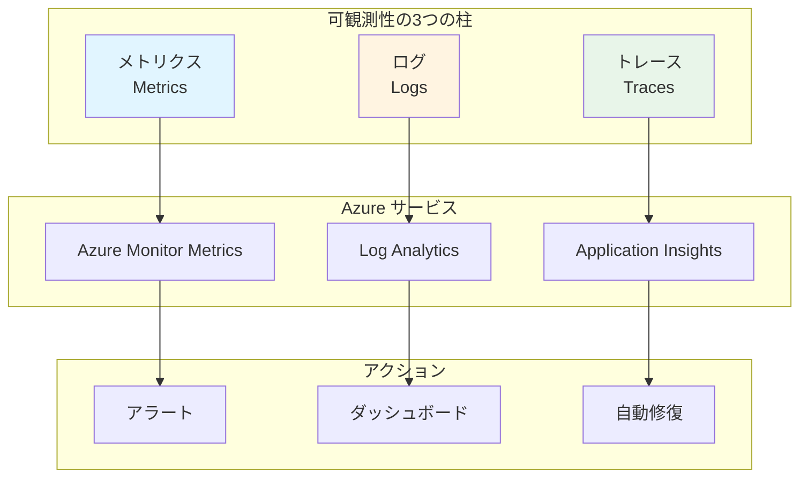
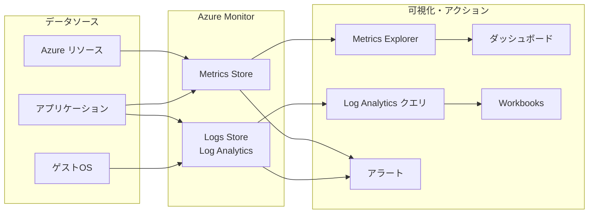

# 第 7 章：監視・ログ基盤構築（1 日目）

## 本章の目的

本章では、Management Subscription に監視・ログ基盤を構築します。Log Analytics Workspace、診断設定、基本的なアラートを実装し、システムの可観測性の基礎を確立します。

**所要時間**: 約 2-3 時間  
**難易度**: ⭐⭐  
**実施タイミング**: **1 日目**（Management Subscription 作成後）

---

## 7.0 事前準備：Management Subscription の選択

本章では、監視・ログリソースを **Management Subscription** にデプロイします。

作業を開始する前に、必ず適切なサブスクリプションを選択してください：

```bash
# 環境変数を読み込み
source .env

# Management Subscriptionに切り替え
az account set --subscription $SUB_MANAGEMENT_ID

# 現在のサブスクリプションを確認
az account show --query "{Name:name, SubscriptionId:id}" -o table
```

**注意**: 第 6 章で作成した Management Subscription を使用します。

---

## 7.1 可観測性（Observability）とは

### 7.1.1 可観測性の 3 つの柱



### 7.1.2 監視戦略

**監視すべき対象**:

- **インフラストラクチャ**: CPU、メモリ、ディスク、ネットワーク
- **アプリケーション**: レスポンスタイム、エラー率、スループット
- **セキュリティ**: 異常なアクセス、失敗した認証
- **コスト**: リソース使用量、予算超過

---

## 7.2 Azure Monitor の理解

### 7.2.1 Azure Monitor とは

**Azure Monitor**は、すべての Azure リソースの監視を統合するサービスです。

**機能**:

- メトリクスの収集と可視化
- ログの収集と分析（Log Analytics）
- アラートの設定
- 自動スケーリング
- ダッシュボード

### 7.2.2 データフロー



---

## 7.3 Log Analytics Workspace と DCR の構築

### 7.3.1 Resource Group の作成

監視リソース用の Resource Group を作成します：

```bash
# Management Subscriptionに切り替え（念のため確認）
az account set --subscription $SUB_MANAGEMENT_ID

# Resource Group作成
az group create \
  --name rg-platform-management-prod-jpe-001 \
  --location japaneast \
  --tags \
    Environment=Production \
    ManagedBy=Bicep \
    Component=Management
```

### 7.3.2 Log Analytics Workspace の作成

すべてのログとメトリクスを集約する中央ログストアとして、Log Analytics Workspace を作成します。

ディレクトリを作成：

```bash
mkdir -p infrastructure/bicep/modules/monitoring
```

ファイル `infrastructure/bicep/modules/monitoring/log-analytics.bicep` を作成：

```bicep
@description('Log Analytics Workspaceの名前')
param workspaceName string

@description('デプロイ先のリージョン')
param location string

@description('データ保持期間（日数）')
@minValue(30)
@maxValue(730)
param retentionInDays int = 90

@description('タグ')
param tags object = {}

// Log Analytics Workspace
resource logAnalyticsWorkspace 'Microsoft.OperationalInsights/workspaces@2022-10-01' = {
  name: workspaceName
  location: location
  tags: tags
  properties: {
    sku: {
      name: 'PerGB2018'
    }
    retentionInDays: retentionInDays
    features: {
      enableLogAccessUsingOnlyResourcePermissions: true
    }
    publicNetworkAccessForIngestion: 'Enabled'
    publicNetworkAccessForQuery: 'Enabled'
  }
}

// 出力
output workspaceId string = logAnalyticsWorkspace.id
output workspaceName string = logAnalyticsWorkspace.name
output customerId string = logAnalyticsWorkspace.properties.customerId
```

デプロイ：

```bash
# 事前確認
az deployment group what-if \
  --name "log-analytics-deployment-$(date +%Y%m%d-%H%M%S)" \
  --resource-group rg-platform-management-prod-jpe-001 \
  --template-file infrastructure/bicep/modules/monitoring/log-analytics.bicep \
  --parameters \
    workspaceName=log-platform-prod-jpe-001 \
    location=japaneast \
    retentionInDays=90

# 確認後、デプロイ実行
az deployment group create \
  --name "log-analytics-deployment-$(date +%Y%m%d-%H%M%S)" \
  --resource-group rg-platform-management-prod-jpe-001 \
  --template-file infrastructure/bicep/modules/monitoring/log-analytics.bicep \
  --parameters \
    workspaceName=log-platform-prod-jpe-001 \
    location=japaneast \
    retentionInDays=90

# Workspace IDを取得して環境変数に保存
WORKSPACE_ID=$(az monitor log-analytics workspace show \
  --resource-group rg-platform-management-prod-jpe-001 \
  --workspace-name log-platform-prod-jpe-001 \
  --query id -o tsv)

echo "WORKSPACE_ID=$WORKSPACE_ID" >> .env
echo "Log Analytics Workspace ID: $WORKSPACE_ID"
```

### 7.3.3 Data Collection Rule (DCR) for VM Insights

VM Insights 用の DCR を作成します。これにより、VM のパフォーマンスメトリクスとプロセス情報を収集できます。

ファイル `infrastructure/bicep/modules/monitoring/dcr-vm-insights.bicep` を作成：

```bicep
@description('DCRの名前')
param dcrName string

@description('デプロイ先のリージョン')
param location string

@description('Log Analytics Workspace ID')
param workspaceId string

@description('タグ')
param tags object = {}

// Data Collection Rule for VM Insights
resource dcrVMInsights 'Microsoft.Insights/dataCollectionRules@2022-06-01' = {
  name: dcrName
  location: location
  tags: tags
  kind: 'Linux'
  properties: {
    description: 'Data Collection Rule for VM Insights (Performance and Processes)'
    dataSources: {
      performanceCounters: [
        {
          name: 'VMInsightsPerfCounters'
          streams: [
            'Microsoft-InsightsMetrics'
          ]
          samplingFrequencyInSeconds: 60
          counterSpecifiers: [
            '\\VmInsights\\DetailedMetrics'
          ]
        }
      ]
      extensions: [
        {
          name: 'DependencyAgentDataSource'
          streams: [
            'Microsoft-ServiceMap'
          ]
          extensionName: 'DependencyAgent'
          extensionSettings: {}
        }
      ]
    }
    destinations: {
      logAnalytics: [
        {
          name: 'VMInsightsPerf-Logs-Dest'
          workspaceResourceId: workspaceId
        }
      ]
    }
    dataFlows: [
      {
        streams: [
          'Microsoft-InsightsMetrics'
        ]
        destinations: [
          'VMInsightsPerf-Logs-Dest'
        ]
      }
      {
        streams: [
          'Microsoft-ServiceMap'
        ]
        destinations: [
          'VMInsightsPerf-Logs-Dest'
        ]
      }
    ]
  }
}

output dcrId string = dcrVMInsights.id
output dcrName string = dcrVMInsights.name
```

デプロイ：

```bash
# 事前確認
az deployment group what-if \
  --name "dcr-vm-insights-$(date +%Y%m%d-%H%M%S)" \
  --resource-group rg-platform-management-prod-jpe-001 \
  --template-file infrastructure/bicep/modules/monitoring/dcr-vm-insights.bicep \
  --parameters \
    dcrName=dcr-vm-insights-prod-jpe-001 \
    location=japaneast \
    workspaceId="$WORKSPACE_ID"

# 確認後、デプロイ実行
az deployment group create \
  --name "dcr-vm-insights-$(date +%Y%m%d-%H%M%S)" \
  --resource-group rg-platform-management-prod-jpe-001 \
  --template-file infrastructure/bicep/modules/monitoring/dcr-vm-insights.bicep \
  --parameters \
    dcrName=dcr-vm-insights-prod-jpe-001 \
    location=japaneast \
    workspaceId="$WORKSPACE_ID"

# DCR IDを取得して保存
DCR_VM_INSIGHTS_ID=$(az monitor data-collection rule show \
  --name dcr-vm-insights-prod-jpe-001 \
  --resource-group rg-platform-management-prod-jpe-001 \
  --query id -o tsv)

echo "DCR_VM_INSIGHTS_ID=$DCR_VM_INSIGHTS_ID" >> .env
echo "VM Insights DCR ID: $DCR_VM_INSIGHTS_ID"
```

### 7.3.4 Data Collection Rule (DCR) for Windows Event Logs and Syslog

Windows Event ログと Linux Syslog を収集する DCR を作成します。

ファイル `infrastructure/bicep/modules/monitoring/dcr-os-logs.bicep` を作成：

```bicep
@description('DCRの名前')
param dcrName string

@description('デプロイ先のリージョン')
param location string

@description('Log Analytics Workspace ID')
param workspaceId string

@description('タグ')
param tags object = {}

// Data Collection Rule for OS Logs (Windows Events + Syslog)
resource dcrOSLogs 'Microsoft.Insights/dataCollectionRules@2022-06-01' = {
  name: dcrName
  location: location
  tags: tags
  properties: {
    description: 'Data Collection Rule for Windows Event Logs and Linux Syslog'
    dataSources: {
      windowsEventLogs: [
        {
          name: 'WindowsEventLogsDataSource'
          streams: [
            'Microsoft-Event'
          ]
          xPathQueries: [
            'System!*[System[(Level=1 or Level=2 or Level=3 or Level=4 or Level=0)]]'
            'Application!*[System[(Level=1 or Level=2 or Level=3 or Level=4 or Level=0)]]'
            'Security!*'
          ]
        }
      ]
      syslog: [
        {
          name: 'SyslogDataSource'
          streams: [
            'Microsoft-Syslog'
          ]
          facilityNames: [
            'auth'
            'authpriv'
            'cron'
            'daemon'
            'kern'
            'syslog'
            'user'
          ]
          logLevels: [
            'Alert'
            'Critical'
            'Debug'
            'Emergency'
            'Error'
            'Info'
            'Notice'
            'Warning'
          ]
        }
      ]
    }
    destinations: {
      logAnalytics: [
        {
          name: 'OSLogs-Dest'
          workspaceResourceId: workspaceId
        }
      ]
    }
    dataFlows: [
      {
        streams: [
          'Microsoft-Event'
        ]
        destinations: [
          'OSLogs-Dest'
        ]
      }
      {
        streams: [
          'Microsoft-Syslog'
        ]
        destinations: [
          'OSLogs-Dest'
        ]
      }
    ]
  }
}

output dcrId string = dcrOSLogs.id
output dcrName string = dcrOSLogs.name
```

デプロイ：

```bash
# 事前確認
az deployment group what-if \
  --name "dcr-os-logs-$(date +%Y%m%d-%H%M%S)" \
  --resource-group rg-platform-management-prod-jpe-001 \
  --template-file infrastructure/bicep/modules/monitoring/dcr-os-logs.bicep \
  --parameters \
    dcrName=dcr-os-logs-prod-jpe-001 \
    location=japaneast \
    workspaceId="$WORKSPACE_ID"

# 確認後、デプロイ実行
az deployment group create \
  --name "dcr-os-logs-$(date +%Y%m%d-%H%M%S)" \
  --resource-group rg-platform-management-prod-jpe-001 \
  --template-file infrastructure/bicep/modules/monitoring/dcr-os-logs.bicep \
  --parameters \
    dcrName=dcr-os-logs-prod-jpe-001 \
    location=japaneast \
    workspaceId="$WORKSPACE_ID"

# DCR IDを取得して保存
DCR_OS_LOGS_ID=$(az monitor data-collection rule show \
  --name dcr-os-logs-prod-jpe-001 \
  --resource-group rg-platform-management-prod-jpe-001 \
  --query id -o tsv)

echo "DCR_OS_LOGS_ID=$DCR_OS_LOGS_ID" >> .env
echo "OS Logs DCR ID: $DCR_OS_LOGS_ID"
```

### 7.3.5 DCR の役割と今後の活用

作成した DCR は、後の章で **Azure Policy** と組み合わせることで、環境全体の VM に自動的に適用されます。

**組み込みポリシー例：**

- `Configure Windows machines to run Azure Monitor Agent and associate them to a Data Collection Rule`
- `Configure Linux machines to run Azure Monitor Agent and associate them to a Data Collection Rule`

これにより、新しく作成される VM にも自動的に Azure Monitor Agent がインストールされ、ログ収集が開始されます。

---

## 7.4 サブスクリプションのアクティビティログ収集

作成したサブスクリプションのアクティビティログ（管理操作の履歴）を Log Analytics Workspace に送信します。

### 7.4.1 診断設定 Bicep モジュール

ファイル `infrastructure/bicep/modules/monitoring/subscription-diagnostic-settings.bicep` を作成します：

**subscription-diagnostic-settings.bicep の解説：**

サブスクリプションレベルの診断設定を作成します。`targetScope: 'subscription'` を指定することで、サブスクリプション全体のアクティビティログを Log Analytics に送信できます。

```bicep
targetScope = 'subscription'

@description('Log Analytics Workspace ID')
param workspaceId string

@description('診断設定の名前')
param diagnosticSettingName string = 'send-to-log-analytics'

// サブスクリプションの診断設定
resource diagnosticSetting 'Microsoft.Insights/diagnosticSettings@2021-05-01-preview' = {
  name: diagnosticSettingName
  properties: {
    workspaceId: workspaceId
    logs: [
      { category: 'Administrative', enabled: true }
      { category: 'Security', enabled: true }
      { category: 'ServiceHealth', enabled: true }
      { category: 'Alert', enabled: true }
      { category: 'Recommendation', enabled: true }
      { category: 'Policy', enabled: true }
      { category: 'Autoscale', enabled: true }
      { category: 'ResourceHealth', enabled: true }
    ]
  }
}
```

### 7.4.2 Management Subscription の診断設定を適用

```bash
# Management Subscription で実行
az account set --subscription $SUB_MANAGEMENT_ID

# 事前確認
az deployment sub what-if \
  --name "sub-diagnostics-$(date +%Y%m%d-%H%M%S)" \
  --location japaneast \
  --template-file infrastructure/bicep/modules/monitoring/subscription-diagnostic-settings.bicep \
  --parameters \
    workspaceId=$LOG_WORKSPACE_ID

# 確認後、デプロイ実行
az deployment sub create \
  --name "sub-diagnostics-$(date +%Y%m%d-%H%M%S)" \
  --location japaneast \
  --template-file infrastructure/bicep/modules/monitoring/subscription-diagnostic-settings.bicep \
  --parameters \
    workspaceId=$LOG_WORKSPACE_ID
```

---

## 7.5 Azure Policy 用ユーザー割り当てマネージド ID

第 10 章で Azure Policy の DeployIfNotExists/Modify 効果を使う際に必要となるマネージド ID を事前に作成します。

### 7.5.1 マネージド ID の配置場所

CAF のベストプラクティスに従い、ポリシー実行用のマネージド ID は **Management Subscription** に配置します。これにより、複数のサブスクリプションにまたがるポリシー割り当てを一元管理できます。

### 7.5.2 マネージド ID Bicep モジュール

ファイル `infrastructure/bicep/modules/identity/managed-identity.bicep` を作成します：

```bicep
@description('マネージドIDの名前')
param identityName string

@description('デプロイ先のリージョン')
param location string

@description('タグ')
param tags object = {}

// ユーザー割り当てマネージドID
resource managedIdentity 'Microsoft.ManagedIdentity/userAssignedIdentities@2023-01-31' = {
  name: identityName
  location: location
  tags: tags
}

output identityId string = managedIdentity.id
output principalId string = managedIdentity.properties.principalId
output clientId string = managedIdentity.properties.clientId
```

### 7.5.3 マネージド ID の作成

```bash
# Management Subscription で実行
az account set --subscription $SUB_MANAGEMENT_ID

# 事前確認
az deployment group what-if \
  --name "policy-identity-$(date +%Y%m%d-%H%M%S)" \
  --resource-group rg-platform-management-prod-jpe-001 \
  --template-file infrastructure/bicep/modules/identity/managed-identity.bicep \
  --parameters \
    identityName=id-policy-assignment-prod-jpe-001 \
    location=japaneast

# 確認後、デプロイ実行
DEPLOYMENT_OUTPUT=$(az deployment group create \
  --name "policy-identity-$(date +%Y%m%d-%H%M%S)" \
  --resource-group rg-platform-management-prod-jpe-001 \
  --template-file infrastructure/bicep/modules/identity/managed-identity.bicep \
  --parameters \
    identityName=id-policy-assignment-prod-jpe-001 \
    location=japaneast \
  --query 'properties.outputs' -o json)

# 環境変数に保存
POLICY_IDENTITY_ID=$(echo $DEPLOYMENT_OUTPUT | jq -r '.identityId.value')
POLICY_IDENTITY_PRINCIPAL_ID=$(echo $DEPLOYMENT_OUTPUT | jq -r '.principalId.value')

echo "POLICY_IDENTITY_ID=$POLICY_IDENTITY_ID" >> .env
echo "POLICY_IDENTITY_PRINCIPAL_ID=$POLICY_IDENTITY_PRINCIPAL_ID" >> .env

echo "Policy用マネージドID: $POLICY_IDENTITY_ID"
echo "Principal ID: $POLICY_IDENTITY_PRINCIPAL_ID"
```

### 7.5.4 マネージド ID への権限付与

Azure Policy の DeployIfNotExists/Modify 効果（特に Defender for Cloud の適用）には **Owner** 権限が必要です。Management Subscription に対して Owner ロールを付与します。

ファイル `infrastructure/bicep/modules/identity/role-assignment-owner.bicep` を作成します：

```bicep
targetScope = 'subscription'

@description('マネージドIDのPrincipal ID')
param principalId string

@description('ロール定義ID（Owner）')
param roleDefinitionId string = '8e3af657-a8ff-443c-a75c-2fe8c4bcb635' // Owner

// Owner権限の付与
resource roleAssignment 'Microsoft.Authorization/roleAssignments@2022-04-01' = {
  name: guid(subscription().id, principalId, roleDefinitionId)
  properties: {
    roleDefinitionId: subscriptionResourceId('Microsoft.Authorization/roleDefinitions', roleDefinitionId)
    principalId: principalId
    principalType: 'ServicePrincipal'
  }
}

output roleAssignmentId string = roleAssignment.id
```

```bash
# Management Subscription に Owner 権限を付与
# 事前確認
az deployment sub what-if \
  --name "policy-identity-owner-$(date +%Y%m%d-%H%M%S)" \
  --location japaneast \
  --template-file infrastructure/bicep/modules/identity/role-assignment-owner.bicep \
  --parameters \
    principalId=$POLICY_IDENTITY_PRINCIPAL_ID

# 確認後、デプロイ実行
az deployment sub create \
  --name "policy-identity-owner-$(date +%Y%m%d-%H%M%S)" \
  --location japaneast \
  --template-file infrastructure/bicep/modules/identity/role-assignment-owner.bicep \
  --parameters \
    principalId=$POLICY_IDENTITY_PRINCIPAL_ID

echo "マネージドIDにOwner権限を付与しました"
```

---

## 7.6 既存リソースの診断設定

すでに作成した Log Analytics Workspace と DCR に対して診断設定を適用し、これらのリソース自体の操作ログも収集します。

### 7.6.1 Log Analytics Workspace の診断設定

ファイル `infrastructure/bicep/modules/monitoring/log-analytics-diagnostics.bicep` を作成します：

**log-analytics-diagnostics.bicep の解説：**

Log Analytics Workspace 自体の操作ログ（Audit）とメトリクスを収集します。ワークスペースへの変更履歴を追跡できます。

```bicep
@description('Log Analytics Workspace名')
param workspaceName string

@description('診断設定の送信先 Workspace ID')
param destinationWorkspaceId string

@description('診断設定の名前')
param diagnosticSettingName string = 'send-to-log-analytics'

// 既存のLog Analytics Workspace
resource workspace 'Microsoft.OperationalInsights/workspaces@2022-10-01' existing = {
  name: workspaceName
}

// 診断設定
resource diagnosticSetting 'Microsoft.Insights/diagnosticSettings@2021-05-01-preview' = {
  name: diagnosticSettingName
  scope: workspace
  properties: {
    workspaceId: destinationWorkspaceId
    logs: [
      { category: 'Audit', enabled: true, retentionPolicy: { enabled: false, days: 0 } }
    ]
    metrics: [
      { category: 'AllMetrics', enabled: true, retentionPolicy: { enabled: false, days: 0 } }
    ]
  }
}

output diagnosticSettingId string = diagnosticSetting.id
```

```bash
# Log Analytics Workspace の診断設定を適用
# 事前確認
az deployment group what-if \
  --name "log-diagnostics-$(date +%Y%m%d-%H%M%S)" \
  --resource-group rg-platform-management-prod-jpe-001 \
  --template-file infrastructure/bicep/modules/monitoring/log-analytics-diagnostics.bicep \
  --parameters \
    workspaceName=log-platform-prod-jpe-001 \
    destinationWorkspaceId=$LOG_WORKSPACE_ID

# 確認後、デプロイ実行
az deployment group create \
  --name "log-diagnostics-$(date +%Y%m%d-%H%M%S)" \
  --resource-group rg-platform-management-prod-jpe-001 \
  --template-file infrastructure/bicep/modules/monitoring/log-analytics-diagnostics.bicep \
  --parameters \
    workspaceName=log-platform-prod-jpe-001 \
    destinationWorkspaceId=$LOG_WORKSPACE_ID
```

### 7.6.2 Data Collection Rule の診断設定

ファイル `infrastructure/bicep/modules/monitoring/dcr-diagnostics.bicep` を作成します：

**dcr-diagnostics.bicep の解説：**

DCR 自体の操作ログを収集します。DCR の変更や削除を追跡できます。

```bicep
@description('DCR名')
param dcrName string

@description('診断設定の送信先 Workspace ID')
param destinationWorkspaceId string

@description('診断設定の名前')
param diagnosticSettingName string = 'send-to-log-analytics'

// 既存のDCR
resource dcr 'Microsoft.Insights/dataCollectionRules@2022-06-01' existing = {
  name: dcrName
}

// 診断設定
resource diagnosticSetting 'Microsoft.Insights/diagnosticSettings@2021-05-01-preview' = {
  name: diagnosticSettingName
  scope: dcr
  properties: {
    workspaceId: destinationWorkspaceId
    logs: [
      { category: 'allLogs', enabled: true, retentionPolicy: { enabled: false, days: 0 } }
    ]
    metrics: [
      { category: 'AllMetrics', enabled: true, retentionPolicy: { enabled: false, days: 0 } }
    ]
  }
}

output diagnosticSettingId string = diagnosticSetting.id
```

```bash
# VM Insights DCR の診断設定
# 事前確認
az deployment group what-if \
  --name "dcr-vm-insights-diagnostics-$(date +%Y%m%d-%H%M%S)" \
  --resource-group rg-platform-management-prod-jpe-001 \
  --template-file infrastructure/bicep/modules/monitoring/dcr-diagnostics.bicep \
  --parameters \
    dcrName=dcr-vm-insights-prod-jpe-001 \
    destinationWorkspaceId=$LOG_WORKSPACE_ID

# 確認後、デプロイ実行
az deployment group create \
  --name "dcr-vm-insights-diagnostics-$(date +%Y%m%d-%H%M%S)" \
  --resource-group rg-platform-management-prod-jpe-001 \
  --template-file infrastructure/bicep/modules/monitoring/dcr-diagnostics.bicep \
  --parameters \
    dcrName=dcr-vm-insights-prod-jpe-001 \
    destinationWorkspaceId=$LOG_WORKSPACE_ID

# OS Logs DCR の診断設定
# 事前確認
az deployment group what-if \
  --name "dcr-os-logs-diagnostics-$(date +%Y%m%d-%H%M%S)" \
  --resource-group rg-platform-management-prod-jpe-001 \
  --template-file infrastructure/bicep/modules/monitoring/dcr-diagnostics.bicep \
  --parameters \
    dcrName=dcr-os-logs-prod-jpe-001 \
    destinationWorkspaceId=$LOG_WORKSPACE_ID

# 確認後、デプロイ実行
az deployment group create \
  --name "dcr-os-logs-diagnostics-$(date +%Y%m%d-%H%M%S)" \
  --resource-group rg-platform-management-prod-jpe-001 \
  --template-file infrastructure/bicep/modules/monitoring/dcr-diagnostics.bicep \
  --parameters \
    dcrName=dcr-os-logs-prod-jpe-001 \
    destinationWorkspaceId=$LOG_WORKSPACE_ID
```

**今後のリソース作成ルール：**

今後、新しいリソースを作成する際は、診断設定が利用可能なリソース（Azure Firewall、Key Vault、Bastion、Storage Account 等）については、リソース作成と同じ Bicep ファイル内で診断設定も一緒に定義します。

---

## 7.7 Azure Automation の構築

### 7.7.1 Azure Automation とは

**Azure Automation**は、定期的なタスクを自動化するサービスです。

**ユースケース**:

- VM の定期的な起動・停止
- 古いスナップショットの削除
- コンプライアンスレポートの生成
- パッチ管理

### 7.7.2 Automation Account の作成

ファイル `infrastructure/bicep/modules/automation/automation-account.bicep` を作成し、以下の内容を記述します：

**automation-account.bicep の解説：**

Azure Automation Account を作成し、System-assigned Managed Identity を有効化します。定期的なタスク（VM の起動・停止等）を自動化するための基盤として機能します。

```bicep
@description('Automation Accountの名前')
param automationAccountName string

@description('デプロイ先のリージョン')
param location string

@description('タグ')
param tags object = {}

// Automation Account
resource automationAccount 'Microsoft.Automation/automationAccounts@2023-11-01' = {
  name: automationAccountName
  location: location
  tags: tags
  properties: {
    sku: {
      name: 'Basic'
    }
    encryption: {
      keySource: 'Microsoft.Automation'
    }
    publicNetworkAccess: true
  }
}

// マネージドIDの有効化
resource managedIdentity 'Microsoft.Automation/automationAccounts@2023-11-01' = {
  name: automationAccountName
  location: location
  tags: tags
  identity: {
    type: 'SystemAssigned'
  }
  properties: automationAccount.properties
}

// 出力
output automationAccountId string = automationAccount.id
output automationAccountName string = automationAccount.name
output principalId string = managedIdentity.identity.principalId
```

```bash
# デプロイ
# 事前確認
az deployment group what-if \
  --name "automation-account-deployment-$(date +%Y%m%d-%H%M%S)" \
  --resource-group rg-platform-management-prod-jpe-001 \
  --template-file infrastructure/bicep/modules/automation/automation-account.bicep \
  --parameters \
    automationAccountName=aa-platform-prod-jpe-001 \
    location=japaneast

# 確認後、デプロイ実行
az deployment group create \
  --name "automation-account-deployment-$(date +%Y%m%d-%H%M%S)" \
  --resource-group rg-platform-management-prod-jpe-001 \
  --template-file infrastructure/bicep/modules/automation/automation-account.bicep \
  --parameters \
    automationAccountName=aa-platform-prod-jpe-001 \
    location=japaneast
```

### 7.7.3 Runbook の例（VM の自動起動・停止）

```bash
cat << 'EOF' > infrastructure/automation/runbooks/Start-AzureVMs.ps1
<#
.SYNOPSIS
    指定されたタグを持つVMを起動します

.DESCRIPTION
    AutoStart=trueタグを持つすべてのVMを起動します

.NOTES
    実行にはマネージドIDが必要です
#>

# Azure接続
Connect-AzAccount -Identity

# AutoStart=trueのVMを取得
$vms = Get-AzVM -Status | Where-Object {$_.Tags["AutoStart"] -eq "true" -and $_.PowerState -eq "VM deallocated"}

foreach ($vm in $vms) {
    Write-Output "Starting VM: $($vm.Name)"
    Start-AzVM -ResourceGroupName $vm.ResourceGroupName -Name $vm.Name -NoWait
}

Write-Output "Complete: Started $($vms.Count) VMs"
EOF

# Runbookをインポート
az automation runbook create \
  --resource-group rg-platform-management-prod-jpe-001 \
  --automation-account-name aa-platform-prod-jpe-001 \
  --name "Start-AzureVMs" \
  --type PowerShell \
  --location japaneast

az automation runbook replace-content \
  --resource-group rg-platform-management-prod-jpe-001 \
  --automation-account-name aa-platform-prod-jpe-001 \
  --name "Start-AzureVMs" \
  --content @infrastructure/automation/runbooks/Start-AzureVMs.ps1

az automation runbook publish \
  --resource-group rg-platform-management-prod-jpe-001 \
  --automation-account-name aa-platform-prod-jpe-001 \
  --name "Start-AzureVMs"
```

### 7.7.4 スケジュールの作成

```bash
# 平日の朝8時にVMを起動するスケジュール
az automation schedule create \
  --resource-group rg-platform-management-prod-jpe-001 \
  --automation-account-name aa-platform-prod-jpe-001 \
  --name "Weekday-Morning-Start" \
  --frequency "Week" \
  --interval 1 \
  --start-time "2026-01-08T08:00:00+09:00" \
  --time-zone "Tokyo Standard Time" \
  --week-days Monday Tuesday Wednesday Thursday Friday

# Runbookとスケジュールをリンク
az automation job-schedule create \
  --resource-group rg-platform-management-prod-jpe-001 \
  --automation-account-name aa-platform-prod-jpe-001 \
  --runbook-name "Start-AzureVMs" \
  --schedule-name "Weekday-Morning-Start"
```

---

## 7.8 Azure Portal での確認

### 7.8.1 Azure Monitor の確認

1. Azure ポータルで「Monitor」を検索
2. 「Metrics」でリソースのメトリクスをグラフ化
3. 「Logs」で Log Analytics クエリを実行
4. 「Alerts」でアラートルールを確認

### 7.8.2 アラートのテスト

```bash
# Key Vaultに意図的に失敗したアクセスを実行（アラート発火テスト）
az keyvault secret show \
  --vault-name kv-hub-prod-jpe-001 \
  --name NonExistentSecret 2>/dev/null || echo "Expected error"

# 5-10分後にメールが届くことを確認
```

---

## 7.9 コスト管理

### 7.9.1 リソース別のコスト

| リソース             | 概算月額コスト（東日本）                |
| -------------------- | --------------------------------------- |
| Log Analytics        | データ量により変動（約 ¥300/GB）        |
| Application Insights | データ量により変動（約 ¥300/GB）        |
| Automation Account   | 実行時間により変動（500 分/月まで無料） |
| アラート             | アラート数により変動                    |

### 7.9.2 コスト削減のヒント

- Log Analytics の保持期間を適切に設定
- 不要なログの収集を停止
- Application Insights のサンプリング率を調整
- Automation Runbook の実行頻度を最適化

---

## 7.10 Git へのコミット

```bash
git add .
git commit -m "Day 1: Monitoring and log foundation

- Created Log Analytics Workspace in Management Subscription
- Configured comprehensive Log Analytics queries (KQL)
- Created action groups for alert notifications
- Created metric-based and log-based alerts
- Deployed Azure Automation Account with sample runbooks
- Configured diagnostic settings for existing resources (Log Analytics, DCR)
- Documented monitoring best practices"

git push origin main
```

---

## 7.11 章のまとめ

本章で構築したもの：

1. ✅ Log Analytics 基盤

   - Management Subscription に Log Analytics Workspace を構築
   - **VM Insights 用 Data Collection Rule (DCR)**
   - **Windows Event Logs と Syslog 収集用 DCR**
   - 後続の章でポリシーによる自動適用の準備完了

2. ✅ Log Analytics クエリ

   - KQL クエリの基礎
   - よく使うクエリ集の作成

3. ✅ アラートルール

   - アクショングループ（メール通知）
   - メトリクスベースアラート（Firewall CPU）
   - ログベースアラート（Key Vault 失敗）

4. ✅ Azure Automation

   - Automation Account
   - VM 自動起動 Runbook
   - スケジュール設定

### 重要なポイント

- **可観測性の確保**: メトリクス、ログ、トレースの 3 つの柱
- **DCR による統一的なログ収集**: VM Insights と OS ログを自動収集
- **ポリシーとの連携準備**: 後の章で組み込みポリシーを使って VM 全体に自動適用
- **プロアクティブな監視**: 問題が起きる前にアラート
- **自動化**: 定期的なタスクは Automation
- **コストの最適化**: ログの保持期間とサンプリング率

### 1 日目の作業完了

Management Subscription の作成と監視・ログ基盤の構築が完了しました。これで、後続のリソースを監視する準備が整いました。

**24 時間後に 2 日目の作業（Identity Subscription 作成とガバナンス）に進んでください。**

---

## 次のステップ

1 日目の作業が完了しました。次は 2 日目の作業として、Identity Subscription の作成に進みます。

👉 [第 8 章：Identity Subscription 作成（2 日目）](chapter08-identity-subscription.md)

---

**最終更新**: 2026 年 1 月 7 日
