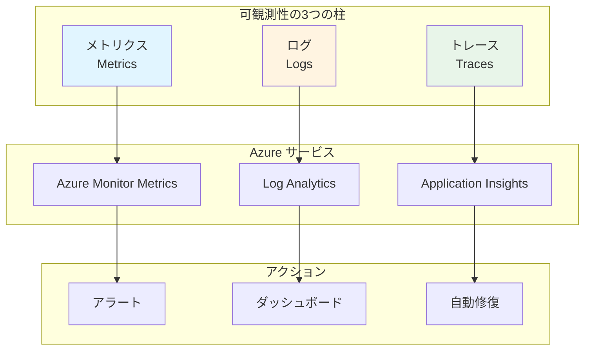
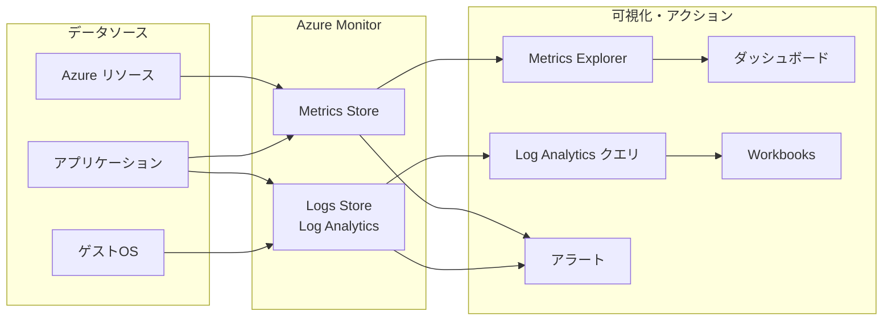

# 第 7 章：監視・ログ基盤構築（1 日目）

## 本章の目的

本章では、Management Subscription に監視・ログ基盤を構築します。Log Analytics Workspace、診断設定、基本的なアラートを実装し、システムの可観測性の基礎を確立します。

**所要時間**: 約 2-3 時間  
**難易度**: ⭐⭐  
**実施タイミング**: **1 日目**（Management Subscription 作成後）

---

## 7.0 事前準備：Management Subscription の選択

本章では、監視・ログリソースを **Management Subscription** にデプロイします。

作業を開始する前に、必ず適切なサブスクリプションを選択してください：

```bash
# 環境変数を読み込み
source .env

# Management Subscriptionに切り替え
az account set --subscription $SUB_MANAGEMENT_ID

# 現在のサブスクリプションを確認
az account show --query "{Name:name, SubscriptionId:id}" -o table
```

**注意**: 第 6 章で作成した Management Subscription を使用します。

---

## 7.1 可観測性（Observability）とは

### 7.1.1 可観測性の 3 つの柱



### 7.1.2 監視戦略

**監視すべき対象**:

- **インフラストラクチャ**: CPU、メモリ、ディスク、ネットワーク
- **アプリケーション**: レスポンスタイム、エラー率、スループット
- **セキュリティ**: 異常なアクセス、失敗した認証
- **コスト**: リソース使用量、予算超過

---

## 7.2 Azure Monitor の理解

### 7.2.1 Azure Monitor とは

**Azure Monitor**は、すべての Azure リソースの監視を統合するサービスです。

**機能**:

- メトリクスの収集と可視化
- ログの収集と分析（Log Analytics）
- アラートの設定
- 自動スケーリング
- ダッシュボード

### 7.2.2 データフロー



---

## 7.3 Log Analytics Workspace と DCR の構築

### 7.3.1 Resource Group の作成

監視リソース用の Resource Group を作成します：

```bash
# Management Subscriptionに切り替え（念のため確認）
az account set --subscription $SUB_MANAGEMENT_ID

# Resource Group作成
az group create \
  --name rg-platform-management-prod-jpe-001 \
  --location japaneast \
  --tags \
    Environment=Production \
    ManagedBy=Bicep \
    Component=Management
```

### 7.3.2 Log Analytics Workspace の作成

すべてのログとメトリクスを集約する中央ログストアとして、Log Analytics Workspace を作成します。

ディレクトリを作成：

```bash
mkdir -p infrastructure/bicep/modules/monitoring
```

ファイル `infrastructure/bicep/modules/monitoring/log-analytics.bicep` を作成：

```bicep
@description('Log Analytics Workspaceの名前')
param workspaceName string

@description('デプロイ先のリージョン')
param location string

@description('データ保持期間（日数）')
@minValue(30)
@maxValue(730)
param retentionInDays int = 90

@description('タグ')
param tags object = {}

// Log Analytics Workspace
resource logAnalyticsWorkspace 'Microsoft.OperationalInsights/workspaces@2022-10-01' = {
  name: workspaceName
  location: location
  tags: tags
  properties: {
    sku: {
      name: 'PerGB2018'
    }
    retentionInDays: retentionInDays
    features: {
      enableLogAccessUsingOnlyResourcePermissions: true
    }
    publicNetworkAccessForIngestion: 'Enabled'
    publicNetworkAccessForQuery: 'Enabled'
  }
}

// 出力
output workspaceId string = logAnalyticsWorkspace.id
output workspaceName string = logAnalyticsWorkspace.name
output customerId string = logAnalyticsWorkspace.properties.customerId
```

デプロイ：

```bash
az deployment group create \
  --name "log-analytics-deployment-$(date +%Y%m%d-%H%M%S)" \
  --resource-group rg-platform-management-prod-jpe-001 \
  --template-file infrastructure/bicep/modules/monitoring/log-analytics.bicep \
  --parameters \
    workspaceName=log-platform-prod-jpe-001 \
    location=japaneast \
    retentionInDays=90

# Workspace IDを取得して環境変数に保存
WORKSPACE_ID=$(az monitor log-analytics workspace show \
  --resource-group rg-platform-management-prod-jpe-001 \
  --workspace-name log-platform-prod-jpe-001 \
  --query id -o tsv)

echo "WORKSPACE_ID=$WORKSPACE_ID" >> .env
echo "Log Analytics Workspace ID: $WORKSPACE_ID"
```

### 7.3.3 Data Collection Rule (DCR) for VM Insights

VM Insights 用の DCR を作成します。これにより、VM のパフォーマンスメトリクスとプロセス情報を収集できます。

ファイル `infrastructure/bicep/modules/monitoring/dcr-vm-insights.bicep` を作成：

```bicep
@description('DCRの名前')
param dcrName string

@description('デプロイ先のリージョン')
param location string

@description('Log Analytics Workspace ID')
param workspaceId string

@description('タグ')
param tags object = {}

// Data Collection Rule for VM Insights
resource dcrVMInsights 'Microsoft.Insights/dataCollectionRules@2022-06-01' = {
  name: dcrName
  location: location
  tags: tags
  kind: 'Linux'
  properties: {
    description: 'Data Collection Rule for VM Insights (Performance and Processes)'
    dataSources: {
      performanceCounters: [
        {
          name: 'VMInsightsPerfCounters'
          streams: [
            'Microsoft-InsightsMetrics'
          ]
          samplingFrequencyInSeconds: 60
          counterSpecifiers: [
            '\\VmInsights\\DetailedMetrics'
          ]
        }
      ]
      extensions: [
        {
          name: 'DependencyAgentDataSource'
          streams: [
            'Microsoft-ServiceMap'
          ]
          extensionName: 'DependencyAgent'
          extensionSettings: {}
        }
      ]
    }
    destinations: {
      logAnalytics: [
        {
          name: 'VMInsightsPerf-Logs-Dest'
          workspaceResourceId: workspaceId
        }
      ]
    }
    dataFlows: [
      {
        streams: [
          'Microsoft-InsightsMetrics'
        ]
        destinations: [
          'VMInsightsPerf-Logs-Dest'
        ]
      }
      {
        streams: [
          'Microsoft-ServiceMap'
        ]
        destinations: [
          'VMInsightsPerf-Logs-Dest'
        ]
      }
    ]
  }
}

output dcrId string = dcrVMInsights.id
output dcrName string = dcrVMInsights.name
```

デプロイ：

```bash
az deployment group create \
  --name "dcr-vm-insights-$(date +%Y%m%d-%H%M%S)" \
  --resource-group rg-platform-management-prod-jpe-001 \
  --template-file infrastructure/bicep/modules/monitoring/dcr-vm-insights.bicep \
  --parameters \
    dcrName=dcr-vm-insights-prod-jpe-001 \
    location=japaneast \
    workspaceId="$WORKSPACE_ID"

# DCR IDを取得して保存
DCR_VM_INSIGHTS_ID=$(az monitor data-collection rule show \
  --name dcr-vm-insights-prod-jpe-001 \
  --resource-group rg-platform-management-prod-jpe-001 \
  --query id -o tsv)

echo "DCR_VM_INSIGHTS_ID=$DCR_VM_INSIGHTS_ID" >> .env
echo "VM Insights DCR ID: $DCR_VM_INSIGHTS_ID"
```

### 7.3.4 Data Collection Rule (DCR) for Windows Event Logs and Syslog

Windows Event ログと Linux Syslog を収集する DCR を作成します。

ファイル `infrastructure/bicep/modules/monitoring/dcr-os-logs.bicep` を作成：

```bicep
@description('DCRの名前')
param dcrName string

@description('デプロイ先のリージョン')
param location string

@description('Log Analytics Workspace ID')
param workspaceId string

@description('タグ')
param tags object = {}

// Data Collection Rule for OS Logs (Windows Events + Syslog)
resource dcrOSLogs 'Microsoft.Insights/dataCollectionRules@2022-06-01' = {
  name: dcrName
  location: location
  tags: tags
  properties: {
    description: 'Data Collection Rule for Windows Event Logs and Linux Syslog'
    dataSources: {
      windowsEventLogs: [
        {
          name: 'WindowsEventLogsDataSource'
          streams: [
            'Microsoft-Event'
          ]
          xPathQueries: [
            'System!*[System[(Level=1 or Level=2 or Level=3 or Level=4 or Level=0)]]'
            'Application!*[System[(Level=1 or Level=2 or Level=3 or Level=4 or Level=0)]]'
            'Security!*'
          ]
        }
      ]
      syslog: [
        {
          name: 'SyslogDataSource'
          streams: [
            'Microsoft-Syslog'
          ]
          facilityNames: [
            'auth'
            'authpriv'
            'cron'
            'daemon'
            'kern'
            'syslog'
            'user'
          ]
          logLevels: [
            'Alert'
            'Critical'
            'Debug'
            'Emergency'
            'Error'
            'Info'
            'Notice'
            'Warning'
          ]
        }
      ]
    }
    destinations: {
      logAnalytics: [
        {
          name: 'OSLogs-Dest'
          workspaceResourceId: workspaceId
        }
      ]
    }
    dataFlows: [
      {
        streams: [
          'Microsoft-Event'
        ]
        destinations: [
          'OSLogs-Dest'
        ]
      }
      {
        streams: [
          'Microsoft-Syslog'
        ]
        destinations: [
          'OSLogs-Dest'
        ]
      }
    ]
  }
}

output dcrId string = dcrOSLogs.id
output dcrName string = dcrOSLogs.name
```

デプロイ：

```bash
az deployment group create \
  --name "dcr-os-logs-$(date +%Y%m%d-%H%M%S)" \
  --resource-group rg-platform-management-prod-jpe-001 \
  --template-file infrastructure/bicep/modules/monitoring/dcr-os-logs.bicep \
  --parameters \
    dcrName=dcr-os-logs-prod-jpe-001 \
    location=japaneast \
    workspaceId="$WORKSPACE_ID"

# DCR IDを取得して保存
DCR_OS_LOGS_ID=$(az monitor data-collection rule show \
  --name dcr-os-logs-prod-jpe-001 \
  --resource-group rg-platform-management-prod-jpe-001 \
  --query id -o tsv)

echo "DCR_OS_LOGS_ID=$DCR_OS_LOGS_ID" >> .env
echo "OS Logs DCR ID: $DCR_OS_LOGS_ID"
```

### 7.3.5 DCR の役割と今後の活用

作成した DCR は、後の章で **Azure Policy** と組み合わせることで、環境全体の VM に自動的に適用されます。

**組み込みポリシー例：**
- `Configure Windows machines to run Azure Monitor Agent and associate them to a Data Collection Rule`
- `Configure Linux machines to run Azure Monitor Agent and associate them to a Data Collection Rule`

これにより、新しく作成される VM にも自動的に Azure Monitor Agent がインストールされ、ログ収集が開始されます。

---

## 7.4 Log Analytics クエリの基礎

### 7.4.1 KQL の基本

**KQL（Kusto Query Language）**は、Log Analytics でデータをクエリする言語です。

**基本構文**:

```kql
// テーブルを指定
AzureDiagnostics

// 時間範囲をフィルタ
| where TimeGenerated > ago(1h)

// 特定の列のみ選択
| project TimeGenerated, ResourceType, OperationName

// 条件でフィルタ
| where OperationName == "SecretGet"

// 並び替え
| order by TimeGenerated desc

// 件数制限
| limit 100
```

### 7.4.2 よく使うクエリ例

```bash
# クエリ集ファイルを作成
mkdir -p docs/queries

cat << 'EOF' > docs/queries/log-analytics-queries.kql
// ----------------------------------------
// Azure Firewall - 拒否されたトラフィック
// ----------------------------------------
AzureDiagnostics
| where ResourceType == "AZUREFIREWALLS"
| where msg_s contains "Deny"
| project TimeGenerated, msg_s, Protocol = Protocol_s, SourceIP = SourceIP_s, DestinationIP = DestinationIP_s
| order by TimeGenerated desc

// ----------------------------------------
// Key Vault - シークレットアクセス
// ----------------------------------------
AzureDiagnostics
| where ResourceProvider == "MICROSOFT.KEYVAULT"
| where OperationName == "SecretGet"
| project TimeGenerated, CallerIPAddress, ResultType, Resource
| order by TimeGenerated desc

// ----------------------------------------
// Azure Bastion - 接続ログ
// ----------------------------------------
AzureDiagnostics
| where ResourceType == "BASTIONHOSTS"
| project TimeGenerated, Message, UserName = identity_claim_upn_s, TargetResourceId
| order by TimeGenerated desc

// ----------------------------------------
// VM - CPU使用率が80%超
// ----------------------------------------
Perf
| where ObjectName == "Processor"
| where CounterName == "% Processor Time"
| where CounterValue > 80
| summarize avg(CounterValue) by Computer, bin(TimeGenerated, 5m)
| order by TimeGenerated desc

// ----------------------------------------
// リソース別のログ件数（上位10件）
// ----------------------------------------
AzureDiagnostics
| where TimeGenerated > ago(24h)
| summarize Count = count() by ResourceType
| top 10 by Count desc

// ----------------------------------------
// エラーログの集計
// ----------------------------------------
AzureDiagnostics
| where Level == "Error"
| where TimeGenerated > ago(24h)
| summarize Count = count() by ResourceType, OperationName
| order by Count desc

// ----------------------------------------
// 認証失敗の監視
// ----------------------------------------
SigninLogs
| where ResultType != "0"  // 0は成功
| where TimeGenerated > ago(1h)
| project TimeGenerated, UserPrincipalName, IPAddress, AppDisplayName, ResultType, ResultDescription
| order by TimeGenerated desc
EOF
```

---

## 7.5 アラートルールの作成

### 7.5.1 アクショングループの作成

**アクショングループ**は、アラート発火時の通知先を定義します。

ファイル `infrastructure/bicep/modules/monitoring/action-group.bicep` を作成し、以下の内容を記述します：

**action-group.bicep の解説：**

アラート発火時の通知先を定義するアクショングループを作成します。複数のメールアドレスに通知を送信できます。

```bicep
@description('アクショングループの名前')
param actionGroupName string

@description('デプロイ先のリージョン')
param location string = 'global'

@description('通知先のメールアドレス')
param emailAddresses array

@description('タグ')
param tags object = {}

// アクショングループ
resource actionGroup 'Microsoft.Insights/actionGroups@2023-01-01' = {
  name: actionGroupName
  location: location
  tags: tags
  properties: {
    groupShortName: substring(actionGroupName, 0, min(length(actionGroupName), 12))
    enabled: true
    emailReceivers: [for (email, i) in emailAddresses: {
      name: 'Email-${i}'
      emailAddress: email
      useCommonAlertSchema: true
    }]
  }
}

// 出力
output actionGroupId string = actionGroup.id
output actionGroupName string = actionGroup.name
```

```bash
# デプロイ
az deployment group create \
  --name "action-group-deployment-$(date +%Y%m%d-%H%M%S)" \
  --resource-group rg-platform-management-prod-jpe-001 \
  --template-file infrastructure/bicep/modules/monitoring/action-group.bicep \
  --parameters \
    actionGroupName=ag-platform-prod-jpe-001 \
    emailAddresses='["admin@example.com","ops@example.com"]'
```

### 7.5.2 メトリクスベースのアラート

ファイル `infrastructure/bicep/modules/monitoring/metric-alert.bicep` を作成し、以下の内容を記述します：

**metric-alert.bicep の解説：**

メトリクスベースのアラートルールを作成します。指定したメトリクスがしきい値を超えた場合に、アクショングループに通知します。

```bicep
@description('アラートルールの名前')
param alertRuleName string

@description('デプロイ先のリージョン')
param location string

@description('監視対象リソースのID')
param targetResourceId string

@description('アクショングループID')
param actionGroupId string

@description('メトリクス名')
param metricName string

@description('メトリクスの名前空間')
param metricNamespace string

@description('しきい値')
param threshold int

@description('演算子')
@allowed([
  'GreaterThan'
  'LessThan'
  'GreaterThanOrEqual'
  'LessThanOrEqual'
])
param operator string = 'GreaterThan'

@description('重要度（0=Critical, 1=Error, 2=Warning, 3=Informational）')
@allowed([
  0
  1
  2
  3
])
param severity int = 2

@description('タグ')
param tags object = {}

// メトリクスアラート
resource metricAlert 'Microsoft.Insights/metricAlerts@2018-03-01' = {
  name: alertRuleName
  location: location
  tags: tags
  properties: {
    description: '${metricName} が ${threshold} を超えました'
    severity: severity
    enabled: true
    scopes: [
      targetResourceId
    ]
    evaluationFrequency: 'PT5M'  // 5分ごと
    windowSize: 'PT15M'          // 15分間のデータ
    criteria: {
      'odata.type': 'Microsoft.Azure.Monitor.SingleResourceMultipleMetricCriteria'
      allOf: [
        {
          name: 'Metric1'
          metricName: metricName
          metricNamespace: metricNamespace
          operator: operator
          threshold: threshold
          timeAggregation: 'Average'
        }
      ]
    }
    actions: [
      {
        actionGroupId: actionGroupId
      }
    ]
  }
}

output alertRuleId string = metricAlert.id
```

### 7.5.3 Azure Firewall の監視アラート

```bash
# Azure FirewallのリソースIDを取得
FIREWALL_ID=$(az network firewall show \
  --name afw-hub-prod-jpe-001 \
  --resource-group rg-platform-connectivity-prod-jpe-001 \
  --query id -o tsv)

# アクショングループIDを取得
ACTION_GROUP_ID=$(az monitor action-group show \
  --name ag-platform-prod-jpe-001 \
  --resource-group rg-platform-management-prod-jpe-001 \
  --query id -o tsv)

# CPU使用率アラート
az deployment group create \
  --name "firewall-cpu-alert-$(date +%Y%m%d-%H%M%S)" \
  --resource-group rg-platform-connectivity-prod-jpe-001 \
  --template-file infrastructure/bicep/modules/monitoring/metric-alert.bicep \
  --parameters \
    alertRuleName="Firewall-CPU-High" \
    location=japaneast \
    targetResourceId="$FIREWALL_ID" \
    actionGroupId="$ACTION_GROUP_ID" \
    metricName="FirewallHealth" \
    metricNamespace="Microsoft.Network/azureFirewalls" \
    threshold=80 \
    operator=LessThan \
    severity=2
```

### 7.5.4 ログベースのアラート

ファイル `infrastructure/bicep/modules/monitoring/log-alert.bicep` を作成し、以下の内容を記述します：

**log-alert.bicep の解説：**

KQL クエリベースのアラートルールを作成します。Log Analytics Workspace のログデータを分析し、特定の条件（例：アクセス失敗が 5 回以上）でアラートを発火します。

```bicep
@description('アラートルールの名前')
param alertRuleName string

@description('デプロイ先のリージョン')
param location string

@description('Log Analytics Workspace ID')
param workspaceId string

@description('アクショングループID')
param actionGroupId string

@description('クエリ')
param query string

@description('しきい値')
param threshold int

@description('重要度')
@allowed([
  0
  1
  2
  3
])
param severity int = 2

@description('タグ')
param tags object = {}

// ログアラート
resource logAlert 'Microsoft.Insights/scheduledQueryRules@2023-03-15-preview' = {
  name: alertRuleName
  location: location
  tags: tags
  properties: {
    displayName: alertRuleName
    description: 'ログベースのアラート'
    severity: severity
    enabled: true
    evaluationFrequency: 'PT5M'
    scopes: [
      workspaceId
    ]
    windowSize: 'PT15M'
    criteria: {
      allOf: [
        {
          query: query
          timeAggregation: 'Count'
          operator: 'GreaterThan'
          threshold: threshold
          failingPeriods: {
            numberOfEvaluationPeriods: 1
            minFailingPeriodsToAlert: 1
          }
        }
      ]
    }
    actions: {
      actionGroups: [
        actionGroupId
      ]
    }
  }
}

output logAlertId string = logAlert.id
```

```bash
# Key Vaultのアクセス失敗を監視するアラート
LOG_WORKSPACE_ID=$(az monitor log-analytics workspace show \
  --resource-group rg-platform-management-prod-jpe-001 \
  --workspace-name log-platform-prod-jpe-001 \
  --query id -o tsv)

cat << 'EOF' > /tmp/kv-alert-query.txt
AzureDiagnostics
| where ResourceProvider == "MICROSOFT.KEYVAULT"
| where ResultType != "Success"
| summarize Count = count()
EOF

QUERY=$(cat /tmp/kv-alert-query.txt | tr '\n' ' ')

az deployment group create \
  --name "kv-access-failed-alert-$(date +%Y%m%d-%H%M%S)" \
  --resource-group rg-platform-management-prod-jpe-001 \
  --template-file infrastructure/bicep/modules/monitoring/log-alert.bicep \
  --parameters \
    alertRuleName="KeyVault-Access-Failed" \
    location=japaneast \
    workspaceId="$LOG_WORKSPACE_ID" \
    actionGroupId="$ACTION_GROUP_ID" \
    query="$QUERY" \
    threshold=5 \
    severity=1
```

---

## 7.6 ダッシュボードの作成

### 7.6.1 Azure ポータルでのダッシュボード作成

1. Azure ポータルで「Dashboard」をクリック
2. 「+ New dashboard」→「Blank dashboard」
3. 「Add tile」でタイルを追加：
   - Metrics chart（Firewall のスループット）
   - Resource health（すべてのリソース）
   - Markdown（説明）
4. 「Done customizing」→「Save」

### 7.6.2 Bicep でのダッシュボード作成

ファイル `infrastructure/bicep/modules/monitoring/dashboard.bicep` を作成し、以下の内容を記述します：

**dashboard.bicep の解説：**

Azure Portal ダッシュボードを Bicep で作成します。Markdown パーツを含むダッシュボードを定義し、CAF Landing Zone の主要なメトリクスを監視できるようにします。

```bicep
@description('ダッシュボードの名前')
param dashboardName string

@description('デプロイ先のリージョン')
param location string

@description('タグ')
param tags object = {}

// ダッシュボード
resource dashboard 'Microsoft.Portal/dashboards@2020-09-01-preview' = {
  name: dashboardName
  location: location
  tags: union(tags, {
    'hidden-title': 'CAF Landing Zone Dashboard'
  })
  properties: {
    lenses: [
      {
        order: 0
        parts: [
          {
            position: {
              x: 0
              y: 0
              colSpan: 6
              rowSpan: 4
            }
            metadata: {
              inputs: []
              type: 'Extension/HubsExtension/PartType/MarkdownPart'
              settings: {
                content: {
                  settings: {
                    content: '# CAF Landing Zone Dashboard\n\nこのダッシュボードでは、Landing Zoneの主要なメトリクスを監視します。\n\n- Azure Firewall\n- Azure Bastion\n- Key Vault\n- Log Analytics'
                  }
                }
              }
            }
          }
        ]
      }
    ]
  }
}

output dashboardId string = dashboard.id
```

---

## 7.7 Azure Automation の構築

### 7.7.1 Azure Automation とは

**Azure Automation**は、定期的なタスクを自動化するサービスです。

**ユースケース**:

- VM の定期的な起動・停止
- 古いスナップショットの削除
- コンプライアンスレポートの生成
- パッチ管理

### 7.7.2 Automation Account の作成

ファイル `infrastructure/bicep/modules/automation/automation-account.bicep` を作成し、以下の内容を記述します：

**automation-account.bicep の解説：**

Azure Automation Account を作成し、System-assigned Managed Identity を有効化します。定期的なタスク（VM の起動・停止等）を自動化するための基盤として機能します。

```bicep
@description('Automation Accountの名前')
param automationAccountName string

@description('デプロイ先のリージョン')
param location string

@description('タグ')
param tags object = {}

// Automation Account
resource automationAccount 'Microsoft.Automation/automationAccounts@2023-11-01' = {
  name: automationAccountName
  location: location
  tags: tags
  properties: {
    sku: {
      name: 'Basic'
    }
    encryption: {
      keySource: 'Microsoft.Automation'
    }
    publicNetworkAccess: true
  }
}

// マネージドIDの有効化
resource managedIdentity 'Microsoft.Automation/automationAccounts@2023-11-01' = {
  name: automationAccountName
  location: location
  tags: tags
  identity: {
    type: 'SystemAssigned'
  }
  properties: automationAccount.properties
}

// 出力
output automationAccountId string = automationAccount.id
output automationAccountName string = automationAccount.name
output principalId string = managedIdentity.identity.principalId
```

```bash
# デプロイ
az deployment group create \
  --name "automation-account-deployment-$(date +%Y%m%d-%H%M%S)" \
  --resource-group rg-platform-management-prod-jpe-001 \
  --template-file infrastructure/bicep/modules/automation/automation-account.bicep \
  --parameters \
    automationAccountName=aa-platform-prod-jpe-001 \
    location=japaneast
```

### 7.7.3 Runbook の例（VM の自動起動・停止）

```bash
cat << 'EOF' > infrastructure/automation/runbooks/Start-AzureVMs.ps1
<#
.SYNOPSIS
    指定されたタグを持つVMを起動します

.DESCRIPTION
    AutoStart=trueタグを持つすべてのVMを起動します

.NOTES
    実行にはマネージドIDが必要です
#>

# Azure接続
Connect-AzAccount -Identity

# AutoStart=trueのVMを取得
$vms = Get-AzVM -Status | Where-Object {$_.Tags["AutoStart"] -eq "true" -and $_.PowerState -eq "VM deallocated"}

foreach ($vm in $vms) {
    Write-Output "Starting VM: $($vm.Name)"
    Start-AzVM -ResourceGroupName $vm.ResourceGroupName -Name $vm.Name -NoWait
}

Write-Output "Complete: Started $($vms.Count) VMs"
EOF

# Runbookをインポート
az automation runbook create \
  --resource-group rg-platform-management-prod-jpe-001 \
  --automation-account-name aa-platform-prod-jpe-001 \
  --name "Start-AzureVMs" \
  --type PowerShell \
  --location japaneast

az automation runbook replace-content \
  --resource-group rg-platform-management-prod-jpe-001 \
  --automation-account-name aa-platform-prod-jpe-001 \
  --name "Start-AzureVMs" \
  --content @infrastructure/automation/runbooks/Start-AzureVMs.ps1

az automation runbook publish \
  --resource-group rg-platform-management-prod-jpe-001 \
  --automation-account-name aa-platform-prod-jpe-001 \
  --name "Start-AzureVMs"
```

### 7.7.4 スケジュールの作成

```bash
# 平日の朝8時にVMを起動するスケジュール
az automation schedule create \
  --resource-group rg-platform-management-prod-jpe-001 \
  --automation-account-name aa-platform-prod-jpe-001 \
  --name "Weekday-Morning-Start" \
  --frequency "Week" \
  --interval 1 \
  --start-time "2026-01-08T08:00:00+09:00" \
  --time-zone "Tokyo Standard Time" \
  --week-days Monday Tuesday Wednesday Thursday Friday

# Runbookとスケジュールをリンク
az automation job-schedule create \
  --resource-group rg-platform-management-prod-jpe-001 \
  --automation-account-name aa-platform-prod-jpe-001 \
  --runbook-name "Start-AzureVMs" \
  --schedule-name "Weekday-Morning-Start"
```

---

## 7.8 Application Insights の構築

### 7.8.1 Application Insights とは

**Application Insights**は、アプリケーションのパフォーマンスとユーザー行動を監視する APM サービスです。

**機能**:

- レスポンスタイム監視
- 失敗したリクエストの追跡
- 依存関係の可視化
- ユーザー行動の分析

### 7.8.2 Application Insights Bicep モジュール

ファイル `infrastructure/bicep/modules/monitoring/application-insights.bicep` を作成し、以下の内容を記述します：

**application-insights.bicep の解説：**

Application Insights を作成し、Log Analytics Workspace と統合します。アプリケーションのパフォーマンスとユーザー行動を監視する APM サービスです。

```bicep
@description('Application Insightsの名前')
param appInsightsName string

@description('デプロイ先のリージョン')
param location string

@description('Log Analytics Workspace ID')
param workspaceId string

@description('タグ')
param tags object = {}

// Application Insights
resource appInsights 'Microsoft.Insights/components@2020-02-02' = {
  name: appInsightsName
  location: location
  tags: tags
  kind: 'web'
  properties: {
    Application_Type: 'web'
    WorkspaceResourceId: workspaceId
    publicNetworkAccessForIngestion: 'Enabled'
    publicNetworkAccessForQuery: 'Enabled'
  }
}

// 出力
output appInsightsId string = appInsights.id
output appInsightsName string = appInsights.name
output instrumentationKey string = appInsights.properties.InstrumentationKey
output connectionString string = appInsights.properties.ConnectionString
```

```bash
# デプロイ
az deployment group create \
  --name "app-insights-deployment-$(date +%Y%m%d-%H%M%S)" \
  --resource-group rg-platform-management-prod-jpe-001 \
  --template-file infrastructure/bicep/modules/monitoring/application-insights.bicep \
  --parameters \
    appInsightsName=appi-platform-prod-jpe-001 \
    location=japaneast \
    workspaceId="$LOG_WORKSPACE_ID"
```

---

## 7.9 Azure Portal での確認

### 7.9.1 Azure Monitor の確認

1. Azure ポータルで「Monitor」を検索
2. 「Metrics」でリソースのメトリクスをグラフ化
3. 「Logs」で Log Analytics クエリを実行
4. 「Alerts」でアラートルールを確認

### 7.9.2 アラートのテスト

```bash
# Key Vaultに意図的に失敗したアクセスを実行（アラート発火テスト）
az keyvault secret show \
  --vault-name kv-hub-prod-jpe-001 \
  --name NonExistentSecret 2>/dev/null || echo "Expected error"

# 5-10分後にメールが届くことを確認
```

---

## 7.10 Workbooks の作成

### 7.10.1 Workbooks とは

**Workbooks**は、Azure Monitor データをインタラクティブなレポートとしてカスタマイズできるツールです。

### 7.10.2 Workbook の作成（ポータル）

1. Azure ポータルで「Monitor」→「Workbooks」
2. 「+ New」で新しい Workbook を作成
3. 「+ Add」→「Add query」で KQL クエリを追加
4. 可視化方法を選択（Table, Chart, Grid 等）
5. 「Save」で保存

---

## 7.11 コスト管理

### 7.11.1 リソース別のコスト

| リソース             | 概算月額コスト（東日本）                |
| -------------------- | --------------------------------------- |
| Log Analytics        | データ量により変動（約 ¥300/GB）        |
| Application Insights | データ量により変動（約 ¥300/GB）        |
| Automation Account   | 実行時間により変動（500 分/月まで無料） |
| アラート             | アラート数により変動                    |

### 7.11.2 コスト削減のヒント

- Log Analytics の保持期間を適切に設定
- 不要なログの収集を停止
- Application Insights のサンプリング率を調整
- Automation Runbook の実行頻度を最適化

---

## 7.12 Git へのコミット

```bash
git add .
git commit -m "Day 1: Monitoring and log foundation

- Created Log Analytics Workspace in Management Subscription
- Configured comprehensive Log Analytics queries (KQL)
- Created action groups for alert notifications
- Created metric-based and log-based alerts
- Deployed Azure Automation Account with sample runbooks
- Created Application Insights for app monitoring
- Documented monitoring best practices"

git push origin main
```

---

## 7.13 章のまとめ

本章で構築したもの：

1. ✅ Log Analytics 基盤

   - Management Subscription に Log Analytics Workspace を構築
   - **VM Insights 用 Data Collection Rule (DCR)**
   - **Windows Event Logs と Syslog 収集用 DCR**
   - 後続の章でポリシーによる自動適用の準備完了

2. ✅ Log Analytics クエリ

   - KQL クエリの基礎
   - よく使うクエリ集の作成

3. ✅ アラートルール

   - アクショングループ（メール通知）
   - メトリクスベースアラート（Firewall CPU）
   - ログベースアラート（Key Vault 失敗）

4. ✅ Azure Automation

   - Automation Account
   - VM 自動起動 Runbook
   - スケジュール設定

5. ✅ Application Insights
   - アプリケーション監視基盤
   - Log Analytics と統合

### 重要なポイント

- **可観測性の確保**: メトリクス、ログ、トレースの 3 つの柱
- **DCR による統一的なログ収集**: VM Insights と OS ログを自動収集
- **ポリシーとの連携準備**: 後の章で組み込みポリシーを使って VM 全体に自動適用
- **プロアクティブな監視**: 問題が起きる前にアラート
- **自動化**: 定期的なタスクは Automation
- **コストの最適化**: ログの保持期間とサンプリング率

### 1 日目の作業完了

Management Subscription の作成と監視・ログ基盤の構築が完了しました。これで、後続のリソースを監視する準備が整いました。

**24 時間後に 2 日目の作業（Identity Subscription 作成とガバナンス）に進んでください。**

---

## 次のステップ

1 日目の作業が完了しました。次は 2 日目の作業として、Identity Subscription の作成に進みます。

👉 [第 8 章：Identity Subscription 作成（2 日目）](chapter08-identity-subscription.md)

---

**最終更新**: 2026 年 1 月 7 日
