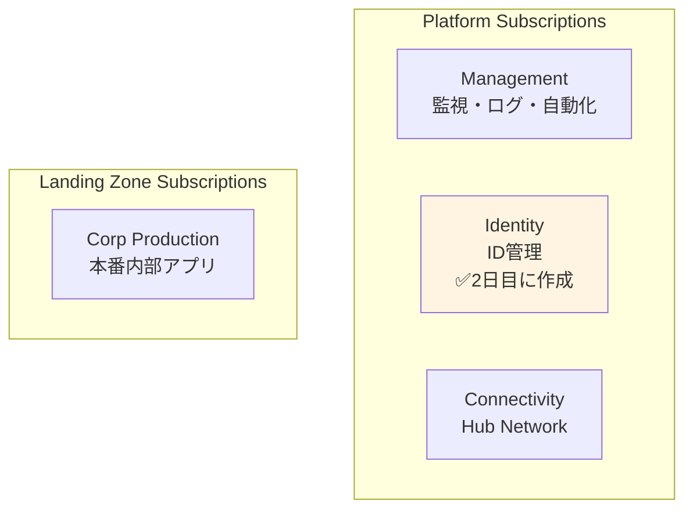

# 第 8 章：Identity Subscription 作成（2 日目）

## 本章の目的

本章では、**2 日目の作業として Identity Subscription を作成**します。Identity Subscription は、将来的に ID 管理やディレクトリサービスを配置するための専用サブスクリプションです。

**所要時間**: 約 30 分〜1 時間  
**難易度**: ⭐  
**実施タイミング**: **2 日目**（1 日目の作業から 24 時間後）

---

## 8.0 前提条件

### 8.0.1 1 日目の作業完了確認

以下が完了していることを確認してください：

- Management Subscription の作成
- Management Subscription への監視・ログ基盤の構築
- .env ファイルに BILLING_SCOPE と SUB_MANAGEMENT_ID が保存されている

### 8.0.2 24 時間待機の確認

> **⚠️ 重要：個人契約アカウントの制約事項**
>
> 個人契約の Azure アカウント（Pay-As-You-Go、Free Trial など）では、**24 時間に 1 つのサブスクリプションしか作成できません**。
>
> 1 日目に Management Subscription を作成してから、**最低 24 時間**待機してください。待機せずにデプロイすると、エラーが発生します。

### 8.0.3 環境変数の読み込み

```bash
# .envファイルから環境変数を読み込み
source .env

# BILLING_SCOPEが設定されていることを確認
echo "Billing Scope: $BILLING_SCOPE"

# SUB_MANAGEMENT_IDが設定されていることを確認
echo "Management Subscription ID: $SUB_MANAGEMENT_ID"
```

---

## 8.1 Identity Subscription とは

### 8.1.1 Identity Subscription の役割

**Identity Subscription** は、ID 管理に関するリソースを配置するための専用サブスクリプションです：

- **Active Directory Domain Services (AD DS)**: オンプレミス AD との統合
- **Azure AD Domain Services**: マネージド AD サービス
- **ID 関連のバックアップと復旧**: ADDS のバックアップ
- **将来の拡張**: エンタープライズ環境での ID 基盤

本ハンズオンでは、Azure AD（Entra ID）をテナントレベルで使用するため、このサブスクリプションにはリソースをデプロイしません。しかし、**CAF のベストプラクティスに従い、将来の拡張に備えて作成**します。

### 8.1.2 CAF における Identity Subscription の位置づけ



---

## 8.2 Identity Subscription の作成

### 8.2.1 Orchestration への統合

**Chapter 6 で作成した orchestration (`tenant.bicep`)は既に Subscription モジュールを含んでいます。** Chapter 8 では`tenant.bicepparam`に Identity Subscription の設定を追記するだけです。

**orchestration/tenant.bicepparam を開き**、`subscriptions`セクションを以下のように更新：

```bicep
param subscriptions = {
  management: {
    aliasName: 'sub-platform-management-prod'
    displayName: 'sub-platform-management-prod'
    workload: 'Production'
  }
  identity: {  // 👈 Chapter 8で追記
    aliasName: 'sub-platform-identity-prod'
    displayName: 'sub-platform-identity-prod'
    workload: 'Production'
  }
}
```

**orchestration/tenant.bicep を開き**、Identity Subscription モジュールを追記：

```bicep
// 条件を変数で定義
var hasIdentitySubscription = contains(subscriptions, 'identity')

// Identity Subscription作成
module identitySubscription '../modules/subscriptions/subscription.bicep' = if (hasIdentitySubscription) {
  name: 'deploy-subscription-identity'
  params: {
    subscriptionAliasName: subscriptions.identity.aliasName
    subscriptionDisplayName: subscriptions.identity.displayName
    billingScope: billingScope
    workload: subscriptions.identity.workload
  }
}

// Identity SubscriptionをManagement Groupに紐づけ
// モジュール自体は常にデプロイ、リソース作成は条件付き
module identitySubscriptionAssociation '../modules/management-groups/subscription-association.bicep' = {
  name: 'deploy-mg-assoc-identity'
  params: {
    managementGroupId: '${companyPrefix}-platform-identity'
    subscriptionId: hasIdentitySubscription ? identitySubscription.outputs.subscriptionId : ''
  }
  dependsOn: [
    managementGroups
  ]
}
```

### 8.2.2 What-If 実行

**orchestration 経由**でデプロイします：

```bash
# デプロイ名を変数に保存
DEPLOYMENT_NAME="tenant-deployment-$(date +%Y%m%d-%H%M%S)"

echo "Creating Identity Subscription via Orchestration..."

# What-If実行
az deployment tenant what-if \
  --name "$DEPLOYMENT_NAME" \
  --location japaneast \
  --template-file infrastructure/bicep/orchestration/tenant.bicep \
  --parameters infrastructure/bicep/orchestration/tenant.bicepparam
```

### 8.2.3 デプロイ実行（10-15 分）

```bash
# デプロイ実行
az deployment tenant create \
  --name "$DEPLOYMENT_NAME" \
  --location japaneast \
  --template-file infrastructure/bicep/orchestration/tenant.bicep \
  --parameters infrastructure/bicep/orchestration/tenant.bicepparam

echo "Deployment name: $DEPLOYMENT_NAME"
```

**デプロイには 10〜15 分程度かかります。**

### 8.2.4 Subscription ID の取得と記録

```bash
# デプロイ結果から Subscription ID を取得
SUB_IDENTITY_ID=$(az deployment tenant show \
  --name "$DEPLOYMENT_NAME" \
  --query "properties.outputs.identitySubscription.value.subscriptionId" -o tsv)

echo "Identity Subscription ID: $SUB_IDENTITY_ID"

# .envファイルに追記
echo "SUB_IDENTITY_ID=$SUB_IDENTITY_ID" >> .env

# 確認
cat .env
```

**代替方法**: デプロイから時間が経過している場合：

```bash
SUB_IDENTITY_ID=$(az account list --query "[?name=='sub-platform-identity-prod'].id" -o tsv)
echo "Identity Subscription ID: $SUB_IDENTITY_ID"
echo "SUB_IDENTITY_ID=$SUB_IDENTITY_ID" >> .env
```

### 8.2.5 Azure ポータルでの確認

1. [Azure ポータル](https://portal.azure.com)にアクセス
2. 検索バーで「Subscriptions」を検索
3. **sub-platform-identity-prod** が表示されることを確認
4. 「Management groups」を開き、**contoso-platform-identity** 配下に表示されることを確認

CLI で確認：

```bash
# Subscription確認
az account show --subscription $SUB_IDENTITY_ID --output table

# Management Group紐づけ確認
az account management-group subscription show \
  --name contoso-platform-identity \
  --subscription $SUB_IDENTITY_ID
```

**✅ orchestration により、Subscription 作成と MG 紐づけが自動で完了しています！**

---

## 8.3 orchestration 統合のメリット（再確認）

1. Azure ポータルで「Management groups」を開く

2. 「contoso-platform-identity」をクリック

3. 「Subscriptions」タブを選択

4. **sub-platform-identity-prod** が表示されていることを確認

---

## 8.4 Git へのコミット

```bash
# 変更の確認
git status

# ステージングとコミット
git add .

git commit -m "Day 2: Create Identity Subscription and associate with Management Group

- Created sub-platform-identity-prod subscription
- Associated with contoso-platform-identity management group
- Saved SUB_IDENTITY_ID to .env"

# プッシュ
git push origin main
```

---

## 8.5 章のまとめ

本章で行ったこと：

1. ✅ 1 日目の作業から 24 時間待機
2. ✅ Identity Subscription の作成
3. ✅ Identity Subscription と Management Group の関連付け
4. ✅ Subscription ID の記録
5. ✅ Git へのコミット・プッシュ

### 重要なポイント

- **24 時間待機が必須**: 個人アカウントでは 1 日 1 サブスクリプションのみ作成可能
- **将来の拡張に備える**: Identity Subscription は将来的な AD DS などの配置を想定
- **CAF ベストプラクティス**: ID 管理は専用サブスクリプションで分離

### 2 日目の次のステップ

Identity Subscription の作成が完了したら、次は Identity & Access Management（IAM）の設計と実装に進みます。

---

## チェックリスト

- [ ] 1 日目の作業から 24 時間以上経過したことを確認した
- [ ] BILLING_SCOPE を .env から読み込んだ
- [ ] Identity Subscription を作成した
- [ ] Identity Subscription を Management Group に関連付けた
- [ ] SUB_IDENTITY_ID を .env に保存した
- [ ] Git にコミット・プッシュした

---

## 次のステップ

Identity Subscription の準備が完了したら、次は Identity & Access Management（IAM）の設計と実装に進みます。

👉 [第 9 章：Identity & Access Management（IAM）設計（2 日目）](chapter09-iam.md)

**注意**: 次の章では、RBAC ロールの設計とカスタムロール定義を行います。

---

## 参考リンク

- [Azure サブスクリプション](https://docs.microsoft.com/azure/cost-management-billing/manage/create-subscription)
- [CAF Identity Subscription](https://docs.microsoft.com/azure/cloud-adoption-framework/ready/landing-zone/design-area/identity-access-platform-subscription)
- [Azure AD Domain Services](https://docs.microsoft.com/azure/active-directory-domain-services/)

---

**最終更新**: 2026 年 1 月 7 日
