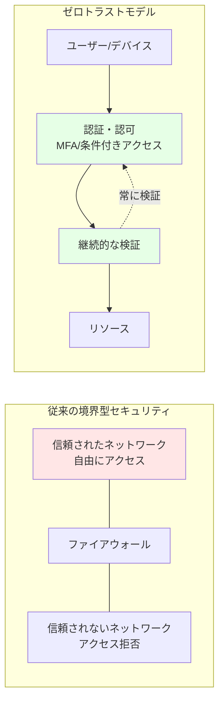

# 第 9 章：セキュリティ基盤構築

## 本章の目的

本章では、Azure CAF Landing Zone のセキュリティ基盤を構築します。Microsoft Defender for Cloud、Azure Key Vault、DDoS Protection、Azure Sentinel などのサービスを実装し、ゼロトラストセキュリティを実現します。

**所要時間**: 約 3-4 時間  
**難易度**: ⭐⭐⭐

---

## 9.0 事前準備：Management Subscription の選択

本章では、セキュリティ・監視リソース（Log Analytics Workspace、Key Vault 等）を **Management Subscription** にデプロイします。

作業を開始する前に、必ず適切なサブスクリプションを選択してください：

```bash
# Management Subscriptionに切り替え
az account set --subscription $SUB_MANAGEMENT_ID

# 現在のサブスクリプションを確認
az account show --query "{Name:name, SubscriptionId:id}" -o table
```

**重要**: Log Analytics Workspace や Key Vault は管理・監視の中核となるため、必ず Management Subscription に配置してください。

---

## 9.1 ゼロトラストセキュリティモデル

### 9.1.1 ゼロトラストとは

**ゼロトラスト**は「決して信頼せず、常に検証する」という原則に基づくセキュリティモデルです。



### 9.1.2 ゼロトラストの 3 原則

1. **明示的な検証**: すべてのアクセスを認証・認可
2. **最小権限アクセス**: 必要最小限の権限のみ付与
3. **侵害の想定**: 侵害されたと仮定して設計

---

## 9.2 Microsoft Defender for Cloud の有効化

### 9.2.1 Microsoft Defender for Cloud とは

**Microsoft Defender for Cloud**（旧 Azure Security Center）は、統合セキュリティ管理と脅威保護を提供します。

**機能**:

- セキュアスコア（セキュリティ評価）
- 推奨事項の提供
- 脅威の検出とアラート
- コンプライアンス評価

### 9.2.2 Defender Plans の有効化

```bash
# Subscription IDを取得
SUBSCRIPTION_ID=$(az account show --query id -o tsv)

# Defender for Serversを有効化
az security pricing create \
  --name VirtualMachines \
  --tier Standard

# Defender for App Serviceを有効化
az security pricing create \
  --name AppServices \
  --tier Standard

# Defender for Storageを有効化
az security pricing create \
  --name StorageAccounts \
  --tier Standard

# Defender for SQLを有効化
az security pricing create \
  --name SqlServers \
  --tier Standard

# Defender for Containersを有効化
az security pricing create \
  --name Containers \
  --tier Standard

# Defender for Key Vaultを有効化
az security pricing create \
  --name KeyVaults \
  --tier Standard
```

### 9.2.3 セキュリティ連絡先の設定

```bash
# セキュリティアラートの送信先を設定
az security contact create \
  --email security@example.com \
  --name default \
  --alert-notifications On \
  --alerts-admins On
```

### 9.2.4 Bicep での実装

ファイル `infrastructure/bicep/modules/security/defender.bicep` を作成し、以下の内容を記述します：

**defender.bicep の解説：**

Microsoft Defender for Cloud の複数の Plan（VirtualMachines、AppServices、StorageAccounts、SqlServers、Containers、KeyVaults）を有効化し、セキュリティ連絡先を設定します。

```bicep
targetScope = 'subscription'

@description('Defender Plansの設定')
param defenderPlans array = [
  'VirtualMachines'
  'AppServices'
  'StorageAccounts'
  'SqlServers'
  'Containers'
  'KeyVaults'
]

@description('セキュリティ連絡先のメール')
param securityContactEmail string

// Defender Plansの有効化
resource defenderPricing 'Microsoft.Security/pricings@2023-01-01' = [for plan in defenderPlans: {
  name: plan
  properties: {
    pricingTier: 'Standard'
  }
}]

// セキュリティ連絡先の設定
resource securityContact 'Microsoft.Security/securityContacts@2023-01-01' = {
  name: 'default'
  properties: {
    emails: securityContactEmail
    alertNotifications: {
      state: 'On'
      minimalSeverity: 'Medium'
    }
    notificationsByRole: {
      state: 'On'
      roles: [
        'Owner'
      ]
    }
  }
}

// 出力
output defenderPlans array = defenderPlans
output securityContactEmail string = securityContactEmail
```

---

## 9.3 Azure Key Vault の構築

### 9.3.1 Azure Key Vault とは

**Azure Key Vault**は、シークレット、暗号化キー、証明書を安全に保管・管理するサービスです。

**ユースケース**:

- データベース接続文字列の保管
- API キーの保管
- SSL/TLS 証明書の管理
- 暗号化キーの管理

### 9.3.2 Key Vault Bicep モジュール

ファイル `infrastructure/bicep/modules/security/key-vault.bicep` を作成し、以下の内容を記述します：

**key-vault.bicep の解説：**

Azure Key Vault を構築し、RBAC 認証、Soft Delete、Purge Protection を有効化します。Public アクセスを無効化し、Private Endpoint で VNet 統合し、Private DNS Zone を構成します。Key Vault Administrator ロールを管理者に割り当てます。

```bicep
@description('Key Vaultの名前（グローバルで一意）')
@minLength(3)
@maxLength(24)
param keyVaultName string

@description('デプロイ先のリージョン')
param location string

@description('テナントID')
param tenantId string = subscription().tenantId

@description('Key Vault管理者のオブジェクトID')
param administratorObjectId string

@description('Soft Delete保持期間（日数）')
@minValue(7)
@maxValue(90)
param softDeleteRetentionInDays int = 90

@description('ネットワークアクセス設定')
@allowed([
  'Enabled'
  'Disabled'
])
param publicNetworkAccess string = 'Disabled'

@description('Hub VNetのサブネットID（Private Endpoint用）')
param subnetId string

@description('タグ')
param tags object = {}

// Key Vault
resource keyVault 'Microsoft.KeyVault/vaults@2023-07-01' = {
  name: keyVaultName
  location: location
  tags: tags
  properties: {
    sku: {
      family: 'A'
      name: 'standard'
    }
    tenantId: tenantId
    enabledForDeployment: true
    enabledForDiskEncryption: true
    enabledForTemplateDeployment: true
    enableSoftDelete: true
    softDeleteRetentionInDays: softDeleteRetentionInDays
    enablePurgeProtection: true
    enableRbacAuthorization: true  // RBAC使用
    publicNetworkAccess: publicNetworkAccess
    networkAcls: {
      bypass: 'AzureServices'
      defaultAction: publicNetworkAccess == 'Disabled' ? 'Deny' : 'Allow'
    }
  }
}

// Private Endpoint（VNet統合）
resource privateEndpoint 'Microsoft.Network/privateEndpoints@2023-05-01' = if (publicNetworkAccess == 'Disabled') {
  name: '${keyVaultName}-pe'
  location: location
  tags: tags
  properties: {
    subnet: {
      id: subnetId
    }
    privateLinkServiceConnections: [
      {
        name: '${keyVaultName}-connection'
        properties: {
          privateLinkServiceId: keyVault.id
          groupIds: [
            'vault'
          ]
        }
      }
    ]
  }
}

// Private DNS Zone
resource privateDnsZone 'Microsoft.Network/privateDnsZones@2020-06-01' = if (publicNetworkAccess == 'Disabled') {
  name: 'privatelink.vaultcore.azure.net'
  location: 'global'
  tags: tags
}

// Private DNS Zone Group
resource privateDnsZoneGroup 'Microsoft.Network/privateEndpoints/privateDnsZoneGroups@2023-05-01' = if (publicNetworkAccess == 'Disabled') {
  name: 'default'
  parent: privateEndpoint
  properties: {
    privateDnsZoneConfigs: [
      {
        name: 'vault-config'
        properties: {
          privateDnsZoneId: privateDnsZone.id
        }
      }
    ]
  }
}

// Key Vault管理者ロールの割り当て
resource kvAdministratorRoleAssignment 'Microsoft.Authorization/roleAssignments@2022-04-01' = {
  name: guid(keyVault.id, administratorObjectId, '00482a5a-887f-4fb3-b363-3b7fe8e74483')
  scope: keyVault
  properties: {
    roleDefinitionId: subscriptionResourceId('Microsoft.Authorization/roleDefinitions', '00482a5a-887f-4fb3-b363-3b7fe8e74483') // Key Vault Administrator
    principalId: administratorObjectId
    principalType: 'User'
  }
}

// 出力
output keyVaultId string = keyVault.id
output keyVaultName string = keyVault.name
output keyVaultUri string = keyVault.properties.vaultUri
```

### 9.3.3 Key Vault のデプロイ

```bash
# 自分のオブジェクトIDを取得
MY_OBJECT_ID=$(az ad signed-in-user show --query id -o tsv)

# Key Vault用のResource Groupを作成
az group create \
  --name rg-platform-security-prod-jpe-001 \
  --location japaneast \
  --tags \
    Environment=Production \
    ManagedBy=Bicep \
    Component=Security

# Management SubnetのIDを取得
MANAGEMENT_SUBNET_ID=$(az network vnet subnet show \
  --vnet-name vnet-hub-prod-jpe-001 \
  --name ManagementSubnet \
  --resource-group rg-platform-connectivity-prod-jpe-001 \
  --query id -o tsv)

# パラメータファイルを作成
cat << EOF > infrastructure/bicep/parameters/key-vault.parameters.json
{
  "\$schema": "https://schema.management.azure.com/schemas/2019-04-01/deploymentParameters.json#",
  "contentVersion": "1.0.0.0",
  "parameters": {
    "keyVaultName": {
      "value": "kv-hub-prod-jpe-001"
    },
    "location": {
      "value": "japaneast"
    },
    "administratorObjectId": {
      "value": "$MY_OBJECT_ID"
    },
    "publicNetworkAccess": {
      "value": "Disabled"
    },
    "subnetId": {
      "value": "$MANAGEMENT_SUBNET_ID"
    }
  }
}
EOF

# デプロイ
az deployment group create \
  --name "key-vault-deployment-$(date +%Y%m%d-%H%M%S)" \
  --resource-group rg-platform-security-prod-jpe-001 \
  --template-file infrastructure/bicep/modules/security/key-vault.bicep \
  --parameters infrastructure/bicep/parameters/key-vault.parameters.json
```

### 9.3.4 Secret の保存テスト

```bash
# Secretを保存
az keyvault secret set \
  --vault-name kv-hub-prod-jpe-001 \
  --name "DatabaseConnectionString" \
  --value "Server=myserver;Database=mydb;User=admin;Password=P@ssw0rd123!"

# Secretを取得
az keyvault secret show \
  --vault-name kv-hub-prod-jpe-001 \
  --name "DatabaseConnectionString" \
  --query value -o tsv
```

---

## 9.4 DDoS Protection

### 9.4.1 Azure DDoS Protection とは

**Azure DDoS Protection**は、DDoS 攻撃からアプリケーションを保護するサービスです。

**プラン**:

- **Basic**: 無料、自動有効化
- **Standard**: 高度な保護、SLA 保証

### 9.4.2 DDoS Protection Plan Bicep モジュール

ファイル `infrastructure/bicep/modules/security/ddos-protection.bicep` を作成し、以下の内容を記述します：

**ddos-protection.bicep の解説：**

Azure DDoS Protection Plan を作成し、Hub VNet に適用することで、DDoS 攻撃からアプリケーションを保護します。

```bicep
@description('DDoS Protection Planの名前')
param ddosProtectionPlanName string

@description('デプロイ先のリージョン')
param location string

@description('タグ')
param tags object = {}

// DDoS Protection Plan
resource ddosProtectionPlan 'Microsoft.Network/ddosProtectionPlans@2023-05-01' = {
  name: ddosProtectionPlanName
  location: location
  tags: tags
  properties: {}
}

// 出力
output ddosProtectionPlanId string = ddosProtectionPlan.id
output ddosProtectionPlanName string = ddosProtectionPlan.name
```

### 9.4.3 VNet への DDoS Protection 適用

```bash
# DDoS Protection Planをデプロイ
az deployment group create \
  --name "ddos-deployment-$(date +%Y%m%d-%H%M%S)" \
  --resource-group rg-platform-security-prod-jpe-001 \
  --template-file infrastructure/bicep/modules/security/ddos-protection.bicep \
  --parameters \
    ddosProtectionPlanName=ddos-hub-prod-jpe-001 \
    location=japaneast

# DDoS Protection PlanをHub VNetに適用
DDOS_PLAN_ID=$(az network ddos-protection show \
  --name ddos-hub-prod-jpe-001 \
  --resource-group rg-platform-security-prod-jpe-001 \
  --query id -o tsv)

az network vnet update \
  --name vnet-hub-prod-jpe-001 \
  --resource-group rg-platform-connectivity-prod-jpe-001 \
  --ddos-protection-plan $DDOS_PLAN_ID \
  --ddos-protection true
```

**注意**: DDoS Protection Standard は約 ¥350,000/月の高コストです。テスト環境では無効化を検討してください。

---

## 9.5 診断設定（Diagnostic Settings）

### 9.5.1 診断設定とは

**診断設定**は、Azure リソースのログとメトリクスを収集する仕組みです。

**送信先**:

- Log Analytics Workspace（推奨）
- Storage Account（長期保管）
- Event Hubs（SIEM 統合）

### 9.5.2 Log Analytics Workspace の作成

ファイル `infrastructure/bicep/modules/monitoring/log-analytics.bicep` を作成し、以下の内容を記述します：

**log-analytics.bicep の解説：**

Log Analytics Workspace を作成し、データ保持期間を設定します。すべての診断ログとメトリクスが集約される中央ログストアとして機能します。

```bicep
@description('Log Analytics Workspaceの名前')
param workspaceName string

@description('デプロイ先のリージョン')
param location string

@description('データ保持期間（日数）')
@minValue(30)
@maxValue(730)
param retentionInDays int = 90

@description('タグ')
param tags object = {}

// Log Analytics Workspace
resource logAnalyticsWorkspace 'Microsoft.OperationalInsights/workspaces@2022-10-01' = {
  name: workspaceName
  location: location
  tags: tags
  properties: {
    sku: {
      name: 'PerGB2018'
    }
    retentionInDays: retentionInDays
    features: {
      enableLogAccessUsingOnlyResourcePermissions: true
    }
    publicNetworkAccessForIngestion: 'Enabled'
    publicNetworkAccessForQuery: 'Enabled'
  }
}

// 出力
output workspaceId string = logAnalyticsWorkspace.id
output workspaceName string = logAnalyticsWorkspace.name
output customerId string = logAnalyticsWorkspace.properties.customerId
```

```bash
# デプロイ
az deployment group create \
  --name "log-analytics-deployment-$(date +%Y%m%d-%H%M%S)" \
  --resource-group rg-platform-management-prod-jpe-001 \
  --template-file infrastructure/bicep/modules/monitoring/log-analytics.bicep \
  --parameters \
    workspaceName=log-platform-prod-jpe-001 \
    location=japaneast \
    retentionInDays=90
```

### 9.5.3 リソースへの診断設定適用

ファイル `infrastructure/bicep/modules/monitoring/diagnostic-settings.bicep` を作成し、以下の内容を記述します：

**diagnostic-settings.bicep の解説：**

Azure リソースに診断設定を適用し、すべてのログとメトリクスを Log Analytics Workspace に送信する汎用モジュールです。allLogs カテゴリグループと AllMetrics を有効化します。

```bicep
@description('診断設定を適用するリソースID')
param resourceId string

@description('Log Analytics Workspace ID')
param workspaceId string

@description('診断設定の名前')
param diagnosticSettingName string = 'default'

// 診断設定（リソースごとに異なるログカテゴリがあるため、汎用的に記述）
resource diagnosticSetting 'Microsoft.Insights/diagnosticSettings@2021-05-01-preview' = {
  name: diagnosticSettingName
  scope: resourceId
  properties: {
    workspaceId: workspaceId
    logs: [
      {
        categoryGroup: 'allLogs'
        enabled: true
        retentionPolicy: {
          enabled: false
          days: 0
        }
      }
    ]
    metrics: [
      {
        category: 'AllMetrics'
        enabled: true
        retentionPolicy: {
          enabled: false
          days: 0
        }
      }
    ]
  }
}

output diagnosticSettingId string = diagnosticSetting.id
```

### 9.5.4 Key Vault に診断設定を適用

```bash
# Log Analytics Workspace IDを取得
LOG_WORKSPACE_ID=$(az monitor log-analytics workspace show \
  --resource-group rg-platform-management-prod-jpe-001 \
  --workspace-name log-platform-prod-jpe-001 \
  --query id -o tsv)

# Key Vaultに診断設定を適用
KEY_VAULT_ID=$(az keyvault show \
  --name kv-hub-prod-jpe-001 \
  --query id -o tsv)

az monitor diagnostic-settings create \
  --name "SendToLogAnalytics" \
  --resource $KEY_VAULT_ID \
  --workspace $LOG_WORKSPACE_ID \
  --logs '[{"categoryGroup":"allLogs","enabled":true}]' \
  --metrics '[{"category":"AllMetrics","enabled":true}]'
```

---

## 9.6 Azure Sentinel（オプション）

### 9.6.1 Azure Sentinel とは

**Azure Sentinel**は、クラウドネイティブの SIEM（Security Information and Event Management）および SOAR（Security Orchestration, Automation and Response）サービスです。

**機能**:

- セキュリティイベントの収集と分析
- 脅威の検出
- 自動応答
- インシデント管理

### 9.6.2 Sentinel の有効化（オプション）

```bash
# Sentinelソリューションを追加
az sentinel onboard \
  --resource-group rg-platform-management-prod-jpe-001 \
  --workspace-name log-platform-prod-jpe-001
```

**注意**: Sentinel はデータ取り込み量に応じた従量課金です。大規模環境では高コストになります。

---

## 9.7 セキュリティベースラインの実装

### 9.7.1 暗号化設定

すべてのストレージとデータベースで暗号化を有効化：

ファイル `infrastructure/bicep/modules/storage/storage-account.bicep` を作成し、以下の内容を記述します：

**storage-account.bicep の解説：**

Storage Account を作成し、HTTPS 強制、TLS 1.2 以上、Public アクセス禁止、暗号化有効化などのセキュリティベースラインを適用します。

```bicep
@description('Storage Accountの名前')
param storageAccountName string

@description('デプロイ先のリージョン')
param location string

@description('タグ')
param tags object = {}

resource storageAccount 'Microsoft.Storage/storageAccounts@2023-01-01' = {
  name: storageAccountName
  location: location
  tags: tags
  sku: {
    name: 'Standard_LRS'
  }
  kind: 'StorageV2'
  properties: {
    supportsHttpsTrafficOnly: true  // HTTPS強制
    minimumTlsVersion: 'TLS1_2'    // TLS 1.2以上
    allowBlobPublicAccess: false   // Publicアクセス禁止
    encryption: {
      services: {
        blob: {
          enabled: true
          keyType: 'Account'
        }
        file: {
          enabled: true
          keyType: 'Account'
        }
      }
      keySource: 'Microsoft.Storage'  // Microsoft管理キー
    }
  }
}

output storageAccountId string = storageAccount.id
output storageAccountName string = storageAccount.name
```
```

---

## 9.8 Azure Portal での確認

### 9.8.1 Microsoft Defender for Cloud の確認

1. Azure ポータルで「Microsoft Defender for Cloud」を検索
2. 「Overview」でセキュアスコアを確認
3. 「Recommendations」で推奨事項を確認
4. 「Security alerts」でアラートを確認

### 9.8.2 Key Vault の確認

1. 「Key vaults」を検索
2. 「kv-hub-prod-jpe-001」をクリック
3. 「Secrets」でシークレットを確認
4. 「Access policies」または「Access control (IAM)」でアクセス権限を確認
5. 「Networking」で Private Endpoint 設定を確認

### 9.8.3 Log Analytics の確認

1. 「Log Analytics workspaces」を検索
2. 「log-platform-prod-jpe-001」をクリック
3. 「Logs」でクエリを実行してみる：

```kql
// Key Vaultのアクセスログ
AzureDiagnostics
| where ResourceProvider == "MICROSOFT.KEYVAULT"
| where TimeGenerated > ago(1h)
| project TimeGenerated, OperationName, ResultType, CallerIPAddress
| order by TimeGenerated desc
```

---

## 9.9 コスト管理

### 9.9.1 リソース別のコスト

| リソース                 | 概算月額コスト（東日本）                 |
| ------------------------ | ---------------------------------------- |
| Defender for Cloud Plans | 約 ¥1,500 / サーバー                     |
| Key Vault Standard       | 約 ¥50 + 操作ごとの従量課金              |
| Log Analytics            | データ取り込み量により変動（約 ¥300/GB） |
| DDoS Protection Standard | 約 ¥350,000                              |
| Sentinel                 | データ取り込み量により変動               |

### 9.9.2 コスト削減のヒント

- Defender for Cloud は必要なリソースタイプのみ有効化
- Log Analytics の保持期間を適切に設定（90 日推奨）
- DDoS Protection Standard はテスト環境では無効化
- Sentinel は本番環境でのみ使用

---

## 9.10 Git へのコミット

```bash
git add .
git commit -m "Chapter 9: Security foundation implementation

- Enabled Microsoft Defender for Cloud with multiple plans
- Deployed Azure Key Vault with RBAC and Private Endpoint
- Configured DDoS Protection for Hub VNet
- Created Log Analytics Workspace for centralized logging
- Configured diagnostic settings for Key Vault
- Implemented security baseline (encryption, TLS 1.2)
- Created comprehensive Bicep modules for security"

git push origin main
```

---

## 9.11 章のまとめ

本章で構築したもの：

1. ✅ Microsoft Defender for Cloud

   - 複数の Defender Plans 有効化
   - セキュアスコア監視
   - セキュリティ連絡先設定

2. ✅ Azure Key Vault

   - RBAC 認証
   - Private Endpoint 統合
   - Soft Delete & Purge Protection

3. ✅ DDoS Protection

   - Hub VNet に適用

4. ✅ Log Analytics Workspace

   - 診断設定の集約
   - 90 日間のログ保持

5. ✅ セキュリティベースライン
   - 暗号化強制
   - TLS 1.2 以上
   - Public アクセス禁止

### 重要なポイント

- **ゼロトラストの実践**: すべてのアクセスを検証
- **暗号化の徹底**: 保存時・転送時の両方
- **ログの集約**: Log Analytics で一元管理
- **コスト意識**: DDoS Protection と Sentinel は高コスト

---

## 次のステップ

セキュリティ基盤が構築できたら、次は監視・管理基盤の構築に進みます。

👉 [第 10 章：監視・管理基盤構築](chapter10-monitoring.md)

---

**最終更新**: 2026 年 1 月 7 日
