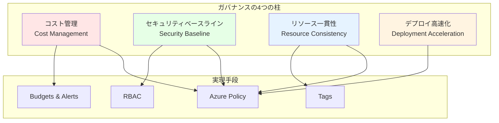

# 第 10 章：ガバナンス・ポリシー実装（2 日目）

## 本章の目的

本章では、Azure CAF Landing Zone のガバナンス基盤を構築します。Azure Policy、Blueprints、Cost Management、Tagging 戦略など、組織全体のガバナンスを実現します。

**所要時間**: 約 4-5 時間  
**難易度**: ⭐⭐⭐⭐  
**実施タイミング**: **2 日目**

---

## 10.1 ガバナンスの重要性

### 10.1.1 ガバナンスとは

**ガバナンス**は、組織のクラウド利用を制御・管理する仕組みです。



### 10.1.2 CAF ガバナンスガイダンス

CAF では、以下のガバナンス規律を定義しています：

1. **Cost Management**: 予算管理、コスト最適化
2. **Security Baseline**: セキュリティ標準の適用
3. **Resource Consistency**: 命名規則、タグ付け
4. **Identity Baseline**: IAM、認証・認可
5. **Deployment Acceleration**: CI/CD、自動化

---

## 10.2 Azure Policy の理解

### 10.2.1 Azure Policy とは

**Azure Policy**は、Azure リソースに対するルールを定義・適用するサービスです。

**効果（Effect）の種類**:

- **Audit**: ルール違反を検出（変更なし）
- **Deny**: ルール違反のリソース作成を拒否
- **Append**: リソースに値を追加
- **Modify**: リソースを変更
- **DeployIfNotExists**: リソースが存在しない場合に作成
- **AuditIfNotExists**: リソースが存在しない場合に監査

### 10.2.2 Policy の構造

```json
{
  "properties": {
    "displayName": "許可されたリージョンの制限",
    "policyType": "Custom",
    "mode": "All",
    "parameters": {
      "allowedLocations": {
        "type": "Array",
        "metadata": {
          "description": "許可されたリージョンのリスト"
        }
      }
    },
    "policyRule": {
      "if": {
        "not": {
          "field": "location",
          "in": "[parameters('allowedLocations')]"
        }
      },
      "then": {
        "effect": "deny"
      }
    }
  }
}
```

---

## 10.3 組み込み Policy の適用

### 10.3.1 重要な組み込み Policy

```bash
# よく使う組み込みPolicyを一覧化
cat << 'EOF' > docs/policies/built-in-policies.md
# よく使う組み込みAzure Policy

## セキュリティ

| Policy名 | 説明 | Effect |
|---|---|---|
| Allowed locations | リソースをデプロイできるリージョンを制限 | Deny |
| Allowed virtual machine size SKUs | 作成できるVMサイズを制限 | Deny |
| Storage accounts should use customer-managed key | Storage Accountでカスタマー管理キーを強制 | Audit |
| Azure Defender for servers should be enabled | Defender for Serversを有効化を監査 | AuditIfNotExists |

## コスト管理

| Policy名 | 説明 | Effect |
|---|---|---|
| Not allowed resource types | 特定のリソースタイプの作成を禁止 | Deny |
| Allowed storage account SKUs | Storage AccountのSKUを制限 | Deny |

## タグ付け

| Policy名 | 説明 | Effect |
|---|---|---|
| Require a tag on resources | 必須タグを強制 | Deny |
| Inherit a tag from the resource group | RGのタグをリソースに継承 | Modify |
| Append a tag and its value to resources | リソースにタグを追加 | Append |

## ネットワーク

| Policy名 | 説明 | Effect |
|---|---|---|
| Network interfaces should not have public IPs | NICへのPublic IP割り当てを禁止 | Deny |
| Subnets should be associated with a Network Security Group | サブネットにNSGを必須化 | Audit |

## 診断設定

| Policy名 | 説明 | Effect |
|---|---|---|
| Deploy Diagnostic Settings for Key Vault | Key Vaultの診断設定を自動作成 | DeployIfNotExists |
| Deploy Diagnostic Settings for Network Security Groups | NSGの診断設定を自動作成 | DeployIfNotExists |
EOF
```

### 10.3.2 Management Group への Policy 適用

```bash
# 許可されたリージョンを制限するPolicy
az policy assignment create \
  --name "AllowedLocationsPolicy" \
  --display-name "許可されたリージョンの制限" \
  --scope "/providers/Microsoft.Management/managementGroups/contoso-platform" \
  --policy "e56962a6-4747-49cd-b67b-bf8b01975c4c" \
  --params '{
    "allowedLocations": {
      "value": ["japaneast", "japanwest"]
    }
  }'

# 必須タグの強制（Environment）
az policy assignment create \
  --name "RequireEnvironmentTag" \
  --display-name "必須タグ: Environment" \
  --scope "/providers/Microsoft.Management/managementGroups/contoso-landingzones" \
  --policy "871b6d14-10aa-478d-b590-94f262ecfa99" \
  --params '{
    "tagName": {
      "value": "Environment"
    }
  }'

# Storage AccountでHTTPSを強制
az policy assignment create \
  --name "SecureTransferToStorageAccounts" \
  --display-name "Storage AccountsはHTTPS必須" \
  --scope "/providers/Microsoft.Management/managementGroups/contoso-landingzones" \
  --policy "404c3081-a854-4457-ae30-26a93ef643f9"
```

---

## 10.4 カスタム Policy の作成

### 10.4.1 命名規則を強制する Policy

```bash
mkdir -p infrastructure/policies/definitions

cat << 'EOF' > infrastructure/policies/definitions/naming-convention-policy.json
{
  "properties": {
    "displayName": "命名規則の強制",
    "description": "リソース名が命名規則に従っているかチェック",
    "mode": "All",
    "parameters": {
      "resourceTypes": {
        "type": "Array",
        "metadata": {
          "displayName": "リソースタイプ",
          "description": "チェック対象のリソースタイプ"
        }
      }
    },
    "policyRule": {
      "if": {
        "allOf": [
          {
            "field": "type",
            "in": "[parameters('resourceTypes')]"
          },
          {
            "not": {
              "field": "name",
              "match": "*-*-*-*-*"
            }
          }
        ]
      },
      "then": {
        "effect": "audit"
      }
    }
  }
}
EOF

# カスタムPolicyを作成
az policy definition create \
  --name "naming-convention-policy" \
  --display-name "命名規則の強制" \
  --description "リソース名が {type}-{workload}-{env}-{region}-{instance} に従っているかチェック" \
  --mode All \
  --rules infrastructure/policies/definitions/naming-convention-policy.json \
  --params '{
    "resourceTypes": {
      "type": "Array",
      "metadata": {
        "displayName": "リソースタイプ",
        "description": "チェック対象のリソースタイプ"
      },
      "defaultValue": [
        "Microsoft.Compute/virtualMachines",
        "Microsoft.Storage/storageAccounts",
        "Microsoft.Network/virtualNetworks"
      ]
    }
  }'
```

### 10.4.2 診断設定を自動作成する Policy

```bash
cat << 'EOF' > infrastructure/policies/definitions/deploy-diagnostics-keyvault.json
{
  "properties": {
    "displayName": "Key Vaultの診断設定を自動デプロイ",
    "description": "Key Vaultに診断設定が存在しない場合、自動的に作成する",
    "mode": "All",
    "parameters": {
      "logAnalyticsWorkspaceId": {
        "type": "String",
        "metadata": {
          "displayName": "Log Analytics Workspace ID",
          "description": "診断ログの送信先Workspace"
        }
      }
    },
    "policyRule": {
      "if": {
        "field": "type",
        "equals": "Microsoft.KeyVault/vaults"
      },
      "then": {
        "effect": "deployIfNotExists",
        "details": {
          "type": "Microsoft.Insights/diagnosticSettings",
          "existenceCondition": {
            "allOf": [
              {
                "field": "Microsoft.Insights/diagnosticSettings/logs.enabled",
                "equals": "True"
              },
              {
                "field": "Microsoft.Insights/diagnosticSettings/workspaceId",
                "equals": "[parameters('logAnalyticsWorkspaceId')]"
              }
            ]
          },
          "roleDefinitionIds": [
            "/providers/microsoft.authorization/roleDefinitions/b24988ac-6180-42a0-ab88-20f7382dd24c"
          ],
          "deployment": {
            "properties": {
              "mode": "incremental",
              "template": {
                "$schema": "https://schema.management.azure.com/schemas/2019-04-01/deploymentTemplate.json#",
                "contentVersion": "1.0.0.0",
                "parameters": {
                  "resourceName": {
                    "type": "string"
                  },
                  "workspaceId": {
                    "type": "string"
                  }
                },
                "resources": [
                  {
                    "type": "Microsoft.KeyVault/vaults/providers/diagnosticSettings",
                    "apiVersion": "2021-05-01-preview",
                    "name": "[concat(parameters('resourceName'), '/Microsoft.Insights/default')]",
                    "properties": {
                      "workspaceId": "[parameters('workspaceId')]",
                      "logs": [
                        {
                          "categoryGroup": "allLogs",
                          "enabled": true
                        }
                      ],
                      "metrics": [
                        {
                          "category": "AllMetrics",
                          "enabled": true
                        }
                      ]
                    }
                  }
                ]
              },
              "parameters": {
                "resourceName": {
                  "value": "[field('name')]"
                },
                "workspaceId": {
                  "value": "[parameters('logAnalyticsWorkspaceId')]"
                }
              }
            }
          }
        }
      }
    }
  }
}
EOF

# カスタムPolicyを作成
az policy definition create \
  --name "deploy-diagnostics-keyvault" \
  --display-name "Key Vaultの診断設定を自動デプロイ" \
  --mode All \
  --rules infrastructure/policies/definitions/deploy-diagnostics-keyvault.json
```

---

## 10.5 Policy Initiative の作成

### 10.5.1 Policy Initiative とは

**Policy Initiative**（ポリシーセット）は、複数の Policy をグループ化したものです。

### 10.5.2 CAF Landing Zone Initiative

```bash
cat << 'EOF' > infrastructure/policies/initiatives/caf-landingzone-initiative.json
{
  "properties": {
    "displayName": "CAF Landing Zone ガバナンス",
    "description": "CAF Landing Zoneで推奨されるポリシーのセット",
    "policyDefinitions": [
      {
        "policyDefinitionId": "/providers/Microsoft.Authorization/policyDefinitions/e56962a6-4747-49cd-b67b-bf8b01975c4c",
        "parameters": {
          "allowedLocations": {
            "value": ["japaneast", "japanwest"]
          }
        }
      },
      {
        "policyDefinitionId": "/providers/Microsoft.Authorization/policyDefinitions/871b6d14-10aa-478d-b590-94f262ecfa99",
        "parameters": {
          "tagName": {
            "value": "Environment"
          }
        }
      },
      {
        "policyDefinitionId": "/providers/Microsoft.Authorization/policyDefinitions/404c3081-a854-4457-ae30-26a93ef643f9",
        "parameters": {}
      },
      {
        "policyDefinitionId": "/providers/Microsoft.Authorization/policyDefinitions/83a214f7-d01a-484b-91a9-ed54470c9a6a",
        "parameters": {}
      },
      {
        "policyDefinitionId": "/providers/Microsoft.Authorization/policyDefinitions/013e242c-8828-4970-87b3-ab247555486d",
        "parameters": {}
      }
    ]
  }
}
EOF

# Policy Initiativeを作成
az policy set-definition create \
  --name "caf-landingzone-initiative" \
  --display-name "CAF Landing Zone ガバナンス" \
  --description "CAF Landing Zoneで推奨されるポリシーのセット" \
  --definitions infrastructure/policies/initiatives/caf-landingzone-initiative.json

# Management GroupにInitiativeを割り当て
az policy assignment create \
  --name "CAFLandingZoneGovernance" \
  --display-name "CAF Landing Zoneガバナンス適用" \
  --scope "/providers/Microsoft.Management/managementGroups/contoso-landingzones" \
  --policy-set-definition "caf-landingzone-initiative"
```

---

## 10.6 Bicep での Policy 実装

### 10.6.1 Policy Definition Bicep モジュール

ファイル `infrastructure/bicep/modules/governance/policy-definition.bicep` を作成し、以下の内容を記述します：

**policy-definition.bicep の解説：**

Management Group レベルでカスタム Azure Policy 定義を作成するモジュールです。ポリシー名、ルール、パラメータを指定して、組織固有のガバナンスルールを実装できます。

```bicep
targetScope = 'managementGroup'

@description('ポリシー定義の名前')
param policyName string

@description('表示名')
param displayName string

@description('説明')
param description string

@description('ポリシールール')
param policyRule object

@description('パラメータ')
param parameters object = {}

// Policy Definition
resource policyDefinition 'Microsoft.Authorization/policyDefinitions@2021-06-01' = {
  name: policyName
  properties: {
    displayName: displayName
    description: description
    policyType: 'Custom'
    mode: 'All'
    parameters: parameters
    policyRule: policyRule
  }
}

output policyDefinitionId string = policyDefinition.id
```

### 10.6.2 Policy Assignment Bicep モジュール

ファイル `infrastructure/bicep/modules/governance/policy-assignment.bicep` を作成し、以下の内容を記述します：

**policy-assignment.bicep の解説：**

Management Group レベルで Azure Policy を割り当てるモジュールです。ポリシー定義 ID とパラメータを指定し、特定のスコープにポリシーを適用します。

```bicep
targetScope = 'managementGroup'

@description('割り当て名')
param assignmentName string

@description('表示名')
param displayName string

@description('ポリシー定義ID')
param policyDefinitionId string

@description('パラメータ')
param parameters object = {}

@description('スコープ（Management Group ID）')
param scope string

// Policy Assignment
resource policyAssignment 'Microsoft.Authorization/policyAssignments@2022-06-01' = {
  name: assignmentName
  properties: {
    displayName: displayName
    policyDefinitionId: policyDefinitionId
    parameters: parameters
    enforcementMode: 'Default'
  }
}

output assignmentId string = policyAssignment.id
```

---

## 10.7 Policy Compliance 監視

### 10.7.1 コンプライアンス状態の確認

```bash
# すべてのPolicy Assignmentのコンプライアンスを確認
az policy state summarize \
  --management-group contoso-landingzones

# 特定のPolicyの詳細
az policy state list \
  --management-group contoso-landingzones \
  --filter "policyAssignmentName eq 'AllowedLocationsPolicy'" \
  --query "[?complianceState=='NonCompliant'].{Resource:resourceId, Reason:policyDefinitionAction}" \
  --output table
```

### 10.7.2 修復タスク（Remediation）

DeployIfNotExists や Modify 効果の Policy は、既存のリソースに適用するため修復タスクが必要です。

```bash
# 修復タスクを作成
az policy remediation create \
  --name "remediate-diagnostics-keyvault" \
  --policy-assignment "/providers/Microsoft.Management/managementGroups/contoso-landingzones/providers/Microsoft.Authorization/policyAssignments/CAFLandingZoneGovernance" \
  --definition-reference-id "deploy-diagnostics-keyvault" \
  --resource-discovery-mode ReEvaluateCompliance

# 修復タスクのステータス確認
az policy remediation show \
  --name "remediate-diagnostics-keyvault" \
  --management-group contoso-landingzones
```

---

## 10.8 タグ付け戦略

### 10.8.1 推奨タグ

````bash
cat << 'EOF' > docs/governance/tagging-strategy.md
# タグ付け戦略

## 必須タグ

すべてのリソースに以下のタグを付与する：

| タグ名 | 説明 | 例 |
|---|---|---|
| Environment | 環境 | Production, Development, Test |
| ManagedBy | 管理方法 | Bicep, Terraform, Portal |
| CostCenter | コストセンター | IT-001, Marketing-002 |
| Owner | 所有者 | john.doe@example.com |
| Project | プロジェクト | CAF-Landing-Zone |

## オプショナルタグ

| タグ名 | 説明 | 例 |
|---|---|---|
| Application | アプリケーション名 | WebApp, API |
| DataClassification | データ分類 | Public, Internal, Confidential |
| BusinessUnit | ビジネスユニット | Sales, Engineering |
| Compliance | コンプライアンス要件 | HIPAA, PCI-DSS |

## タグ付けのベストプラクティス

1. **一貫性**: 命名規則を統一
2. **自動化**: Bicep/Terraformでタグを自動付与
3. **継承**: Resource GroupのタグをリソースIに継承
4. **検証**: Policyでタグを強制
5. **レビュー**: 定期的にタグをレビュー

## Bicepでのタグ実装例

```bicep
param commonTags object = {
  Environment: 'Production'
  ManagedBy: 'Bicep'
  Project: 'CAF-Landing-Zone'
}

resource storageAccount 'Microsoft.Storage/storageAccounts@2023-01-01' = {
  name: 'stcontosoprod001'
  location: 'japaneast'
  tags: union(commonTags, {
    Component: 'Storage'
    CostCenter: 'IT-001'
  })
  // ...
}
````

EOF

````

---

## 10.9 Cost Managementの設定

### 10.9.1 予算（Budget）の作成

```bash
# Subscription IDを取得
SUBSCRIPTION_ID=$(az account show --query id -o tsv)

# 月次予算を作成
az consumption budget create \
  --budget-name "MonthlyBudget" \
  --category Cost \
  --amount 100000 \
  --time-grain Monthly \
  --start-date "2026-01-01" \
  --end-date "2026-12-31" \
  --resource-group rg-platform-management-prod-jpe-001 \
  --notifications '{
    "Actual_GreaterThan_80_Percent": {
      "enabled": true,
      "operator": "GreaterThan",
      "threshold": 80,
      "contactEmails": ["admin@example.com"],
      "thresholdType": "Actual"
    },
    "Forecasted_GreaterThan_100_Percent": {
      "enabled": true,
      "operator": "GreaterThan",
      "threshold": 100,
      "contactEmails": ["admin@example.com"],
      "thresholdType": "Forecasted"
    }
  }'
````

### 10.9.2 Cost Analysis の活用

1. Azure ポータルで「Cost Management + Billing」を開く
2. 「Cost analysis」でコストを分析：
   - Resource Group 別
   - タグ別
   - サービス別
3. カスタムビューを作成して保存

---

## 10.10 Azure Blueprints（レガシー）

**注意**: Azure Blueprints は 2026 年に廃止予定です。新規プロジェクトでは Bicep/Terraform を使用してください。

---

## 10.11 Azure Portal での確認

### 10.11.1 Policy の確認

1. Azure ポータルで「Policy」を検索
2. 「Compliance」でコンプライアンス状態を確認
3. 「Assignments」で割り当て済み Policy を確認
4. 「Definitions」でカスタム Policy を確認

### 10.11.2 非準拠リソースの確認

1. 「Compliance」→ 特定の Policy をクリック
2. 「Non-compliant resources」タブで非準拠リソースを確認
3. 必要に応じて修復タスクを実行

---

## 10.12 Git へのコミット

```bashbash
git add .
git commit -m "Day 2: Governance and policy implementation

- Created built-in policy assignments (allowed locations, required tags, HTTPS)
- Created custom policies (naming convention, diagnostics deployment)
- Created policy initiative for CAF Landing Zone governance
- Implemented Bicep modules for policy definitions and assignments
- Documented tagging strategy and best practices
- Configured budgets and cost management alerts
- Created comprehensive policy compliance monitoring"

git push origin main
```

---

## 10.13 章のまとめ

本章で構築したもの：

1. ✅ 組み込み Policy 適用

   - 許可されたリージョン制限
   - 必須タグ強制
   - HTTPS 強制

2. ✅ カスタム Policy 作成

   - 命名規則チェック
   - 診断設定自動デプロイ

3. ✅ Policy Initiative

   - CAF Landing Zone ガバナンスセット

4. ✅ タグ付け戦略

   - 必須タグの定義
   - 自動付与の実装

5. ✅ Cost Management
   - 月次予算設定
   - アラート通知

### 重要なポイント

- **Policy ファースト**: リソース作成前にガバナンスを設定
- **段階的適用**: Audit → Deny の順で適用
- **継続的監視**: コンプライアンス状態を定期確認
- **コスト意識**: 予算アラートで早期検知

---

## 次のステップ

2 日目の作業（Identity Subscription 作成、IAM、ガバナンス）が完了しました。次は 3 日目の作業として、Connectivity Subscription の作成に進みます。

**24 時間後に 3 日目の作業（Connectivity Subscription 作成とセキュリティ基盤）に進んでください。**

👉 [第 11 章：Connectivity Subscription 作成（3 日目）](chapter11-connectivity-subscription.md)

---

**最終更新**: 2026 年 1 月 7 日
