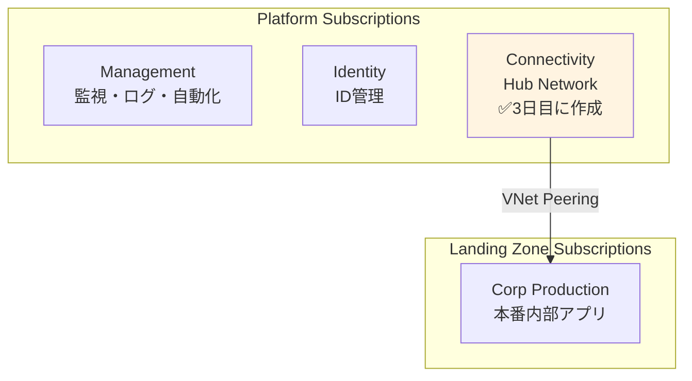

# 第 11 章：Connectivity Subscription 作成（3 日目）

## 本章の目的

本章では、**3 日目の作業として Connectivity Subscription を作成**します。Connectivity Subscription は、Hub VNet、Azure Firewall、Azure Bastion などのネットワーク接続リソースを配置するための専用サブスクリプションです。

**所要時間**: 約 30 分〜1 時間  
**難易度**: ⭐  
**実施タイミング**: **3 日目**（2 日目の作業から 24 時間後）

---

## 11.0 前提条件

### 11.0.1 2 日目の作業完了確認

以下が完了していることを確認してください：

- Identity Subscription の作成
- Identity & Access Management (IAM) の設計
- ガバナンス・ポリシーの実装
- .env ファイルに BILLING_SCOPE、SUB_MANAGEMENT_ID、SUB_IDENTITY_ID が保存されている

### 11.0.2 24 時間待機の確認

> **⚠️ 重要：個人契約アカウントの制約事項**
>
> 個人契約の Azure アカウント（Pay-As-You-Go、Free Trial など）では、**24 時間に 1 つのサブスクリプションしか作成できません**。
>
> 2 日目に Identity Subscription を作成してから、**最低 24 時間**待機してください。待機せずにデプロイすると、エラーが発生します。

### 11.0.3 環境変数の読み込み

```bash
# .envファイルから環境変数を読み込み
source .env

# BILLING_SCOPEが設定されていることを確認
echo "Billing Scope: $BILLING_SCOPE"

# SUB_MANAGEMENT_IDが設定されていることを確認
echo "Management Subscription ID: $SUB_MANAGEMENT_ID"

# SUB_IDENTITY_IDが設定されていることを確認
echo "Identity Subscription ID: $SUB_IDENTITY_ID"
```

---

## 11.1 Connectivity Subscription とは

### 11.1.1 Connectivity Subscription の役割

**Connectivity Subscription** は、組織全体のネットワーク接続を提供するための専用サブスクリプションです：

- **Hub VNet**: Hub-Spoke トポロジの中心
- **Azure Firewall**: すべてのトラフィックのフィルタリング
- **Azure Bastion**: セキュアな VM アクセス
- **VPN Gateway / ExpressRoute**: オンプレミス接続
- **Private DNS**: 名前解決の集中管理

### 11.1.2 CAF における Connectivity Subscription の位置づけ



---

## 11.2 Connectivity Subscription の作成

### 11.2.1 Bicep ファイルの作成

ファイル `infrastructure/bicep/subscriptions/sub-connectivity.bicep` を作成し、以下の内容を記述します：

```bicep
targetScope = 'tenant'

@description('Billing Scope')
param billingScope string

resource subConnectivity 'Microsoft.Subscription/aliases@2021-10-01' = {
  name: 'sub-platform-connectivity-prod'
  properties: {
    workload: 'Production'
    displayName: 'sub-platform-connectivity-prod'
    billingScope: billingScope
  }
}

output subscriptionId string = subConnectivity.properties.subscriptionId
```

### 11.2.2 パラメーターファイルの作成

ファイル `infrastructure/bicep/parameters/sub-connectivity.bicepparam` を作成し、以下の内容を記述します：

```bicep
using '../subscriptions/sub-connectivity.bicep'

param billingScope = '/providers/Microsoft.Billing/billingAccounts/your-billing-account-id/enrollmentAccounts/your-enrollment-account-id'
```

**重要：** `billingScope` の値を置き換えてください。以下のコマンドで取得した値を使用します：

```bash
# Billing Scopeの値を確認（第6章で取得済み）
echo $BILLING_SCOPE

# 出力例：
# /providers/Microsoft.Billing/billingAccounts/12345678/billingProfiles/ABCD-EFGH-001/invoiceSections/IJKL-MNOP-002
```

この値をパラメーターファイルの `billingScope` に設定します。

### 11.2.3 What-If 実行

```bash
echo "Creating Connectivity Subscription..."

# 事前確認
az deployment tenant what-if \
  --name "deploy-sub-connectivity-$(date +%Y%m%d-%H%M%S)" \
  --location japaneast \
  --template-file infrastructure/bicep/subscriptions/sub-connectivity.bicep \
  --parameters infrastructure/bicep/parameters/sub-connectivity.bicepparam
```

### 11.2.4 デプロイ実行（10-15 分）

```bash
# デプロイ実行
az deployment tenant create \
  --name "deploy-sub-connectivity-$(date +%Y%m%d-%H%M%S)" \
  --location japaneast \
  --template-file infrastructure/bicep/subscriptions/sub-connectivity.bicep \
  --parameters infrastructure/bicep/parameters/sub-connectivity.bicepparam
```

**デプロイには 10〜15 分程度かかります。**

### 11.2.5 Subscription ID の記録

```bash
SUB_CONNECTIVITY_ID=$(az account list --query "[?name=='sub-platform-connectivity-prod'].id" -o tsv)
echo "Connectivity Subscription ID: $SUB_CONNECTIVITY_ID"

# .envファイルに追記
echo "SUB_CONNECTIVITY_ID=$SUB_CONNECTIVITY_ID" >> .env
```

### 11.2.4 Azure ポータルでの確認

1. [Azure ポータル](https://portal.azure.com)にアクセス

2. 検索バーで「Subscriptions」を検索

3. **sub-platform-connectivity-prod** が表示されることを確認

または CLI で確認：

```bash
# Connectivity Subscriptionを表示
az account show --subscription $SUB_CONNECTIVITY_ID --output table
```

---

## 11.3 Connectivity Subscription と Management Group の関連付け

作成した Connectivity Subscription を、第 5 章で作成した Management Group「contoso-platform-connectivity」に割り当てます。

パラメーターファイル `infrastructure/bicep/parameters/mg-assoc-connectivity.bicepparam` を作成：

```bicep
using '../modules/management-groups/subscription-association.bicep'

param managementGroupName = 'contoso-platform-connectivity'
param subscriptionId = 'YOUR_CONNECTIVITY_SUBSCRIPTION_ID'
```

**重要：** `subscriptionId` の値を置き換えてください。以下のコマンドで取得した Connectivity Subscription ID を使用します：

```bash
# Connectivity Subscription IDの値を確認（前のセクションで取得済み）
echo $SUB_CONNECTIVITY_ID

# 出力例：
# 34567890-3456-3456-3456-345678901234
```

この値をパラメーターファイルの `subscriptionId` に設定します。

第 6 章で作成した Bicep モジュールを使用します：

```bash
# 事前確認
az deployment mg what-if \
  --management-group-id contoso-platform-connectivity \
  --location japaneast \
  --template-file infrastructure/bicep/modules/management-groups/subscription-association.bicep \
  --parameters infrastructure/bicep/parameters/mg-assoc-connectivity.bicepparam

# 確認後、デプロイ実行
az deployment mg create \
  --management-group-id contoso-platform-connectivity \
  --location japaneast \
  --template-file infrastructure/bicep/modules/management-groups/subscription-association.bicep \
  --parameters infrastructure/bicep/parameters/mg-assoc-connectivity.bicepparam

echo "Connectivity Subscription が Management Group に割り当てられました"
```

### Azure ポータルでの確認

1. Azure ポータルで「Management groups」を開く

2. 「contoso-platform-connectivity」をクリック

3. 「Subscriptions」タブを選択

4. **sub-platform-connectivity-prod** が表示されていることを確認

---

## 11.4 Git へのコミット

```bash
# 変更の確認
git status

# ステージングとコミット
git add .

git commit -m "Day 3: Create Connectivity Subscription and associate with Management Group

- Created sub-platform-connectivity-prod subscription
- Associated with contoso-platform-connectivity management group
- Saved SUB_CONNECTIVITY_ID to .env"

# プッシュ
git push origin main
```

---

## 11.5 章のまとめ

本章で行ったこと：

1. ✅ 2 日目の作業から 24 時間待機
2. ✅ Connectivity Subscription の作成
3. ✅ Connectivity Subscription と Management Group の関連付け
4. ✅ Subscription ID の記録
5. ✅ Git へのコミット・プッシュ

### 重要なポイント

- **24 時間待機が必須**: 個人アカウントでは 1 日 1 サブスクリプションのみ作成可能
- **Hub Network の基盤**: この Subscription に Hub VNet、Firewall、Bastion を配置
- **CAF ベストプラクティス**: ネットワーク接続は専用サブスクリプションで分離

### 3 日目の次のステップ

Connectivity Subscription の作成が完了したら、次はセキュリティ基盤の構築に進みます。

---

## チェックリスト

- [ ] 2 日目の作業から 24 時間以上経過したことを確認した
- [ ] BILLING_SCOPE を .env から読み込んだ
- [ ] Connectivity Subscription を作成した
- [ ] Connectivity Subscription を Management Group に関連付けた
- [ ] SUB_CONNECTIVITY_ID を .env に保存した
- [ ] Git にコミット・プッシュした

---

## 次のステップ

Connectivity Subscription の準備が完了したら、次はセキュリティ基盤の構築に進みます。

👉 [第 12 章：Security 基盤構築（3 日目）](chapter12-security.md)

**注意**: 次の章では、Key Vault、Diagnostic Settings、Network Security などのセキュリティリソースを構築します。

---

## 参考リンク

- [Azure サブスクリプション](https://docs.microsoft.com/azure/cost-management-billing/manage/create-subscription)
- [CAF Connectivity Subscription](https://docs.microsoft.com/azure/cloud-adoption-framework/ready/landing-zone/design-area/network-topology-and-connectivity)
- [Hub-Spoke ネットワークトポロジ](https://docs.microsoft.com/azure/architecture/reference-architectures/hybrid-networking/hub-spoke)

---

**最終更新**: 2026 年 1 月 7 日
