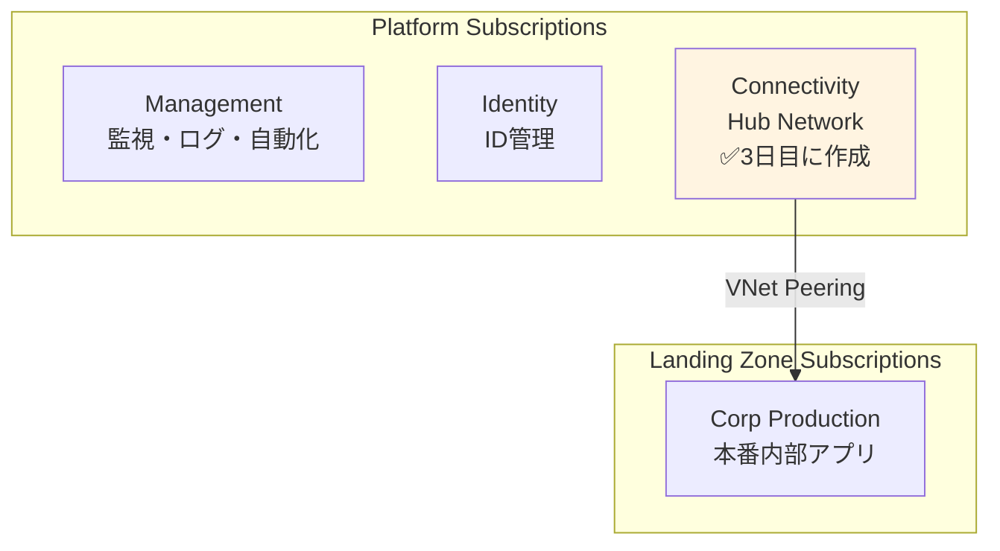

# 第 11 章：Connectivity Subscription 作成（3 日目）

## 本章の目的

本章では、**3 日目の作業として Connectivity Subscription を作成**します。Connectivity Subscription は、Hub VNet、Azure Firewall、Azure Bastion などのネットワーク接続リソースを配置するための専用サブスクリプションです。

**所要時間**: 約 30 分〜1 時間  
**難易度**: ⭐  
**実施タイミング**: **3 日目**（2 日目の作業から 24 時間後）

---

## 11.0 前提条件

### 11.0.1 2 日目の作業完了確認

以下が完了していることを確認してください：

- Identity Subscription の作成
- Identity & Access Management (IAM) の設計
- ガバナンス・ポリシーの実装
- .env ファイルに BILLING_SCOPE、SUB_MANAGEMENT_ID、SUB_IDENTITY_ID が保存されている

### 11.0.2 24 時間待機の確認

> **⚠️ 重要：個人契約アカウントの制約事項**
>
> 個人契約の Azure アカウント（Pay-As-You-Go、Free Trial など）では、**24 時間に 1 つのサブスクリプションしか作成できません**。
>
> 2 日目に Identity Subscription を作成してから、**最低 24 時間**待機してください。待機せずにデプロイすると、エラーが発生します。

### 11.0.3 環境変数の読み込み

```bash
# .envファイルから環境変数を読み込み
source .env

# BILLING_SCOPEが設定されていることを確認
echo "Billing Scope: $BILLING_SCOPE"

# SUB_MANAGEMENT_IDが設定されていることを確認
echo "Management Subscription ID: $SUB_MANAGEMENT_ID"

# SUB_IDENTITY_IDが設定されていることを確認
echo "Identity Subscription ID: $SUB_IDENTITY_ID"
```

---

## 11.1 Connectivity Subscription とは

### 11.1.1 Connectivity Subscription の役割

**Connectivity Subscription** は、組織全体のネットワーク接続を提供するための専用サブスクリプションです：

- **Hub VNet**: Hub-Spoke トポロジの中心
- **Azure Firewall**: すべてのトラフィックのフィルタリング
- **Azure Bastion**: セキュアな VM アクセス
- **VPN Gateway / ExpressRoute**: オンプレミス接続
- **Private DNS**: 名前解決の集中管理

### 11.1.2 CAF における Connectivity Subscription の位置づけ



---

## 11.2 Connectivity Subscription の作成

### 11.2.1 Orchestration への統合

**Chapter 6 で作成した orchestration (`tenant.bicep`)は既に Subscription モジュールを含んでいます。** Chapter 11 では`tenant.bicepparam`に Connectivity Subscription の設定を追記するだけです。

**orchestration/tenant.bicepparam を開き**、`subscriptions`セクションを以下のように更新：

```bicep
param subscriptions = {
  management: {
    aliasName: 'sub-platform-management-prod'
    displayName: 'sub-platform-management-prod'
    workload: 'Production'
  }
  identity: {
    aliasName: 'sub-platform-identity-prod'
    displayName: 'sub-platform-identity-prod'
    workload: 'Production'
  }
  connectivity: {  // 👈 Chapter 11で追記
    aliasName: 'sub-platform-connectivity-prod'
    displayName: 'sub-platform-connectivity-prod'
    workload: 'Production'
  }
}
```

**orchestration/tenant.bicep を開き**、Connectivity Subscription モジュールを追記：

```bicep
// Connectivity Subscription作成
module connectivitySubscription '../modules/subscriptions/subscription.bicep' = if (contains(subscriptions, 'connectivity')) {
  name: 'deploy-subscription-connectivity'
  params: {
    subscriptionAliasName: subscriptions.connectivity.aliasName
    subscriptionDisplayName: subscriptions.connectivity.displayName
    billingScope: billingScope
    workload: subscriptions.connectivity.workload
  }
}

// Connectivity SubscriptionをManagement Groupに紐づけ
module connectivitySubscriptionAssociation '../modules/management-groups/subscription-association.bicep' = if (contains(subscriptions, 'connectivity')) {
  name: 'deploy-mg-assoc-connectivity'
  params: {
    managementGroupId: '${companyPrefix}-platform-connectivity'
    subscriptionId: contains(subscriptions, 'connectivity') ? connectivitySubscription.outputs.subscriptionId : ''
  }
  dependsOn: [
    managementGroups
    connectivitySubscription
  ]
}
```

### 11.2.2 What-If 実行

**orchestration 経由**でデプロイします：

```bash
# デプロイ名を変数に保存
DEPLOYMENT_NAME="tenant-deployment-$(date +%Y%m%d-%H%M%S)"

echo "Creating Connectivity Subscription via Orchestration..."

# What-If実行
az deployment tenant what-if \
  --name "$DEPLOYMENT_NAME" \
  --location japaneast \
  --template-file infrastructure/bicep/orchestration/tenant.bicep \
  --parameters infrastructure/bicep/orchestration/tenant.bicepparam
```

### 11.2.3 デプロイ実行（10-15 分）

```bash
# デプロイ実行
az deployment tenant create \
  --name "$DEPLOYMENT_NAME" \
  --location japaneast \
  --template-file infrastructure/bicep/orchestration/tenant.bicep \
  --parameters infrastructure/bicep/orchestration/tenant.bicepparam

echo "Deployment name: $DEPLOYMENT_NAME"
```

**デプロイには 10〜15 分程度かかります。**

### 11.2.4 Subscription ID の取得と記録

```bash
# デプロイ結果から Subscription ID を取得
SUB_CONNECTIVITY_ID=$(az deployment tenant show \
  --name "$DEPLOYMENT_NAME" \
  --query "properties.outputs.connectivitySubscription.value.subscriptionId" -o tsv)

echo "Connectivity Subscription ID: $SUB_CONNECTIVITY_ID"

# .envファイルに追記
echo "SUB_CONNECTIVITY_ID=$SUB_CONNECTIVITY_ID" >> .env

# 確認
cat .env
```

**代替方法**: デプロイから時間が経過している場合：

```bash
SUB_CONNECTIVITY_ID=$(az account list --query "[?name=='sub-platform-connectivity-prod'].id" -o tsv)
echo "Connectivity Subscription ID: $SUB_CONNECTIVITY_ID"
echo "SUB_CONNECTIVITY_ID=$SUB_CONNECTIVITY_ID" >> .env
```

### 11.2.5 Azure ポータルでの確認

1. [Azure ポータル](https://portal.azure.com)にアクセス
2. 検索バーで「Subscriptions」を検索
3. **sub-platform-connectivity-prod** が表示されることを確認
4. 「Management groups」を開き、**contoso-platform-connectivity** 配下に表示されることを確認

CLI で確認：

```bash
# Subscription確認
az account show --subscription $SUB_CONNECTIVITY_ID --output table

# Management Group紐づけ確認
az account management-group subscription show \
  --name contoso-platform-connectivity \
  --subscription $SUB_CONNECTIVITY_ID
```

**✅ orchestration により、Subscription 作成と MG 紐づけが自動で完了しています！**

---

## 11.3 orchestration 統合のメリット（再確認）

**従来の方式**（個別デプロイ）:

- ❌ 各 Chapter で Subscription 作成と MG 紐づけを別々に実行
- ❌ orchestration ファイルに含まれず、復元時に手動実行が必要
- ❌ 冪等性が保証されない

**orchestration 統合後**:

- ✅ **1 コマンドで全て作成**: Subscription 作成と MG 紐づけが自動
- ✅ **冪等性**: 何度実行しても同じ結果
- ✅ **復元が容易**: 全削除後も`tenant.bicep`を実行するだけ
- ✅ **一元管理**: `tenant.bicepparam`でパラメータ管理

---

## 11.4 Git へのコミット

```bash
# 変更の確認
git status

# ステージングとコミット
git add .

git commit -m "Day 3: Create Connectivity Subscription and associate with Management Group

- Created sub-platform-connectivity-prod subscription
- Associated with contoso-platform-connectivity management group
- Saved SUB_CONNECTIVITY_ID to .env"

# プッシュ
git push origin main
```

---

## 11.5 章のまとめ

本章で行ったこと：

1. ✅ 2 日目の作業から 24 時間待機
2. ✅ Connectivity Subscription の作成
3. ✅ Connectivity Subscription と Management Group の関連付け
4. ✅ Subscription ID の記録
5. ✅ Git へのコミット・プッシュ

### 重要なポイント

- **24 時間待機が必須**: 個人アカウントでは 1 日 1 サブスクリプションのみ作成可能
- **Hub Network の基盤**: この Subscription に Hub VNet、Firewall、Bastion を配置
- **CAF ベストプラクティス**: ネットワーク接続は専用サブスクリプションで分離

### 3 日目の次のステップ

Connectivity Subscription の作成が完了したら、次はセキュリティ基盤の構築に進みます。

---

## チェックリスト

- [ ] 2 日目の作業から 24 時間以上経過したことを確認した
- [ ] BILLING_SCOPE を .env から読み込んだ
- [ ] Connectivity Subscription を作成した
- [ ] Connectivity Subscription を Management Group に関連付けた
- [ ] SUB_CONNECTIVITY_ID を .env に保存した
- [ ] Git にコミット・プッシュした

---

## 次のステップ

Connectivity Subscription の準備が完了したら、次はセキュリティ基盤の構築に進みます。

👉 [第 12 章：Security 基盤構築（3 日目）](chapter12-security.md)

**注意**: 次の章では、Key Vault、Diagnostic Settings、Network Security などのセキュリティリソースを構築します。

---

## 参考リンク

- [Azure サブスクリプション](https://docs.microsoft.com/azure/cost-management-billing/manage/create-subscription)
- [CAF Connectivity Subscription](https://docs.microsoft.com/azure/cloud-adoption-framework/ready/landing-zone/design-area/network-topology-and-connectivity)
- [Hub-Spoke ネットワークトポロジ](https://docs.microsoft.com/azure/architecture/reference-architectures/hybrid-networking/hub-spoke)

---

**最終更新**: 2026 年 1 月 7 日
