# 第 12 章：CI/CD パイプライン構築

## 本章の目的

本章では、GitHub Actions を使用した CI/CD パイプラインを構築します。Infrastructure as Code（Bicep）の自動デプロイ、Pull Request 検証、セキュリティスキャンなどを実装します。

**所要時間**: 約 3-4 時間  
**難易度**: ⭐⭐⭐⭐

---

## 12.1 CI/CD の重要性

### 12.1.1 CI/CD とは

```mermaid
graph LR
    A[開発者] -->|git push| B[GitHub]
    B -->|trigger| C[CI: Build & Test]
    C -->|成功| D[CD: Deploy to Dev]
    D -->|承認| E[CD: Deploy to Prod]

    subgraph "Continuous Integration"
        C
    end

    subgraph "Continuous Deployment"
        D
        E
    end

    style C fill:#e6ffe6
    style D fill:#e6f3ff
    style E fill:#ffe6e6
```



**CI（Continuous Integration）**:

- コードの自動ビルド
- 自動テスト
- コード品質チェック
- セキュリティスキャン

**CD（Continuous Deployment/Delivery）**:

- 自動デプロイ
- 環境別デプロイ
- ロールバック機能

### 12.1.2 GitOps ワークフロー

```mermaid
graph TB
    A[Feature Branch] -->|Pull Request| B[Main Branch]
    B -->|GitHub Actions| C{Bicep Validation}
    C -->|成功| D[What-If Check]
    D -->|承認| E[Deploy to Azure]
    E --> F[Smoke Test]
    F -->|成功| G[完了]

    C -->|失敗| H[PR Reject]
    F -->|失敗| I[Rollback]

    style B fill:#e6ffe6
    style E fill:#e6f3ff
    style G fill:#d4edda
```



---

## 12.2 GitHub Actions の基礎

### 12.2.1 ワークフローの構成要素

```yaml
name: ワークフロー名
on: # トリガー
  push:
    branches: [main]
jobs: # ジョブ
  build:
    runs-on: ubuntu-latest # 実行環境
    steps: # ステップ
      - uses: actions/checkout@v4
      - run: echo "Hello"
```

### 12.2.2 GitHub Secrets の設定

```bash
# Azure認証情報をGitHub Secretsに登録

# 1. Service Principalを作成
az ad sp create-for-rbac \
  --name "github-actions-caf-landingzone" \
  --role Contributor \
  --scopes /subscriptions/$(az account show --query id -o tsv) \
  --sdk-auth

# 出力されたJSONをコピー

# 2. GitHubリポジトリの Settings > Secrets and variables > Actions
#    で以下のSecretsを追加:
#    - AZURE_CREDENTIALS: 上記のJSON全体
#    - AZURE_SUBSCRIPTION_ID: Subscription ID
#    - AZURE_TENANT_ID: Tenant ID
```

---

## 12.3 Bicep 検証ワークフロー

### 12.3.1 Pull Request 時の検証

```bash
mkdir -p .github/workflows

cat << 'EOF' > .github/workflows/bicep-validate.yml
name: Bicep Validation

on:
  pull_request:
    branches: [main]
    paths:
      - 'infrastructure/bicep/**'
      - '.github/workflows/bicep-validate.yml'

permissions:
  contents: read
  pull-requests: write

jobs:
  validate:
    name: Validate Bicep Templates
    runs-on: ubuntu-latest

    steps:
      - name: Checkout code
        uses: actions/checkout@v4

      - name: Setup Azure CLI
        uses: azure/login@v1
        with:
          creds: ${{ secrets.AZURE_CREDENTIALS }}

      - name: Bicep Lint
        run: |
          echo "=== Bicep Lint ==="
          for file in $(find infrastructure/bicep -name "*.bicep"); do
            echo "Linting: $file"
            az bicep build --file $file
          done

      - name: Bicep What-If (Hub VNet)
        id: whatif-hubvnet
        run: |
          az deployment group what-if \
            --resource-group rg-platform-connectivity-prod-jpe-001 \
            --template-file infrastructure/bicep/modules/networking/hub-vnet.bicep \
            --parameters infrastructure/bicep/parameters/hub-vnet.parameters.json \
            --result-format FullResourcePayloads

      - name: Comment PR
        uses: actions/github-script@v7
        if: github.event_name == 'pull_request'
        with:
          script: |
            const output = `#### Bicep Validation Results

            ✅ Bicep files successfully validated!

            <details><summary>What-If Results</summary>

            \`\`\`
            ${{ steps.whatif-hubvnet.outputs.stdout }}
            \`\`\`

            </details>

            *Pusher: @${{ github.actor }}*`;

            github.rest.issues.createComment({
              issue_number: context.issue.number,
              owner: context.repo.owner,
              repo: context.repo.repo,
              body: output
            });
EOF
```

---

## 12.4 インフラデプロイワークフロー

### 12.4.1 main ブランチへのプッシュ時デプロイ

```bash
cat << 'EOF' > .github/workflows/deploy-infrastructure.yml
name: Deploy Infrastructure

on:
  push:
    branches: [main]
    paths:
      - 'infrastructure/bicep/**'
      - '.github/workflows/deploy-infrastructure.yml'
  workflow_dispatch:  # 手動実行を許可

permissions:
  contents: read
  id-token: write

jobs:
  deploy-hub:
    name: Deploy Hub Network
    runs-on: ubuntu-latest
    environment: production

    steps:
      - name: Checkout code
        uses: actions/checkout@v4

      - name: Azure Login
        uses: azure/login@v1
        with:
          creds: ${{ secrets.AZURE_CREDENTIALS }}

      - name: Deploy Hub VNet
        id: deploy-hubvnet
        run: |
          az deployment group create \
            --name "hub-vnet-deployment-$(date +%Y%m%d-%H%M%S)" \
            --resource-group rg-platform-connectivity-prod-jpe-001 \
            --template-file infrastructure/bicep/modules/networking/hub-vnet.bicep \
            --parameters infrastructure/bicep/parameters/hub-vnet.parameters.json

      - name: Deploy Azure Firewall
        id: deploy-firewall
        run: |
          FIREWALL_SUBNET_ID=$(az network vnet subnet show \
            --vnet-name vnet-hub-prod-jpe-001 \
            --name AzureFirewallSubnet \
            --resource-group rg-platform-connectivity-prod-jpe-001 \
            --query id -o tsv)

          az deployment group create \
            --name "firewall-deployment-$(date +%Y%m%d-%H%M%S)" \
            --resource-group rg-platform-connectivity-prod-jpe-001 \
            --template-file infrastructure/bicep/modules/networking/firewall.bicep \
            --parameters \
              firewallName=afw-hub-prod-jpe-001 \
              location=japaneast \
              firewallSubnetId="$FIREWALL_SUBNET_ID" \
              skuTier=Standard

      - name: Deploy Azure Bastion
        id: deploy-bastion
        run: |
          BASTION_SUBNET_ID=$(az network vnet subnet show \
            --vnet-name vnet-hub-prod-jpe-001 \
            --name AzureBastionSubnet \
            --resource-group rg-platform-connectivity-prod-jpe-001 \
            --query id -o tsv)

          az deployment group create \
            --name "bastion-deployment-$(date +%Y%m%d-%H%M%S)" \
            --resource-group rg-platform-connectivity-prod-jpe-001 \
            --template-file infrastructure/bicep/modules/networking/bastion.bicep \
            --parameters \
              bastionName=bas-hub-prod-jpe-001 \
              location=japaneast \
              bastionSubnetId="$BASTION_SUBNET_ID" \
              skuName=Standard

      - name: Deployment Summary
        run: |
          echo "✅ Hub Network deployment completed"
          echo "- Hub VNet: vnet-hub-prod-jpe-001"
          echo "- Azure Firewall: afw-hub-prod-jpe-001"
          echo "- Azure Bastion: bas-hub-prod-jpe-001"

  deploy-security:
    name: Deploy Security Resources
    runs-on: ubuntu-latest
    needs: deploy-hub
    environment: production

    steps:
      - name: Checkout code
        uses: actions/checkout@v4

      - name: Azure Login
        uses: azure/login@v1
        with:
          creds: ${{ secrets.AZURE_CREDENTIALS }}

      - name: Deploy Key Vault
        run: |
          MY_OBJECT_ID=$(az ad signed-in-user show --query id -o tsv)
          MANAGEMENT_SUBNET_ID=$(az network vnet subnet show \
            --vnet-name vnet-hub-prod-jpe-001 \
            --name ManagementSubnet \
            --resource-group rg-platform-connectivity-prod-jpe-001 \
            --query id -o tsv)

          az deployment group create \
            --name "key-vault-deployment-$(date +%Y%m%d-%H%M%S)" \
            --resource-group rg-platform-security-prod-jpe-001 \
            --template-file infrastructure/bicep/modules/security/key-vault.bicep \
            --parameters \
              keyVaultName=kv-hub-prod-jpe-001 \
              location=japaneast \
              administratorObjectId="$MY_OBJECT_ID" \
              publicNetworkAccess=Disabled \
              subnetId="$MANAGEMENT_SUBNET_ID"

      - name: Deploy Log Analytics
        run: |
          az deployment group create \
            --name "log-analytics-deployment-$(date +%Y%m%d-%H%M%S)" \
            --resource-group rg-platform-management-prod-jpe-001 \
            --template-file infrastructure/bicep/modules/monitoring/log-analytics.bicep \
            --parameters \
              workspaceName=log-platform-prod-jpe-001 \
              location=japaneast \
              retentionInDays=90
EOF
```

---

## 12.5 Policy デプロイワークフロー

### 12.5.1 Policy 定義の自動デプロイ

```bash
cat << 'EOF' > .github/workflows/deploy-policies.yml
name: Deploy Azure Policies

on:
  push:
    branches: [main]
    paths:
      - 'infrastructure/policies/**'
      - '.github/workflows/deploy-policies.yml'
  workflow_dispatch:

permissions:
  contents: read
  id-token: write

jobs:
  deploy-policies:
    name: Deploy Azure Policies
    runs-on: ubuntu-latest
    environment: production

    steps:
      - name: Checkout code
        uses: actions/checkout@v4

      - name: Azure Login
        uses: azure/login@v1
        with:
          creds: ${{ secrets.AZURE_CREDENTIALS }}

      - name: Deploy Custom Policy Definitions
        run: |
          echo "=== Deploying Custom Policies ==="

          # 命名規則ポリシー
          if [ -f infrastructure/policies/definitions/naming-convention-policy.json ]; then
            az policy definition create \
              --name "naming-convention-policy" \
              --display-name "命名規則の強制" \
              --mode All \
              --rules infrastructure/policies/definitions/naming-convention-policy.json \
              --management-group contoso-platform || echo "Policy already exists"
          fi

          # Key Vault診断設定ポリシー
          if [ -f infrastructure/policies/definitions/deploy-diagnostics-keyvault.json ]; then
            az policy definition create \
              --name "deploy-diagnostics-keyvault" \
              --display-name "Key Vaultの診断設定を自動デプロイ" \
              --mode All \
              --rules infrastructure/policies/definitions/deploy-diagnostics-keyvault.json \
              --management-group contoso-platform || echo "Policy already exists"
          fi

      - name: Deploy Policy Initiative
        run: |
          echo "=== Deploying Policy Initiative ==="

          if [ -f infrastructure/policies/initiatives/caf-landingzone-initiative.json ]; then
            az policy set-definition create \
              --name "caf-landingzone-initiative" \
              --display-name "CAF Landing Zone ガバナンス" \
              --definitions infrastructure/policies/initiatives/caf-landingzone-initiative.json \
              --management-group contoso-platform || echo "Initiative already exists"
          fi

      - name: Assign Policies
        run: |
          echo "=== Assigning Policies ==="

          # 許可されたリージョンの制限
          az policy assignment create \
            --name "AllowedLocationsPolicy" \
            --display-name "許可されたリージョンの制限" \
            --scope "/providers/Microsoft.Management/managementGroups/contoso-platform" \
            --policy "e56962a6-4747-49cd-b67b-bf8b01975c4c" \
            --params '{
              "allowedLocations": {
                "value": ["japaneast", "japanwest"]
              }
            }' || echo "Already assigned"

          # 必須タグの強制
          az policy assignment create \
            --name "RequireEnvironmentTag" \
            --display-name "必須タグ: Environment" \
            --scope "/providers/Microsoft.Management/managementGroups/contoso-landingzones" \
            --policy "871b6d14-10aa-478d-b590-94f262ecfa99" \
            --params '{
              "tagName": {
                "value": "Environment"
              }
            }' || echo "Already assigned"

      - name: Policy Compliance Check
        run: |
          echo "=== Checking Policy Compliance ==="
          az policy state summarize --management-group contoso-platform
EOF
```

---

## 12.6 セキュリティスキャン

### 12.6.1 Bicep セキュリティスキャン

```bash
cat << 'EOF' > .github/workflows/security-scan.yml
name: Security Scan

on:
  pull_request:
    branches: [main]
  push:
    branches: [main]
  schedule:
    - cron: '0 0 * * 0'  # 毎週日曜日

permissions:
  contents: read
  security-events: write

jobs:
  bicep-security:
    name: Bicep Security Scan
    runs-on: ubuntu-latest

    steps:
      - name: Checkout code
        uses: actions/checkout@v4

      - name: Run PSRule for Azure
        uses: microsoft/ps-rule@v2.9.0
        with:
          modules: 'PSRule.Rules.Azure'
          inputPath: 'infrastructure/bicep/'
          outputFormat: 'Sarif'
          outputPath: 'reports/ps-rule-results.sarif'

      - name: Upload SARIF results
        uses: github/codeql-action/upload-sarif@v2
        with:
          sarif_file: 'reports/ps-rule-results.sarif'

  secret-scan:
    name: Secret Scanning
    runs-on: ubuntu-latest

    steps:
      - name: Checkout code
        uses: actions/checkout@v4
        with:
          fetch-depth: 0

      - name: TruffleHog Secret Scan
        uses: trufflesecurity/trufflehog@main
        with:
          path: ./
          base: main
          head: HEAD

  dependency-check:
    name: Dependency Check
    runs-on: ubuntu-latest

    steps:
      - name: Checkout code
        uses: actions/checkout@v4

      - name: Run Trivy vulnerability scanner
        uses: aquasecurity/trivy-action@master
        with:
          scan-type: 'config'
          scan-ref: 'infrastructure/'
          format: 'sarif'
          output: 'trivy-results.sarif'

      - name: Upload Trivy results
        uses: github/codeql-action/upload-sarif@v2
        with:
          sarif_file: 'trivy-results.sarif'
EOF
```

---

## 12.7 環境別デプロイ

### 12.7.1 Environment の作成

GitHub リポジトリで環境を定義：

1. **Settings** > **Environments**
2. 「New environment」で以下を作成：

   - `development`
   - `staging`
   - `production`

3. `production` に保護ルールを設定：
   - ✅ Required reviewers（承認者を指定）
   - ✅ Wait timer（例: 5 分待機）

### 12.7.2 環境別パラメータ

```bash
# Development環境用パラメータ
cat << 'EOF' > infrastructure/bicep/parameters/hub-vnet.dev.parameters.json
{
  "$schema": "https://schema.management.azure.com/schemas/2019-04-01/deploymentParameters.json#",
  "contentVersion": "1.0.0.0",
  "parameters": {
    "vnetName": {
      "value": "vnet-hub-dev-jpe-001"
    },
    "location": {
      "value": "japaneast"
    },
    "addressPrefix": {
      "value": "10.10.0.0/16"
    }
  }
}
EOF

# Production環境用パラメータ
cat << 'EOF' > infrastructure/bicep/parameters/hub-vnet.prod.parameters.json
{
  "$schema": "https://schema.management.azure.com/schemas/2019-04-01/deploymentParameters.json#",
  "contentVersion": "1.0.0.0",
  "parameters": {
    "vnetName": {
      "value": "vnet-hub-prod-jpe-001"
    },
    "location": {
      "value": "japaneast"
    },
    "addressPrefix": {
      "value": "10.0.0.0/16"
    }
  }
}
EOF
```

### 12.7.3 環境別デプロイワークフロー

```bash
cat << 'EOF' > .github/workflows/deploy-multi-env.yml
name: Multi-Environment Deploy

on:
  workflow_dispatch:
    inputs:
      environment:
        description: 'Target environment'
        required: true
        type: choice
        options:
          - development
          - staging
          - production

permissions:
  contents: read
  id-token: write

jobs:
  deploy:
    name: Deploy to ${{ github.event.inputs.environment }}
    runs-on: ubuntu-latest
    environment: ${{ github.event.inputs.environment }}

    steps:
      - name: Checkout code
        uses: actions/checkout@v4

      - name: Azure Login
        uses: azure/login@v1
        with:
          creds: ${{ secrets.AZURE_CREDENTIALS }}

      - name: Set Environment Variables
        run: |
          if [ "${{ github.event.inputs.environment }}" == "production" ]; then
            echo "ENV_SUFFIX=prod" >> $GITHUB_ENV
            echo "RG_PREFIX=rg-platform" >> $GITHUB_ENV
          elif [ "${{ github.event.inputs.environment }}" == "staging" ]; then
            echo "ENV_SUFFIX=stg" >> $GITHUB_ENV
            echo "RG_PREFIX=rg-staging" >> $GITHUB_ENV
          else
            echo "ENV_SUFFIX=dev" >> $GITHUB_ENV
            echo "RG_PREFIX=rg-dev" >> $GITHUB_ENV
          fi

      - name: Deploy Hub VNet
        run: |
          az deployment group create \
            --name "hub-vnet-${{ github.event.inputs.environment }}-$(date +%Y%m%d-%H%M%S)" \
            --resource-group "${{ env.RG_PREFIX }}-connectivity-${{ env.ENV_SUFFIX }}-jpe-001" \
            --template-file infrastructure/bicep/modules/networking/hub-vnet.bicep \
            --parameters infrastructure/bicep/parameters/hub-vnet.${{ env.ENV_SUFFIX }}.parameters.json

      - name: Run Smoke Tests
        run: |
          echo "Running smoke tests..."
          az network vnet show \
            --name "vnet-hub-${{ env.ENV_SUFFIX }}-jpe-001" \
            --resource-group "${{ env.RG_PREFIX }}-connectivity-${{ env.ENV_SUFFIX }}-jpe-001"
          echo "✅ Smoke tests passed"
EOF
```

---

## 12.8 ロールバック戦略

### 12.8.1 タグベースのロールバック

```bash
# デプロイ前にタグを付与
az deployment group create \
  --name "deployment-v1.2.3" \
  --resource-group rg-platform-connectivity-prod-jpe-001 \
  --template-file infrastructure/bicep/modules/networking/hub-vnet.bicep \
  --parameters infrastructure/bicep/parameters/hub-vnet.parameters.json

# 問題があればタグでロールバック
az deployment group create \
  --name "rollback-to-v1.2.2" \
  --resource-group rg-platform-connectivity-prod-jpe-001 \
  --template-file infrastructure/bicep/modules/networking/hub-vnet.bicep \
  --parameters @infrastructure/bicep/parameters/hub-vnet.parameters.v1.2.2.json
```

---

## 12.9 Notification 設定

### 12.9.1 Slack 通知（オプション）

```bash
cat << 'EOF' > .github/workflows/notify-slack.yml
name: Notify Slack

on:
  workflow_run:
    workflows: ["Deploy Infrastructure"]
    types: [completed]

jobs:
  notify:
    runs-on: ubuntu-latest
    steps:
      - name: Slack Notification
        uses: rtCamp/action-slack-notify@v2
        env:
          SLACK_WEBHOOK: ${{ secrets.SLACK_WEBHOOK }}
          SLACK_CHANNEL: '#deployments'
          SLACK_COLOR: ${{ job.status }}
          SLACK_MESSAGE: 'Infrastructure deployment ${{ job.status }}'
          SLACK_TITLE: 'Deployment Status'
          SLACK_USERNAME: 'GitHub Actions'
EOF
```

---

## 12.10 Azure Portal での確認

### 12.10.1 GitHub Actions の実行履歴

1. GitHub リポジトリの「Actions」タブを開く
2. 実行中・完了したワークフローを確認
3. 各ステップのログを確認

### 12.10.2 Azure Deployment の確認

1. Azure ポータルで Resource Group を開く
2. 「Deployments」で デプロイ履歴を確認
3. 各デプロイの詳細（パラメータ、エラー）を確認

---

## 12.11 Git へのコミット

```bash
git add .
git commit -m "Chapter 12: CI/CD pipeline implementation

- Created Bicep validation workflow for PR checks
- Created infrastructure deployment workflow for main branch
- Created policy deployment workflow
- Added security scanning (PSRule, TruffleHog, Trivy)
- Implemented multi-environment deployment strategy
- Added rollback strategy documentation
- Configured GitHub Environments (dev, staging, prod)
- Created comprehensive CI/CD documentation"

git push origin main

# これによりCI/CDパイプラインがトリガーされます！
```

---

## 12.12 章のまとめ

本章で構築したもの：

1. ✅ Bicep 検証ワークフロー

   - PR での自動検証
   - What-If チェック
   - PR コメント自動投稿

2. ✅ インフラデプロイワークフロー

   - Hub Network 自動デプロイ
   - Security Resources 自動デプロイ
   - ジョブ依存関係

3. ✅ Policy デプロイワークフロー

   - カスタム Policy 自動デプロイ
   - Initiative 自動デプロイ
   - Policy Assignment

4. ✅ セキュリティスキャン

   - PSRule for Azure
   - Secret Scanning
   - 脆弱性スキャン

5. ✅ 環境別デプロイ
   - Development/Staging/Production
   - 承認フロー
   - 環境別パラメータ

### 重要なポイント

- **自動化**: 手動作業を最小化
- **検証**: デプロイ前に必ず What-If
- **セキュリティ**: シークレットスキャンは必須
- **承認フロー**: 本番環境は承認必須

---

## 次のステップ

CI/CD パイプラインが構築できたら、次は Landing Zone（Spoke）の構築に進みます。

👉 [第 13 章：Landing Zone（Spoke）構築](chapter13-landing-zone.md)

---

**最終更新**: 2026 年 1 月 7 日
