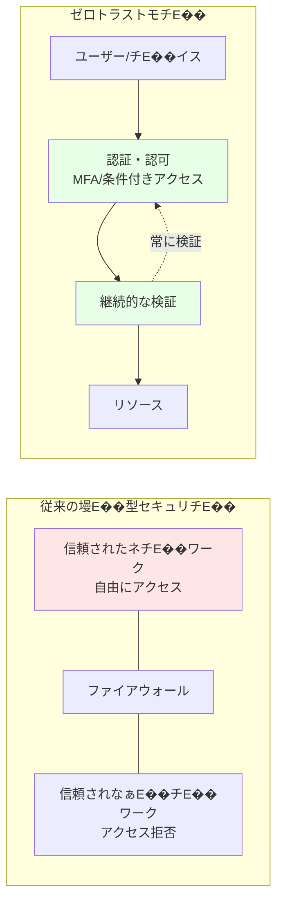

# 第 12 章 �E�Security 基盤構築！E 日目 �E�E

## 本章の目皁 E

本章では、Azure CAF Landing Zone のセキュリチ E�� 基盤を構築します、Eicrosoft Defender for Cloud、Azure Key Vault、DDoS Protection、Azure Sentinel などのサービスを実裁 E��、ゼロトラストセキュリチ E�� を実現します、E

**所要時閁 E\*: 紁 E3-4 時間  
**難易度**: ⭐⭐⭁E
**実施タイミング**: **3 日目\*\*

---

## 12.0 事前準備 �E�Management Subscription の選抁 E

本章では、セキュリチ E��・監視リソース �E�Eog Analytics Workspace、Key Vault 等）を **Management Subscription** にチ E�E ロイします、E

作業を開始する前に、忁 E�� 適刁 E�� サブスクリプションを選択してください �E�E

```bash
# Management Subscriptionに刁E��替ぁE
az account set --subscription $SUB_MANAGEMENT_ID

# 現在のサブスクリプションを確誁E
az account show --query "{Name:name, SubscriptionId:id}" -o table
```

\*_重要 E_: Log Analytics Workspace め EKey Vault は管琁 E�E 監視 �E 中核となるため、忁 E�� Management Subscription に配置してください、E

---

## 12.1 ゼロトラストセキュリチ E�� モチ E��

### 12.1.1 ゼロトラストとは

\**ゼロトラスチ E*は「決して信頼せず、常に検証する」とぁ E�� 原則に基づくセキュリチ E�� モチ E�� です、E



### 12.1.2 ゼロトラスト �E 3 原則

1. **明示皁 E�� 検証**: すべてのアクセスを認証・認可
2. **最小権限アクセス**: 忁 E�� 最小限の権限 �E み付丁 E
3. \*_侵害の想宁 E_: 侵害されたと仮定して設訁 E

---

## 12.2 Microsoft Defender for Cloud の有効匁 E

### 12.2.1 Microsoft Defender for Cloud とは

**Microsoft Defender for Cloud**�E� 旧 Azure Security Center�E��E、統合セキュリチ E�� 管琁 E�� 脁 E�� 保護を提供します、E

**機 �E**:

- セキュアスコア �E� セキュリチ E�� 評価 �E�E
- 推奨事頁 E�E 提侁 E
- 脁 E���E 検 �E とアラーチ E
- コンプライアンス評価

### 12.2.2 Defender Plans の有効匁 E

```bash
# Subscription IDを取征E
SUBSCRIPTION_ID=$(az account show --query id -o tsv)

# Defender for Serversを有効匁E
az security pricing create \
  --name VirtualMachines \
  --tier Standard

# Defender for App Serviceを有効匁E
az security pricing create \
  --name AppServices \
  --tier Standard

# Defender for Storageを有効匁E
az security pricing create \
  --name StorageAccounts \
  --tier Standard

# Defender for SQLを有効匁E
az security pricing create \
  --name SqlServers \
  --tier Standard

# Defender for Containersを有効匁E
az security pricing create \
  --name Containers \
  --tier Standard

# Defender for Key Vaultを有効匁E
az security pricing create \
  --name KeyVaults \
  --tier Standard
```

### 12.2.3 セキュリチ E�� 連絡先 �E 設宁 E

```bash
# セキュリチE��アラート�E送信先を設宁E
az security contact create \
  --email security@example.com \
  --name default \
  --alert-notifications On \
  --alerts-admins On
```

### 12.2.4 Bicep での実裁 E

#### モジュールの作 �E

ファイル `infrastructure/bicep/modules/security/defender.bicep` を作 �E し、以下 �E 冁 E�� を記述します！E

\*_defender.bicep の解説 �E�E_

Microsoft Defender for Cloud の褁 E�� の Plan�E�EirtualMachines、AppServices、StorageAccounts、SqlServers、Containers、KeyVaults�E� を有効化し、セキュリチ E�� 連絡先を設定します、E

```bicep
targetScope = 'subscription'

@description('Defender Plansの設宁E)
param defenderPlans array = [
  'VirtualMachines'
  'AppServices'
  'StorageAccounts'
  'SqlServers'
  'Containers'
  'KeyVaults'
]

@description('セキュリチE��連絡先�Eメール')
param securityContactEmail string

// Defender Plansの有効匁E
resource defenderPricing 'Microsoft.Security/pricings@2023-01-01' = [for plan in defenderPlans: {
  name: plan
  properties: {
    pricingTier: 'Standard'
  }
}]

// セキュリチE��連絡先�E設宁E
resource securityContact 'Microsoft.Security/securityContacts@2023-01-01' = {
  name: 'default'
  properties: {
    emails: securityContactEmail
    alertNotifications: {
      state: 'On'
      minimalSeverity: 'Medium'
    }
    notificationsByRole: {
      state: 'On'
      roles: [
        'Owner'
      ]
    }
  }
}

// 出劁E
output defenderPlans array = defenderPlans
output securityContactEmail string = securityContactEmail
```

#### オーケストレーションへのパラメータ追訁 E

ファイル `infrastructure/bicep/orchestration/main.bicepparam` を開き、以下を追記！E

```bicep
// =============================================================================
// Chapter 12: Security
// =============================================================================

param security = {
  defender: {
    plans: [
      'VirtualMachines'
      'AppServices'
      'StorageAccounts'
      'SqlServers'
      'Containers'
      'KeyVaults'
    ]
    securityContactEmail: 'security@example.com'
  }
  // 12.3以降で追記予宁E
}
```

#### オーケストレーションへのモジュール追加

ファイル `infrastructure/bicep/orchestration/main.bicep` を開き、以下を追記！E

```bicep
// =============================================================================
// パラメータ定義�E�既存�Eセクションに追加�E�E
// =============================================================================

@description('Security設宁E)
param security object

// =============================================================================
// モジュールチE�Eロイ�E�既存�Eセクションに追加�E�E
// =============================================================================

// Chapter 12: Defender for Cloud
module defender '../modules/security/defender.bicep' = {
  name: 'deploy-defender'
  params: {
    defenderPlans: security.defender.plans
    securityContactEmail: security.defender.securityContactEmail
  }
}
```

#### What-If による事前確誁 E

```bash
# Management Subscription に刁E��替ぁE
az account set --subscription $SUB_MANAGEMENT_ID

# What-If実衁E
az deployment sub what-if \
  --name "main-deployment-$(date +%Y%m%d-%H%M%S)" \
  --location japaneast \
  --template-file infrastructure/bicep/orchestration/main.bicep \
  --parameters infrastructure/bicep/orchestration/main.bicepparam
```

#### チ E�E ロイ実衁 E

```bash
# チE�Eロイ実衁E
az deployment sub create \
  --name "main-deployment-$(date +%Y%m%d-%H%M%S)" \
  --location japaneast \
  --template-file infrastructure/bicep/orchestration/main.bicep \
  --parameters infrastructure/bicep/orchestration/main.bicepparam

echo "✁EDefender for Cloud ぁEorchestration 経由でチE�Eロイされました"
```

---

## 12.3 Azure Key Vault

**Azure Key Vault** は第 7 章で作 �E 済みです、EitHub Personal Access Token などの機寁 E�� 報を安 �E に保管してぁ E�� す、E

Key Vault の詳細と構築手頁 E�� つぁ E�� は、E\*第 7 章 7.9.1 Key Vault の作 �E\*\* を参照してください、E

---

## 12.4 DDoS Protection

### 12.4.1 Azure DDoS Protection とは

```bicep
targetScope = 'resourceGroup'

@description('Key Vaultの名前�E�グローバルで一意！E)
@minLength(3)
@maxLength(24)
param keyVaultName string

@description('チE�Eロイ先�Eリージョン')
param location string

@description('チE��ンチED')
param tenantId string = subscription().tenantId

@description('Key Vault管琁E��E�EオブジェクチED')
param administratorObjectId string

@description('Soft Delete保持期間�E�日数�E�E)
@minValue(7)
@maxValue(90)
param softDeleteRetentionInDays int = 90

@description('タグ')
param tags object = {}

// Key Vault
resource keyVault 'Microsoft.KeyVault/vaults@2023-07-01' = {
  name: keyVaultName
  location: location
  tags: tags
  properties: {
    sku: {
      family: 'A'
      name: 'standard'
    }
    tenantId: tenantId
    enabledForDeployment: true
    enabledForDiskEncryption: true
    enabledForTemplateDeployment: true
    enableSoftDelete: true
    softDeleteRetentionInDays: softDeleteRetentionInDays
    enablePurgeProtection: true
    enableRbacAuthorization: true  // RBAC使用
    publicNetworkAccess: 'Enabled'  // 簡略化�Eため有効
    networkAcls: {
      bypass: 'AzureServices'
      defaultAction: 'Allow'
    }
  }
}

// Key Vault管琁E��E��ールの割り当て
resource kvAdministratorRoleAssignment 'Microsoft.Authorization/roleAssignments@2022-04-01' = {
  name: guid(keyVault.id, administratorObjectId, '00482a5a-887f-4fb3-b363-3b7fe8e74483')
  scope: keyVault
  properties: {
    roleDefinitionId: subscriptionResourceId('Microsoft.Authorization/roleDefinitions', '00482a5a-887f-4fb3-b363-3b7fe8e74483') // Key Vault Administrator
    principalId: administratorObjectId
    principalType: 'User'
  }
}

// 出劁E
output keyVaultId string = keyVault.id
output keyVaultName string = keyVault.name
output keyVaultUri string = keyVault.properties.vaultUri
```

\*_注愁 E_: Private Endpoint と Private DNS Zone は Chapter 13 で Hub VNet 作 �E 後に追加します、E

## 12.4 DDoS Protection

### 12.4.1 Azure DDoS Protection とは

**Azure DDoS Protection**は、DDoS 攻撁 E�� らアプリケーションを保護するサービスです、E

**プラン**:

- **Basic**: 無料、�E 動有効匁 E
- **Standard**: 高度な保護、SLA 保証

### 12.4.2 DDoS Protection Plan Bicep モジュール

ファイル `infrastructure/bicep/modules/security/ddos-protection.bicep` を作 �E し、以下 �E 冁 E�� を記述します！E

\*_ddos-protection.bicep の解説 �E�E_

Azure DDoS Protection Plan を作 �E し、Hub VNet に適用することで、DDoS 攻撁 E�� らアプリケーションを保護します、E

```bicep
@description('DDoS Protection Planの名前')
param ddosProtectionPlanName string

@description('チE�Eロイ先�Eリージョン')
param location string

@description('タグ')
param tags object = {}

// DDoS Protection Plan
resource ddosProtectionPlan 'Microsoft.Network/ddosProtectionPlans@2023-05-01' = {
  name: ddosProtectionPlanName
  location: location
  tags: tags
  properties: {}
}

// 出劁E
output ddosProtectionPlanId string = ddosProtectionPlan.id
output ddosProtectionPlanName string = ddosProtectionPlan.name
```

### 12.4.3 VNet への DDoS Protection 適用

\*_What-If による事前確認！E_

```bash
# 事前確誁E
az deployment group what-if \
  --name "ddos-deployment-$(date +%Y%m%d-%H%M%S)" \
  --resource-group rg-platform-security-prod-jpe-001 \
  --template-file infrastructure/bicep/modules/security/ddos-protection.bicep \
  --parameters \
    ddosProtectionPlanName=ddos-hub-prod-jpe-001 \
    location=japaneast
```

\*_チ E�E ロイ実行！E_

```bash
# チE�Eロイ実衁E
az deployment group create \
  --name "ddos-deployment-$(date +%Y%m%d-%H%M%S)" \
  --resource-group rg-platform-security-prod-jpe-001 \
  --template-file infrastructure/bicep/modules/security/ddos-protection.bicep \
  --parameters \
    ddosProtectionPlanName=ddos-hub-prod-jpe-001 \
    location=japaneast

# DDoS Protection PlanをHub VNetに適用
DDOS_PLAN_ID=$(az network ddos-protection show \
  --name ddos-hub-prod-jpe-001 \
  --resource-group rg-platform-security-prod-jpe-001 \
  --query id -o tsv)

az network vnet update \
  --name vnet-hub-prod-jpe-001 \
  --resource-group rg-platform-connectivity-prod-jpe-001 \
  --ddos-protection-plan $DDOS_PLAN_ID \
  --ddos-protection true
```

\*_注愁 E_: DDoS Protection Standard は紁 E¥350,000/月 �E 高コストです。テスト環墁 E�� は無効化を検討してください、E

---

## 12.5 診断設定！Eiagnostic Settings�E�E

### 12.5.1 診断設定とは

\**診断設宁 E*は、Azure リソースのログとメトリクスを収雁 E�� る仕絁 E�� です、E

\*_送信允 E_:

- Log Analytics Workspace�E� 推奨 �E�E
- Storage Account�E� 長期保管 �E�E
- Event Hubs�E�EIEM 統合！E

### 12.5.2 Log Analytics Workspace ID の取征 E

Log Analytics Workspace は第 7 章で既に作 �E 済みです。ここでは Workspace ID を取得して環墁 E�� 数に保存します！E

```bash
# Management Subscriptionに刁E��替ぁE
az account set --subscription $SUB_MANAGEMENT_ID

# Workspace IDを取征E
WORKSPACE_ID=$(az monitor log-analytics workspace show \
  --resource-group rg-platform-management-prod-jpe-001 \
  --workspace-name log-platform-prod-jpe-001 \
  --query id -o tsv)

echo "WORKSPACE_ID=$WORKSPACE_ID"

# .envファイルに保存（既に保存済みの場合�EスキチE�E�E�E
grep -q "WORKSPACE_ID=" .env || echo "WORKSPACE_ID=$WORKSPACE_ID" >> .env
```

### 12.5.3 リソースへの診断設定適用

ファイル `infrastructure/bicep/modules/monitoring/diagnostic-settings.bicep` を作 �E し、以下 �E 冁 E�� を記述します！E

\*_diagnostic-settings.bicep の解説 �E�E_

Azure リソースに診断設定を適用し、すべてのログとメトリクスめ ELog Analytics Workspace に送信する汎用モジュールです。allLogs カチ E�� リグループと AllMetrics を有効化します、E

```bicep
@description('診断設定を適用するリソースID')
param resourceId string

@description('Log Analytics Workspace ID')
param workspaceId string

@description('診断設定�E名前')
param diagnosticSettingName string = 'default'

// 診断設定（リソースごとに異なるログカチE��リがあるため、汎用皁E��記述�E�E
resource diagnosticSetting 'Microsoft.Insights/diagnosticSettings@2021-05-01-preview' = {
  name: diagnosticSettingName
  scope: resourceId
  properties: {
    workspaceId: workspaceId
    logs: [
      {
        categoryGroup: 'allLogs'
        enabled: true
        retentionPolicy: {
          enabled: false
          days: 0
        }
      }
    ]
    metrics: [
      {
        category: 'AllMetrics'
        enabled: true
        retentionPolicy: {
          enabled: false
          days: 0
        }
      }
    ]
  }
}

output diagnosticSettingId string = diagnosticSetting.id
```

### 12.5.4 Key Vault に診断設定を適用

```bash
# Log Analytics Workspace IDを取征E
LOG_WORKSPACE_ID=$(az monitor log-analytics workspace show \
  --resource-group rg-platform-management-prod-jpe-001 \
  --workspace-name log-platform-prod-jpe-001 \
  --query id -o tsv)

# Key Vaultに診断設定を適用
KEY_VAULT_ID=$(az keyvault show \
  --name kv-hub-prod-jpe-001 \
  --query id -o tsv)

az monitor diagnostic-settings create \
  --name "SendToLogAnalytics" \
  --resource $KEY_VAULT_ID \
  --workspace $LOG_WORKSPACE_ID \
  --logs '[{"categoryGroup":"allLogs","enabled":true}]' \
  --metrics '[{"category":"AllMetrics","enabled":true}]'
```

---

## 12.6 Azure Sentinel�E� オプション �E�E

### 12.6.1 Azure Sentinel とは

**Azure Sentinel**は、クラウドネイチ E�� ブ �E SIEM�E�Eecurity Information and Event Management�E� およ �E SOAR�E�Eecurity Orchestration, Automation and Response�E� サービスです、E

**機 �E**:

- セキュリチ E�� イベント �E 収集と刁 E��
- 脁 E���E 検 �E
- 自動応筁 E
- インシチ E�� ト管琁 E

### 12.6.2 Sentinel の有効化（オプション �E�E

```bash
# Sentinelソリューションを追加
az sentinel onboard \
  --resource-group rg-platform-management-prod-jpe-001 \
  --workspace-name log-platform-prod-jpe-001
```

\*_注愁 E_: Sentinel はチ E�E タ取り込み量に応じた従量課金です。大規模環墁 E�� は高コストになります、E

---

## 12.7 セキュリチ E�� ベ �E スラインの実裁 E

### 12.7.1 暗号化設宁 E

すべてのストレージとチ E�E タベ �E スで暗号化を有効化！E

ファイル `infrastructure/bicep/modules/storage/storage-account.bicep` を作 �E し、以下 �E 冁 E�� を記述します！E

\*_storage-account.bicep の解説 �E�E_

Storage Account を作 �E し、HTTPS 強制、TLS 1.2 以上、Public アクセス禁止、暗号化有効化などのセキュリチ E�� ベ �E スラインを適用します、E

```bicep
@description('Storage Accountの名前')
param storageAccountName string

@description('チE�Eロイ先�Eリージョン')
param location string

@description('タグ')
param tags object = {}

resource storageAccount 'Microsoft.Storage/storageAccounts@2023-01-01' = {
  name: storageAccountName
  location: location
  tags: tags
  sku: {
    name: 'Standard_LRS'
  }
  kind: 'StorageV2'
  properties: {
    supportsHttpsTrafficOnly: true  // HTTPS強制
    minimumTlsVersion: 'TLS1_2'    // TLS 1.2以丁E
    allowBlobPublicAccess: false   // Publicアクセス禁止
    encryption: {
      services: {
        blob: {
          enabled: true
          keyType: 'Account'
        }
        file: {
          enabled: true
          keyType: 'Account'
        }
      }
      keySource: 'Microsoft.Storage'  // Microsoft管琁E��ー
    }
  }
}

output storageAccountId string = storageAccount.id
output storageAccountName string = storageAccount.name
```

````

---

## 12.8 Azure Portal での確誁E

### 12.8.1 Microsoft Defender for Cloud の確誁E

1. Azure ポ�Eタルで「Microsoft Defender for Cloud」を検索
2. 「Overview」でセキュアスコアを確誁E
3. 「Recommendations」で推奨事頁E��確誁E
4. 「Security alerts」でアラートを確誁E

### 12.8.2 Key Vault の確誁E

1. 「Key vaults」を検索
2. 「kv-hub-prod-jpe-001」をクリチE��
3. 「Secrets」でシークレチE��を確誁E
4. 「Access policies」また�E「Access control (IAM)」でアクセス権限を確誁E
5. 「Networking」で Private Endpoint 設定を確誁E

### 12.8.3 Log Analytics の確誁E

1. 「Log Analytics workspaces」を検索
2. 「log-platform-prod-jpe-001」をクリチE��
3. 「Logs」でクエリを実行してみる！E

```kql
// Key Vaultのアクセスログ
AzureDiagnostics
| where ResourceProvider == "MICROSOFT.KEYVAULT"
| where TimeGenerated > ago(1h)
| project TimeGenerated, OperationName, ResultType, CallerIPAddress
| order by TimeGenerated desc
```

---

## 12.9 コスト管琁E

### 12.9.1 リソース別のコスチE

| リソース                 | 概算月額コスト（東日本�E�E                |
| ------------------------ | ---------------------------------------- |
| Defender for Cloud Plans | 紁E¥1,500 / サーバ�E                     |
| Key Vault Standard       | 紁E¥50 + 操作ごとの従量課釁E             |
| Log Analytics            | チE�Eタ取り込み量により変動�E�紁E¥300/GB�E�E|
| DDoS Protection Standard | 紁E¥350,000                              |
| Sentinel                 | チE�Eタ取り込み量により変動               |

### 9.9.2 コスト削減�EヒンチE

- Defender for Cloud は忁E��なリソースタイプ�Eみ有効匁E
- Log Analytics の保持期間を適刁E��設定！E0 日推奨�E�E
- DDoS Protection Standard はチE��ト環墁E��は無効匁E
- Sentinel は本番環墁E��のみ使用

---

## 12.10 Git へのコミッチE

```bash
git add .
git commit -m "Day 3: Security foundation implementation

- Enabled Microsoft Defender for Cloud with multiple plans
- Deployed Azure Key Vault with RBAC and Private Endpoint
- Configured DDoS Protection for Hub VNet
- Created Log Analytics Workspace for centralized logging
- Configured diagnostic settings for Key Vault
- Implemented security baseline (encryption, TLS 1.2)
- Created comprehensive Bicep modules for security"

git push origin main
```

---

## 12.11 章のまとめE

本章で構築したもの�E�E

1. ✁EMicrosoft Defender for Cloud

   - 褁E��の Defender Plans 有効匁E
   - セキュアスコア監要E
   - セキュリチE��連絡先設宁E

2. ✁EAzure Key Vault

   - RBAC 認証
   - Private Endpoint 統吁E
   - Soft Delete & Purge Protection

3. ✁EDDoS Protection

   - Hub VNet に適用

4. ✁ELog Analytics Workspace

   - 診断設定�E雁E��E
   - 90 日間�Eログ保持

5. ✁EセキュリチE��ベ�Eスライン
   - 暗号化強制
   - TLS 1.2 以丁E
   - Public アクセス禁止

### 重要なポインチE

- **ゼロトラスト�E実践**: すべてのアクセスを検証
- **暗号化�E徹庁E*: 保存時・転送時の両方
- **ログの雁E��E*: Log Analytics で一允E��琁E
- **コスト意譁E*: DDoS Protection と Sentinel は高コスチE

---

## 次のスチE��チE

3 日目の作業�E�Eonnectivity Subscription 作�EとセキュリチE��基盤�E�が完亁E��ました。次は 4 日目以降�E作業として、Hub Network�E�Eetworking-Hub�E��E構築に進みます、E

**注意！E 日目以降�E作業は Azure リソースの費用が発生します。実施する前に予算とコストを確認してください、E*

**24 時間後に 4 日目の作業�E�Eanding Zone Subscription 作�Eと Hub Network 構築）に進んでください、E*

👉 [第 13 章�E�Hub Network 構築！E 日目以降）](chapter13-networking-hub.md)

---

**最終更新**: 2026 年 1 朁E7 日
````
