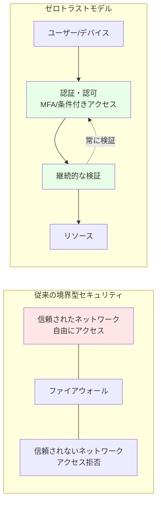

# 第 12 章：Security 基盤構築（3 日目）

## 本章の目的

本章では、Azure CAF Landing Zone のセキュリティ基盤を構築します。Microsoft Defender for Cloud、Azure Key Vault、DDoS Protection、Azure Sentinel などのサービスを実装し、ゼロトラストセキュリティを実現します。

**所要時間**: 約 3-4 時間  
**難易度**: ⭐⭐⭐  
**実施タイミング**: **3 日目**

---

## 12.0 事前準備：Management Subscription の選択

本章では、セキュリティ・監視リソース（Log Analytics Workspace、Key Vault 等）を **Management Subscription** にデプロイします。

作業を開始する前に、必ず適切なサブスクリプションを選択してください：

```bash
# Management Subscriptionに切り替え
az account set --subscription $SUB_MANAGEMENT_ID

# 現在のサブスクリプションを確認
az account show --query "{Name:name, SubscriptionId:id}" -o table
```

**重要**: Log Analytics Workspace や Key Vault は管理・監視の中核となるため、必ず Management Subscription に配置してください。

---

## 12.1 ゼロトラストセキュリティモデル

### 12.1.1 ゼロトラストとは

**ゼロトラスト**は「決して信頼せず、常に検証する」という原則に基づくセキュリティモデルです。



### 12.1.2 ゼロトラストの 3 原則

1. **明示的な検証**: すべてのアクセスを認証・認可
2. **最小権限アクセス**: 必要最小限の権限のみ付与
3. **侵害の想定**: 侵害されたと仮定して設計

---

## 12.2 Microsoft Defender for Cloud の有効化

### 12.2.1 Microsoft Defender for Cloud とは

**Microsoft Defender for Cloud**（旧 Azure Security Center）は、統合セキュリティ管理と脅威保護を提供します。

**機能**:

- セキュアスコア（セキュリティ評価）
- 推奨事項の提供
- 脅威の検出とアラート
- コンプライアンス評価

### 12.2.2 Defender Plans の有効化

```bash
# Subscription IDを取得
SUBSCRIPTION_ID=$(az account show --query id -o tsv)

# Defender for Serversを有効化
az security pricing create \
  --name VirtualMachines \
  --tier Standard

# Defender for App Serviceを有効化
az security pricing create \
  --name AppServices \
  --tier Standard

# Defender for Storageを有効化
az security pricing create \
  --name StorageAccounts \
  --tier Standard

# Defender for SQLを有効化
az security pricing create \
  --name SqlServers \
  --tier Standard

# Defender for Containersを有効化
az security pricing create \
  --name Containers \
  --tier Standard

# Defender for Key Vaultを有効化
az security pricing create \
  --name KeyVaults \
  --tier Standard
```

### 12.2.3 セキュリティ連絡先の設定

```bash
# セキュリティアラートの送信先を設定
az security contact create \
  --email security@example.com \
  --name default \
  --alert-notifications On \
  --alerts-admins On
```

### 12.2.4 Bicep での実装

#### モジュールの作成

ファイル `infrastructure/bicep/modules/security/defender.bicep` を作成し、以下の内容を記述します：

**defender.bicep の解説：**

Microsoft Defender for Cloud の複数の Plan（VirtualMachines、AppServices、StorageAccounts、SqlServers、Containers、KeyVaults）を有効化し、セキュリティ連絡先を設定します。

```bicep
targetScope = 'subscription'

@description('Defender Plansの設定')
param defenderPlans array = [
  'VirtualMachines'
  'AppServices'
  'StorageAccounts'
  'SqlServers'
  'Containers'
  'KeyVaults'
]

@description('セキュリティ連絡先のメール')
param securityContactEmail string

// Defender Plansの有効化
resource defenderPricing 'Microsoft.Security/pricings@2023-01-01' = [for plan in defenderPlans: {
  name: plan
  properties: {
    pricingTier: 'Standard'
  }
}]

// セキュリティ連絡先の設定
resource securityContact 'Microsoft.Security/securityContacts@2023-01-01' = {
  name: 'default'
  properties: {
    emails: securityContactEmail
    alertNotifications: {
      state: 'On'
      minimalSeverity: 'Medium'
    }
    notificationsByRole: {
      state: 'On'
      roles: [
        'Owner'
      ]
    }
  }
}

// 出力
output defenderPlans array = defenderPlans
output securityContactEmail string = securityContactEmail
```

#### オーケストレーションへのパラメータ追記

ファイル `infrastructure/bicep/orchestration/main.bicepparam` を開き、以下を追記：

```bicep
// =============================================================================
// Chapter 12: Security
// =============================================================================

param security = {
  defender: {
    plans: [
      'VirtualMachines'
      'AppServices'
      'StorageAccounts'
      'SqlServers'
      'Containers'
      'KeyVaults'
    ]
    securityContactEmail: 'security@example.com'
  }
  // 12.3以降で追記予定
}
```

#### オーケストレーションへのモジュール追加

ファイル `infrastructure/bicep/orchestration/main.bicep` を開き、以下を追記：

```bicep
// =============================================================================
// パラメータ定義（既存のセクションに追加）
// =============================================================================

@description('Security設定')
param security object

// =============================================================================
// モジュールデプロイ（既存のセクションに追加）
// =============================================================================

// Chapter 12: Defender for Cloud
module defender '../modules/security/defender.bicep' = {
  name: 'deploy-defender'
  params: {
    defenderPlans: security.defender.plans
    securityContactEmail: security.defender.securityContactEmail
  }
}
```

#### デプロイ実行

```bash
# Management Subscription に切り替え
az account set --subscription $SUB_MANAGEMENT_ID

# What-If実行
az deployment sub what-if \
  --name "main-deployment-$(date +%Y%m%d-%H%M%S)" \
  --location japaneast \
  --template-file infrastructure/bicep/orchestration/main.bicep \
  --parameters infrastructure/bicep/orchestration/main.bicepparam

# デプロイ実行
az deployment sub create \
  --name "main-deployment-$(date +%Y%m%d-%H%M%S)" \
  --location japaneast \
  --template-file infrastructure/bicep/orchestration/main.bicep \
  --parameters infrastructure/bicep/orchestration/main.bicepparam

echo "✅ Defender for Cloud が orchestration 経由でデプロイされました"
```

---

## 12.3 Azure Key Vault の構築

### 12.3.1 Azure Key Vault とは

**Azure Key Vault**は、シークレット、暗号化キー、証明書を安全に保管・管理するサービスです。

**ユースケース**:

- データベース接続文字列の保管
- API キーの保管
- SSL/TLS 証明書の管理
- 暗号化キーの管理

### 12.3.2 Key Vault Bicep モジュール

ファイル `infrastructure/bicep/modules/security/key-vault.bicep` を作成し、以下の内容を記述します：

**key-vault.bicep の解説：**

Azure Key Vault を構築し、RBAC 認証、Soft Delete、Purge Protection を有効化します。本ハンズオンでは簡略化のため Public Access を有効にしていますが、Chapter 13 で Hub VNet を作成後に Private Endpoint を追加できます。

```bicep
targetScope = 'resourceGroup'

@description('Key Vaultの名前（グローバルで一意）')
@minLength(3)
@maxLength(24)
param keyVaultName string

@description('デプロイ先のリージョン')
param location string

@description('テナントID')
param tenantId string = subscription().tenantId

@description('Key Vault管理者のオブジェクトID')
param administratorObjectId string

@description('Soft Delete保持期間（日数）')
@minValue(7)
@maxValue(90)
param softDeleteRetentionInDays int = 90

@description('タグ')
param tags object = {}

// Key Vault
resource keyVault 'Microsoft.KeyVault/vaults@2023-07-01' = {
  name: keyVaultName
  location: location
  tags: tags
  properties: {
    sku: {
      family: 'A'
      name: 'standard'
    }
    tenantId: tenantId
    enabledForDeployment: true
    enabledForDiskEncryption: true
    enabledForTemplateDeployment: true
    enableSoftDelete: true
    softDeleteRetentionInDays: softDeleteRetentionInDays
    enablePurgeProtection: true
    enableRbacAuthorization: true  // RBAC使用
    publicNetworkAccess: 'Enabled'  // 簡略化のため有効
    networkAcls: {
      bypass: 'AzureServices'
      defaultAction: 'Allow'
    }
  }
}

// Key Vault管理者ロールの割り当て
resource kvAdministratorRoleAssignment 'Microsoft.Authorization/roleAssignments@2022-04-01' = {
  name: guid(keyVault.id, administratorObjectId, '00482a5a-887f-4fb3-b363-3b7fe8e74483')
  scope: keyVault
  properties: {
    roleDefinitionId: subscriptionResourceId('Microsoft.Authorization/roleDefinitions', '00482a5a-887f-4fb3-b363-3b7fe8e74483') // Key Vault Administrator
    principalId: administratorObjectId
    principalType: 'User'
  }
}

// 出力
output keyVaultId string = keyVault.id
output keyVaultName string = keyVault.name
output keyVaultUri string = keyVault.properties.vaultUri
```

**注意**: Private Endpoint と Private DNS Zone は Chapter 13 で Hub VNet 作成後に追加します。

### 12.3.3 Key Vault のデプロイ

#### オーケストレーションへのパラメータ追記

自分のオブジェクト ID を取得：

```bash
# 自分のオブジェクトIDを取得
MY_OBJECT_ID=$(az ad signed-in-user show --query id -o tsv)
echo "My Object ID: $MY_OBJECT_ID"
```

ファイル `infrastructure/bicep/orchestration/main.bicepparam` を開き、`security` セクションに追記：

```bicep
param security = {
  defender: {
    plans: [
      'VirtualMachines'
      'AppServices'
      'StorageAccounts'
      'SqlServers'
      'Containers'
      'KeyVaults'
    ]
    securityContactEmail: 'security@example.com'
  }
  // 👇 12.3で追記
  resourceGroup: {
    name: 'rg-platform-security-prod-jpe-001'
    tags: {
      Environment: 'Production'
      ManagedBy: 'Bicep'
      Component: 'Security'
    }
  }
  keyVault: {
    name: 'kv-hub-prod-jpe-001'  // グローバルで一意な名前に変更してください
    administratorObjectId: 'YOUR_OBJECT_ID'  // 👆上記コマンドで取得したIDに置き換え
    softDeleteRetentionInDays: 90
    tags: {
      Environment: 'Production'
      ManagedBy: 'Bicep'
      Component: 'Security'
    }
  }
}
```

#### オーケストレーションへのモジュール追加

ファイル `infrastructure/bicep/orchestration/main.bicep` を開き、以下を追記：

```bicep
// Chapter 12: Security Resource Group
module securityRG '../modules/resource-group/resource-group.bicep' = {
  name: 'deploy-security-rg'
  params: {
    resourceGroupName: security.resourceGroup.name
    location: location
    tags: union(tags, security.resourceGroup.tags)
  }
}

// Chapter 12: Key Vault
module keyVault '../modules/security/key-vault.bicep' = {
  name: 'deploy-key-vault'
  params: {
    keyVaultName: security.keyVault.name
    location: location
    administratorObjectId: security.keyVault.administratorObjectId
    softDeleteRetentionInDays: security.keyVault.softDeleteRetentionInDays
    resourceGroupName: security.resourceGroup.name
    tags: union(tags, security.keyVault.tags)
  }
  dependsOn: [
    securityRG
  ]
}
```

#### デプロイ実行

````bash
# Management Subscription に切り替え
az account set --subscription $SUB_MANAGEMENT_ID

# What-If実行
az deployment sub what-if \
  --name "main-deployment-$(date +%Y%m%d-%H%M%S)" \
  --location japaneast \
  --template-file infrastructure/bicep/orchestration/main.bicep \
  --parameters infrastructure/bicep/orchestration/main.bicepparam

# デプロイ実行
az deployment sub create \
  --name "main-deployment-$(date +%Y%m%d-%H%M%S)" \
  --location japaneast \
  --template-file infrastructure/bicep/orchestration/main.bicep \
  --parameters infrastructure/bicep/orchestration/main.bicepparam

echo "✅ Key Vault が orchestration 経由でデプロイされました"
```

### 12.3.4 Secret の保存テスト

```bash
# Secretを保存
az keyvault secret set \
  --vault-name kv-hub-prod-jpe-001 \
  --name "DatabaseConnectionString" \
  --value "Server=myserver;Database=mydb;User=admin;Password=P@ssw0rd123!"

# Secretを取得
az keyvault secret show \
  --vault-name kv-hub-prod-jpe-001 \
  --name "DatabaseConnectionString" \
  --query value -o tsv
```

---

## 12.4 DDoS Protection

### 12.4.1 Azure DDoS Protection とは

**Azure DDoS Protection**は、DDoS 攻撃からアプリケーションを保護するサービスです。

**プラン**:

- **Basic**: 無料、自動有効化
- **Standard**: 高度な保護、SLA 保証

### 12.4.2 DDoS Protection Plan Bicep モジュール

ファイル `infrastructure/bicep/modules/security/ddos-protection.bicep` を作成し、以下の内容を記述します：

**ddos-protection.bicep の解説：**

Azure DDoS Protection Plan を作成し、Hub VNet に適用することで、DDoS 攻撃からアプリケーションを保護します。

```bicep
@description('DDoS Protection Planの名前')
param ddosProtectionPlanName string

@description('デプロイ先のリージョン')
param location string

@description('タグ')
param tags object = {}

// DDoS Protection Plan
resource ddosProtectionPlan 'Microsoft.Network/ddosProtectionPlans@2023-05-01' = {
  name: ddosProtectionPlanName
  location: location
  tags: tags
  properties: {}
}

// 出力
output ddosProtectionPlanId string = ddosProtectionPlan.id
output ddosProtectionPlanName string = ddosProtectionPlan.name
```

### 12.4.3 VNet への DDoS Protection 適用

**What-If による事前確認：**

```bash
# 事前確認
az deployment group what-if \
  --name "ddos-deployment-$(date +%Y%m%d-%H%M%S)" \
  --resource-group rg-platform-security-prod-jpe-001 \
  --template-file infrastructure/bicep/modules/security/ddos-protection.bicep \
  --parameters \
    ddosProtectionPlanName=ddos-hub-prod-jpe-001 \
    location=japaneast
```

**デプロイ実行：**

```bash
# デプロイ実行
az deployment group create \
  --name "ddos-deployment-$(date +%Y%m%d-%H%M%S)" \
  --resource-group rg-platform-security-prod-jpe-001 \
  --template-file infrastructure/bicep/modules/security/ddos-protection.bicep \
  --parameters \
    ddosProtectionPlanName=ddos-hub-prod-jpe-001 \
    location=japaneast

# DDoS Protection PlanをHub VNetに適用
DDOS_PLAN_ID=$(az network ddos-protection show \
  --name ddos-hub-prod-jpe-001 \
  --resource-group rg-platform-security-prod-jpe-001 \
  --query id -o tsv)

az network vnet update \
  --name vnet-hub-prod-jpe-001 \
  --resource-group rg-platform-connectivity-prod-jpe-001 \
  --ddos-protection-plan $DDOS_PLAN_ID \
  --ddos-protection true
```

**注意**: DDoS Protection Standard は約 ¥350,000/月の高コストです。テスト環境では無効化を検討してください。

---

## 12.5 診断設定（Diagnostic Settings）

### 12.5.1 診断設定とは

**診断設定**は、Azure リソースのログとメトリクスを収集する仕組みです。

**送信先**:

- Log Analytics Workspace（推奨）
- Storage Account（長期保管）
- Event Hubs（SIEM 統合）

### 12.5.2 Log Analytics Workspace ID の取得

Log Analytics Workspace は第 7 章で既に作成済みです。ここでは Workspace ID を取得して環境変数に保存します：

```bash
# Management Subscriptionに切り替え
az account set --subscription $SUB_MANAGEMENT_ID

# Workspace IDを取得
WORKSPACE_ID=$(az monitor log-analytics workspace show \
  --resource-group rg-platform-management-prod-jpe-001 \
  --workspace-name log-platform-prod-jpe-001 \
  --query id -o tsv)

echo "WORKSPACE_ID=$WORKSPACE_ID"

# .envファイルに保存（既に保存済みの場合はスキップ）
grep -q "WORKSPACE_ID=" .env || echo "WORKSPACE_ID=$WORKSPACE_ID" >> .env
```

### 12.5.3 リソースへの診断設定適用

ファイル `infrastructure/bicep/modules/monitoring/diagnostic-settings.bicep` を作成し、以下の内容を記述します：

**diagnostic-settings.bicep の解説：**

Azure リソースに診断設定を適用し、すべてのログとメトリクスを Log Analytics Workspace に送信する汎用モジュールです。allLogs カテゴリグループと AllMetrics を有効化します。

```bicep
@description('診断設定を適用するリソースID')
param resourceId string

@description('Log Analytics Workspace ID')
param workspaceId string

@description('診断設定の名前')
param diagnosticSettingName string = 'default'

// 診断設定（リソースごとに異なるログカテゴリがあるため、汎用的に記述）
resource diagnosticSetting 'Microsoft.Insights/diagnosticSettings@2021-05-01-preview' = {
  name: diagnosticSettingName
  scope: resourceId
  properties: {
    workspaceId: workspaceId
    logs: [
      {
        categoryGroup: 'allLogs'
        enabled: true
        retentionPolicy: {
          enabled: false
          days: 0
        }
      }
    ]
    metrics: [
      {
        category: 'AllMetrics'
        enabled: true
        retentionPolicy: {
          enabled: false
          days: 0
        }
      }
    ]
  }
}

output diagnosticSettingId string = diagnosticSetting.id
```

### 12.5.4 Key Vault に診断設定を適用

```bash
# Log Analytics Workspace IDを取得
LOG_WORKSPACE_ID=$(az monitor log-analytics workspace show \
  --resource-group rg-platform-management-prod-jpe-001 \
  --workspace-name log-platform-prod-jpe-001 \
  --query id -o tsv)

# Key Vaultに診断設定を適用
KEY_VAULT_ID=$(az keyvault show \
  --name kv-hub-prod-jpe-001 \
  --query id -o tsv)

az monitor diagnostic-settings create \
  --name "SendToLogAnalytics" \
  --resource $KEY_VAULT_ID \
  --workspace $LOG_WORKSPACE_ID \
  --logs '[{"categoryGroup":"allLogs","enabled":true}]' \
  --metrics '[{"category":"AllMetrics","enabled":true}]'
```

---

## 12.6 Azure Sentinel（オプション）

### 12.6.1 Azure Sentinel とは

**Azure Sentinel**は、クラウドネイティブの SIEM（Security Information and Event Management）および SOAR（Security Orchestration, Automation and Response）サービスです。

**機能**:

- セキュリティイベントの収集と分析
- 脅威の検出
- 自動応答
- インシデント管理

### 12.6.2 Sentinel の有効化（オプション）

```bash
# Sentinelソリューションを追加
az sentinel onboard \
  --resource-group rg-platform-management-prod-jpe-001 \
  --workspace-name log-platform-prod-jpe-001
```

**注意**: Sentinel はデータ取り込み量に応じた従量課金です。大規模環境では高コストになります。

---

## 12.7 セキュリティベースラインの実装

### 12.7.1 暗号化設定

すべてのストレージとデータベースで暗号化を有効化：

ファイル `infrastructure/bicep/modules/storage/storage-account.bicep` を作成し、以下の内容を記述します：

**storage-account.bicep の解説：**

Storage Account を作成し、HTTPS 強制、TLS 1.2 以上、Public アクセス禁止、暗号化有効化などのセキュリティベースラインを適用します。

```bicep
@description('Storage Accountの名前')
param storageAccountName string

@description('デプロイ先のリージョン')
param location string

@description('タグ')
param tags object = {}

resource storageAccount 'Microsoft.Storage/storageAccounts@2023-01-01' = {
  name: storageAccountName
  location: location
  tags: tags
  sku: {
    name: 'Standard_LRS'
  }
  kind: 'StorageV2'
  properties: {
    supportsHttpsTrafficOnly: true  // HTTPS強制
    minimumTlsVersion: 'TLS1_2'    // TLS 1.2以上
    allowBlobPublicAccess: false   // Publicアクセス禁止
    encryption: {
      services: {
        blob: {
          enabled: true
          keyType: 'Account'
        }
        file: {
          enabled: true
          keyType: 'Account'
        }
      }
      keySource: 'Microsoft.Storage'  // Microsoft管理キー
    }
  }
}

output storageAccountId string = storageAccount.id
output storageAccountName string = storageAccount.name
```

````

---

## 12.8 Azure Portal での確認

### 12.8.1 Microsoft Defender for Cloud の確認

1. Azure ポータルで「Microsoft Defender for Cloud」を検索
2. 「Overview」でセキュアスコアを確認
3. 「Recommendations」で推奨事項を確認
4. 「Security alerts」でアラートを確認

### 12.8.2 Key Vault の確認

1. 「Key vaults」を検索
2. 「kv-hub-prod-jpe-001」をクリック
3. 「Secrets」でシークレットを確認
4. 「Access policies」または「Access control (IAM)」でアクセス権限を確認
5. 「Networking」で Private Endpoint 設定を確認

### 12.8.3 Log Analytics の確認

1. 「Log Analytics workspaces」を検索
2. 「log-platform-prod-jpe-001」をクリック
3. 「Logs」でクエリを実行してみる：

```kql
// Key Vaultのアクセスログ
AzureDiagnostics
| where ResourceProvider == "MICROSOFT.KEYVAULT"
| where TimeGenerated > ago(1h)
| project TimeGenerated, OperationName, ResultType, CallerIPAddress
| order by TimeGenerated desc
```

---

## 12.9 コスト管理

### 12.9.1 リソース別のコスト

| リソース                 | 概算月額コスト（東日本）                 |
| ------------------------ | ---------------------------------------- |
| Defender for Cloud Plans | 約 ¥1,500 / サーバー                     |
| Key Vault Standard       | 約 ¥50 + 操作ごとの従量課金              |
| Log Analytics            | データ取り込み量により変動（約 ¥300/GB） |
| DDoS Protection Standard | 約 ¥350,000                              |
| Sentinel                 | データ取り込み量により変動               |

### 9.9.2 コスト削減のヒント

- Defender for Cloud は必要なリソースタイプのみ有効化
- Log Analytics の保持期間を適切に設定（90 日推奨）
- DDoS Protection Standard はテスト環境では無効化
- Sentinel は本番環境でのみ使用

---

## 12.10 Git へのコミット

```bash
git add .
git commit -m "Day 3: Security foundation implementation

- Enabled Microsoft Defender for Cloud with multiple plans
- Deployed Azure Key Vault with RBAC and Private Endpoint
- Configured DDoS Protection for Hub VNet
- Created Log Analytics Workspace for centralized logging
- Configured diagnostic settings for Key Vault
- Implemented security baseline (encryption, TLS 1.2)
- Created comprehensive Bicep modules for security"

git push origin main
```

---

## 12.11 章のまとめ

本章で構築したもの：

1. ✅ Microsoft Defender for Cloud

   - 複数の Defender Plans 有効化
   - セキュアスコア監視
   - セキュリティ連絡先設定

2. ✅ Azure Key Vault

   - RBAC 認証
   - Private Endpoint 統合
   - Soft Delete & Purge Protection

3. ✅ DDoS Protection

   - Hub VNet に適用

4. ✅ Log Analytics Workspace

   - 診断設定の集約
   - 90 日間のログ保持

5. ✅ セキュリティベースライン
   - 暗号化強制
   - TLS 1.2 以上
   - Public アクセス禁止

### 重要なポイント

- **ゼロトラストの実践**: すべてのアクセスを検証
- **暗号化の徹底**: 保存時・転送時の両方
- **ログの集約**: Log Analytics で一元管理
- **コスト意識**: DDoS Protection と Sentinel は高コスト

---

## 次のステップ

3 日目の作業（Connectivity Subscription 作成とセキュリティ基盤）が完了しました。次は 4 日目以降の作業として、Hub Network（Networking-Hub）の構築に進みます。

**注意：4 日目以降の作業は Azure リソースの費用が発生します。実施する前に予算とコストを確認してください。**

**24 時間後に 4 日目の作業（Landing Zone Subscription 作成と Hub Network 構築）に進んでください。**

👉 [第 13 章：Hub Network 構築（4 日目以降）](chapter13-networking-hub.md)

---

**最終更新**: 2026 年 1 月 7 日
