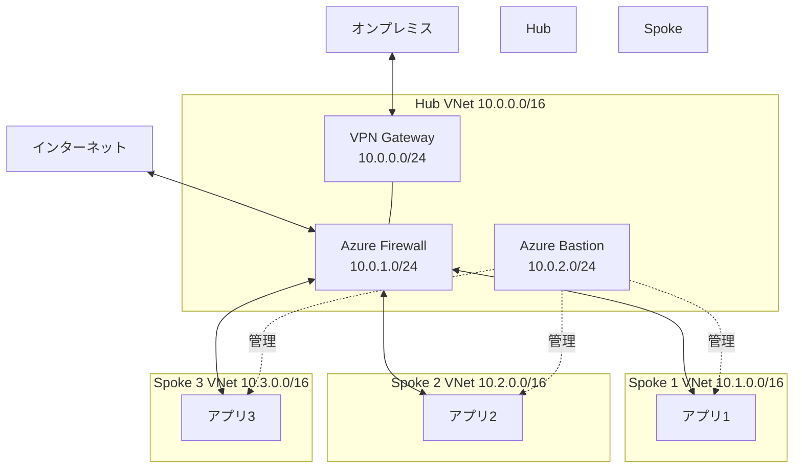

# 第 13 章：Hub Network 構築（4 日目以降）

## 本章の目的

本章では、Hub-Spoke ネットワークトポロジーの中心となる Hub VNet を構築します。Azure Firewall、Azure Bastion、VPN Gateway など、集中管理されたネットワークサービスを実装します。

**所要時間**: 約 4-6 時間  
**難易度**: ⭐⭐⭐  
**実施タイミング**: **4 日目以降**  
**注意**: この章から Azure リソースの費用が発生します（Azure Firewall、Bastion など）

**重要な注意事項：パラメーターの管理について**

この章では、2 種類のパラメーターを使用します：

1. **静的なパラメーター（パラメーターファイルで管理）**

   - リソース名、リージョン、IP アドレス範囲などの固定値
   - 例：`.parameters.json` ファイルに記述

2. **動的なパラメーター（CLI で注入）**
   - 前のデプロイで作成されたリソースの ID を取得して使用
   - 例：Subnet ID、Public IP ID など
   - これらは環境ごとに異なるため、パラメーターファイルに固定できません
   - `az ... show` コマンドで取得し、`--parameters` で注入します

この使い分けにより、環境間での再現性と柔軟性を両立します。

---

## 13.0 事前準備：Connectivity Subscription の選択

本章では、Hub Network リソース（Hub VNet、Azure Firewall、Azure Bastion 等）を **Connectivity Subscription** にデプロイします。

作業を開始する前に、必ず適切なサブスクリプションを選択してください：

```bash
# Connectivity Subscriptionに切り替え
az account set --subscription $SUB_CONNECTIVITY_ID

# 現在のサブスクリプションを確認
az account show --query "{Name:name, SubscriptionId:id}" -o table
```

**重要**: この確認を怠ると、誤ったサブスクリプションにリソースがデプロイされ、CAF の設計原則に反する構成になります。

---

## 13.1 Hub-Spoke ネットワークトポロジーの理解

### 13.1.1 Hub-Spoke とは

**Hub-Spoke**は、中央の Hub VNet と複数の Spoke VNet を接続するネットワークアーキテクチャです。



### 13.1.2 Hub の役割

**集中管理サービス**:

- Azure Firewall: すべてのトラフィック制御
- Azure Bastion: 安全な管理アクセス
- VPN Gateway / ExpressRoute: オンプレミス接続
- DNS: プライベート DNS 解決

**メリット**:

- セキュリティの一元管理
- コスト効率（共有リソース）
- トラフィックの可視化
- 運用の簡素化

---

## 13.2 IP アドレス設計

### 13.2.1 アドレス空間の計画

慎重に計画する必要があります（後から変更が困難）。

**本ハンズオンの割り当て**:

```
Hub VNet:      10.0.0.0/16  (65,536 IP)
Spoke 1 VNet:  10.1.0.0/16  (65,536 IP)
Spoke 2 VNet:  10.2.0.0/16  (65,536 IP)
...
予備:          10.10.0.0/16 - 10.255.0.0/16
```

### 13.2.2 Hub VNet のサブネット設計

| サブネット名        | CIDR        | 用途                     | 予約 IP |
| ------------------- | ----------- | ------------------------ | ------- |
| GatewaySubnet       | 10.0.0.0/24 | VPN/ExpressRoute Gateway | 5       |
| AzureFirewallSubnet | 10.0.1.0/24 | Azure Firewall           | 5       |
| AzureBastionSubnet  | 10.0.2.0/24 | Azure Bastion            | 5       |
| ManagementSubnet    | 10.0.3.0/24 | 管理用 VM 等             | 5       |
| (予約)              | 10.0.4.0/22 | 将来の拡張               | -       |

**注意**: GatewaySubnet、AzureFirewallSubnet、AzureBastionSubnet は名前固定です。

---

## 13.3 Hub VNet の構築

### 13.3.1 Resource Group の作成

Hub Network 用の Resource Group を Bicep で作成します。

#### オーケストレーションへのパラメータ追記

ファイル `infrastructure/bicep/orchestration/main.bicepparam` を開き、以下を追記：

```bicep
// =============================================================================
// Chapter 13: Networking Hub
// =============================================================================

param networking = {
  resourceGroup: {
    name: 'rg-platform-connectivity-prod-jpe-001'
    tags: {
      Environment: 'Production'
      ManagedBy: 'Bicep'
      Project: 'CAF-Landing-Zone'
      Component: 'Connectivity'
    }
  }
  // 13.3.2以降で追記予定
}
```

#### オーケストレーションへのモジュール追加

ファイル `infrastructure/bicep/orchestration/main.bicep` を開き、以下を追記：

```bicep
// =============================================================================
// パラメータ定義（既存のセクションに追加）
// =============================================================================

@description('Networking設定')
param networking object

// =============================================================================
// モジュールデプロイ（既存のセクションに追加）
// =============================================================================

// Chapter 13: Connectivity Resource Group
module connectivityRG '../modules/resource-group/resource-group.bicep' = {
  name: 'deploy-connectivity-rg'
  params: {
    resourceGroupName: networking.resourceGroup.name
    location: location
    tags: union(tags, networking.resourceGroup.tags)
  }
}
```

**注意**: この段階では Connectivity Subscription に切り替える必要があります。

### 13.3.2 Hub VNet Bicep モジュールの作成

```bash
# Hub VNetモジュールを作成
mkdir -p infrastructure/bicep/modules/networking
```

ファイル `infrastructure/bicep/modules/networking/hub-vnet.bicep` を作成し、以下の内容を記述します：

**hub-vnet.bicep の解説：**

Hub VNet を作成し、GatewaySubnet、AzureFirewallSubnet、AzureBastionSubnet、ManagementSubnet の 4 つのサブネットを定義します。Management Subnet 用の NSG では、Bastion からの RDP/SSH アクセスのみを許可します。

```bicep
targetScope = 'resourceGroup'

@description('Hub VNetの名前')
param vnetName string

@description('デプロイ先のリージョン')
param location string

@description('Hub VNetのアドレス空間')
param addressPrefix string = '10.0.0.0/16'

@description('タグ')
param tags object = {}

// Management Subnet用のNSG
resource managementNsg 'Microsoft.Network/networkSecurityGroups@2023-05-01' = {
  name: '${vnetName}-management-nsg'
  location: location
  tags: tags
  properties: {
    securityRules: [
      {
        name: 'AllowRDPFromBastion'
        properties: {
          priority: 100
          direction: 'Inbound'
          access: 'Allow'
          protocol: 'Tcp'
          sourcePortRange: '*'
          destinationPortRange: '3389'
          sourceAddressPrefix: '10.0.2.0/24'  // Bastion subnet
          destinationAddressPrefix: '*'
        }
      }
      {
        name: 'AllowSSHFromBastion'
        properties: {
          priority: 110
          direction: 'Inbound'
          access: 'Allow'
          protocol: 'Tcp'
          sourcePortRange: '*'
          destinationPortRange: '22'
          sourceAddressPrefix: '10.0.2.0/24'  // Bastion subnet
          destinationAddressPrefix: '*'
        }
      }
      {
        name: 'DenyAllInbound'
        properties: {
          priority: 4096
          direction: 'Inbound'
          access: 'Deny'
          protocol: '*'
          sourcePortRange: '*'
          destinationPortRange: '*'
          sourceAddressPrefix: '*'
          destinationAddressPrefix: '*'
        }
      }
    ]
  }
}

// Hub VNetの作成
resource hubVNet 'Microsoft.Network/virtualNetworks@2023-05-01' = {
  name: vnetName
  location: location
  tags: tags
  properties: {
    addressSpace: {
      addressPrefixes: [
        addressPrefix
      ]
    }
    subnets: [
      {
        name: 'GatewaySubnet'
        properties: {
          addressPrefix: '10.0.0.0/24'
        }
      }
      {
        name: 'AzureFirewallSubnet'
        properties: {
          addressPrefix: '10.0.1.0/24'
        }
      }
      {
        name: 'AzureBastionSubnet'
        properties: {
          addressPrefix: '10.0.2.0/24'
        }
      }
      {
        name: 'ManagementSubnet'
        properties: {
          addressPrefix: '10.0.3.0/24'
          networkSecurityGroup: {
            id: managementNsg.id
          }
        }
      }
    ]
  }
}

// 出力
output vnetId string = hubVNet.id
output vnetName string = hubVNet.name
output gatewaySubnetId string = hubVNet.properties.subnets[0].id
output firewallSubnetId string = hubVNet.properties.subnets[1].id
output bastionSubnetId string = hubVNet.properties.subnets[2].id
output managementSubnetId string = hubVNet.properties.subnets[3].id
```

### 13.3.3 Hub VNet のデプロイ

#### オーケストレーションへのパラメータ追記

ファイル `infrastructure/bicep/orchestration/main.bicepparam` を開き、`networking` セクションに追記：

```bicep
param networking = {
  resourceGroup: {
    name: 'rg-platform-connectivity-prod-jpe-001'
    tags: {
      Environment: 'Production'
      ManagedBy: 'Bicep'
      Project: 'CAF-Landing-Zone'
      Component: 'Connectivity'
    }
  }
  // 👇 13.3.2で追記
  hubVNet: {
    name: 'vnet-hub-prod-jpe-001'
    addressPrefix: '10.0.0.0/16'
    tags: {
      Environment: 'Production'
      ManagedBy: 'Bicep'
      Component: 'Hub-Network'
    }
  }
}
```

#### オーケストレーションへのモジュール追加

ファイル `infrastructure/bicep/orchestration/main.bicep` を開き、以下を追記：

```bicep
// Chapter 13: Hub VNet
module hubVNet '../modules/networking/hub-vnet.bicep' = {
  name: 'deploy-hub-vnet'
  params: {
    vnetName: networking.hubVNet.name
    location: location
    addressPrefix: networking.hubVNet.addressPrefix
    resourceGroupName: networking.resourceGroup.name
    tags: union(tags, networking.hubVNet.tags)
  }
  dependsOn: [
    connectivityRG
  ]
}
```

#### What-If による事前確認

**重要**: Connectivity Subscription に切り替えてからデプロイします。

```bash
# Connectivity Subscriptionに切り替え
az account set --subscription $SUB_CONNECTIVITY_ID

# 現在のサブスクリプションを確認
az account show --query "{Name:name, SubscriptionId:id}" -o table

# What-If実行
az deployment sub what-if \
  --name "main-deployment-$(date +%Y%m%d-%H%M%S)" \
  --location japaneast \
  --template-file infrastructure/bicep/orchestration/main.bicep \
  --parameters infrastructure/bicep/orchestration/main.bicepparam
```

#### デプロイ実行

```bash
# デプロイ実行
az deployment sub create \
  --name "main-deployment-$(date +%Y%m%d-%H%M%S)" \
  --location japaneast \
  --template-file infrastructure/bicep/orchestration/main.bicep \
  --parameters infrastructure/bicep/orchestration/main.bicepparam

echo "✅ Hub VNet が orchestration 経由でデプロイされました"
```

---

## 13.4 Azure Firewall の構築

### 13.4.1 Azure Firewall とは

**Azure Firewall**は、フルマネージドのネットワークファイアウォールサービスです。

**機能**:

- L3-L7 トラフィックフィルタリング
- アプリケーションルール（FQDN ベース）
- ネットワークルール（IP/ポート ベース）
- 脅威インテリジェンス
- IDPS（侵入検知・防止）

### 13.4.2 Firewall Bicep モジュールの作成

ファイル `infrastructure/bicep/modules/networking/firewall.bicep` を作成し、以下の内容を記述します：

**firewall.bicep の解説：**

Azure Firewall を構築し、Firewall Policy を作成、Network Rule（HTTP/HTTPS、DNS）と Application Rule（Azure サービスへのアクセス）を設定します。脅威インテリジェンス機能を有効化し、Public IP を割り当てます。

```bicep
targetScope = 'resourceGroup'

@description('Azure Firewallの名前')
param firewallName string

@description('デプロイ先のリージョン')
param location string

@description('Firewall Subnet ID')
param firewallSubnetId string

@description('Firewall SKU')
@allowed([
  'Standard'
  'Premium'
])
param skuTier string = 'Standard'

@description('タグ')
param tags object = {}

// Public IP (Firewall用)
resource firewallPublicIP 'Microsoft.Network/publicIPAddresses@2023-05-01' = {
  name: '${firewallName}-pip'
  location: location
  tags: tags
  sku: {
    name: 'Standard'
  }
  properties: {
    publicIPAllocationMethod: 'Static'
    publicIPAddressVersion: 'IPv4'
  }
}

// Firewall Policy
resource firewallPolicy 'Microsoft.Network/firewallPolicies@2023-05-01' = {
  name: '${firewallName}-policy'
  location: location
  tags: tags
  properties: {
    sku: {
      tier: skuTier
    }
    threatIntelMode: 'Alert'
    intrusionDetection: skuTier == 'Premium' ? {
      mode: 'Alert'
    } : null
  }
}

// Network Rule Collection Group
resource networkRuleCollectionGroup 'Microsoft.Network/firewallPolicies/ruleCollectionGroups@2023-05-01' = {
  name: 'DefaultNetworkRuleCollectionGroup'
  parent: firewallPolicy
  properties: {
    priority: 200
    ruleCollections: [
      {
        name: 'AllowOutboundInternet'
        priority: 100
        ruleCollectionType: 'FirewallPolicyFilterRuleCollection'
        action: {
          type: 'Allow'
        }
        rules: [
          {
            name: 'AllowHTTP'
            ruleType: 'NetworkRule'
            ipProtocols: [
              'TCP'
            ]
            sourceAddresses: [
              '10.0.0.0/8'  // すべてのプライベートIP
            ]
            destinationAddresses: [
              '*'
            ]
            destinationPorts: [
              '80'
              '443'
            ]
          }
          {
            name: 'AllowDNS'
            ruleType: 'NetworkRule'
            ipProtocols: [
              'UDP'
            ]
            sourceAddresses: [
              '10.0.0.0/8'
            ]
            destinationAddresses: [
              '*'
            ]
            destinationPorts: [
              '53'
            ]
          }
        ]
      }
    ]
  }
}

// Application Rule Collection Group
resource applicationRuleCollectionGroup 'Microsoft.Network/firewallPolicies/ruleCollectionGroups@2023-05-01' = {
  name: 'DefaultApplicationRuleCollectionGroup'
  parent: firewallPolicy
  properties: {
    priority: 300
    ruleCollections: [
      {
        name: 'AllowAzureServices'
        priority: 100
        ruleCollectionType: 'FirewallPolicyFilterRuleCollection'
        action: {
          type: 'Allow'
        }
        rules: [
          {
            name: 'AllowAzureCloud'
            ruleType: 'ApplicationRule'
            protocols: [
              {
                protocolType: 'Https'
                port: 443
              }
            ]
            sourceAddresses: [
              '10.0.0.0/8'
            ]
            targetFqdns: [
              '*.azure.com'
              '*.microsoft.com'
              '*.windows.net'
            ]
          }
        ]
      }
    ]
  }
  dependsOn: [
    networkRuleCollectionGroup
  ]
}

// Azure Firewall
resource firewall 'Microsoft.Network/azureFirewalls@2023-05-01' = {
  name: firewallName
  location: location
  tags: tags
  properties: {
    sku: {
      name: 'AZFW_VNet'
      tier: skuTier
    }
    ipConfigurations: [
      {
        name: 'firewallIpConfig'
        properties: {
          subnet: {
            id: firewallSubnetId
          }
          publicIPAddress: {
            id: firewallPublicIP.id
          }
        }
      }
    ]
    firewallPolicy: {
      id: firewallPolicy.id
    }
  }
  scope: resourceGroup
}

// 出力
output firewallId string = firewall.id
output firewallName string = firewall.name
output firewallPrivateIP string = firewall.properties.ipConfigurations[0].properties.privateIPAddress
output firewallPublicIP string = firewallPublicIP.properties.ipAddress
output firewallPolicyId string = firewallPolicy.id
```

### 13.4.3 Firewall のデプロイ

#### オーケストレーションへのパラメータ追記

ファイル `infrastructure/bicep/orchestration/main.bicepparam` を開き、`networking` セクションに追記：

```bicep
param networking = {
  // ... 既存の設定 ...
  // 👇 13.4.3で追記
  firewall: {
    name: 'afw-hub-prod-jpe-001'
    skuTier: 'Standard'
    tags: {
      Environment: 'Production'
      ManagedBy: 'Bicep'
      Component: 'Hub-Firewall'
    }
  }
}
```

#### オーケストレーションへのモジュール追加

ファイル `infrastructure/bicep/orchestration/main.bicep` を開き、以下を追記：

```bicep
// Chapter 13: Azure Firewall
module firewall '../modules/networking/firewall.bicep' = {
  name: 'deploy-firewall'
  params: {
    firewallName: networking.firewall.name
    location: location
    firewallSubnetId: '${hubVNet.outputs.vnetId}/subnets/AzureFirewallSubnet'
    skuTier: networking.firewall.skuTier
    resourceGroupName: networking.resourceGroup.name
    tags: union(tags, networking.firewall.tags)
  }
  dependsOn: [
    hubVNet
  ]
}
```

#### What-If による事前確認

```bash
# Connectivity Subscriptionに切り替え
az account set --subscription $SUB_CONNECTIVITY_ID

# What-If実行
az deployment sub what-if \
  --name "main-deployment-$(date +%Y%m%d-%H%M%S)" \
  --location japaneast \
  --template-file infrastructure/bicep/orchestration/main.bicep \
  --parameters infrastructure/bicep/orchestration/main.bicepparam
```

#### デプロイ実行

```bash
# デプロイ実行（10-15分かかります）
az deployment sub create \
  --name "main-deployment-$(date +%Y%m%d-%H%M%S)" \
  --location japaneast \
  --template-file infrastructure/bicep/orchestration/main.bicep \
  --parameters infrastructure/bicep/orchestration/main.bicepparam

echo "✅ Azure Firewall が orchestration 経由でデプロイされました"
```

**注意**: Azure Firewall のデプロイには 10-15 分かかります。コーヒーブレイクをどうぞ ☕

---

## 13.5 Azure Bastion の構築

### 13.5.1 Azure Bastion とは

**Azure Bastion**は、ブラウザベースの安全な RDP/SSH アクセスを提供するサービスです。

**メリット**:

- Public IP アドレス不要
- NSG で 3389/22 ポートを開ける必要なし
- MFA と統合
- セッション録画可能

### 13.5.2 Bastion Bicep モジュール

ファイル `infrastructure/bicep/modules/networking/bastion.bicep` を作成し、以下の内容を記述します：

**bastion.bicep の解説：**

Azure Bastion を構築し、ブラウザベースの安全な RDP/SSH アクセスを提供します。Standard SKU を使用し、Public IP を割り当て、Bastion Subnet にデプロイします。

```bicep
targetScope = 'resourceGroup'

@description('Azure Bastionの名前')
param bastionName string

@description('デプロイ先のリージョン')
param location string

@description('Bastion Subnet ID')
param bastionSubnetId string

@description('Bastion SKU')
@allowed([
  'Basic'
  'Standard'
])
param skuName string = 'Standard'

@description('タグ')
param tags object = {}

// Public IP (Bastion用)
resource bastionPublicIP 'Microsoft.Network/publicIPAddresses@2023-05-01' = {
  name: '${bastionName}-pip'
  location: location
  tags: tags
  sku: {
    name: 'Standard'
  }
  properties: {
    publicIPAllocationMethod: 'Static'
    publicIPAddressVersion: 'IPv4'
  }
}

// Azure Bastion
resource bastion 'Microsoft.Network/bastionHosts@2023-05-01' = {
  name: bastionName
  location: location
  tags: tags
  sku: {
    name: skuName
  }
  properties: {
    ipConfigurations: [
      {
        name: 'bastionIpConfig'
        properties: {
          subnet: {
            id: bastionSubnetId
          }
          publicIPAddress: {
            id: bastionPublicIP.id
          }
        }
      }
    ]
  }
}

// 出力
output bastionId string = bastion.id
output bastionName string = bastion.name
output bastionPublicIP string = bastionPublicIP.properties.ipAddress
```

### 13.5.3 Bastion のデプロイ

#### オーケストレーションへのパラメータ追記

ファイル `infrastructure/bicep/orchestration/main.bicepparam` を開き、`networking` セクションに追記：

```bicep
param networking = {
  // ... 既存の設定 ...
  // 👇 13.5.3で追記
  bastion: {
    name: 'bas-hub-prod-jpe-001'
    skuName: 'Standard'
    tags: {
      Environment: 'Production'
      ManagedBy: 'Bicep'
      Component: 'Hub-Bastion'
    }
  }
}
```

#### オーケストレーションへのモジュール追加

ファイル `infrastructure/bicep/orchestration/main.bicep` を開き、以下を追記：

```bicep
// Chapter 13: Azure Bastion
module bastion '../modules/networking/bastion.bicep' = {
  name: 'deploy-bastion'
  params: {
    bastionName: networking.bastion.name
    location: location
    bastionSubnetId: '${hubVNet.outputs.vnetId}/subnets/AzureBastionSubnet'
    skuName: networking.bastion.skuName
    resourceGroupName: networking.resourceGroup.name
    tags: union(tags, networking.bastion.tags)
  }
  dependsOn: [
    hubVNet
  ]
}
```

#### What-If による事前確認

```bash
# Connectivity Subscriptionに切り替え
az account set --subscription $SUB_CONNECTIVITY_ID

# What-If実行
az deployment sub what-if \
  --name "main-deployment-$(date +%Y%m%d-%H%M%S)" \
  --location japaneast \
  --template-file infrastructure/bicep/orchestration/main.bicep \
  --parameters infrastructure/bicep/orchestration/main.bicepparam
```

#### デプロイ実行

```bash
# デプロイ実行（5-10分かかります）
az deployment sub create \
  --name "main-deployment-$(date +%Y%m%d-%H%M%S)" \
  --location japaneast \
  --template-file infrastructure/bicep/orchestration/main.bicep \
  --parameters infrastructure/bicep/orchestration/main.bicepparam

echo "✅ Azure Bastion が orchestration 経由でデプロイされました"
```

---

## 13.6 Route Table の構築

### 13.6.1 UDR（User Defined Routes）

すべてのトラフィックを Firewall 経由にするため、Route Table を設定します。

ファイル `infrastructure/bicep/modules/networking/route-table.bicep` を作成し、以下の内容を記述します：

**route-table.bicep の解説：**

Route Table を作成し、デフォルトルート（0.0.0.0/0）と Spoke VNet へのルートを設定します。すべてのトラフィックが Azure Firewall を経由するように、nextHopType を VirtualAppliance に設定します。

```bicep
targetScope = 'resourceGroup'

@description('Route Tableの名前')
param routeTableName string

@description('デプロイ先のリージョン')
param location string

@description('Azure FirewallのプライベートIP')
param firewallPrivateIP string

@description('タグ')
param tags object = {}

// Route Table
resource routeTable 'Microsoft.Network/routeTables@2023-05-01' = {
  name: routeTableName
  location: location
  tags: tags
  properties: {
    routes: [
      {
        name: 'DefaultRoute'
        properties: {
          addressPrefix: '0.0.0.0/0'
          nextHopType: 'VirtualAppliance'
          nextHopIpAddress: firewallPrivateIP
        }
      }
      {
        name: 'ToSpoke1'
        properties: {
          addressPrefix: '10.1.0.0/16'
          nextHopType: 'VirtualAppliance'
          nextHopIpAddress: firewallPrivateIP
        }
      }
      {
        name: 'ToSpoke2'
        properties: {
          addressPrefix: '10.2.0.0/16'
          nextHopType: 'VirtualAppliance'
          nextHopIpAddress: firewallPrivateIP
        }
      }
    ]
  }
}

// 出力
output routeTableId string = routeTable.id
output routeTableName string = routeTable.name
```

### 13.6.2 Route Table のデプロイ

#### オーケストレーションへのパラメータ追記

ファイル `infrastructure/bicep/orchestration/main.bicepparam` を開き、`networking` セクションに追記：

```bicep
param networking = {
  // ... 既存の設定 ...
  // 👇 13.6.2で追記
  routeTable: {
    name: 'rt-hub-prod-jpe-001'
    tags: {
      Environment: 'Production'
      ManagedBy: 'Bicep'
      Component: 'Hub-RouteTable'
    }
  }
}
```

#### オーケストレーションへのモジュール追加

ファイル `infrastructure/bicep/orchestration/main.bicep` を開き、以下を追記：

```bicep
// Chapter 13: Route Table
module routeTable '../modules/networking/route-table.bicep' = {
  name: 'deploy-route-table'
  params: {
    routeTableName: networking.routeTable.name
    location: location
    firewallPrivateIP: firewall.outputs.firewallPrivateIP
    resourceGroupName: networking.resourceGroup.name
    tags: union(tags, networking.routeTable.tags)
  }
  dependsOn: [
    firewall
  ]
}
```

#### What-If による事前確認

```bash
# Connectivity Subscriptionに切り替え
az account set --subscription $SUB_CONNECTIVITY_ID

# What-If実行
az deployment sub what-if \
  --name "main-deployment-$(date +%Y%m%d-%H%M%S)" \
  --location japaneast \
  --template-file infrastructure/bicep/orchestration/main.bicep \
  --parameters infrastructure/bicep/orchestration/main.bicepparam
```

#### デプロイ実行

```bash
# デプロイ実行
az deployment sub create \
  --name "main-deployment-$(date +%Y%m%d-%H%M%S)" \
  --location japaneast \
  --template-file infrastructure/bicep/orchestration/main.bicep \
  --parameters infrastructure/bicep/orchestration/main.bicepparam

echo "✅ Route Table が orchestration 経由でデプロイされました"
```

---

## 13.7 Azure Portal での確認

### 13.7.1 Virtual Networks の確認

1. Azure ポータルで「Virtual networks」を検索
2. 「vnet-hub-prod-jpe-001」をクリック
3. 「Subnets」で 4 つのサブネットを確認
4. 「Connected devices」で Firewall と Bastion を確認

### 13.7.2 Azure Firewall の確認

1. 「Azure Firewall」を検索
2. 「afw-hub-prod-jpe-001」をクリック
3. 「Overview」で Private IP と Public IP を確認
4. 「Rules」→「Rule collections」でルールを確認

### 13.7.3 Azure Bastion の確認

1. 「Bastions」を検索
2. 「bas-hub-prod-jpe-001」をクリック
3. Standard プランの機能を確認

---

## 13.8 コスト管理

### 13.8.1 リソース別のコスト

| リソース                | 概算月額コスト（東日本） |
| ----------------------- | ------------------------ |
| Azure Firewall Standard | 約 ¥130,000              |
| Azure Bastion Standard  | 約 ¥19,000               |
| Public IP × 2           | 約 ¥800                  |
| **合計**                | **約 ¥150,000/月**       |

### 13.8.2 コスト削減のヒント

**テスト環境での削減方法**:

- 使わない時はリソースを削除
- Firewall/Bastion の Basic SKU を使用（機能制限あり）
- 夜間・週末は停止（Firewall は停止不可）

**本番環境での最適化**:

- Reserved Instances の検討
- 必要な SKU のみ選択
- トラフィック量の監視とチューニング

---

## 13.9 Git へのコミット

```bash
git add .
git commit -m "Day 4+: Hub Network implementation

- Created Hub VNet with 4 subnets
- Deployed Azure Firewall with policy and rules
- Deployed Azure Bastion for secure management
- Created Route Tables for traffic routing
- Created comprehensive Bicep modules for networking
- Documented network design and costs"

git push origin main
```

---

## 13.10 章のまとめ

本章で構築したもの：

1. ✅ Hub VNet (10.0.0.0/16)

   - GatewaySubnet
   - AzureFirewallSubnet
   - AzureBastionSubnet
   - ManagementSubnet

2. ✅ Azure Firewall

   - L3-L7 トラフィック制御
   - Network Rules
   - Application Rules
   - Threat Intelligence

3. ✅ Azure Bastion

   - 安全な RDP/SSH アクセス
   - Public IP 不要

4. ✅ Route Tables
   - Firewall 経由のトラフィック制御

### 重要なポイント

- **IP アドレス計画**: 後から変更困難なので慎重に
- **セキュリティファースト**: すべてのトラフィックを Firewall で制御
- **コスト意識**: Firewall と Bastion は高コスト
- **デプロイ時間**: Firewall 10-15 分、Bastion 5-10 分

---

## 次のステップ

Hub Network が構築できたら、次は Landing Zone Subscription を作成して Spoke VNet を構築します。

**24 時間後（または予算確認後）に次の作業に進んでください。**

👉 [第 14 章：Landing Zone Subscription 作成（4 日目以降）](chapter14-landingzone-subscription.md)

---

**最終更新**: 2026 年 1 月 7 日
