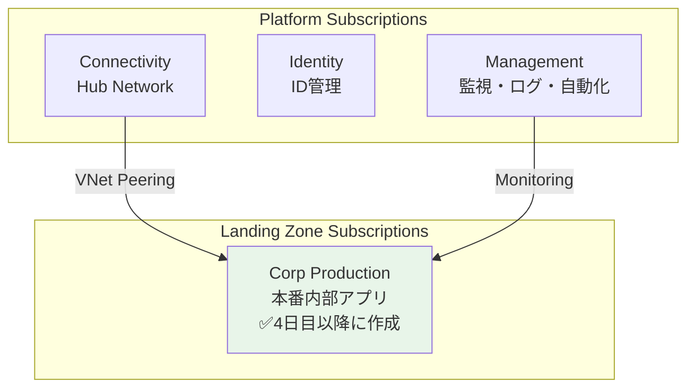

# 第 14 章：Landing Zone Subscription 作成（4 日目以降）

## 本章の目的

本章では、**4 日目以降の作業として Landing Zone Subscription を作成**します。Landing Zone Subscription は、アプリケーションワークロードを配置するための本番環境用サブスクリプションです。

**所要時間**: 約 30 分〜1 時間  
**難易度**: ⭐  
**実施タイミング**: **4 日目以降**（Connectivity Subscription 作成から 24 時間後）  
**注意**: このサブスクリプションにデプロイするリソースは費用が発生します

---

## 14.0 前提条件

### 14.0.1 3 日目までの作業完了確認

以下が完了していることを確認してください：

- Connectivity Subscription の作成
- Hub Network の構築（Hub VNet、Azure Firewall、Bastion）
- Security 基盤の構築
- .env ファイルに BILLING_SCOPE、SUB_MANAGEMENT_ID、SUB_IDENTITY_ID、SUB_CONNECTIVITY_ID が保存されている

### 14.0.2 24 時間待機の確認

> **⚠️ 重要：個人契約アカウントの制約事項**
>
> 個人契約の Azure アカウント（Pay-As-You-Go、Free Trial など）では、**24 時間に 1 つのサブスクリプションしか作成できません**。
>
> 3 日目に Connectivity Subscription を作成してから、**最低 24 時間**待機してください。待機せずにデプロイすると、エラーが発生します。

### 14.0.3 環境変数の読み込み

```bash
# .envファイルから環境変数を読み込み
source .env

# BILLING_SCOPEが設定されていることを確認
echo "Billing Scope: $BILLING_SCOPE"

# 既存のSubscription IDsを確認
echo "Management Subscription ID: $SUB_MANAGEMENT_ID"
echo "Identity Subscription ID: $SUB_IDENTITY_ID"
echo "Connectivity Subscription ID: $SUB_CONNECTIVITY_ID"
```

---

## 14.1 Landing Zone Subscription とは

### 14.1.1 Landing Zone Subscription の役割

**Landing Zone Subscription** は、アプリケーションワークロードを配置するための専用サブスクリプションです：

- **Spoke VNet**: Hub VNet とピアリングされたアプリケーション用ネットワーク
- **Container Apps / AKS**: コンテナワークロード
- **App Service / Functions**: サーバーレスアプリケーション
- **データベース**: SQL Database、Cosmos DB など
- **ストレージ**: Storage Account、Blob など

本ハンズオンでは、**Corp（内部アプリケーション）向けの Landing Zone** を 1 つ作成します。

### 14.1.2 CAF における Landing Zone Subscription の位置づけ



---

## 14.2 Landing Zone Subscription の作成

### 14.2.1 Bicep ファイルの作成

ファイル `infrastructure/bicep/subscriptions/sub-landingzone-corp.bicep` を作成し、以下の内容を記述します：

```bicep
targetScope = 'tenant'

@description('Billing Scope')
param billingScope string

resource subLandingZoneCorp 'Microsoft.Subscription/aliases@2021-10-01' = {
  name: 'sub-landingzone-corp-prod'
  properties: {
    workload: 'Production'
    displayName: 'sub-landingzone-corp-prod'
    billingScope: billingScope
  }
}

output subscriptionId string = subLandingZoneCorp.properties.subscriptionId
```

### 14.2.2 パラメーターファイルの作成

ファイル `infrastructure/bicep/parameters/sub-landingzone-corp.bicepparam` を作成し、以下の内容を記述します：

```bicep
using '../subscriptions/sub-landingzone-corp.bicep'

param billingScope = '/providers/Microsoft.Billing/billingAccounts/your-billing-account-id/enrollmentAccounts/your-enrollment-account-id'
```

**重要：** `billingScope` の値は、第 4 章で取得した `$BILLING_SCOPE` の値に置き換えてください。

### 14.2.3 Bicep のデプロイ（10-15 分）

```bash
echo "Creating Landing Zone Corp Subscription..."

# 事前確認
az deployment tenant what-if \
  --name "deploy-sub-landingzone-corp-$(date +%Y%m%d-%H%M%S)" \
  --location japaneast \
  --template-file infrastructure/bicep/subscriptions/sub-landingzone-corp.bicep \
  --parameters infrastructure/bicep/parameters/sub-landingzone-corp.bicepparam

# 確認後、デプロイ実行
az deployment tenant create \
  --name "deploy-sub-landingzone-corp-$(date +%Y%m%d-%H%M%S)" \
  --location japaneast \
  --template-file infrastructure/bicep/subscriptions/sub-landingzone-corp.bicep \
  --parameters infrastructure/bicep/parameters/sub-landingzone-corp.bicepparam
```

**デプロイには 10〜15 分程度かかります。**

### 14.2.3 Subscription ID の記録

```bash
SUB_LANDINGZONE_CORP_ID=$(az account list --query "[?name=='sub-landingzone-corp-prod'].id" -o tsv)
echo "Landing Zone Corp Subscription ID: $SUB_LANDINGZONE_CORP_ID"

# .envファイルに追記
echo "SUB_LANDINGZONE_CORP_ID=$SUB_LANDINGZONE_CORP_ID" >> .env
```

### 14.2.4 Azure ポータルでの確認

1. [Azure ポータル](https://portal.azure.com)にアクセス

2. 検索バーで「Subscriptions」を検索

3. **sub-landingzone-corp-prod** が表示されることを確認

または CLI で確認：

```bash
# Landing Zone Corp Subscriptionを表示
az account show --subscription $SUB_LANDINGZONE_CORP_ID --output table
```

---

## 14.3 Landing Zone Subscription と Management Group の関連付け

作成した Landing Zone Subscription を、第 5 章で作成した Management Group「contoso-landingzones-corp」に割り当てます。

パラメーターファイル `infrastructure/bicep/parameters/mg-assoc-landingzone-corp.bicepparam` を作成：

```bicep
using '../modules/management-groups/subscription-association.bicep'

param managementGroupName = 'contoso-landingzones-corp'
param subscriptionId = 'YOUR_LANDINGZONE_SUBSCRIPTION_ID'
```

**重要：** `subscriptionId` の値は、前手順で取得した Landing Zone Subscription ID（`$SUB_LANDINGZONE_CORP_ID`）に置き換えてください。

第 6 章で作成した Bicep モジュールを使用します：

```bash
# 事前確認
az deployment mg what-if \
  --management-group-id contoso-landingzones-corp \
  --location japaneast \
  --template-file infrastructure/bicep/modules/management-groups/subscription-association.bicep \
  --parameters infrastructure/bicep/parameters/mg-assoc-landingzone-corp.bicepparam

# 確認後、デプロイ実行
az deployment mg create \
  --management-group-id contoso-landingzones-corp \
  --location japaneast \
  --template-file infrastructure/bicep/modules/management-groups/subscription-association.bicep \
  --parameters infrastructure/bicep/parameters/mg-assoc-landingzone-corp.bicepparam

echo "Landing Zone Subscription が Management Group に割り当てられました"
```

### Azure ポータルでの確認

1. Azure ポータルで「Management groups」を開く

2. 「contoso-landingzones-corp」をクリック

3. 「Subscriptions」タブを選択

4. **sub-landingzone-corp-prod** が表示されていることを確認

---

## 14.4 Git へのコミット

```bash
# 変更の確認
git status

# ステージングとコミット
git add .

git commit -m "Day 4+: Create Landing Zone Corp Subscription

- Created sub-landingzone-corp-prod subscription
- Associated with contoso-landingzones-corp management group
- Saved SUB_LANDINGZONE_CORP_ID to .env"

# プッシュ
git push origin main
```

---

## 14.5 章のまとめ

本章で行ったこと：

1. ✅ 3 日目の作業から 24 時間待機
2. ✅ Landing Zone Corp Subscription の作成
3. ✅ Landing Zone Subscription と Management Group の関連付け
4. ✅ Subscription ID の記録
5. ✅ Git へのコミット・プッシュ

### 重要なポイント

- **24 時間待機が必須**: 個人アカウントでは 1 日 1 サブスクリプションのみ作成可能
- **アプリケーション配置**: この Subscription に Spoke VNet、Container Apps などを配置
- **CAF ベストプラクティス**: ワークロードは専用サブスクリプションで分離

### 4 日目以降の次のステップ

Landing Zone Subscription の作成が完了したら、次は Spoke VNet の構築に進みます。

---

## チェックリスト

- [ ] 3 日目の作業から 24 時間以上経過したことを確認した
- [ ] BILLING_SCOPE を .env から読み込んだ
- [ ] Landing Zone Corp Subscription を作成した
- [ ] Landing Zone Subscription を Management Group に関連付けた
- [ ] SUB_LANDINGZONE_CORP_ID を .env に保存した
- [ ] Git にコミット・プッシュした

---

## 次のステップ

Landing Zone Subscription の準備が完了したら、次は Spoke VNet（Landing Zone Network）の構築に進みます。

👉 [第 15 章：Landing Zone（Spoke）構築](chapter15-landing-zone.md)

**注意**: 次の章では、Spoke VNet、VNet Peering、アプリケーションサブネットなどを構築します。

---

## 参考リンク

- [Azure サブスクリプション](https://docs.microsoft.com/azure/cost-management-billing/manage/create-subscription)
- [CAF Landing Zone](https://docs.microsoft.com/azure/cloud-adoption-framework/ready/landing-zone/)
- [Hub-Spoke ネットワークトポロジ](https://docs.microsoft.com/azure/architecture/reference-architectures/hybrid-networking/hub-spoke)

---

**最終更新**: 2026 年 1 月 7 日
