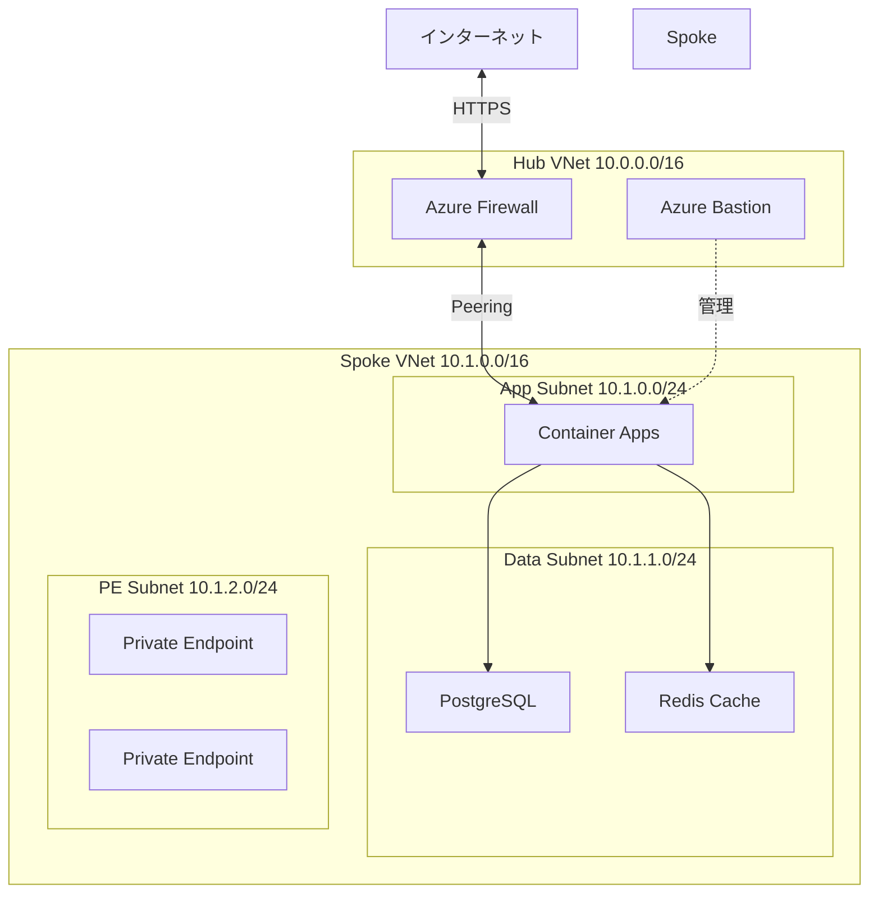

# 第 15 章：Landing Zone（Spoke）構築

> **⚠️ 4 日目以降の作業**  
> 本章から先は **有料リソース（Azure Firewall、Container Apps、PostgreSQL、Redis など）** を作成します。  
> サブスクリプション作成後 24 時間経過していることを確認してから進めてください。

## 本章の目的

本章では、アプリケーションをホストする Landing Zone（Spoke VNet）を構築します。Spoke VNet を Hub に接続し、Azure Container Apps、Azure Database for PostgreSQL、Azure Cache for Redis などのアプリケーションインフラを実装します。

**所要時間**: 約 4-5 時間  
**難易度**: ⭐⭐⭐⭐

**重要な注意事項：パラメーターの管理について**

この章では、2 種類のパラメーターを使用します：

1. **静的なパラメーター（パラメーターファイルで管理）**

   - リソース名、リージョン、SKU などの固定値
   - 例：`.parameters.json` ファイルに記述

2. **動的なパラメーター（CLI で注入）**
   - 前のデプロイで作成されたリソースの ID を取得して使用
   - 例：Subnet ID、VNet ID、Private DNS Zone ID など
   - これらは環境ごとに異なるため、パラメーターファイルに固定できません
   - `az ... show` コマンドで取得し、`--parameters` で注入します

この使い分けにより、環境間での再現性と柔軟性を両立します。

---

## 15.1 Landing Zone の設計

### 15.1.1 Spoke VNet の役割



### 15.1.2 Spoke VNet のサブネット設計

| サブネット名          | CIDR        | 用途              | NSG  |
| --------------------- | ----------- | ----------------- | ---- |
| AppSubnet             | 10.1.0.0/23 | Container Apps    | あり |
| DataSubnet            | 10.1.2.0/24 | PostgreSQL, Redis | あり |
| PrivateEndpointSubnet | 10.1.3.0/24 | Private Endpoints | あり |
| (予約)                | 10.1.4.0/22 | 将来の拡張        | -    |

---

## 15.2 Spoke VNet の構築

### 15.2.1 Resource Group の作成

Landing Zone 用の Resource Group を Bicep で作成します：

パラメーターファイル `infrastructure/bicep/parameters/landingzone-app1-resource-group.bicepparam` を作成：

```bicep
using '../modules/resource-group/resource-group.bicep'

param resourceGroupName = 'rg-landingzone-app1-prod-jpe-001'
param location = 'japaneast'
param tags = {
  Environment: 'Production'
  ManagedBy: 'Bicep'
  Project: 'CAF-Landing-Zone'
  Component: 'LandingZone-App1'
  CostCenter: 'IT-001'
}
```

```bash
# 事前確認
az deployment sub what-if \
  --name "rg-landingzone-app1-$(date +%Y%m%d-%H%M%S)" \
  --location japaneast \
  --template-file infrastructure/bicep/modules/resource-group/resource-group.bicep \
  --parameters infrastructure/bicep/parameters/landingzone-app1-resource-group.bicepparam

# 確認後、デプロイ実行
az deployment sub create \
  --name "rg-landingzone-app1-$(date +%Y%m%d-%H%M%S)" \
  --location japaneast \
  --template-file infrastructure/bicep/modules/resource-group/resource-group.bicep \
  --parameters infrastructure/bicep/parameters/landingzone-app1-resource-group.bicepparam

echo "Resource Group が Bicep で作成されました"
```

### 15.2.2 Spoke VNet Bicep モジュール

```bash
cat << 'EOF' > infrastructure/bicep/modules/networking/spoke-vnet.bicep
@description('Spoke VNetの名前')
param vnetName string

@description('デプロイ先のリージョン')
param location string

@description('Spoke VNetのアドレス空間')
param addressPrefix string = '10.1.0.0/16'

@description('Hub VNet ID（Peering用）')
param hubVNetId string

@description('Azure Firewall Private IP')
param firewallPrivateIP string

@description('タグ')
param tags object = {}

// Spoke VNet
resource spokeVNet 'Microsoft.Network/virtualNetworks@2023-05-01' = {
  name: vnetName
  location: location
  tags: tags
  properties: {
    addressSpace: {
      addressPrefixes: [
        addressPrefix
      ]
    }
    subnets: [
      {
        name: 'AppSubnet'
        properties: {
          addressPrefix: '10.1.0.0/23'
          networkSecurityGroup: {
            id: appNsg.id
          }
          routeTable: {
            id: routeTable.id
          }
        }
      }
      {
        name: 'DataSubnet'
        properties: {
          addressPrefix: '10.1.2.0/24'
          networkSecurityGroup: {
            id: dataNsg.id
          }
          delegations: [
            {
              name: 'PostgreSQLFlexibleServerDelegation'
              properties: {
                serviceName: 'Microsoft.DBforPostgreSQL/flexibleServers'
              }
            }
          ]
        }
      }
      {
        name: 'PrivateEndpointSubnet'
        properties: {
          addressPrefix: '10.1.3.0/24'
          privateEndpointNetworkPolicies: 'Disabled'
        }
      }
    ]
  }
}

// App Subnet用のNSG
resource appNsg 'Microsoft.Network/networkSecurityGroups@2023-05-01' = {
  name: '${vnetName}-app-nsg'
  location: location
  tags: tags
  properties: {
    securityRules: [
      {
        name: 'AllowHTTPSInbound'
        properties: {
          priority: 100
          direction: 'Inbound'
          access: 'Allow'
          protocol: 'Tcp'
          sourcePortRange: '*'
          destinationPortRange: '443'
          sourceAddressPrefix: '10.0.1.0/24'  // Firewall subnet
          destinationAddressPrefix: '*'
        }
      }
      {
        name: 'AllowHTTPInbound'
        properties: {
          priority: 110
          direction: 'Inbound'
          access: 'Allow'
          protocol: 'Tcp'
          sourcePortRange: '*'
          destinationPortRange: '80'
          sourceAddressPrefix: '10.0.1.0/24'  // Firewall subnet
          destinationAddressPrefix: '*'
        }
      }
      {
        name: 'DenyAllInbound'
        properties: {
          priority: 4096
          direction: 'Inbound'
          access: 'Deny'
          protocol: '*'
          sourcePortRange: '*'
          destinationPortRange: '*'
          sourceAddressPrefix: '*'
          destinationAddressPrefix: '*'
        }
      }
    ]
  }
}

// Data Subnet用のNSG
resource dataNsg 'Microsoft.Network/networkSecurityGroups@2023-05-01' = {
  name: '${vnetName}-data-nsg'
  location: location
  tags: tags
  properties: {
    securityRules: [
      {
        name: 'AllowPostgreSQLFromApp'
        properties: {
          priority: 100
          direction: 'Inbound'
          access: 'Allow'
          protocol: 'Tcp'
          sourcePortRange: '*'
          destinationPortRange: '5432'
          sourceAddressPrefix: '10.1.0.0/23'  // App subnet
          destinationAddressPrefix: '*'
        }
      }
      {
        name: 'AllowRedisFromApp'
        properties: {
          priority: 110
          direction: 'Inbound'
          access: 'Allow'
          protocol: 'Tcp'
          sourcePortRange: '*'
          destinationPortRange: '6379-6380'
          sourceAddressPrefix: '10.1.0.0/23'  // App subnet
          destinationAddressPrefix: '*'
        }
      }
      {
        name: 'DenyAllInbound'
        properties: {
          priority: 4096
          direction: 'Inbound'
          access: 'Deny'
          protocol: '*'
          sourcePortRange: '*'
          destinationPortRange: '*'
          sourceAddressPrefix: '*'
          destinationAddressPrefix: '*'
        }
      }
    ]
  }
}

// Route Table（全トラフィックをFirewall経由）
resource routeTable 'Microsoft.Network/routeTables@2023-05-01' = {
  name: '${vnetName}-rt'
  location: location
  tags: tags
  properties: {
    routes: [
      {
        name: 'DefaultRoute'
        properties: {
          addressPrefix: '0.0.0.0/0'
          nextHopType: 'VirtualAppliance'
          nextHopIpAddress: firewallPrivateIP
        }
      }
    ]
  }
}

// Hub-Spoke Peering（Spoke → Hub）
resource spokeToHubPeering 'Microsoft.Network/virtualNetworks/virtualNetworkPeerings@2023-05-01' = {
  name: 'spoke-to-hub'
  parent: spokeVNet
  properties: {
    remoteVirtualNetwork: {
      id: hubVNetId
    }
    allowVirtualNetworkAccess: true
    allowForwardedTraffic: true
    allowGatewayTransit: false
    useRemoteGateways: false
  }
}

// 出力
output vnetId string = spokeVNet.id
output vnetName string = spokeVNet.name
output appSubnetId string = spokeVNet.properties.subnets[0].id
output dataSubnetId string = spokeVNet.properties.subnets[1].id
output privateEndpointSubnetId string = spokeVNet.properties.subnets[2].id
EOF
```

### 15.2.3 Hub 側の Peering 設定

```bash
cat << 'EOF' > infrastructure/bicep/modules/networking/hub-to-spoke-peering.bicep
@description('Hub VNetの名前')
param hubVNetName string

@description('Spoke VNet ID')
param spokeVNetId string

@description('Peeringの名前')
param peeringName string = 'hub-to-spoke'

// Hub → Spoke Peering
resource hubToSpokePeering 'Microsoft.Network/virtualNetworks/virtualNetworkPeerings@2023-05-01' = {
  name: '${hubVNetName}/${peeringName}'
  properties: {
    remoteVirtualNetwork: {
      id: spokeVNetId
    }
    allowVirtualNetworkAccess: true
    allowForwardedTraffic: true
    allowGatewayTransit: true
    useRemoteGateways: false
  }
}

output peeringId string = hubToSpokePeering.id
EOF
```

### 15.2.4 Spoke VNet のデプロイ

```bash
# Hub VNet IDを取得
HUB_VNET_ID=$(az network vnet show \
  --name vnet-hub-prod-jpe-001 \
  --resource-group rg-platform-connectivity-prod-jpe-001 \
  --query id -o tsv)

# Azure FirewallのPrivate IPを取得
FIREWALL_PRIVATE_IP=$(az network firewall show \
  --name afw-hub-prod-jpe-001 \
  --resource-group rg-platform-connectivity-prod-jpe-001 \
  --query 'ipConfigurations[0].properties.privateIPAddress' -o tsv)

# パラメータファイルを作成
cat << EOF > infrastructure/bicep/parameters/spoke-vnet.parameters.json
{
  "\$schema": "https://schema.management.azure.com/schemas/2019-04-01/deploymentParameters.json#",
  "contentVersion": "1.0.0.0",
  "parameters": {
    "vnetName": {
      "value": "vnet-spoke-app1-prod-jpe-001"
    },
    "location": {
      "value": "japaneast"
    },
    "addressPrefix": {
      "value": "10.1.0.0/16"
    },
    "hubVNetId": {
      "value": "$HUB_VNET_ID"
    },
    "firewallPrivateIP": {
      "value": "$FIREWALL_PRIVATE_IP"
    }
  }
}
EOF

# 事前確認
az deployment group what-if \
  --name "spoke-vnet-deployment-$(date +%Y%m%d-%H%M%S)" \
  --resource-group rg-landingzone-app1-prod-jpe-001 \
  --template-file infrastructure/bicep/modules/networking/spoke-vnet.bicep \
  --parameters infrastructure/bicep/parameters/spoke-vnet.parameters.json

# 確認後、デプロイ実行
az deployment group create \
  --name "spoke-vnet-deployment-$(date +%Y%m%d-%H%M%S)" \
  --resource-group rg-landingzone-app1-prod-jpe-001 \
  --template-file infrastructure/bicep/modules/networking/spoke-vnet.bicep \
  --parameters infrastructure/bicep/parameters/spoke-vnet.parameters.json

# Hub側のPeeringを設定
SPOKE_VNET_ID=$(az network vnet show \
  --name vnet-spoke-app1-prod-jpe-001 \
  --resource-group rg-landingzone-app1-prod-jpe-001 \
  --query id -o tsv)

# 事前確認
az deployment group what-if \
  --name "hub-to-spoke-peering-$(date +%Y%m%d-%H%M%S)" \
  --resource-group rg-platform-connectivity-prod-jpe-001 \
  --template-file infrastructure/bicep/modules/networking/hub-to-spoke-peering.bicep \
  --parameters \
    hubVNetName=vnet-hub-prod-jpe-001 \
    spokeVNetId="$SPOKE_VNET_ID" \
    peeringName=hub-to-spoke-app1

# 確認後、デプロイ実行
az deployment group create \
  --name "hub-to-spoke-peering-$(date +%Y%m%d-%H%M%S)" \
  --resource-group rg-platform-connectivity-prod-jpe-001 \
  --template-file infrastructure/bicep/modules/networking/hub-to-spoke-peering.bicep \
  --parameters \
    hubVNetName=vnet-hub-prod-jpe-001 \
    spokeVNetId="$SPOKE_VNET_ID" \
    peeringName=hub-to-spoke-app1
```

---

## 15.3 Azure Container Apps の構築

### 15.3.1 Container Apps Environment の作成

```bash
cat << 'EOF' > infrastructure/bicep/modules/compute/container-apps-environment.bicep
@description('Container Apps Environmentの名前')
param environmentName string

@description('デプロイ先のリージョン')
param location string

@description('Log Analytics Workspace ID')
param logAnalyticsWorkspaceId string

@description('App SubnetのID')
param infrastructureSubnetId string

@description('タグ')
param tags object = {}

// Container Apps Environment
resource containerAppsEnvironment 'Microsoft.App/managedEnvironments@2023-05-01' = {
  name: environmentName
  location: location
  tags: tags
  properties: {
    appLogsConfiguration: {
      destination: 'log-analytics'
      logAnalyticsConfiguration: {
        customerId: reference(logAnalyticsWorkspaceId, '2022-10-01').customerId
        sharedKey: listKeys(logAnalyticsWorkspaceId, '2022-10-01').primarySharedKey
      }
    }
    vnetConfiguration: {
      infrastructureSubnetId: infrastructureSubnetId
      internal: true  // 内部Load Balancer
    }
    zoneRedundant: false
  }
}

// 出力
output environmentId string = containerAppsEnvironment.id
output environmentName string = containerAppsEnvironment.name
output defaultDomain string = containerAppsEnvironment.properties.defaultDomain
output staticIp string = containerAppsEnvironment.properties.staticIp
EOF

# デプロイ
LOG_WORKSPACE_ID=$(az monitor log-analytics workspace show \
  --resource-group rg-platform-management-prod-jpe-001 \
  --workspace-name log-platform-prod-jpe-001 \
  --query id -o tsv)

APP_SUBNET_ID=$(az network vnet subnet show \
  --vnet-name vnet-spoke-app1-prod-jpe-001 \
  --name AppSubnet \
  --resource-group rg-landingzone-app1-prod-jpe-001 \
  --query id -o tsv)

# 事前確認
az deployment group what-if \
  --name "container-apps-env-deployment-$(date +%Y%m%d-%H%M%S)" \
  --resource-group rg-landingzone-app1-prod-jpe-001 \
  --template-file infrastructure/bicep/modules/compute/container-apps-environment.bicep \
  --parameters \
    environmentName=cae-app1-prod-jpe-001 \
    location=japaneast \
    logAnalyticsWorkspaceId="$LOG_WORKSPACE_ID" \
    infrastructureSubnetId="$APP_SUBNET_ID"

# 確認後、デプロイ実行
az deployment group create \
  --name "container-apps-env-deployment-$(date +%Y%m%d-%H%M%S)" \
  --resource-group rg-landingzone-app1-prod-jpe-001 \
  --template-file infrastructure/bicep/modules/compute/container-apps-environment.bicep \
  --parameters \
    environmentName=cae-app1-prod-jpe-001 \
    location=japaneast \
    logAnalyticsWorkspaceId="$LOG_WORKSPACE_ID" \
    infrastructureSubnetId="$APP_SUBNET_ID"
```

---

## 15.4 Azure Database for PostgreSQL の構築

### 15.4.1 PostgreSQL Flexible Server Bicep モジュール

```bash
cat << 'EOF' > infrastructure/bicep/modules/data/postgresql.bicep
@description('PostgreSQL Serverの名前')
param serverName string

@description('デプロイ先のリージョン')
param location string

@description('管理者ユーザー名')
@secure()
param administratorLogin string

@description('管理者パスワード')
@secure()
param administratorLoginPassword string

@description('Data SubnetのID')
param delegatedSubnetId string

@description('Private DNS Zone ID')
param privateDnsZoneId string

@description('PostgreSQLバージョン')
@allowed([
  '13'
  '14'
  '15'
  '16'
])
param postgresqlVersion string = '16'

@description('SKU')
param skuName string = 'Standard_B1ms'

@description('ストレージサイズ（GB）')
param storageSizeGB int = 32

@description('タグ')
param tags object = {}

// PostgreSQL Flexible Server
resource postgresqlServer 'Microsoft.DBforPostgreSQL/flexibleServers@2023-03-01-preview' = {
  name: serverName
  location: location
  tags: tags
  sku: {
    name: skuName
    tier: 'Burstable'
  }
  properties: {
    version: postgresqlVersion
    administratorLogin: administratorLogin
    administratorLoginPassword: administratorLoginPassword
    storage: {
      storageSizeGB: storageSizeGB
    }
    backup: {
      backupRetentionDays: 7
      geoRedundantBackup: 'Disabled'
    }
    highAvailability: {
      mode: 'Disabled'
    }
    network: {
      delegatedSubnetResourceId: delegatedSubnetId
      privateDnsZoneArmResourceId: privateDnsZoneId
    }
  }
}

// データベースの作成
resource database 'Microsoft.DBforPostgreSQL/flexibleServers/databases@2023-03-01-preview' = {
  name: 'appdb'
  parent: postgresqlServer
  properties: {
    charset: 'UTF8'
    collation: 'en_US.utf8'
  }
}

// 出力
output serverId string = postgresqlServer.id
output serverName string = postgresqlServer.name
output fqdn string = postgresqlServer.properties.fullyQualifiedDomainName
EOF
```

### 15.4.2 Private DNS Zone の作成

```bash
cat << 'EOF' > infrastructure/bicep/modules/networking/private-dns-zone.bicep
@description('Private DNS Zoneの名前')
param zoneName string

@description('VNet IDのリスト（VNet Linkingを作成）')
param vnetIds array

@description('タグ')
param tags object = {}

// Private DNS Zone
resource privateDnsZone 'Microsoft.Network/privateDnsZones@2020-06-01' = {
  name: zoneName
  location: 'global'
  tags: tags
}

// VNet Linking
resource vnetLinks 'Microsoft.Network/privateDnsZones/virtualNetworkLinks@2020-06-01' = [for (vnetId, i) in vnetIds: {
  name: 'link-${i}'
  parent: privateDnsZone
  location: 'global'
  properties: {
    registrationEnabled: false
    virtualNetwork: {
      id: vnetId
    }
  }
}]

output privateDnsZoneId string = privateDnsZone.id
EOF

# 事前確認
az deployment group what-if \
  --name "postgres-private-dns-$(date +%Y%m%d-%H%M%S)" \
  --resource-group rg-landingzone-app1-prod-jpe-001 \
  --template-file infrastructure/bicep/modules/networking/private-dns-zone.bicep \
  --parameters \
    zoneName=privatelink.postgres.database.azure.com \
    vnetIds="[\"$SPOKE_VNET_ID\",\"$HUB_VNET_ID\"]"

# 確認後、デプロイ実行
az deployment group create \
  --name "postgres-private-dns-$(date +%Y%m%d-%H%M%S)" \
  --resource-group rg-landingzone-app1-prod-jpe-001 \
  --template-file infrastructure/bicep/modules/networking/private-dns-zone.bicep \
  --parameters \
    zoneName=privatelink.postgres.database.azure.com \
    vnetIds="[\"$SPOKE_VNET_ID\",\"$HUB_VNET_ID\"]"
```

### 15.4.3 PostgreSQL のデプロイ

```bash
# Data SubnetのIDを取得
DATA_SUBNET_ID=$(az network vnet subnet show \
  --vnet-name vnet-spoke-app1-prod-jpe-001 \
  --name DataSubnet \
  --resource-group rg-landingzone-app1-prod-jpe-001 \
  --query id -o tsv)

# Private DNS Zone IDを取得
POSTGRES_DNS_ZONE_ID=$(az network private-dns zone show \
  --name privatelink.postgres.database.azure.com \
  --resource-group rg-landingzone-app1-prod-jpe-001 \
  --query id -o tsv)

# 事前確認
az deployment group what-if \
  --name "postgresql-deployment-$(date +%Y%m%d-%H%M%S)" \
  --resource-group rg-landingzone-app1-prod-jpe-001 \
  --template-file infrastructure/bicep/modules/data/postgresql.bicep \
  --parameters \
    serverName=psql-app1-prod-jpe-001 \
    location=japaneast \
    administratorLogin=psqladmin \
    administratorLoginPassword='P@ssw0rd1234!' \
    delegatedSubnetId="$DATA_SUBNET_ID" \
    privateDnsZoneId="$POSTGRES_DNS_ZONE_ID" \
    postgresqlVersion=16 \
    skuName=Standard_B1ms \
    storageSizeGB=32

# 確認後、デプロイ実行
az deployment group create \
  --name "postgresql-deployment-$(date +%Y%m%d-%H%M%S)" \
  --resource-group rg-landingzone-app1-prod-jpe-001 \
  --template-file infrastructure/bicep/modules/data/postgresql.bicep \
  --parameters \
    serverName=psql-app1-prod-jpe-001 \
    location=japaneast \
    administratorLogin=psqladmin \
    administratorLoginPassword='P@ssw0rd1234!' \
    delegatedSubnetId="$DATA_SUBNET_ID" \
    privateDnsZoneId="$POSTGRES_DNS_ZONE_ID" \
    postgresqlVersion=16 \
    skuName=Standard_B1ms \
    storageSizeGB=32
```

**注意**: パスワードは本番環境では Key Vault から取得してください。

---

## 15.5 Azure Cache for Redis の構築

### 15.5.1 Redis Cache Bicep モジュール

```bash
cat << 'EOF' > infrastructure/bicep/modules/data/redis-cache.bicep
@description('Redis Cacheの名前')
param redisCacheName string

@description('デプロイ先のリージョン')
param location string

@description('SKU')
@allowed([
  'Basic'
  'Standard'
  'Premium'
])
param skuName string = 'Standard'

@description('SKU Family')
@allowed([
  'C'
  'P'
])
param skuFamily string = 'C'

@description('SKU Capacity')
@allowed([
  0
  1
  2
  3
  4
  5
  6
])
param skuCapacity int = 1

@description('Redis バージョン')
@allowed([
  '6'
])
param redisVersion string = '6'

@description('タグ')
param tags object = {}

// Redis Cache
resource redisCache 'Microsoft.Cache/redis@2023-08-01' = {
  name: redisCacheName
  location: location
  tags: tags
  properties: {
    sku: {
      name: skuName
      family: skuFamily
      capacity: skuCapacity
    }
    redisVersion: redisVersion
    enableNonSslPort: false
    minimumTlsVersion: '1.2'
    publicNetworkAccess: 'Disabled'  // Private Endpoint使用
    redisConfiguration: {
      'maxmemory-policy': 'allkeys-lru'
    }
  }
}

// 出力
output redisId string = redisCache.id
output redisName string = redisCache.name
output redisHostName string = redisCache.properties.hostName
output redisPort int = redisCache.properties.sslPort
EOF

# 事前確認
az deployment group what-if \
  --name "redis-deployment-$(date +%Y%m%d-%H%M%S)" \
  --resource-group rg-landingzone-app1-prod-jpe-001 \
  --template-file infrastructure/bicep/modules/data/redis-cache.bicep \
  --parameters \
    redisCacheName=redis-app1-prod-jpe-001 \
    location=japaneast \
    skuName=Standard \
    skuFamily=C \
    skuCapacity=1

# 確認後、デプロイ実行
az deployment group create \
  --name "redis-deployment-$(date +%Y%m%d-%H%M%S)" \
  --resource-group rg-landingzone-app1-prod-jpe-001 \
  --template-file infrastructure/bicep/modules/data/redis-cache.bicep \
  --parameters \
    redisCacheName=redis-app1-prod-jpe-001 \
    location=japaneast \
    skuName=Standard \
    skuFamily=C \
    skuCapacity=1
```

### 15.5.2 Redis Private Endpoint の作成

```bash
# Private Endpoint SubnetのIDを取得
PE_SUBNET_ID=$(az network vnet subnet show \
  --vnet-name vnet-spoke-app1-prod-jpe-001 \
  --name PrivateEndpointSubnet \
  --resource-group rg-landingzone-app1-prod-jpe-001 \
  --query id -o tsv)

# Redis IDを取得
REDIS_ID=$(az redis show \
  --name redis-app1-prod-jpe-001 \
  --resource-group rg-landingzone-app1-prod-jpe-001 \
  --query id -o tsv)

# Private Endpointを作成
az network private-endpoint create \
  --name pe-redis-app1-prod-jpe-001 \
  --resource-group rg-landingzone-app1-prod-jpe-001 \
  --location japaneast \
  --subnet "$PE_SUBNET_ID" \
  --private-connection-resource-id "$REDIS_ID" \
  --group-id redisCache \
  --connection-name redis-connection

# Private DNS Zoneを作成してリンク
az network private-dns zone create \
  --name privatelink.redis.cache.windows.net \
  --resource-group rg-landingzone-app1-prod-jpe-001

az network private-dns link vnet create \
  --name redis-dns-link \
  --resource-group rg-landingzone-app1-prod-jpe-001 \
  --zone-name privatelink.redis.cache.windows.net \
  --virtual-network "$SPOKE_VNET_ID" \
  --registration-enabled false

# Private DNS Zone Groupを作成
az network private-endpoint dns-zone-group create \
  --name redis-dns-group \
  --resource-group rg-landingzone-app1-prod-jpe-001 \
  --endpoint-name pe-redis-app1-prod-jpe-001 \
  --private-dns-zone privatelink.redis.cache.windows.net \
  --zone-name redis
```

---

## 15.6 Azure Container Registry の構築

### 15.6.1 ACR Bicep モジュール

```bash
cat << 'EOF' > infrastructure/bicep/modules/compute/container-registry.bicep
@description('Container Registryの名前')
param registryName string

@description('デプロイ先のリージョン')
param location string

@description('SKU')
@allowed([
  'Basic'
  'Standard'
  'Premium'
])
param skuName string = 'Premium'

@description('タグ')
param tags object = {}

// Container Registry
resource containerRegistry 'Microsoft.ContainerRegistry/registries@2023-07-01' = {
  name: registryName
  location: location
  tags: tags
  sku: {
    name: skuName
  }
  properties: {
    adminUserEnabled: false
    publicNetworkAccess: 'Disabled'
    networkRuleBypassOptions: 'AzureServices'
    zoneRedundancy: 'Disabled'
  }
}

// 出力
output registryId string = containerRegistry.id
output registryName string = containerRegistry.name
output loginServer string = containerRegistry.properties.loginServer
EOF

# 事前確認
az deployment group what-if \
  --name "acr-deployment-$(date +%Y%m%d-%H%M%S)" \
  --resource-group rg-landingzone-app1-prod-jpe-001 \
  --template-file infrastructure/bicep/modules/compute/container-registry.bicep \
  --parameters \
    registryName=acrcafapp1prodjpe001 \
    location=japaneast \
    skuName=Premium

# 確認後、デプロイ実行
az deployment group create \
  --name "acr-deployment-$(date +%Y%m%d-%H%M%S)" \
  --resource-group rg-landingzone-app1-prod-jpe-001 \
  --template-file infrastructure/bicep/modules/compute/container-registry.bicep \
  --parameters \
    registryName=acrcafapp1prodjpe001 \
    location=japaneast \
    skuName=Premium

# ACR Private Endpointを作成
ACR_ID=$(az acr show \
  --name acrcafapp1prodjpe001 \
  --resource-group rg-landingzone-app1-prod-jpe-001 \
  --query id -o tsv)

az network private-endpoint create \
  --name pe-acr-app1-prod-jpe-001 \
  --resource-group rg-landingzone-app1-prod-jpe-001 \
  --location japaneast \
  --subnet "$PE_SUBNET_ID" \
  --private-connection-resource-id "$ACR_ID" \
  --group-id registry \
  --connection-name acr-connection
```

---

## 15.7 Azure Portal での確認

### 15.7.1 VNet Peering の確認

1. Azure ポータルで「Virtual networks」を開く
2. Hub VNet と Spoke VNet を開く
3. 「Peerings」で Peering ステータスが「Connected」であることを確認

### 15.7.2 ネットワーク接続のテスト

```bash
# Spoke VNet内のリソースからインターネットへの接続テスト（Firewall経由）
# Container Apps内から実行
curl -I https://www.microsoft.com
```

---

## 15.8 コスト管理

### 15.8.1 リソース別のコスト

| リソース                          | 概算月額コスト（東日本） |
| --------------------------------- | ------------------------ |
| Container Apps Environment        | 約 ¥5,000 + 実行時間     |
| PostgreSQL Flexible Server (B1ms) | 約 ¥2,500                |
| Redis Cache Standard C1           | 約 ¥3,500                |
| Container Registry Premium        | 約 ¥6,000                |
| VNet Peering                      | データ転送量による       |
| **合計**                          | **約 ¥17,000/月**        |

---

## 15.9 Git へのコミット

```bash
git add .
git commit -m "Chapter 13: Landing Zone (Spoke) implementation

- Created Spoke VNet with Hub-Spoke peering
- Deployed Container Apps Environment with VNet integration
- Deployed PostgreSQL Flexible Server with Private DNS
- Deployed Redis Cache with Private Endpoint
- Deployed Container Registry Premium with Private Endpoint
- Configured NSGs and Route Tables for security
- Created comprehensive Bicep modules for Landing Zone"

git push origin main
```

---

## 15.10 章のまとめ

本章で構築したもの：

1. ✅ Spoke VNet

   - App/Data/PrivateEndpoint サブネット
   - Hub-Spoke Peering
   - NSG と Route Tables

2. ✅ Container Apps Environment

   - VNet 統合
   - 内部 Load Balancer

3. ✅ PostgreSQL Flexible Server

   - VNet 統合
   - Private DNS Zone

4. ✅ Redis Cache

   - Private Endpoint
   - TLS 1.2 強制

5. ✅ Container Registry
   - Private Endpoint
   - Admin 無効化

### 重要なポイント

- **ネットワーク分離**: すべて Private 接続
- **Firewall 経由**: すべてのトラフィックを Firewall で制御
- **データ保護**: PostgreSQL、Redis ともに暗号化
- **コスト最適化**: 適切な SKU 選択

---

## 次のステップ

Landing Zone が構築できたら、次はアプリケーション開発・デプロイに進みます。

👉 [第 16 章：アプリケーション開発・デプロイ](chapter16-application.md)

---

**最終更新**: 2026 年 1 月 7 日
