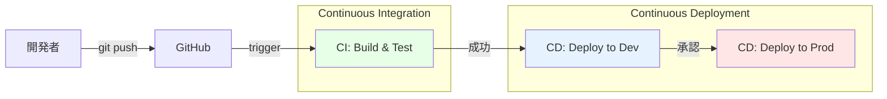
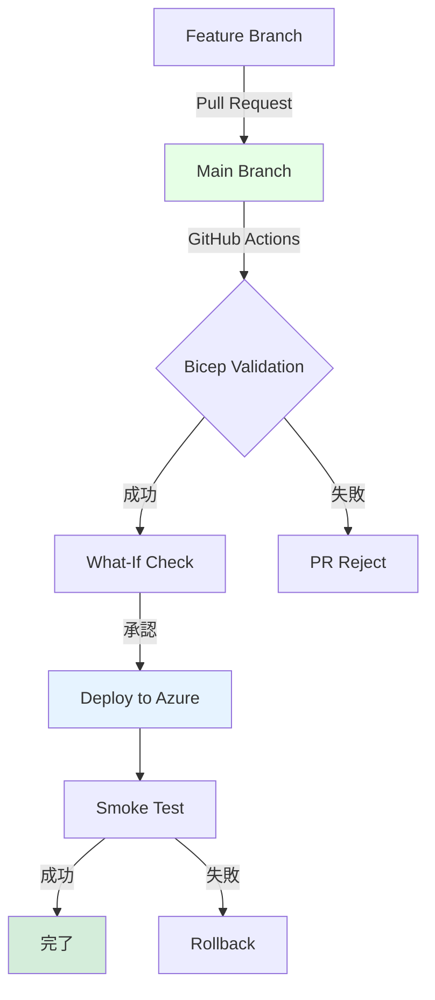

# 第 17 章：CI/CD パイプライン構築

> **⚠️ 4 日目以降の作業**  
> CI/CD パイプラインは前章までのインフラ構築が完了していることを前提とします。

## 本章の目的

本章では、GitHub Actions を使用した CI/CD パイプラインを構築します。Infrastructure as Code（Bicep）の自動デプロイ、Pull Request 検証、セキュリティスキャンなどを実装します。

**所要時間**: 約 3-4 時間  
**難易度**: ⭐⭐⭐⭐

---

## 17.1 CI/CD の重要性

### 17.1.1 CI/CD とは



**CI（Continuous Integration）**:

- コードの自動ビルド
- 自動テスト
- コード品質チェック
- セキュリティスキャン

**CD（Continuous Deployment/Delivery）**:

- 自動デプロイ
- 環境別デプロイ
- ロールバック機能

### 17.1.2 GitOps ワークフロー



---

## 17.2 GitHub Actions の基礎

### 17.2.1 ワークフローの構成要素

```yaml
name: ワークフロー名
on: # トリガー
  push:
    branches: [main]
jobs: # ジョブ
  build:
    runs-on: ubuntu-latest # 実行環境
    steps: # ステップ
      - uses: actions/checkout@v4
      - run: echo "Hello"
```

### 17.2.2 GitHub Secrets の設定

```bash
# Azure認証情報をGitHub Secretsに登録

# 1. Service Principalを作成
az ad sp create-for-rbac \
  --name "github-actions-caf-landingzone" \
  --role Contributor \
  --scopes /subscriptions/$(az account show --query id -o tsv) \
  --sdk-auth

# 出力されたJSONをコピー

# 2. GitHubリポジトリの Settings > Secrets and variables > Actions
#    で以下のSecretsを追加:
#    - AZURE_CREDENTIALS: 上記のJSON全体
#    - AZURE_SUBSCRIPTION_ID: Subscription ID
#    - AZURE_TENANT_ID: Tenant ID
```

---

## 17.3 Bicep 検証ワークフロー

### 17.3.1 Pull Request 時の検証

```bash
mkdir -p .github/workflows

cat << 'EOF' > .github/workflows/bicep-validate.yml
name: Bicep Validation

on:
  pull_request:
    branches: [main]
    paths:
      - 'infrastructure/bicep/**'
      - '.github/workflows/bicep-validate.yml'

permissions:
  contents: read
  pull-requests: write

jobs:
  validate:
    name: Validate Bicep Templates
    runs-on: ubuntu-latest

    steps:
      - name: Checkout code
        uses: actions/checkout@v4

      - name: Setup Azure CLI
        uses: azure/login@v1
        with:
          creds: ${{ secrets.AZURE_CREDENTIALS }}

      - name: Bicep Lint
        run: |
          echo "=== Bicep Lint ==="
          for file in $(find infrastructure/bicep -name "*.bicep"); do
            echo "Linting: $file"
            az bicep build --file $file
          done

      - name: Bicep What-If (Hub VNet)
        id: whatif-hubvnet
        run: |
          az deployment group what-if \
            --resource-group rg-platform-connectivity-prod-jpe-001 \
            --template-file infrastructure/bicep/modules/networking/hub-vnet.bicep \
            --parameters infrastructure/bicep/parameters/hub-vnet.parameters.json \
            --result-format FullResourcePayloads

      - name: Comment PR
        uses: actions/github-script@v7
        if: github.event_name == 'pull_request'
        with:
          script: |
            const output = `#### Bicep Validation Results

            ✅ Bicep files successfully validated!

            <details><summary>What-If Results</summary>

            \`\`\`
            ${{ steps.whatif-hubvnet.outputs.stdout }}
            \`\`\`

            </details>

            *Pusher: @${{ github.actor }}*`;

            github.rest.issues.createComment({
              issue_number: context.issue.number,
              owner: context.repo.owner,
              repo: context.repo.repo,
              body: output
            });
EOF
```

---

## 17.4 インフラデプロイワークフロー

### 17.4.1 main ブランチへのプッシュ時デプロイ

```bash
cat << 'EOF' > .github/workflows/deploy-infrastructure.yml
name: Deploy Infrastructure

on:
  push:
    branches: [main]
    paths:
      - 'infrastructure/bicep/**'
      - '.github/workflows/deploy-infrastructure.yml'
  workflow_dispatch:  # 手動実行を許可

permissions:
  contents: read
  id-token: write

jobs:
  deploy-hub:
    name: Deploy Hub Network
    runs-on: ubuntu-latest
    environment: production

    steps:
      - name: Checkout code
        uses: actions/checkout@v4

      - name: Azure Login
        uses: azure/login@v1
        with:
          creds: ${{ secrets.AZURE_CREDENTIALS }}

      - name: Deploy Hub VNet
        id: deploy-hubvnet
        run: |
          az deployment group create \
            --name "hub-vnet-deployment-$(date +%Y%m%d-%H%M%S)" \
            --resource-group rg-platform-connectivity-prod-jpe-001 \
            --template-file infrastructure/bicep/modules/networking/hub-vnet.bicep \
            --parameters infrastructure/bicep/parameters/hub-vnet.parameters.json

      - name: Deploy Azure Firewall
        id: deploy-firewall
        run: |
          FIREWALL_SUBNET_ID=$(az network vnet subnet show \
            --vnet-name vnet-hub-prod-jpe-001 \
            --name AzureFirewallSubnet \
            --resource-group rg-platform-connectivity-prod-jpe-001 \
            --query id -o tsv)

          az deployment group create \
            --name "firewall-deployment-$(date +%Y%m%d-%H%M%S)" \
            --resource-group rg-platform-connectivity-prod-jpe-001 \
            --template-file infrastructure/bicep/modules/networking/firewall.bicep \
            --parameters \
              firewallName=afw-hub-prod-jpe-001 \
              location=japaneast \
              firewallSubnetId="$FIREWALL_SUBNET_ID" \
              skuTier=Standard

      - name: Deploy Azure Bastion
        id: deploy-bastion
        run: |
          BASTION_SUBNET_ID=$(az network vnet subnet show \
            --vnet-name vnet-hub-prod-jpe-001 \
            --name AzureBastionSubnet \
            --resource-group rg-platform-connectivity-prod-jpe-001 \
            --query id -o tsv)

          az deployment group create \
            --name "bastion-deployment-$(date +%Y%m%d-%H%M%S)" \
            --resource-group rg-platform-connectivity-prod-jpe-001 \
            --template-file infrastructure/bicep/modules/networking/bastion.bicep \
            --parameters \
              bastionName=bas-hub-prod-jpe-001 \
              location=japaneast \
              bastionSubnetId="$BASTION_SUBNET_ID" \
              skuName=Standard

      - name: Deployment Summary
        run: |
          echo "✅ Hub Network deployment completed"
          echo "- Hub VNet: vnet-hub-prod-jpe-001"
          echo "- Azure Firewall: afw-hub-prod-jpe-001"
          echo "- Azure Bastion: bas-hub-prod-jpe-001"

  deploy-security:
    name: Deploy Security Resources
    runs-on: ubuntu-latest
    needs: deploy-hub
    environment: production

    steps:
      - name: Checkout code
        uses: actions/checkout@v4

      - name: Azure Login
        uses: azure/login@v1
        with:
          creds: ${{ secrets.AZURE_CREDENTIALS }}

      - name: Deploy Key Vault
        run: |
          MY_OBJECT_ID=$(az ad signed-in-user show --query id -o tsv)
          MANAGEMENT_SUBNET_ID=$(az network vnet subnet show \
            --vnet-name vnet-hub-prod-jpe-001 \
            --name ManagementSubnet \
            --resource-group rg-platform-connectivity-prod-jpe-001 \
            --query id -o tsv)

          az deployment group create \
            --name "key-vault-deployment-$(date +%Y%m%d-%H%M%S)" \
            --resource-group rg-platform-security-prod-jpe-001 \
            --template-file infrastructure/bicep/modules/security/key-vault.bicep \
            --parameters \
              keyVaultName=kv-hub-prod-jpe-001 \
              location=japaneast \
              administratorObjectId="$MY_OBJECT_ID" \
              publicNetworkAccess=Disabled \
              subnetId="$MANAGEMENT_SUBNET_ID"

      - name: Deploy Log Analytics
        run: |
          az deployment group create \
            --name "log-analytics-deployment-$(date +%Y%m%d-%H%M%S)" \
            --resource-group rg-platform-management-prod-jpe-001 \
            --template-file infrastructure/bicep/modules/monitoring/log-analytics.bicep \
            --parameters \
              workspaceName=log-platform-prod-jpe-001 \
              location=japaneast \
              retentionInDays=90
EOF
```

---

## 17.5 Policy デプロイワークフロー

### 17.5.1 Policy 定義の自動デプロイ

```bash
cat << 'EOF' > .github/workflows/deploy-policies.yml
name: Deploy Azure Policies

on:
  push:
    branches: [main]
    paths:
      - 'infrastructure/policies/**'
      - '.github/workflows/deploy-policies.yml'
  workflow_dispatch:

permissions:
  contents: read
  id-token: write

jobs:
  deploy-policies:
    name: Deploy Azure Policies
    runs-on: ubuntu-latest
    environment: production

    steps:
      - name: Checkout code
        uses: actions/checkout@v4

      - name: Azure Login
        uses: azure/login@v1
        with:
          creds: ${{ secrets.AZURE_CREDENTIALS }}

      - name: Deploy Custom Policy Definitions
        run: |
          echo "=== Deploying Custom Policies ==="

          # 命名規則ポリシー
          if [ -f infrastructure/policies/definitions/naming-convention-policy.json ]; then
            az policy definition create \
              --name "naming-convention-policy" \
              --display-name "命名規則の強制" \
              --mode All \
              --rules infrastructure/policies/definitions/naming-convention-policy.json \
              --management-group contoso-platform || echo "Policy already exists"
          fi

          # Key Vault診断設定ポリシー
          if [ -f infrastructure/policies/definitions/deploy-diagnostics-keyvault.json ]; then
            az policy definition create \
              --name "deploy-diagnostics-keyvault" \
              --display-name "Key Vaultの診断設定を自動デプロイ" \
              --mode All \
              --rules infrastructure/policies/definitions/deploy-diagnostics-keyvault.json \
              --management-group contoso-platform || echo "Policy already exists"
          fi

      - name: Deploy Policy Initiative
        run: |
          echo "=== Deploying Policy Initiative ==="

          if [ -f infrastructure/policies/initiatives/caf-landingzone-initiative.json ]; then
            az policy set-definition create \
              --name "caf-landingzone-initiative" \
              --display-name "CAF Landing Zone ガバナンス" \
              --definitions infrastructure/policies/initiatives/caf-landingzone-initiative.json \
              --management-group contoso-platform || echo "Initiative already exists"
          fi

      - name: Assign Policies
        run: |
          echo "=== Assigning Policies ==="

          # 許可されたリージョンの制限
          az policy assignment create \
            --name "AllowedLocationsPolicy" \
            --display-name "許可されたリージョンの制限" \
            --scope "/providers/Microsoft.Management/managementGroups/contoso-platform" \
            --policy "e56962a6-4747-49cd-b67b-bf8b01975c4c" \
            --params '{
              "allowedLocations": {
                "value": ["japaneast", "japanwest"]
              }
            }' || echo "Already assigned"

          # 必須タグの強制
          az policy assignment create \
            --name "RequireEnvironmentTag" \
            --display-name "必須タグ: Environment" \
            --scope "/providers/Microsoft.Management/managementGroups/contoso-landingzones" \
            --policy "871b6d14-10aa-478d-b590-94f262ecfa99" \
            --params '{
              "tagName": {
                "value": "Environment"
              }
            }' || echo "Already assigned"

      - name: Policy Compliance Check
        run: |
          echo "=== Checking Policy Compliance ==="
          az policy state summarize --management-group contoso-platform
EOF
```

---

## 17.6 セキュリティスキャン

### 17.6.1 Bicep セキュリティスキャン

```bash
cat << 'EOF' > .github/workflows/security-scan.yml
name: Security Scan

on:
  pull_request:
    branches: [main]
  push:
    branches: [main]
  schedule:
    - cron: '0 0 * * 0'  # 毎週日曜日

permissions:
  contents: read
  security-events: write

jobs:
  bicep-security:
    name: Bicep Security Scan
    runs-on: ubuntu-latest

    steps:
      - name: Checkout code
        uses: actions/checkout@v4

      - name: Run PSRule for Azure
        uses: microsoft/ps-rule@v2.9.0
        with:
          modules: 'PSRule.Rules.Azure'
          inputPath: 'infrastructure/bicep/'
          outputFormat: 'Sarif'
          outputPath: 'reports/ps-rule-results.sarif'

      - name: Upload SARIF results
        uses: github/codeql-action/upload-sarif@v2
        with:
          sarif_file: 'reports/ps-rule-results.sarif'

  secret-scan:
    name: Secret Scanning
    runs-on: ubuntu-latest

    steps:
      - name: Checkout code
        uses: actions/checkout@v4
        with:
          fetch-depth: 0

      - name: TruffleHog Secret Scan
        uses: trufflesecurity/trufflehog@main
        with:
          path: ./
          base: main
          head: HEAD

  dependency-check:
    name: Dependency Check
    runs-on: ubuntu-latest

    steps:
      - name: Checkout code
        uses: actions/checkout@v4

      - name: Run Trivy vulnerability scanner
        uses: aquasecurity/trivy-action@master
        with:
          scan-type: 'config'
          scan-ref: 'infrastructure/'
          format: 'sarif'
          output: 'trivy-results.sarif'

      - name: Upload Trivy results
        uses: github/codeql-action/upload-sarif@v2
        with:
          sarif_file: 'trivy-results.sarif'
EOF
```

---

## 17.7 環境別デプロイ

### 17.7.1 Environment の作成

GitHub リポジトリで環境を定義：

1. **Settings** > **Environments**
2. 「New environment」で以下を作成：

   - `development`
   - `staging`
   - `production`

3. `production` に保護ルールを設定：
   - ✅ Required reviewers（承認者を指定）
   - ✅ Wait timer（例: 5 分待機）

### 17.7.2 環境別パラメータ

```bash
# Development環境用パラメータ
cat << 'EOF' > infrastructure/bicep/parameters/hub-vnet.dev.parameters.json
{
  "$schema": "https://schema.management.azure.com/schemas/2019-04-01/deploymentParameters.json#",
  "contentVersion": "1.0.0.0",
  "parameters": {
    "vnetName": {
      "value": "vnet-hub-dev-jpe-001"
    },
    "location": {
      "value": "japaneast"
    },
    "addressPrefix": {
      "value": "10.10.0.0/16"
    }
  }
}
EOF

# Production環境用パラメータ
cat << 'EOF' > infrastructure/bicep/parameters/hub-vnet.prod.parameters.json
{
  "$schema": "https://schema.management.azure.com/schemas/2019-04-01/deploymentParameters.json#",
  "contentVersion": "1.0.0.0",
  "parameters": {
    "vnetName": {
      "value": "vnet-hub-prod-jpe-001"
    },
    "location": {
      "value": "japaneast"
    },
    "addressPrefix": {
      "value": "10.0.0.0/16"
    }
  }
}
EOF
```

### 17.7.3 環境別デプロイワークフロー

```bash
cat << 'EOF' > .github/workflows/deploy-multi-env.yml
name: Multi-Environment Deploy

on:
  workflow_dispatch:
    inputs:
      environment:
        description: 'Target environment'
        required: true
        type: choice
        options:
          - development
          - staging
          - production

permissions:
  contents: read
  id-token: write

jobs:
  deploy:
    name: Deploy to ${{ github.event.inputs.environment }}
    runs-on: ubuntu-latest
    environment: ${{ github.event.inputs.environment }}

    steps:
      - name: Checkout code
        uses: actions/checkout@v4

      - name: Azure Login
        uses: azure/login@v1
        with:
          creds: ${{ secrets.AZURE_CREDENTIALS }}

      - name: Set Environment Variables
        run: |
          if [ "${{ github.event.inputs.environment }}" == "production" ]; then
            echo "ENV_SUFFIX=prod" >> $GITHUB_ENV
            echo "RG_PREFIX=rg-platform" >> $GITHUB_ENV
          elif [ "${{ github.event.inputs.environment }}" == "staging" ]; then
            echo "ENV_SUFFIX=stg" >> $GITHUB_ENV
            echo "RG_PREFIX=rg-staging" >> $GITHUB_ENV
          else
            echo "ENV_SUFFIX=dev" >> $GITHUB_ENV
            echo "RG_PREFIX=rg-dev" >> $GITHUB_ENV
          fi

      - name: Deploy Hub VNet
        run: |
          az deployment group create \
            --name "hub-vnet-${{ github.event.inputs.environment }}-$(date +%Y%m%d-%H%M%S)" \
            --resource-group "${{ env.RG_PREFIX }}-connectivity-${{ env.ENV_SUFFIX }}-jpe-001" \
            --template-file infrastructure/bicep/modules/networking/hub-vnet.bicep \
            --parameters infrastructure/bicep/parameters/hub-vnet.${{ env.ENV_SUFFIX }}.parameters.json

      - name: Run Smoke Tests
        run: |
          echo "Running smoke tests..."
          az network vnet show \
            --name "vnet-hub-${{ env.ENV_SUFFIX }}-jpe-001" \
            --resource-group "${{ env.RG_PREFIX }}-connectivity-${{ env.ENV_SUFFIX }}-jpe-001"
          echo "✅ Smoke tests passed"
EOF
```

---

## 17.8 ロールバック戦略

### 17.8.1 タグベースのロールバック

```bash
# デプロイ前にタグを付与
az deployment group create \
  --name "deployment-v1.2.3" \
  --resource-group rg-platform-connectivity-prod-jpe-001 \
  --template-file infrastructure/bicep/modules/networking/hub-vnet.bicep \
  --parameters infrastructure/bicep/parameters/hub-vnet.parameters.json

# 問題があればタグでロールバック
az deployment group create \
  --name "rollback-to-v1.2.2" \
  --resource-group rg-platform-connectivity-prod-jpe-001 \
  --template-file infrastructure/bicep/modules/networking/hub-vnet.bicep \
  --parameters @infrastructure/bicep/parameters/hub-vnet.parameters.v1.2.2.json
```

---

## 17.9 Notification 設定

### 17.9.1 Slack 通知（オプション）

```bash
cat << 'EOF' > .github/workflows/notify-slack.yml
name: Notify Slack

on:
  workflow_run:
    workflows: ["Deploy Infrastructure"]
    types: [completed]

jobs:
  notify:
    runs-on: ubuntu-latest
    steps:
      - name: Slack Notification
        uses: rtCamp/action-slack-notify@v2
        env:
          SLACK_WEBHOOK: ${{ secrets.SLACK_WEBHOOK }}
          SLACK_CHANNEL: '#deployments'
          SLACK_COLOR: ${{ job.status }}
          SLACK_MESSAGE: 'Infrastructure deployment ${{ job.status }}'
          SLACK_TITLE: 'Deployment Status'
          SLACK_USERNAME: 'GitHub Actions'
EOF
```

---

## 17.10 Azure Portal での確認

### 17.10.1 GitHub Actions の実行履歴

1. GitHub リポジトリの「Actions」タブを開く
2. 実行中・完了したワークフローを確認
3. 各ステップのログを確認

### 17.10.2 Azure Deployment の確認

1. Azure ポータルで Resource Group を開く
2. 「Deployments」で デプロイ履歴を確認
3. 各デプロイの詳細（パラメータ、エラー）を確認

---

## 17.11 Git へのコミット

```bash
git add .
git commit -m "Chapter 12: CI/CD pipeline implementation

- Created Bicep validation workflow for PR checks
- Created infrastructure deployment workflow for main branch
- Created policy deployment workflow
- Added security scanning (PSRule, TruffleHog, Trivy)
- Implemented multi-environment deployment strategy
- Added rollback strategy documentation
- Configured GitHub Environments (dev, staging, prod)
- Created comprehensive CI/CD documentation"

git push origin main

# これによりCI/CDパイプラインがトリガーされます！
```

---

## 17.12 章のまとめ

本章で構築したもの：

1. ✅ Bicep 検証ワークフロー

   - PR での自動検証
   - What-If チェック
   - PR コメント自動投稿

2. ✅ インフラデプロイワークフロー

   - Hub Network 自動デプロイ
   - Security Resources 自動デプロイ
   - ジョブ依存関係

3. ✅ Policy デプロイワークフロー

   - カスタム Policy 自動デプロイ
   - Initiative 自動デプロイ
   - Policy Assignment

4. ✅ セキュリティスキャン

   - PSRule for Azure
   - Secret Scanning
   - 脆弱性スキャン

5. ✅ 環境別デプロイ
   - Development/Staging/Production
   - 承認フロー
   - 環境別パラメータ

### 重要なポイント

- **自動化**: 手動作業を最小化
- **検証**: デプロイ前に必ず What-If
- **セキュリティ**: シークレットスキャンは必須
- **承認フロー**: 本番環境は承認必須

---

## 次のステップ

CI/CD パイプラインの構築が完了しました。最終章でまとめと今後の学習の進め方を確認します。

👉 [第 18 章：まとめと次のステップ](chapter18-conclusion.md)

---

**最終更新**: 2026 年 1 月 7 日
